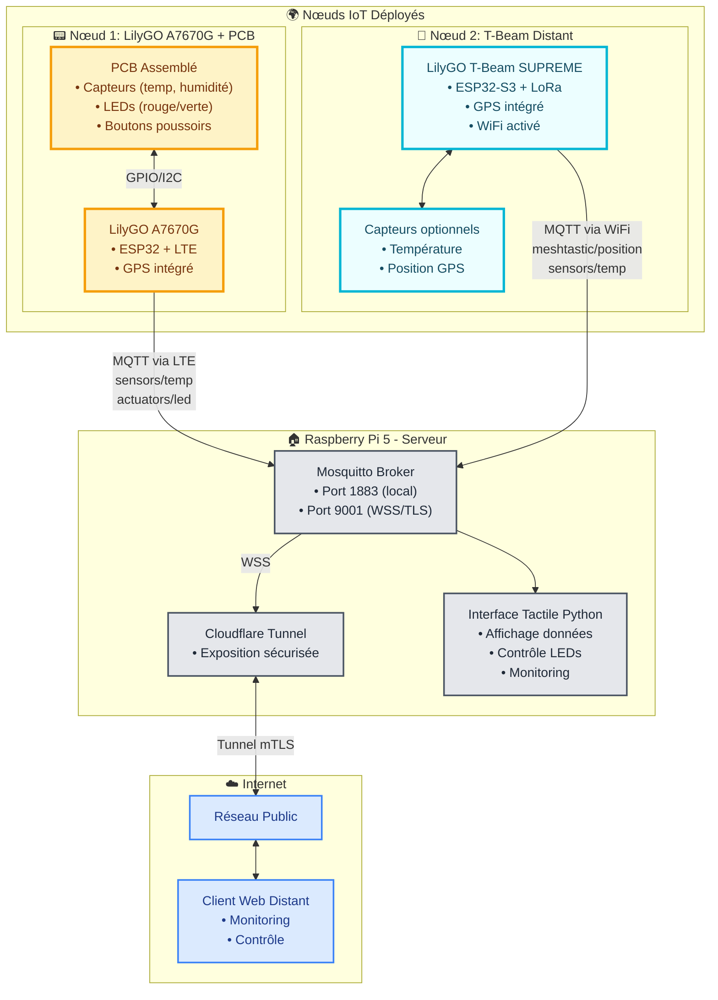
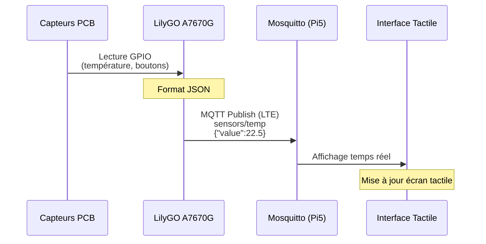
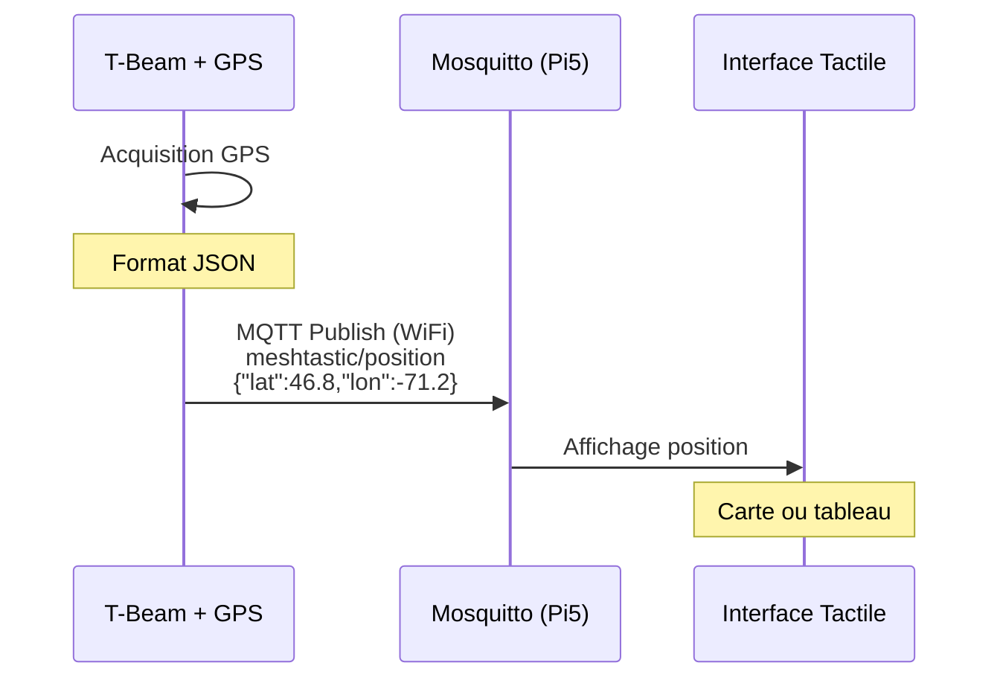

# Architecture Finale du Projet IoT
**Cours:** 243-4J5-LI – Objets connectés

---

## 🏗️ Architecture du Projet Final (Réaliste)



---

## 📊 Flux de Données

### Nœud 1: LilyGO A7670G + PCB → Serveur



### Nœud 2: T-Beam Distant → Serveur



---

## 🔧 Composants du Projet Final

### Infrastructure (déjà en place)
- ✅ **Raspberry Pi 5** configuré
- ✅ **Mosquitto Broker** (local + WSS)
- ✅ **Cloudflare Tunnel** actif
- ✅ **Interface tactile Python** fonctionnelle

### Nœud 1: LilyGO A7670G + PCB
- ✅ **LilyGO A7670G** (Labos 1-2)
- 🔄 **PCB assemblé** (semaine 10)
- 🔄 **Capteurs** branchés sur PCB
- 🔄 **LEDs et boutons** fonctionnels
- 🔄 **Communication MQTT via LTE** opérationnelle

### Nœud 2: T-Beam Distant
- ✅ **T-Beam SUPREME** (semaines 7-9)
- ✅ **WiFi configuré**
- ✅ **MQTT activé**
- ✅ **GPS fonctionnel**
- 🔄 **Données envoyées** au serveur

---

## 📡 Topics MQTT

### Structure simple des topics:

```
mqtt://
├── sensors/               # Nœud A7670G + PCB
│   ├── temperature        # {"value": 22.5, "unit": "C"}
│   ├── humidity           # {"value": 65, "unit": "%"}
│   └── gps                # {"lat": 46.8, "lon": -71.2}
│
├── actuators/             # Contrôle des LEDs
│   ├── led/red            # {"state": "on" | "off"}
│   └── led/green          # {"state": "on" | "off"}
│
└── meshtastic/            # Nœud T-Beam distant
    └── position           # {"lat": 46.8, "lon": -71.2, "alt": 100}
```

---


## ✅ Résumé du Projet Final

### Ce que chaque étudiant doit livrer:

**1. Nœud IoT complet (LilyGO A7670G + PCB):**
- PCB assemblé et soudé
- Capteurs fonctionnels (température, humidité, etc.)
- LEDs et boutons opérationnels
- Communication MQTT via LTE vers le serveur

**2. Infrastructure serveur (déjà en place):**
- Raspberry Pi 5 avec Mosquitto
- Interface tactile Python affichant les données
- Cloudflare Tunnel pour accès distant

**3. Démonstration LoRa (T-Beam):**
- T-Beam configuré et connecté en WiFi
- Envoi de données (position GPS) vers MQTT
- Intégration dans l'architecture globale

**4. Documentation:**
- Schéma du PCB
- Code source (Python, Arduino)
- Guide d'utilisation
- Tests et résultats

---

**Fin du document — Architecture Finale du Projet**
