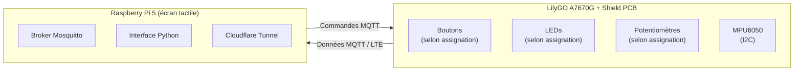

# Projet de mi-session — Système IoT complet avec Shield LilyGO A7670G

> Objectif : concevoir un **système IoT complet** intégrant un shield PCB pour le LilyGO A7670G, un programme embarqué, la communication MQTT et une interface sur Raspberry Pi 5 (écran tactile).

---

## Vue d'ensemble

Ce projet combine toutes les compétences acquises depuis le début de la session:



---

## Partie 1 : Shield PCB

### Assignation des composants par étudiant

Chaque étudiant reçoit une combinaison différente de composants. Le **total est identique pour tous** (7 composants variables).

| Étudiant | Boutons | LEDs | Potentiomètres | Total |
|:--------:|:-------:|:----:|:--------------:|:-----:|
| 1 | 1 | 3 | 3 | 7 |
| 2 | 2 | 2 | 3 | 7 |
| 3 | 3 | 1 | 3 | 7 |
| 4 | 1 | 4 | 2 | 7 |
| 5 | 2 | 3 | 2 | 7 |
| 6 | 3 | 2 | 2 | 7 |
| 7 | 3 | 3 | 1 | 7 |
| 8 | 2 | 4 | 1 | 7 |

> **Note :** Le MPU6050 (accéléromètre/gyroscope) est identique pour tous les étudiants et ne compte pas dans le total variable.

### Composants obligatoires pour tous

| Composant | Spécifications |
|-----------|----------------|
| LEDs | Selon assignation, avec résistances de limitation (330 Ω) |
| Boutons poussoirs | Selon assignation, avec pull-up/pull-down appropriés |
| Potentiomètres | Selon assignation, reliés aux entrées analogiques (ADC) du LilyGO |
| Accéléromètre | **MPU6050** (I2C) — axes X, Y, Z + gyroscope |
| Connecteurs | Headers compatibles LilyGO A7670G (obligatoire) |

### Standards de qualité PCB

Un PCB professionnel respecte ces pratiques :

- **Plan de masse** (ground plane) sur la couche inférieure
- **Silkscreen** clair : labels des composants, valeurs, polarités des LEDs
- **Orientation cohérente** des composants (références dans le même sens)
- **Espacements respectés** : distances minimales DRC sans erreurs
- **Tracés propres** : angles à 45°, pas de lignes orphelines
- **Vias** : diamètre et annular ring conformes aux règles de fabrication

### Livrables PCB

1. **Prototype breadboard** fonctionnel (photos obligatoires)
2. **Schéma KiCad** (ERC sans erreurs)
3. **Layout PCB** (DRC sans erreurs, Gerbers générés)
4. **Documentation** (schéma PDF, rendu 3D, BOM)

---

## Partie 2 : Programme embarqué (LilyGO A7670G)

### Exigences

Le programme sur le LilyGO A7670G doit :

1. **Lire les capteurs** du shield (boutons, potentiomètres, MPU6050)
2. **Contrôler les actionneurs** (LEDs)
3. **Publier les données** vers le broker MQTT sur le Raspberry Pi 5 via LTE
4. **Recevoir des commandes** MQTT pour contrôler les LEDs ou modifier le comportement

### Structure MQTT suggérée

```
Votre topic racine: etudiant/{prenom-nom}/

Publications (LilyGO → Broker):
  etudiant/{prenom-nom}/sensors/buttons      → {"btn1": true, "btn2": false, ...}
  etudiant/{prenom-nom}/sensors/pots         → {"pot1": 1023, "pot2": 512, ...}
  etudiant/{prenom-nom}/sensors/accel        → {"x": 0.12, "y": -0.05, "z": 9.81, "roll": 1.2, "pitch": -0.5}
  etudiant/{prenom-nom}/status               → {"uptime": 3600, "rssi": -65}

Souscriptions (Broker → LilyGO):
  etudiant/{prenom-nom}/actuators/led1       → {"state": "on"} ou {"state": "off"}
  etudiant/{prenom-nom}/actuators/led2       → {"state": "on"} ou {"state": "off"}
  ...                                        → (selon le nb de LEDs assignées)
  etudiant/{prenom-nom}/config               → {"interval": 1000}
```

> **Note :** Le nombre de boutons, LEDs et potentiomètres varie selon votre assignation. Adaptez les topics en conséquence.

### Standards de qualité du firmware

```cpp
// Structure recommandée
void setup() {
    initSerial();      // Debug UART
    initGPIO();        // Boutons, LEDs, potentiomètres
    initI2C();         // MPU6050
    initLTE();         // Modem A7670G
    connectMQTT();     // Broker Mosquitto
}

void loop() {
    maintainMQTT();    // Reconnexion automatique
    readSensors();     // Boutons, pots, accéléromètre
    publishData();     // Topics MQTT
    delay(PUBLISH_INTERVAL_MS);
}
```

**Exigences de qualité :**

- Variables et fonctions en `camelCase` avec noms descriptifs
- Constantes en `UPPER_SNAKE_CASE` (ex : `PUBLISH_INTERVAL_MS`)
- Reconnexion automatique MQTT si déconnexion
- Logs série structurés (`[INFO]`, `[ERROR]`, `[MQTT]`)
- Pas de `delay()` bloquant dans la boucle principale — utiliser des timestamps

---

## Partie 3 : Interface Raspberry Pi 5 (écran tactile)

### Exigences

L'interface Python sur le Raspberry Pi 5 doit :

1. **Afficher les données** reçues des capteurs en temps réel
2. **Permettre le contrôle** des LEDs via l'interface tactile
3. **Être fonctionnelle** sur l'écran tactile du Raspberry Pi
4. **Implémenter la logique applicative** de votre projet

### Fonctionnalités minimales

- Affichage de l'état de chaque bouton (avec indicateur visuel)
- Affichage des valeurs des potentiomètres (barre de progression ou jauge)
- Affichage des données de l'accéléromètre (axes X, Y, Z + inclinaison)
- Boutons tactiles pour contrôler les LEDs à distance
- Interface adaptée à votre concept de projet (jeu, dashboard, etc.)

### Standards de qualité de l'interface

**Apparence professionnelle :**

- Fenêtre plein écran (800×480 ou résolution de l'écran)
- Palette de couleurs cohérente (maximum 4-5 couleurs)
- Typographie lisible : taille minimale 16 px pour les labels
- Indicateur de connexion MQTT visible (connecté / déconnecté)
- Toutes les valeurs affichées avec leurs unités

**Code Python propre :**

```python
# Structure recommandée
class SensorDisplay:
    """Affichage des données capteurs."""
    def update(self, data: dict) -> None: ...

class LEDControl:
    """Contrôle des LEDs via MQTT."""
    def toggle(self, led_id: int) -> None: ...

class App:
    """Application principale."""
    def run(self) -> None: ...
```

- Fonctions et classes bien séparées (MVC ou équivalent)
- Gestion des exceptions pour les connexions MQTT
- `requirements.txt` avec versions fixées

---

## Partie 4 : Tests et validation

### Tests du firmware (LilyGO)

Compléter et inclure dans votre dépôt le fichier `firmware/tests/checklist.md` :

```markdown
## Checklist de validation — Firmware

### Périphériques
- [ ] MPU6050 détecté sur le bus I2C (adresse 0x68)
- [ ] Valeurs X, Y, Z cohérentes (axe Z ≈ 9.81 m/s² au repos)
- [ ] Chaque bouton réagit à la pression (digitalRead correct)
- [ ] Chaque potentiomètre produit une plage 0–4095 (ADC 12 bits)
- [ ] Chaque LED s'allume et s'éteint sur commande

### Communication MQTT
- [ ] Connexion LTE établie (signal RSSI affiché)
- [ ] Connexion au broker MQTT réussie
- [ ] Publication sur tous les topics configurés
- [ ] Réception des commandes LED et exécution correcte
- [ ] Reconnexion automatique après coupure (test manuel)

### Robustesse
- [ ] Aucun crash après 5 minutes de fonctionnement continu
- [ ] Gestion du cas MPU6050 absent (message d'erreur, pas de plantage)
```

### Tests de l'interface (Raspberry Pi)

Compléter et inclure dans votre dépôt le fichier `interface/tests/checklist.md` :

```markdown
## Checklist de validation — Interface

### Affichage
- [ ] Interface s'ouvre en plein écran sans erreur
- [ ] Données des boutons mises à jour en temps réel (< 500 ms)
- [ ] Valeurs des potentiomètres affichées avec unité ou pourcentage
- [ ] Données accéléromètre (X, Y, Z) affichées et actualisées
- [ ] Indicateur de connexion MQTT visible et exact

### Contrôle
- [ ] Chaque bouton tactile LED envoie la commande MQTT correcte
- [ ] L'état de la LED se reflète dans l'interface (feedback visuel)

### Qualité
- [ ] Aucune exception Python non gérée lors de l'utilisation normale
- [ ] Interface utilisable au doigt (zones tactiles ≥ 44×44 px)
```

### Tests du PCB (breadboard)

```markdown
## Checklist de validation — Prototype breadboard

- [ ] Alimentation 3.3 V mesurée aux pins VCC de chaque composant
- [ ] Masse commune vérifiée (multimètre en continuité)
- [ ] Chaque LED s'allume avec la tension correcte (≈ 2 V aux bornes)
- [ ] Résistances de limitation vérifiées (valeur mesurée ≈ valeur nominale)
- [ ] MPU6050 répond aux commandes I2C (scan I2C réussi)
- [ ] Chaque bouton produit bien 0 V / 3.3 V selon l'état
- [ ] Chaque potentiomètre produit une tension variable 0–3.3 V
```

---

## Partie 5 : Idées de projets (au choix)

La fonctionnalité exacte de votre système est **libre**. Le shield s'interface avec le **LilyGO** qui échange avec le **RPi** (écran tactile). Voici des idées pour vous inspirer :

### Idées simples

| Projet | Description |
|--------|-------------|
| **Télécommande IoT** | Les boutons et potentiomètres du shield contrôlent des paramètres affichés sur l'interface tactile |
| **Moniteur d'inclinaison** | Le MPU6050 détecte l'orientation, les LEDs indiquent si l'appareil est à niveau |
| **Dashboard IoT** | Monitoring temps réel des capteurs + contrôle des LEDs depuis l'écran tactile |
| **Mixeur de lumières** | Les potentiomètres règlent l'intensité (PWM) de chaque LED à distance |

### Idées intermédiaires

| Projet | Description |
|--------|-------------|
| **Jeu de réflexes** | Appuyer sur le bon bouton au bon moment, score affiché sur l'écran tactile |
| **Jeu Simon** | Séquence de LEDs à reproduire avec les boutons, score affiché sur le Pi |
| **Manette de jeu** | Contrôler un jeu sur le RPi avec les boutons, potentiomètres et l'accéléromètre |
| **Détecteur de chute** | Le MPU6050 déclenche une alerte (LED + notification) lors d'un impact |

### Idées avancées

| Projet | Description |
|--------|-------------|
| **Podomètre IoT** | Le MPU6050 compte les pas, historique et graphique sur le Pi |
| **Système d'alarme** | Armement par bouton, seuil réglable par potentiomètre, détection par MPU6050 |
| **Jeu de labyrinthe** | L'inclinaison (MPU6050) contrôle une balle sur l'écran tactile |
| **Synthétiseur visuel** | Potentiomètres = fréquence/vitesse, accéléromètre = direction d'animation sur le Pi |

### Votre propre idée

Vous pouvez proposer votre propre projet. Il doit :

- Utiliser vos **boutons** assignés de façon interactive
- Utiliser vos **LEDs** assignées comme retour visuel
- Utiliser vos **potentiomètres** assignés pour un réglage continu
- Utiliser le **MPU6050** de façon pertinente (orientation, mouvement, gestes)
- Avoir une **interface tactile** soignée sur le RPi
- Avoir une **logique applicative** cohérente et documentée

---

## Structure de remise

```bash
~/243-4J5-LI/projet-mi-session/
├── kicad/                      # Schéma et PCB
│   ├── shield.kicad_pro
│   ├── shield.kicad_sch
│   └── shield.kicad_pcb
├── firmware/                   # Code LilyGO A7670G
│   ├── src/
│   │   └── main.cpp
│   ├── platformio.ini
│   ├── tests/
│   │   └── checklist.md        # Checklist de validation firmware
│   └── README.md               # Instructions de compilation
├── interface/                  # Interface Python Raspberry Pi
│   ├── main.py
│   ├── requirements.txt
│   ├── tests/
│   │   └── checklist.md        # Checklist de validation interface
│   └── README.md               # Instructions d'exécution
├── fabrication/                # Fichiers de fabrication PCB
│   ├── gerbers/
│   ├── bom.csv
│   └── fabrication-readme.md
├── docs/                       # Documentation
│   ├── photos/                 # Photos du prototype breadboard
│   ├── screenshots/            # Captures de l'interface
│   └── demo-video.mp4          # Vidéo de démonstration (optionnel)
└── README.md                   # Vue d'ensemble du projet
```

---

## Critères d'évaluation

| Critère | Pondération | Description |
|---------|:-----------:|-------------|
| **Shield PCB** | 25% | Schéma complet (ERC propre), routage soigné (DRC propre), plan de masse, silkscreen clair, prototype fonctionnel |
| **Programme embarqué** | 25% | Lecture de tous les capteurs, publication MQTT, réception des commandes, qualité et lisibilité du code |
| **Interface Raspberry Pi** | 20% | Affichage temps réel, contrôle des LEDs, ergonomie tactile, apparence professionnelle |
| **Tests et validation** | 15% | Checklists complétées et signées, tests documentés, robustesse démontrée |
| **Documentation** | 15% | README clair, schéma PDF inclus, BOM, instructions de compilation/exécution, photos/vidéo |

---

## Livraison

```bash
cd ~/243-4J5-LI/projet-mi-session
git add .
git commit -m "Projet mi-session : système IoT complet"
git push origin prenom-nom/projet-mi-session
```

**Date de remise :** Semaine 7

---

## Ressources utiles

### Code de base (à partir des labos 1 et 2)

Votre projet doit **partir du code développé dans les labos précédents** :

#### Firmware LilyGO A7670G (Labo 2)

| Fichier | Description |
|---------|-------------|
| `labo2/code/lilygo_lte_mqtt/lilygo_lte_mqtt.ino` | Communication MQTT via LTE — **point de départ pour le firmware** |
| `labo2/code/lilygo_wifi_mschapv2/lilygo_wifi_mschapv2.ino` | Alternative WiFi si disponible |
| `labo1/lilygo-test/lilygo-test.ino` | Test de base du LilyGO |

**À ajouter au code du Labo 2 :**

- Lecture des boutons avec `digitalRead()`
- Lecture des potentiomètres avec `analogRead()` (ADC 12 bits, 0–4095)
- Contrôle des LEDs avec `digitalWrite()`
- Communication I2C avec le MPU6050 (bibliothèque `MPU6050` ou `Wire`)
- Publication des données capteurs sur vos topics MQTT
- Souscription aux topics de commande pour les LEDs

#### Interface Python Raspberry Pi (Labos 1 et 2)

| Fichier | Description |
|---------|-------------|
| `labo2/led-control/touch_ui_mqtt.py` | Interface tactile avec MQTT — **point de départ pour l'interface** |
| `labo1/led-control/touch_ui_led.py` | Interface tactile de base |
| `labo1/code/touch_ui.py` | Exemple d'interface pygame |

**À ajouter au code du Labo 2 :**

- Affichage de l'état de chaque bouton (indicateur vert/rouge)
- Barres de progression pour les valeurs des potentiomètres
- Graphiques ou jauges pour l'accéléromètre (axes X, Y, Z, inclinaison)
- Boutons tactiles de contrôle pour les LEDs
- Logique applicative selon votre projet choisi
- Indicateur de connexion MQTT

### Outils

| Outil | Usage |
|-------|-------|
| KiCad | Schéma et PCB |
| Arduino IDE / PlatformIO | Firmware LilyGO |
| Python 3 + pygame + paho-mqtt | Interface Raspberry Pi |
| Multimètre | Tests du prototype breadboard |

### Documentation externe

- [LilyGO A7670G Wiki](https://github.com/Xinyuan-LilyGO/LilyGO-T-A7670)
- [MPU6050 Arduino Library](https://github.com/ElectronicCats/mpu6050)
- [Paho MQTT Python](https://pypi.org/project/paho-mqtt/)
