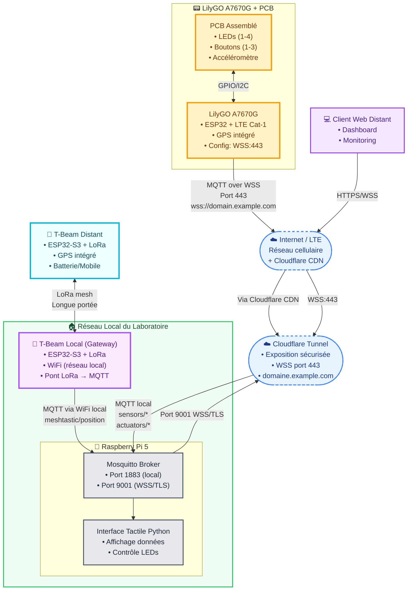
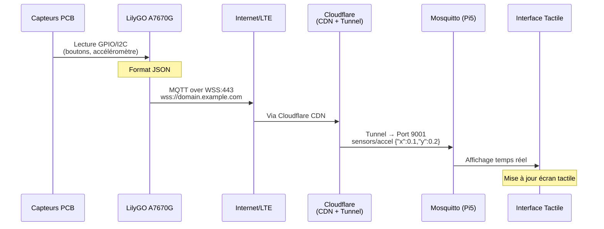
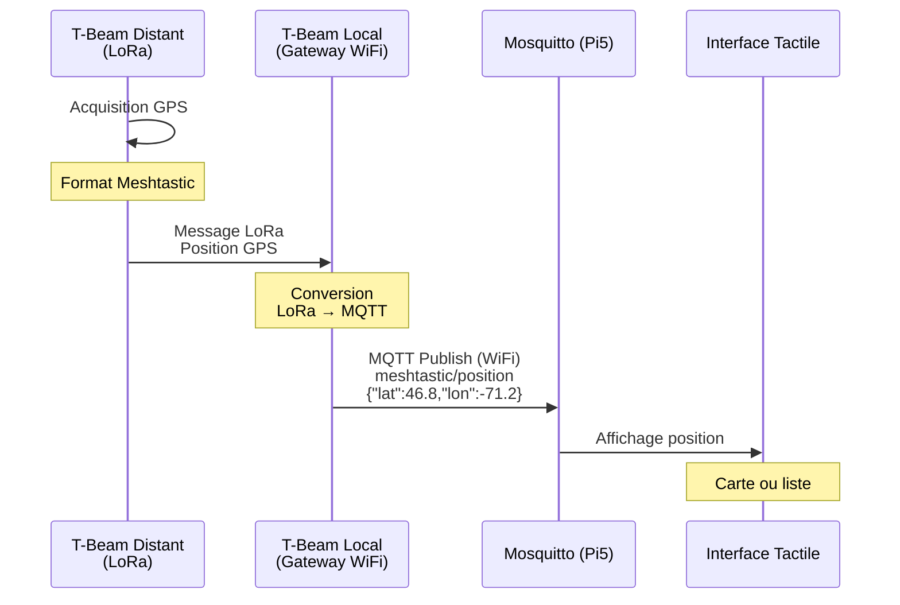

# Architecture Finale du Projet IoT
**Cours:** 243-4J5-LI – Objets connectés

---

## 🏗️ Architecture du Projet Final (Réaliste)



---

## 📊 Flux de Données

### Flux LTE: LilyGO A7670G + PCB → Serveur



### Flux LoRa: T-Beam Distant → T-Beam Local → Serveur



---

## 🔧 Composants du Projet Final

### Infrastructure (déjà en place)
- ✅ **Raspberry Pi 5** configuré (Labos 1-2)
- ✅ **Mosquitto Broker** (local + WSS)
- ✅ **Cloudflare Tunnel** actif
- ✅ **Interface tactile Python** fonctionnelle

### LilyGO A7670G + PCB (Communication LTE)
- ✅ **LilyGO A7670G** (Labos 1-2)
- 🔄 **PCB assemblé et soudé** (semaine 10)
- 🔄 **LEDs** fonctionnelles (selon assignation: 1-4)
- 🔄 **Boutons** fonctionnels (selon assignation: 1-3)
- 🔄 **Accéléromètre** (MPU6050/ADXL345) via I2C
- 🔄 **Communication MQTT via LTE** opérationnelle

### T-Beam Local (Gateway LoRa → WiFi)
- ✅ **T-Beam SUPREME #1** (semaines 7-9)
- ✅ **WiFi configuré** (réseau local du labo)
- ✅ **LoRa activé** (réception mesh)
- ✅ **MQTT activé** (envoi vers Mosquitto)
- 🔄 **Rôle gateway** LoRa → MQTT fonctionnel

### T-Beam Distant (Mobile LoRa)
- ✅ **T-Beam SUPREME #2** (semaines 7-9)
- ✅ **LoRa configuré** (transmission mesh)
- ✅ **GPS fonctionnel**
- 🔄 **Envoi position GPS** via LoRa vers T-Beam local
- 🔄 **Tests terrain** complétés

---

## 📡 Topics MQTT

### Structure simple des topics:

```
mqtt://
├── etudiant/{prenom-nom}/    # Nœud A7670G + PCB
│   ├── sensors/
│   │   ├── buttons           # {"btn1": true, "btn2": false, ...}
│   │   └── accel             # {"x": 0.12, "y": -0.05, "z": 9.81}
│   ├── actuators/
│   │   ├── led1              # {"state": "on" | "off"}
│   │   └── led2              # {"state": "on" | "off"} ...
│   └── status                # {"uptime": 3600, "rssi": -65}
│
└── meshtastic/               # Nœud T-Beam distant
    └── position              # {"lat": 46.8, "lon": -71.2, "alt": 100}
```

---


## ✅ Résumé du Projet Final

### Ce que chaque étudiant doit livrer:

**1. Infrastructure serveur (déjà en place depuis Labos 1-2):**
- Raspberry Pi 5 avec Mosquitto Broker
- Interface tactile Python affichant les données
- Cloudflare Tunnel pour accès distant sécurisé

**2. Module IoT LTE (LilyGO A7670G + PCB):**
- PCB assemblé et soudé (semaine 10)
- LEDs opérationnelles (selon assignation: 1-4)
- Boutons opérationnels (selon assignation: 1-3)
- Accéléromètre (MPU6050/ADXL345) fonctionnel
- Communication MQTT via LTE vers le serveur

**3. Système LoRa mesh (2 T-Beam SUPREME):**
- **T-Beam local:** Gateway LoRa → MQTT (WiFi réseau local)
- **T-Beam distant:** Module mobile avec GPS (communication LoRa)
- Communication mesh LoRa fonctionnelle entre les deux T-Beam
- Données GPS du T-Beam distant acheminées au serveur

**4. Documentation complète:**
- Schéma du PCB (KiCad)
- Code source (Python, Arduino/ESP32)
- Cartographie de couverture LoRa (GPX)
- Guide d'utilisation
- Résultats de tests (RSSI, SNR, portée)

---

**Fin du document — Architecture Finale du Projet**
