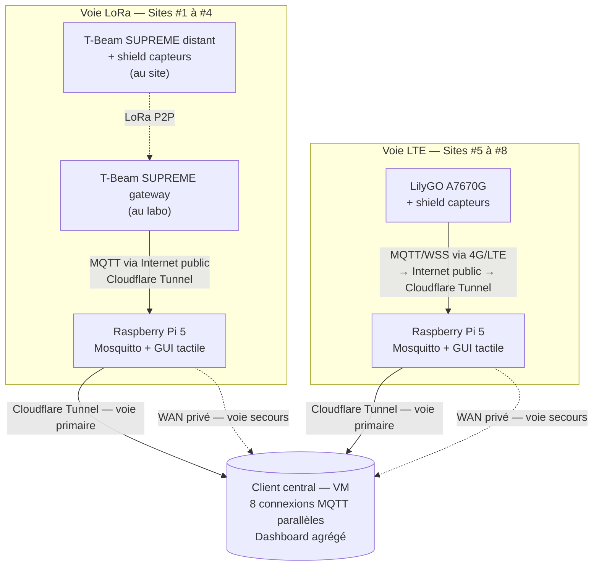

# Architecture finale du projet — Hydro-Limoilou Télémétrie RF
**Cours :** 243-4J5-LI – Objets connectés
**Évaluation :** Projet final IdO (35%, semaines 13 à 15)

---

## 1. Contexte

Le projet final simule le déploiement de **8 sites RF** d'un distributeur d'énergie fictif, **Hydro-Limoilou**. Chaque site **héberge un répéteur RF** (configuré dans le cours 243-4Q5-LI), et le présent projet déploie l'**infrastructure de télémétrie** qui surveille les conditions opérationnelles de chaque site (climat, sécurité, alimentation, intégrité mécanique).

Chaque étudiant est responsable d'un site distinct, avec son propre répéteur RF, ses propres capteurs de télémétrie, son propre nœud de communication, son propre courtier MQTT (sur son Raspberry Pi 5) et son propre écran de monitoring.

Un **serveur central** (VM gérée par l'enseignant) se connecte à chacun des 8 courtiers MQTT pour agréger les données via une **convention de topics standardisée**.

### Articulation avec le cours connexe (configuration des répéteurs)

Chaque étudiant configure **son propre répéteur RF** dans un cours parallèle. Le présent projet en assure le **monitoring environnemental et opérationnel** :

- la télémétrie observe les conditions qui peuvent affecter le bon fonctionnement du répéteur (température dans le shelter, vibration du mât d'antenne, intégrité de l'alimentation, intrusion physique)
- les alarmes signalent les situations qui menacent la disponibilité du répéteur (basculement, inondation, ouverture du cabinet, batterie faible, niveau carburant bas)
- la convergence vers le serveur central simule un **CCR** — Centre de conduite du réseau, équivalent du [CCR d'Hydro-Québec](https://www.hydroquebec.com/comprendre/transport/conduite-reseau.html) qui supervise 24/7 le réseau de transport (160 stations de télémesure, 22 500 points d'acquisition, automatismes de commande à distance). Le projet met les étudiants à la place des répartiteurs, avec une vue agrégée des 8 sites.

---

## 2. Architecture globale

Le serveur central est un **client MQTT** (pas un broker). Il est hébergé sur une VM gérée par l'enseignant et s'abonne en parallèle aux **8 brokers Mosquitto** hébergés sur les Pi 5 des étudiants.


```mermaid
graph TB
    subgraph Sites_LoRa["Voie LoRa — Sites #1 à #4"]
        TBd1["T-Beam SUPREME distant<br/>+ shield capteurs<br/>(au site)"]
        TBg1["T-Beam SUPREME gateway<br/>(au labo)"]
        Pi1["Raspberry Pi 5<br/>Mosquitto + GUI tactile"]
        TBd1 -.LoRa P2P.-> TBg1
        TBg1 -->|MQTT via Internet public<br/>Cloudflare Tunnel| Pi1
    end

    subgraph Sites_LTE["Voie LTE — Sites #5 à #8"]
        A1["LilyGO A7670G<br/>+ shield capteurs"]
        Pi2["Raspberry Pi 5<br/>Mosquitto + GUI tactile"]
        A1 -->|MQTT/WSS via 4G/LTE<br/>→ Internet public → Cloudflare Tunnel| Pi2
    end

    Pi1 -->|Cloudflare Tunnel — voie primaire| Client[("Client central — VM<br/>8 connexions MQTT parallèles<br/>Dashboard agrégé")]
    Pi1 -.WAN privé — voie secours.-> Client
    Pi2 -->|Cloudflare Tunnel — voie primaire| Client
    Pi2 -.WAN privé — voie secours.-> Client
```

**Point clé** : ni le T-Beam gateway ni le A7670G ne sont sur le même LAN que le Pi 5 du site. Les deux publient sur le broker Mosquitto du Pi 5 en passant **par Internet public** (endpoint WSS exposé par Cloudflare Tunnel). Le Pi 5 héberge aussi une **interface graphique tactile locale** (3 pages Python : télémétrie temps réel, alarmes, état du lien) — voir §8 livrables.

### Particularités par voie

| Voie | Hôte | Chemin réseau (capteur → broker Pi 5) | Chemin réseau (client central → broker Pi 5) |
|------|------|---------------------------------------|-----------------------------------------------|
| **LoRa (#1-4)** | T-Beam SUPREME (×2) | Capteurs → T-Beam distant → **LoRa P2P** → T-Beam gateway → **Internet public (WSS/Cloudflare Tunnel)** → Mosquitto sur Pi 5 | Cloudflare Tunnel (primaire) **+** WAN privé inter-labo (secours) |
| **LTE (#5-8)** | LilyGO A7670G (×1) | Capteurs → A7670G → **4G/LTE → Internet public (WSS/Cloudflare Tunnel)** → Mosquitto sur Pi 5 | Cloudflare Tunnel (primaire) **+** WAN privé inter-labo (secours) |

### Redondance du lien client ↔ broker (2 voies)

Chaque broker Mosquitto doit être joignable par **deux chemins réseau indépendants** :

- **Voie primaire** : Cloudflare Tunnel (WSS:443), déjà en place depuis Labos 1-2.
- **Voie secours** : **WAN privé** monté dans le cours de télécom associé (routeur + VPN site-à-site). Même broker Mosquitto, même identifiants, adressage IP distinct sur la voie privée.

Le client central (VM) comme le dashboard web utilisent l'option MQTT `servers: [primaire, secours]` : en cas d'échec de connexion sur la voie primaire, la bascule s'effectue automatiquement vers la voie secours au prochain cycle de reconnexion. Le dashboard affiche explicitement quelle voie est active (`PRIMAIRE` / `WAN PRIVÉ`).

Cette redondance est un livrable du cours de télécom connexe mais se vérifie côté 243-4J5-LI via le critère CP3 3.6 (QoS et fiabilité MQTT).

---

## 3. Mises en situation des 8 sites

| # | Voie | Site | Mise en situation |
|---|------|------|-------------------|
| 1 | LoRa | **Pylône de transport 315 kV (rural)** | Pylône haute tension en zone rurale supportant un **répéteur RF** colocalisé sur la structure. La télémétrie surveille le shelter d'équipement au pied du pylône + l'état mécanique de la structure exposée au vent (vibrations des haubans qui peuvent affecter le pointage de l'antenne du répéteur). |
| 2 | LoRa | **Barrage au fil de l'eau — poste de vanne** | Poste de commande de vanne en crête de barrage abritant un **répéteur RF** assurant la liaison SCADA côtière. Surveillance d'intrusion dans le local + niveau d'eau en amont (risque de crue menaçant l'équipement lors des débits élevés). |
| 3 | LoRa | **Centrale solaire photovoltaïque isolée** | Centrale solaire autonome hébergeant un **répéteur RF** alimenté directement par les panneaux et le banc de batteries. Monitoring environnemental des onduleurs + état de l'alimentation (qui doit garantir la disponibilité du répéteur 24/7). |
| 4 | LoRa | **Pylône de distribution 25 kV** | Pylône en béton supportant un transformateur de distribution et l'antenne d'un **répéteur RF** en zone dégagée. Surveillance du basculement du pylône (impact direct sur le pointage du répéteur) + détection de présence à la base (vandalisme/animaux). |
| 5 | LTE | **Poste électrique de transformation urbain** | Poste de transformation 25 kV/600 V au sol en milieu urbain abritant un **répéteur RF** colocalisé. Monitoring climat de la salle des transformateurs + intrusion + paramètres énergétiques (tension/courant) de la ligne d'alimentation qui alimente le répéteur. |
| 6 | LTE | **Poste électrique à toit ouvert (centre-ville)** | Poste de sectionnement sur toit d'édifice avec **répéteur RF directionnel** et batteries solaires de secours. Surveillance choc/orientation de l'antenne du répéteur + apport solaire (autonomie en cas de panne secteur du poste). |
| 7 | LTE | **Centrale thermique de secours** | Centrale thermique diesel de secours accueillant un **répéteur RF** colocalisé pour la télémétrie SCADA. Monitoring climat machinerie (alternateurs, moteurs) + sécurité d'accès (portail + présence) protégeant la centrale et le répéteur. |
| 8 | LTE | **Barrage hydroélectrique — refuge technique** | Refuge technique en pied de barrage contenant un **répéteur RF** + génératrice de secours qui maintient l'alimentation en cas de panne. Monitoring intégrité du refuge (choc, climat) + niveau de carburant de la génératrice. |

---

## 4. Assignations capteurs et actionneurs

Chaque site reçoit une combinaison **unique** de modules breakout (avec headers) à intégrer sur un shield PCB conçu en KiCad. Les shields se montent directement sur l'hôte (T-Beam SUPREME ou LilyGO A7670G).

| # | Hôte | Modules assignés | Justification du mapping |
|---|------|------------------|--------------------------|
| 1 | T-Beam SUPREME | BME280 + MPU6050 + 2 boutons + 2 LEDs | BME280 = climat shelter ; MPU6050 = vibration mât ; boutons = test+maintenance ; LEDs = état lien+alarme |
| 2 | T-Beam SUPREME | BH1750 + EKMC + 1 pot + 1 bouton + 1 LED | BH1750 = lumière intérieure (porte) ; EKMC = intrusion ; pot = niveau d'eau simulé ; bouton = ack alarme ; LED = alarme |
| 3 | T-Beam SUPREME | BME280 + BH1750 + 1 bouton + 1 pot + 1 LED | BME280 = climat ; BH1750 = ensoleillement panneau solaire ; pot = tension batterie simulée ; bouton = test ; LED = état charge |
| 4 | T-Beam SUPREME | MPU6050 + EKMC + 1 bouton + 1 pot + 2 LEDs | MPU6050 = inclinaison mât ; EKMC = présence base ; pot = vent simulé ; bouton = silence alarme ; LEDs = état mât+détection |
| 5 | LilyGO A7670G | BME280 + EKMC + 2 pots + 2 LEDs | BME280 = climat cabinet ; EKMC = intrusion ; pots = tension+courant simulés ; LEDs = état réseau+alarme |
| 6 | LilyGO A7670G | MPU6050 + BH1750 + 2 boutons + 2 LEDs | MPU6050 = vibration/orientation antenne ; BH1750 = ensoleillement ; boutons = test+maintenance ; LEDs = état antenne+charge |
| 7 | LilyGO A7670G | BME280 + BH1750 + EKMC + 2 LEDs | BME280 = climat machinerie ; BH1750 = portail ouvert ; EKMC = présence ; LEDs = état pompe+alarme |
| 8 | LilyGO A7670G | MPU6050 + BME280 + 2 boutons + 1 pot + 1 LED | MPU6050 = choc/ouverture porte ; BME280 = climat ; boutons = mode+reset ; pot = niveau carburant ; LED = état alim |

### Notes d'intégration

- **Bus I2C primaire du T-Beam SUPREME** (GPIO 17/18) : déjà occupé en interne par OLED, magnéto et un **BME280 interne** (0x77). Le BME280 **externe** (Adafruit 2652) doit donc être configuré à **0x76** (strap SDO → GND) pour éviter le conflit. Les modules I2C externes MPU6050 (0x68) et BH1750 (0x23) **partagent ce bus** sans conflit.
- **ADC sur T-Beam SUPREME** : limité (essentiellement ADC1 sur GPIO 2-3). Les sites LoRa sont contraints à **1 potentiomètre maximum**.
- **GPIO digital du T-Beam SUPREME** : 4-5 broches utilisables sur les pads exposés.
- **LilyGO A7670G (ESP32 standard)** : beaucoup plus de GPIO disponibles, donc les sites LTE peuvent porter jusqu'à 5 modules.
- **Alimentation** : tous les modules breakout fonctionnent directement en **3.3 V** (BME280, MPU6050, BH1750 : 3-5 V tolérants ; EKMC4607112K : 3-6 V, sortie logique compatible 3.3 V).

---

## 5. Sélection pédagogique des étudiants

Le projet final est conçu comme une **occasion de remédiation** : chaque étudiant est affecté à la voie qui exerce ce qu'il a le moins bien réussi lors des évaluations antérieures. Le projet final devient une **2e chance encadrée** de démontrer la compétence faiblement maîtrisée.

| Évaluation antérieure faiblement réussie | Compétence à redémontrer | Voie attribuée au projet final |
|------------------------------------------|--------------------------|-------------------------------|
| **Évaluation sommative de mi-session** (Sem. 7 — Shield PCB pour LilyGO A7670G : intégration capteurs, MQTT/LTE, Python) | Conception et programmation d'un objet connecté avec **A7670G + LTE + MQTT/WSS** | **LTE (#5-8)** |
| **TP LoRa** (Sem. 9 — Intégration LoRa point-à-point : configuration radio, paramètres SF/BW, gateway WiFi→MQTT) | Configuration et exploitation d'une **liaison LoRa P2P** + pont MQTT | **LoRa (#1-4)** |

### Cas limites
- Étudiant faible aux **deux** évaluations → arbitrage selon la lacune **la plus marquée** (écart au seuil), avec léger biais vers **LoRa** car le projet inclut 2 T-Beam à configurer = davantage d'occasions d'observer la progression
- Étudiant solide aux deux → choix selon les **places restantes** (équilibre 4/4 maintenu) et selon l'intérêt déclaré

### Bénéfices
- Le projet final n'est pas un nouvel apprentissage à partir de zéro mais un **approfondissement ciblé**
- Les checkpoints hebdomadaires (sem. 13, 14, 15) deviennent des points d'observation de la progression
- L'enseignant peut comparer la performance au projet final avec l'évaluation antérieure pour ajuster son jugement global de la capacité concernée

---

## 6. Convention de topics MQTT

La VM centrale doit pouvoir agréger les 8 sites avec un schéma uniforme. Chaque site est identifié par un `site-id` numéroté `poste-01` à `poste-08`.

```
hydro-limoilou/{site-id}/telemetry/{capteur}     # Données périodiques
hydro-limoilou/{site-id}/status                  # uptime, rssi, link, batterie
hydro-limoilou/{site-id}/status/llm              # Résumé texte généré par un LLM local (nouveau)
hydro-limoilou/{site-id}/alarm/{type}            # door, water, motion, tilt, ...
hydro-limoilou/{site-id}/actuators/{nom}         # Commandes descendantes (LED, relais)
```

### Exemples concrets

```
hydro-limoilou/poste-01/telemetry/temperature   {"value": 22.4, "unit": "C", "ts": 1739500000}
hydro-limoilou/poste-01/telemetry/humidity      {"value": 45.2, "unit": "%", "ts": 1739500000}
hydro-limoilou/poste-01/telemetry/vibration     {"x": 0.02, "y": -0.01, "z": 9.81, "ts": 1739500000}
hydro-limoilou/poste-01/telemetry/btn_1         {"state": "pressed", "ts": 1739500010}
hydro-limoilou/poste-01/status                  {"uptime": 3600, "rssi": -67, "link": "lora", "battery_v": 3.9}
hydro-limoilou/poste-01/status/llm              {"summary": "Vibrations nominales, climat ok.", "model": "qwen2.5:3b", "ts": 1739500090}
hydro-limoilou/poste-01/alarm/tilt              {"level": "warning", "value": 12.3, "unit": "deg", "ts": 1739500000}
hydro-limoilou/poste-01/actuators/led_1         {"state": "on"}
```

### Note — résumé LLM (topic `status/llm`)

Chaque appareil doit **exécuter un appel LLM local** (ex. Ollama + qwen2.5:3b sur la passerelle Pi 5 ou modèle embarqué ESP32) à intervalle régulier pour produire un résumé texte des dernières lectures de capteurs, et publier ce résumé sur `status/llm`. Le dashboard central affiche ce résumé dans le panneau du site. Voir §3.6 du contrat serveur central pour le schéma et la fréquence.

### Mapping par capteur (noms de topics standardisés)

| Capteur | Sous-topic `telemetry/` | Champs payload |
|---------|------------------------|----------------|
| **BME280** (Adafruit 2652) | `temperature`, `humidity`, `pressure` | `value`, `unit` (`"C"`, `"%"`, `"hPa"`), `ts` |
| **MPU6050** (Adafruit 3886, STEMMA QT) | `vibration` | `x`, `y`, `z`, `ts` (accélérations m/s²) |
| **BH1750** (DFRobot SEN0097) | `light` | `value`, `unit` (lux), `ts` |
| **EKMC4607112K** (SparkFun 17372, PIR ultra-basse conso) | sous `alarm/motion` | `level`, `ts` |
| Potentiomètre | `analog_1`, `analog_2` (ou nom selon site, ex. `water_level`, `battery_v`) | `value`, `unit`, `ts` |
| Bouton-poussoir | `btn_1`, `btn_2` (numérotation indépendante du site) | `state` (`"pressed"` / `"released"`), `ts` — événementiel, QoS 1, sans rétention |
| LED | `actuators/led_N` (descendant) | `state` (`"on"`/`"off"`) |

Un **document séparé** (`contrat-serveur-central.md`) détaille les topics exacts attendus pour chaque site #1-8, les fréquences de publication minimales et les payloads JSON normalisés.

---

## 7. Composants par étudiant

### Infrastructure individuelle (1 par étudiant)
- **Raspberry Pi 5** — broker Mosquitto + interface tactile + tunnel Cloudflare *(déjà en place depuis Labos 1-2)*
- **Domaine Cloudflare personnel** *(déjà en place)*

### Voie LoRa (étudiants #1-4)
- 2 × **LilyGO T-Beam SUPREME** (1 nœud de site + 1 gateway WiFi)
- Modules breakout assignés
- Shield PCB conçu en KiCad (livrable, non fabriqué)
- Breadboard pour intégration physique

### Voie LTE (étudiants #5-8)
- 1 × **LilyGO A7670G** (réutilisé du mid-session)
- Modules breakout assignés
- Shield PCB conçu en KiCad (livrable, non fabriqué)
- Breadboard pour intégration physique

### Infrastructure centrale (gérée par l'enseignant)
- **VM** avec script Python d'agrégation MQTT
- **Dashboard global** affichant l'état des 8 sites en temps réel

---

## 8. Livrables du projet final

Pour chaque étudiant, à la fin de la sem. 15 :

1. **Shield PCB** (livrable de conception KiCad, **non fabriqué**) :
   - Schéma `.kicad_sch` (ERC sans erreurs)
   - PCB 2 couches `.kicad_pcb` (DRC sans erreurs)
   - Gerbers + BOM générés
2. **Firmware** (Arduino/ESP32, dans Git) :
   - Lecture de tous les capteurs assignés
   - Publication MQTT sur les bons topics
   - Gestion des alarmes
3. **Extension de l'interface tactile** (Python sur Pi 5, dans Git) :
   - Page **Télémétrie temps réel** (jauges/valeurs des capteurs du site)
   - Page **Alarmes** (liste + ack)
   - Page **État du lien** (RSSI/SNR LoRa ou signal LTE, uptime)
4. **Documentation** (Markdown dans le dépôt) :
   - Description du site et de la mise en situation
   - Schéma de câblage breadboard
   - Liste des topics utilisés (conformité contrat VM)
   - Procédure de démo et résultats des 3 scénarios de test
5. **Vidéo de démo** (≤ 5 min) montrant les 3 scénarios :
   - Nominal (publication continue, dashboard VM voit le site)
   - Alarme (déclenchement physique → topic alarm publié → affichage tactile + dashboard)
   - Perte/reprise de lien (coupure WiFi/LTE → reconnexion → republication)

---

## 9. Évaluation

Voir `grille-projet-final.md` pour les critères détaillés.

| Checkpoint | Semaine | Pondération | Focus principal |
|------------|---------|:-----------:|----------------|
| **CP1** | 13 | 5% | Intégration matérielle breadboard + 1ère publication MQTT + amorce KiCad |
| **CP2** | 14 | 10% | Tous les capteurs publient + alarmes + interface tactile + visibilité VM + schéma KiCad complet |
| **CP3** | 15 | 20% | Démo 3 scénarios + finalisation PCB (DRC + Gerbers) + livrables documentés |
| | | **35%** | |

Pondération par capacité (Plan de cours) :
- **Capacité 1 (Concevoir et programmer un objet connecté)** : 10% du cours
- **Capacité 2 (Maîtriser les protocoles de communication IdO)** : 25% du cours

---

**Fin du document — Architecture finale du projet Hydro-Limoilou**
