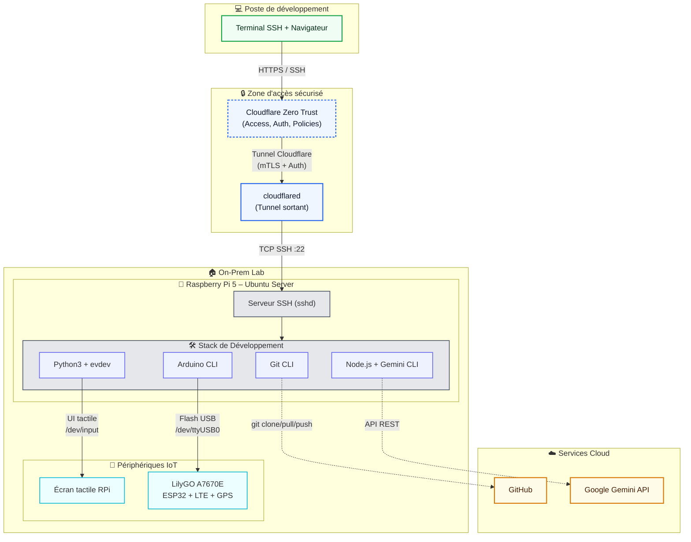

<div style="background: linear-gradient(90deg, #0ea5e9, #6366f1); padding: 18px 20px; color: #f8fafc; border-radius: 14px; box-shadow: 0 4px 12px rgba(0,0,0,0.15);">
  <h1 style="margin: 0; font-size: 28px;">Labo 1 — Environnement de programmation distant pour objets connectés</h1>
  <p style="margin: 6px 0 0; font-size: 15px;">Guide pas à pas pour préparer un Raspberry Pi 5, le connecter au réseau et déployer les outils nécessaires.</p>
</div>

---

## 📐 Architecture du système



Ce diagramme illustre l'architecture complète du laboratoire:
- **Zone Client (vert):** Votre poste de développement
- **Zone d'accès sécurisé (bleu):** Cloudflare Zero Trust et tunnel
- **Zone Lab (gris):** Raspberry Pi 5 avec tous les outils et périphériques IoT
- **Zone Cloud (jaune):** Services externes (GitHub, Gemini API)

---

## 🧭 Plan du guide
- [Matériel requis](#-matériel-requis)
- [Installation Ubuntu Server](#1-installation-ubuntu-server)
- [Configuration réseau](#2-configuration-réseau)
- [Connexion à distance via Cloudflare Tunnel](#3-connexion-à-distance-via-cloudflare-tunnel)
- [Configuration Git](#4-configuration-git)
- [Interface tactile en mode console](#5-interface-tactile-distante-en-mode-console)
- [Installation Node.js et outils CLI](#6-installation-nodejs-et-outils-cli)
- [Programmation du LilyGO A7670E](#7-programmation-du-lilygo-a7670e)
- [Notes importantes](#-notes-importantes)
- [Commandes de vérification](#-commandes-de-vérification-utiles)

<div style="height: 6px; background: linear-gradient(90deg, #22d3ee, #22c55e); border-radius: 999px; margin: 18px 0;"></div>

## 🎒 Matériel requis
<div style="background:#ecfeff; border:1px solid #06b6d4; padding:12px 14px; border-radius:10px;">
<ul style="margin:0;">
  <li>Clavier Raspberry Pi</li>
  <li>Raspberry Pi 5</li>
  <li>Écran tactile pour Raspberry Pi 5</li>
  <li>Alimentation USB-C pour Raspberry Pi 5</li>
  <li>Câble micro-USB pour clavier</li>
  <li>Carte micro SD 64 GB</li>
  <li>LilyGO A7670E avec antenne GPS et LTE</li>
  <li>Carte SIM</li>
  <li>Câble USB-A à USB-C</li>
</ul>
</div>

### 📝 Pourquoi ce matériel?

**Raspberry Pi 5 comme station de programmation distante:**
Le Raspberry Pi 5 servira de **passerelle de développement accessible à distance**. Vous le configurerez une fois sur place avec un écran et un clavier, puis vous y accéderez via SSH depuis n'importe où grâce à Cloudflare Tunnel. Il hébergera tous vos outils de développement (Arduino CLI, Node.js, Git) et servira de pont pour programmer le LilyGO. Cette approche simule un environnement professionnel où les appareils IoT sont souvent déployés dans des lieux difficiles d'accès.

**Écran tactile et clavier (configuration initiale uniquement):**
Ces périphériques sont essentiels pour la **configuration initiale** du Raspberry Pi: installation d'Ubuntu, configuration réseau, et premiers tests. Une fois le système configuré et accessible à distance, vous n'en aurez plus besoin au quotidien. L'écran tactile servira également pour l'exercice d'interface utilisateur en mode console (Section 5).

**Carte micro SD 64 GB:**
Le système d'exploitation, les outils de développement, et vos projets seront stockés sur cette carte. Une capacité de 64 GB offre amplement d'espace pour Ubuntu Server, Node.js, Arduino CLI, et tous vos programmes.

**LilyGO A7670E:**
Ce module ESP32 avec modem cellulaire intégré (LTE Cat-1) et GPS représente votre **objet connecté cible**. Il sera programmé **via le Raspberry Pi à distance**. Dans un scénario réel, cet appareil pourrait être déployé sur un véhicule, dans un champ agricole, ou sur une station météo isolée. Vous le programmerez comme si vous mettiez à jour un appareil IoT sur le terrain, sans y être physiquement.

**Carte SIM et antennes:**
La carte SIM permet au LilyGO de se connecter au réseau cellulaire pour envoyer des données sans dépendre du WiFi. Les antennes GPS et LTE sont essentielles pour la réception des signaux satellites et cellulaires. Cela simule des cas d'usage réels où les appareils IoT doivent communiquer depuis des zones sans infrastructure WiFi.

**Câble USB-A vers USB-C:**
Ce câble connecte le Raspberry Pi au LilyGO pour deux fonctions critiques:
1. **Téléversement du code** depuis le Raspberry Pi vers le LilyGO (via Arduino CLI)
2. **Débogage série** pour lire les messages du LilyGO en temps réel

Le flux complet est: **Votre PC → (SSH/Cloudflare) → Raspberry Pi → (USB) → LilyGO**

<div style="height: 6px; background: linear-gradient(90deg, #22c55e, #84cc16); border-radius: 999px; margin: 22px 0;"></div>

## 1. Installation Ubuntu Server
> 🎯 **Objectif :** préparer la carte SD avec Ubuntu Server, SSH et l'écran tactile.

### 💡 Concepts clés

**Pourquoi Ubuntu Server et non Desktop?**
Ubuntu Server est une version allégée de Linux sans interface graphique (GUI). Pour un appareil IoT ou une station de développement distante, cela présente plusieurs avantages:
- **Moins de ressources:** Plus de RAM et CPU disponibles pour vos applications
- **Plus stable:** Moins de services en arrière-plan qui pourraient causer des problèmes
- **Accès à distance naturel:** Conçu pour être administré via SSH (ligne de commande)
- **Mise à jour automatique:** Parfait pour des appareils non surveillés

**Importance de SSH dès le départ:**
SSH (Secure Shell) est le protocole qui vous permettra de contrôler le Raspberry Pi à distance via la ligne de commande. En l'activant lors de l'installation, vous évitez de devoir brancher un écran et un clavier plus tard pour le configurer manuellement.

**Configuration hostname, username, password:**
- **Hostname:** Le nom du Raspberry Pi sur le réseau (ex: `rpi-francis`). Facilite l'identification si vous avez plusieurs appareils
- **Username/Password:** Vos identifiants pour vous connecter. À noter: le mot de passe sera demandé lors des connexions SSH

### Préparation de la carte SD
1. Installer Ubuntu Server (dernière version LTS) sur le Raspberry Pi 5
   - Utilisez **Raspberry Pi Imager** (outil officiel) disponible sur [raspberrypi.com](https://www.raspberrypi.com/software/)
   - Sélectionnez: `Other general-purpose OS → Ubuntu → Ubuntu Server 24.04 LTS (64-bit)`

2. Lors de la préparation de la carte micro-SD:
   - **Activer SSH** ✓ (crucial pour l'accès à distance)
   - **Configurer username, password et hostname** (ces identifiants seront utilisés pour toutes les connexions)

3. Pendant la préparation de la carte, installer l'écran sur le Raspberry Pi 5 (suivre les instructions du fabricant attentivement)
   - L'écran se connecte via les ports GPIO et DSI
   - Assurez-vous que les connexions sont bien enfoncées

4. Brancher le clavier sur le Raspberry Pi 5 (port USB)

<div style="background:#dbeafe; border:1px solid #3b82f6; padding:10px 12px; border-radius:10px;">
<strong>🔍 Premier démarrage</strong>
<ul>
  <li>Au premier boot, Ubuntu va finaliser l'installation (2-3 minutes)</li>
  <li>Vous verrez des messages de log défiler à l'écran</li>
  <li>Attendez l'invite de connexion: <code>ubuntu login:</code></li>
  <li>Connectez-vous avec le username/password que vous avez configurés</li>
</ul>
</div>

<div style="height: 5px; background: linear-gradient(90deg, #f59e0b, #fb7185); border-radius: 999px; margin: 22px 0;"></div>

## 2. Configuration réseau
> 🌐 **Objectif :** disposer d'une connexion filaire fixe et d'un WiFi prêt pour le réseau du Cégep.

### 💡 Concepts clés

**Netplan : le gestionnaire réseau d'Ubuntu**
Ubuntu utilise **Netplan**, un outil de configuration réseau basé sur des fichiers YAML. Au lieu de modifier plusieurs fichiers de configuration disparates, vous créez un seul fichier `.yaml` décrivant votre réseau. Netplan se charge ensuite de configurer les services réseau appropriés (`networkd` ou `NetworkManager`).

**IP statique vs DHCP :**
- **DHCP (Dynamic):** Le routeur attribue automatiquement une adresse IP qui peut changer à chaque redémarrage
- **IP statique (Static):** Vous choisissez une adresse IP fixe qui ne change jamais

Pour un appareil IoT ou une station de développement, une **IP statique** est préférable car:
- Vous savez toujours comment le joindre sur le réseau local
- Simplifie la configuration SSH et des règles de pare-feu
- Essentiel si vous voulez exposer des services (serveur web, MQTT, etc.)

**Pourquoi configurer DEUX interfaces réseau?**
1. **Ethernet (eth0):** Connexion filaire stable avec IP statique → pour votre développement à la maison
2. **WiFi (wlan0):** Connexion sans fil au réseau du Cégep → pour travailler en classe

Cette double configuration vous permet de travailler dans les deux environnements sans reconfiguration.

**WiFi WPA-EAP (Enterprise) :**
Contrairement au WiFi domestique (WPA2-PSK avec mot de passe simple), les réseaux d'entreprise et institutionnels utilisent **WPA-EAP** (Extensible Authentication Protocol):
- Authentification par **username + password** (pas juste un mot de passe partagé)
- Protocole PEAP (Protected EAP) avec MS-CHAPv2
- Chaque utilisateur a ses propres identifiants
- Plus sécurisé car on peut révoquer l'accès d'un utilisateur individuel

### 2.1 Adresse IP statique (Ethernet)

#### Créer/éditer le fichier Netplan
```bash
sudo nano /etc/netplan/01-ethernet.yaml
```

#### Configuration
```yaml
network:
  version: 2
  renderer: networkd
  ethernets:
    eth0:
      dhcp4: false
      addresses:
        - 192.168.1.9/24
      gateway4: 192.168.1.1
      nameservers:
        addresses:
          - 1.1.1.1
          - 8.8.8.8
```

<div style="background:#fef9c3; border:1px solid #facc15; padding:10px 12px; border-radius:10px;">
<strong>📖 Explication des paramètres (connexion directe PC ↔ RPi)</strong>
<ul>
  <li><code>dhcp4: false</code> → Désactive DHCP, on configure une IP statique</li>
  <li><code>192.168.1.9</code> → IP statique du Raspberry Pi</li>
  <li><code>/24</code> → Masque 255.255.255.0 (notation CIDR)</li>
  <li><code>gateway4: 192.168.1.1</code> → Passerelle (peut être fictive dans ce contexte)</li>
  <li><code>nameservers</code> → Serveurs DNS (1.1.1.1 = Cloudflare, 8.8.8.8 = Google)</li>
</ul>

<strong>🔌 Configuration en connexion directe</strong>
<p>Vous allez connecter un câble Ethernet <strong>directement</strong> entre votre PC et le Raspberry Pi, sans routeur intermédiaire. Les deux appareils doivent avoir des IPs statiques sur le <strong>même sous-réseau</strong>:</p>
<ul>
  <li><strong>Raspberry Pi:</strong> 192.168.1.9/24</li>
  <li><strong>Votre PC:</strong> 192.168.1.10/24 (à configurer sur votre PC)</li>
</ul>
<p>Les deux appareils peuvent communiquer directement sans passer par Internet. Le SSH fonctionnera entre eux même sans accès Internet. La gateway et les DNS ne sont utiles que si vous branchez ensuite un câble au routeur pour l'accès Internet.</p>
</div>

#### Appliquer la configuration
```bash
sudo netplan apply
```

Ou avec debug:
```bash
sudo netplan --debug apply
```

#### Vérification
```bash
ip a
```
Vous devriez voir: `inet 192.168.1.9/24`

**Test Internet:**
```bash
ping 1.1.1.1
ping google.com
```

### 2.2 Connexion SSH locale
1. Brancher le câble réseau entre votre RPi et votre PC
2. Se connecter en SSH au Raspberry Pi

### 2.3 Configuration WiFi WPA-EAP (Réseau Cégep)

#### Créer le fichier de configuration WiFi
```bash
sudo nano /etc/netplan/01-wifi.yaml
```
```yaml
network:
  version: 2
  renderer: networkd
  wifis:
    wlan0:
      dhcp4: true
      access-points:
        "MonSSID":
          mode: infrastructure
          auth:
            key-management: wpa-eap
            eap-method: peap
            identity: "mon_user"
            password: "mon_password"
            phase2-auth: mschapv2
```

<div style="background:#fef9c3; border:1px solid #facc15; padding:10px 12px; border-radius:10px;">
<strong>📖 Explication des paramètres WiFi WPA-EAP</strong>
<ul>
  <li><code>dhcp4: true</code> → Le réseau du Cégep attribue automatiquement l'IP via DHCP</li>
  <li><code>"MonSSID"</code> → Remplacez par le nom du réseau WiFi du Cégep</li>
  <li><code>mode: infrastructure</code> → Mode standard pour se connecter à un point d'accès WiFi</li>
  <li><code>key-management: wpa-eap</code> → Authentification entreprise (pas un simple mot de passe)</li>
  <li><code>eap-method: peap</code> → Protected EAP, tunnel chiffré pour l'authentification</li>
  <li><code>identity</code> → Votre nom d'utilisateur du Cégep (ex: numéro de DA)</li>
  <li><code>password</code> → Votre mot de passe du Cégep</li>
  <li><code>phase2-auth: mschapv2</code> → Méthode d'authentification interne (MS-CHAP version 2)</li>
</ul>

<strong>🔐 Sécurité</strong>
<p>Attention: vos identifiants sont stockés en texte clair dans ce fichier. Assurez-vous que seul root peut le lire :</p>
<pre><code>sudo chmod 600 /etc/netplan/01-wifi.yaml</code></pre>
</div>

#### Appliquer la configuration WiFi
```bash
sudo netplan generate
sudo netplan apply
```

#### Debug si la connexion échoue
```bash
sudo netplan --debug apply
sudo journalctl -u systemd-networkd -f
```

#### Test de connectivité
```bash
ping www.google.ca
```

<div style="height: 5px; background: linear-gradient(90deg, #22d3ee, #3b82f6); border-radius: 999px; margin: 22px 0;"></div>

## 3. Connexion à distance via Cloudflare Tunnel
> 🔒 **Objectif :** sécuriser l'accès SSH via un tunnel Cloudflare et Zero Trust.

### 💡 Concepts clés

**Pourquoi un tunnel Cloudflare au lieu de l'exposition de ports?**

Dans une configuration classique, pour accéder à votre Raspberry Pi depuis l'extérieur, vous devriez:
1. **Ouvrir le port 22 (SSH)** sur votre routeur (port forwarding)
2. Connaître votre **IP publique** (qui change régulièrement chez la plupart des fournisseurs)
3. Exposer directement votre appareil à Internet

**Problèmes de cette approche :**
- 🚨 Exposition directe aux attaques (bots qui scannent le port 22 en continu)
- 🔄 IP dynamique qui change sans prévenir
- 🔧 Configuration complexe du routeur et pare-feu
- 🏢 Impossible si vous êtes derrière un réseau d'entreprise/Cégep (NAT, pare-feu strict)

**Solution: Cloudflare Tunnel**

Cloudflare Tunnel crée une **connexion sortante sécurisée** de votre Raspberry Pi vers les serveurs de Cloudflare. Vous n'avez **aucun port à ouvrir**!

**Architecture du tunnel:**
```
Votre PC → Cloudflare Edge → Tunnel chiffré → Raspberry Pi
```

**Flux de connexion:**
1. Votre Raspberry Pi établit une connexion **sortante** vers Cloudflare (via `cloudflared`)
2. Cette connexion reste ouverte en permanence (websocket persistant)
3. Quand vous voulez vous connecter, vous passez par Cloudflare qui route vers le tunnel
4. Cloudflare **authentifie** d'abord votre identité (Zero Trust)
5. Une fois autorisé, vos commandes SSH passent par le tunnel chiffré

**Avantages:**
- ✅ Aucun port ouvert sur votre routeur → pas de surface d'attaque
- ✅ Fonctionne même derrière un NAT strict ou pare-feu d'entreprise
- ✅ Pas besoin de connaître votre IP publique
- ✅ Authentification robuste via Zero Trust (email, 2FA, etc.)
- ✅ Logs d'accès détaillés
- ✅ Révocation d'accès en un clic

**Qu'est-ce que Zero Trust?**

Le modèle **Zero Trust** (confiance zéro) repose sur le principe: "Ne jamais faire confiance, toujours vérifier". Même si quelqu'un connaît votre URL (`rpi.edxo.ca`), ils ne peuvent pas se connecter sans:
1. Être authentifié (email/2FA)
2. Être dans la liste des utilisateurs autorisés (policies)
3. Passer les vérifications de sécurité de Cloudflare

C'est comme avoir un **garde de sécurité virtuel** qui vérifie l'identité de chaque visiteur avant de les laisser passer.

### 3.1 Prérequis
1. Se créer un compte gratuit sur Cloudflare
2. Acheter un nom de domaine public

### 3.2 Installation et configuration sur le Raspberry Pi

#### Authentification Cloudflare
```bash
cloudflared login
```

#### Créer un tunnel nommé
```bash
cloudflared tunnel create rpi-ssh
```

La commande affichera:
- Un **UUID** (ex: `12345678-abcd-...`) - **gardez-le précieusement**
- Créera un fichier JSON de credentials dans: `/home/fpoisson/.cloudflared/<UUID>.json`

#### Créer le fichier de configuration
```bash
nano /home/fpoisson/.cloudflared/config.yml
```

**Contenu:**
```yaml
tunnel: <TON-UUID-ICI>
credentials-file: /home/fpoisson/.cloudflared/<TON-UUID-ICI>.json

ingress:
  - hostname: rpi.edxo.ca
    service: ssh://localhost:22
  - service: http_status:404
```

<div style="background:#fdf2f8; border:1px solid #ec4899; padding:10px 12px; border-radius:10px;">
<strong>📖 Explication de la configuration</strong>
<ul>
  <li><code>tunnel:</code> → L'UUID unique de votre tunnel (généré par <code>cloudflared tunnel create</code>)</li>
  <li><code>credentials-file:</code> → Fichier JSON contenant les clés d'authentification du tunnel</li>
  <li><code>ingress:</code> → Règles de routage (où envoyer le trafic qui arrive au tunnel)</li>
  <li><code>hostname: rpi.edxo.ca</code> → Quand quelqu'un accède à cette URL...</li>
  <li><code>service: ssh://localhost:22</code> → ...redirige vers le port SSH local (22)</li>
  <li><code>service: http_status:404</code> → Règle par défaut (obligatoire) : retourne 404 pour tout autre trafic</li>
</ul>

<strong>⚙️ À personnaliser</strong>
<ul>
  <li><code>&lt;TON-UUID-ICI&gt;</code> → Remplacez par l'UUID affiché lors de la création du tunnel</li>
  <li><code>rpi.edxo.ca</code> → Remplacez par votre sous-domaine (ex: rpi.votredomaine.com)</li>
  <li><code>/home/fpoisson/</code> → Adaptez si votre username est différent</li>
</ul>
</div>

#### Lier le tunnel au DNS
```bash
cloudflared tunnel route dns rpi-ssh rpi.edxo.ca
```
- `rpi-ssh` → nom du tunnel
- `rpi.edxo.ca` → hostname externe

Cela crée automatiquement l'entrée DNS dans votre compte Cloudflare.

#### Tester le tunnel manuellement
```bash
cloudflared tunnel run rpi-ssh
```
Laissez cette commande tourner (utilisez `tmux` ou `screen` si nécessaire).

Si tout fonctionne, vous verrez des logs: `"Connection established"` / `"Proxying tunnel"`

#### Installer le service (démarrage automatique)
Une fois le test réussi:
```bash
sudo cloudflared service install
```

### 3.3 Configuration Cloudflare Zero Trust (Dashboard web)
1. Aller sur le dashboard Cloudflare
2. Accéder à **Zero Trust** (ou "Cloudflare One")
3. Naviguer vers: **Access → Applications → Add an application**

**Configuration de l'application:**
- **Type:** Self-hosted
- **Application name:** rpi-ssh (ou autre nom)
- **Domain:** rpi.edxo.ca
- **Session duration:** 24h (ou selon préférence)

**Configuration des Policies:**
- **Action:** Allow
- **Include:** Emails → Votre email Cloudflare (ex: francis.poisson2@...)
- Enregistrer

**Résultat:** Seul un utilisateur autorisé (vous) pourra utiliser `rpi.edxo.ca` en SSH via Access.

### 3.4 Connexion SSH via Cloudflare Access

#### Configuration SSH locale (sur votre PC)
Éditer `~/.ssh/config`:
```bash
nano ~/.ssh/config
```

**Ajouter:**
```
Host rpi
  HostName rpi.edxo.ca
  User fpoisson
  ProxyCommand cloudflared access ssh --hostname %h
```

#### Se connecter
```bash
ssh rpi
```

Vous verrez soit:
- `fpoisson@rpi's password:` (authentification par mot de passe)
- `Authenticated with public key...` (si clé SSH configurée)

<div style="height: 5px; background: linear-gradient(90deg, #c084fc, #22d3ee); border-radius: 999px; margin: 22px 0;"></div>


## 4. Configuration Git
> 🔧 **Objectif :** configurer Git et GitHub pour collaborer sur le projet du cours.

### 💡 Concepts clés

**Pourquoi Git et GitHub pour l'IoT?**

Git est un système de **contrôle de version** qui sauvegarde l'historique complet de votre code. Pour des projets IoT sur Raspberry Pi, c'est essentiel car vous devez synchroniser votre code entre GitHub et votre appareil distant, et pouvoir revenir à une version stable en cas de problème.

**Personal Access Token (PAT):**
GitHub n'accepte plus les mots de passe simples. Les tokens sont plus sécurisés car ils peuvent être limités en permissions et révoqués sans changer votre mot de passe principal.

### 4.1 Création du compte GitHub et token d'accès

#### Créer un compte GitHub
1. Si vous n'avez pas de compte, allez sur [github.com](https://github.com) et créez-en un
2. Vérifiez votre adresse email

#### Créer un Personal Access Token (Classic)
1. Connectez-vous à GitHub
2. Allez dans **Settings** (en haut à droite, cliquez sur votre avatar)
3. Dans le menu de gauche, en bas, cliquez sur **Developer settings**
4. Cliquez sur **Personal access tokens** → **Tokens (classic)**
5. Cliquez sur **Generate new token** → **Generate new token (classic)**
6. Configurez le token:
   - **Note:** `Raspberry Pi - 243-4J5-LI`
   - **Expiration:** 90 days (ou selon préférence)
   - **Scopes:** Cochez au minimum `repo` (accès complet aux dépôts privés et publics)
7. Cliquez sur **Generate token**
8. **⚠️ IMPORTANT:** Copiez le token immédiatement, vous ne pourrez plus le voir!

### 4.2 Configuration Git sur le Raspberry Pi

#### Configuration de l'identité
```bash
git config --global user.name "Votre Nom"
git config --global user.email "votre.email@example.com"
```

#### Configurer le credential store
Pour éviter de retaper le token à chaque fois:
```bash
git config --global credential.helper store
```

<div style="background:#fee2e2; border:1px solid #ef4444; padding:10px 12px; border-radius:10px;">
<strong>⚠️ Attention sécurité</strong>
<ul>
  <li>Le mode <code>store</code> enregistre le token en <strong>texte clair</strong> dans <code>~/.git-credentials</code></li>
  <li>Sur un système partagé, préférez <code>cache</code> : <code>git config --global credential.helper cache</code></li>
  <li>Pour un timeout de 1h : <code>git config --global credential.helper 'cache --timeout=3600'</code></li>
</ul>
</div>

### 4.3 Cloner le dépôt du cours

#### Cloner le repository
```bash
cd ~
git clone https://github.com/fpoisson2/243-4J5-LI.git
cd 243-4J5-LI
```

Lors du premier clone, Git vous demandera:
- **Username:** Votre nom d'utilisateur GitHub
- **Password:** Collez votre **token** (pas votre mot de passe!)

Le credential helper sauvegarde ces informations pour les prochaines fois.

### 4.4 Travailler avec les branches

#### 💡 Qu'est-ce qu'une branche?

**La branche `main` (principal/tronc):**
La branche `main` (anciennement appelée `master`) est la branche **principale** du projet. Elle contient la version "officielle" et stable du code. Dans un projet professionnel, c'est souvent le code déployé en production. Pour ce cours, `main` contient la version de base du projet partagée par tous les étudiants.

**Votre branche personnelle:**
Pour ne pas perturber `main` et pour que chaque étudiant travaille indépendamment, vous créez votre **propre branche** à partir de `main`. C'est comme une copie isolée où vous pouvez faire tous les changements que vous voulez sans affecter les autres.

**Analogie:** Imaginez `main` comme un livre de référence à la bibliothèque. Vous ne pouvez pas écrire dedans. Votre branche est une photocopie personnelle sur laquelle vous pouvez annoter, modifier, expérimenter. Quand votre travail est prêt, vous pouvez proposer de fusionner vos modifications dans le livre de référence (via une Pull Request).

#### Créer votre branche personnelle
```bash
git checkout -b prenom-nom/labo1
```

**Explication:**
- `git checkout -b` → Créer une nouvelle branche ET basculer dessus immédiatement
- `prenom-nom/labo1` → Le nom de votre branche (convention: `prenom-nom/description`)

Exemple: `git checkout -b francis-poisson/labo1`

#### Vérifier votre branche actuelle
```bash
git branch
```

**Résultat:**
```
  main
* prenom-nom/labo1
```
L'astérisque `*` indique la branche active (celle sur laquelle vous travaillez actuellement).

#### Faire des modifications et les sauvegarder

**Vérifier l'état:**
```bash
git status
```

**Ce que cette commande affiche:**
- Fichiers modifiés (en rouge) → pas encore ajoutés au prochain commit
- Fichiers ajoutés (en vert) → seront inclus dans le prochain commit
- Fichiers non suivis (untracked) → nouveaux fichiers que Git ne surveille pas encore

**Ajouter vos modifications:**
```bash
git add .
```
**Explication:** Le `.` signifie "tous les fichiers modifiés dans le dossier actuel et sous-dossiers"

Ou pour ajouter un fichier spécifique:
```bash
git add chemin/vers/fichier.py
```

**Créer un commit:**
```bash
git commit -m "Description de vos changements"
```

**Explication:**
- `commit` → Crée un "point de sauvegarde" dans l'historique Git
- `-m` → Le message qui décrit ce que vous avez fait
- Le message doit être court et descriptif (verbe à l'impératif ou infinitif)

Exemple: `git commit -m "Ajout de l'interface tactile avec trois boutons"`

**Pousser vers GitHub:**
```bash
git push origin prenom-nom/labo1
```

**Explication:**
- `push` → Envoyer vos commits locaux vers GitHub
- `origin` → Le nom du dépôt distant (par défaut, c'est GitHub)
- `prenom-nom/labo1` → La branche distante vers laquelle pousser

Si c'est le **premier push** de cette branche:
```bash
git push -u origin prenom-nom/labo1
```

**Explication:** Le flag `-u` (ou `--set-upstream`) établit le lien entre votre branche locale et la branche distante. Après ce premier push, vous pourrez simplement faire `git push` sans préciser le nom de la branche.

### 4.5 Synchroniser avec le dépôt principal

#### 💡 Pourquoi synchroniser?

Pendant que vous travaillez sur votre branche, le professeur ou d'autres étudiants peuvent avoir mis à jour la branche `main` (nouveaux exercices, corrections de bugs, fichiers supplémentaires). Il est important de **récupérer ces changements** régulièrement pour:
- Avoir accès aux dernières ressources
- Éviter les conflits massifs lors de la fusion finale
- Vous assurer que votre code fonctionne avec la version la plus récente

#### Récupérer les dernières modifications
```bash
git fetch origin
```

**Explication:**
- `fetch` → Télécharge les informations sur les nouvelles modifications depuis GitHub
- N'applique AUCUN changement à vos fichiers locaux
- C'est une opération "sûre" qui sert juste à voir ce qui a changé sur GitHub

#### Mettre à jour votre branche locale depuis main
```bash
git checkout main
git pull origin main
```

**Explication:**
- `git checkout main` → Bascule sur votre branche locale `main`
- `git pull origin main` → Télécharge ET applique les modifications de `main` depuis GitHub
- Équivalent à : `git fetch` + `git merge origin/main`

#### Fusionner main dans votre branche
```bash
git checkout prenom-nom/labo1
git merge main
```

**Explication:**
- `git checkout prenom-nom/labo1` → Retourne sur votre branche de travail
- `git merge main` → Fusionne les modifications de `main` dans votre branche

**Ce qui se passe:**
- Git essaie de combiner automatiquement les modifications
- Si aucun conflit: fusion automatique réussie ✅
- Si conflit: Git vous demande de choisir quelle version garder (vous devrez éditer les fichiers marqués en conflit)

**Workflow complet de synchronisation:**
```bash
git fetch origin              # 1. Voir ce qui a changé
git checkout main             # 2. Aller sur main
git pull origin main          # 3. Mettre à jour main localement
git checkout votre-branche    # 4. Retourner sur votre branche
git merge main                # 5. Intégrer les changements de main
```

<div style="background:#dbeafe; border:1px solid #3b82f6; padding:10px 12px; border-radius:10px;">
<strong>💡 Bonnes pratiques</strong>
<ul>
  <li>Faites des commits fréquents avec des messages clairs</li>
  <li>Synchronisez régulièrement avec <code>main</code> pour éviter les conflits</li>
  <li>Nommez vos branches de façon descriptive: <code>prenom-nom/feature-description</code></li>
  <li>Ne travaillez jamais directement sur <code>main</code></li>
</ul>
</div>

<div style="height: 5px; background: linear-gradient(90deg, #10b981, #06b6d4); border-radius: 999px; margin: 22px 0;"></div>


## 5. Interface tactile distante en mode console
> 📱 **Objectif :** afficher un tableau de bord tactile minimal directement sur la console du Raspberry Pi (TTY1) via `curses` et `evdev`.

### 💡 Concepts clés

**Interface tactile SANS serveur X (mode texte uniquement):**

Normalement, pour avoir une interface graphique (fenêtres, boutons, images), vous avez besoin d'un **serveur X** (X11) ou **Wayland**. Mais sur Ubuntu Server, il n'y a pas d'environnement graphique installé, seulement une **console texte** (TTY).

Ce projet montre comment créer une interface **interactive et tactile** directement dans la console, sans installer de serveur graphique. C'est parfait pour:
- Des appareils embarqués avec ressources limitées
- Des tableaux de bord minimalistes sur écrans tactiles
- Des interfaces de contrôle rapides sans overhead graphique

**Bibliothèques utilisées:**

1. **`curses`** (interface texte stylisée):
   - Permet de positionner du texte n'importe où sur l'écran
   - Ajouter des couleurs, des bordures, des zones interactives
   - Créer des "fenêtres" en mode texte
   - C'est la bibliothèque derrière beaucoup d'outils CLI interactifs (nano, htop, etc.)

2. **`evdev`** (événements tactiles):
   - Lit directement les événements du périphérique tactile (`/dev/input/eventX`)
   - Capture les coordonnées X/Y des touchers d'écran
   - Fonctionne au niveau du kernel Linux (bas niveau)
   - Pas besoin de X11 ou Wayland

**TTY1 vs votre session SSH:**

Quand vous vous connectez en SSH, vous utilisez un terminal virtuel (pseudo-terminal). L'écran physique du Raspberry Pi affiche **TTY1**, la console locale. La commande dans cette section lance l'interface sur TTY1, donc vous la verrez sur l'écran tactile du Raspberry Pi, pas dans votre session SSH.

**Pourquoi `sudo` et `setsid`?**

- `sudo`: Nécessaire pour accéder aux périphériques d'entrée (`/dev/input/`) et à TTY1
- `chvt 1`: Bascule l'affichage sur la console locale (TTY1)
- `setsid`: Démarre le script dans une nouvelle session pour rediriger correctement STDIN/STDOUT/STDERR vers l'écran physique

### 5.1 Code prêt à l'emploi
- Le script se trouve dans `~/243-4J5-LI/labo1/code/touch_ui.py`.
- Il affiche trois boutons (STATUS, LOGS, QUIT) et réagit aux taps du panneau tactile sans serveur X.
- `q` ou le bouton **QUIT** ferment l'application.
- **Architecture:** Le script utilise `curses` pour dessiner l'interface et `evdev` pour détecter les touchés et mapper les coordonnées aux boutons.

### 5.2 Dépendances requises
```bash
sudo apt update
sudo apt install -y python3 python3-evdev
```

### 5.3 Lancer l'UI sur l'écran distant
Exécuter depuis une session SSH (le Pi doit avoir l'écran tactile branché) :
```bash
sudo chvt 1
sudo setsid sh -c 'exec </dev/tty1 >/dev/tty1 2>&1 python3 /home/fpoisson/243-4J5-LI/labo1/code/touch_ui.py'
```
- `chvt 1` bascule l'affichage sur la console locale (TTY1).
- `setsid` démarre le script dans un nouveau groupe de sessions et redirige STDIN/STDOUT/STDERR vers l'écran, ce qui permet de voir et toucher l'interface à distance.

<div style="height: 5px; background: linear-gradient(90deg, #f59e0b, #f97316); border-radius: 999px; margin: 22px 0;"></div>


## 6. Installation Node.js et outils CLI
> 🛠️ **Objectif :** installer Node.js 22 avec NVM puis la Gemini CLI.

### 💡 Concepts clés

**Pourquoi Node.js dans un projet IoT?**

Node.js est un runtime JavaScript côté serveur. Dans le contexte IoT, il est très populaire car:
- **npm** (Node Package Manager): accès à des milliers de bibliothèques pour MQTT, HTTP, capteurs, etc.
- **Asynchrone par nature**: parfait pour gérer plusieurs connexions simultanées (capteurs, API, etc.)
- **Léger**: peut tourner sur des appareils à ressources limitées comme le Raspberry Pi
- **Écosystème riche**: outils CLI, frameworks web, bibliothèques de communication

**NVM (Node Version Manager) : Pourquoi ne pas installer Node directement?**

Sans NVM, vous installeriez Node.js via `apt install nodejs`, mais:
- ❌ Version souvent obsolète (Ubuntu LTS a des versions anciennes de Node)
- ❌ Nécessite `sudo` pour installer des packages globaux
- ❌ Difficile de changer de version de Node

Avec NVM:
- ✅ Installez N'IMPORTE quelle version de Node (22, 20, 18, etc.)
- ✅ Basculez entre versions facilement (`nvm use 22`, `nvm use 20`)
- ✅ Pas besoin de `sudo` → tout est dans votre dossier utilisateur (`~/.nvm`)
- ✅ Isolation: chaque projet peut utiliser une version différente de Node

**Gemini CLI : Assistant IA pour le développement**

Gemini CLI est un outil développé par Google qui vous donne accès à l'IA Gemini directement depuis la ligne de commande. Vous pouvez:
- Poser des questions sur votre code
- Demander de générer du code
- Obtenir de l'aide pour déboguer
- Améliorer ou documenter votre code existant

**IMPORTANT:** Gemini CLI peut aussi **exécuter des commandes système pour vous** en mode CLI:
- 🔧 **Compiler et téléverser du code Arduino** vers l'ESP32 (via `arduino-cli compile` et `arduino-cli upload`)
- 🔌 **Accéder au port série** de l'ESP32 pour lire les logs et déboguer (`arduino-cli monitor`)
- 📦 **Exécuter des commandes Git** (add, commit, push, pull, etc.)
- 🐚 **Lancer n'importe quelle commande Bash** sur le Raspberry Pi

**Exemple de workflow avec Gemini CLI:**
```
Vous: "Ajoute un bouton REBOOT à l'interface tactile et teste-le"
Gemini: [Modifie le code Python]
        [Exécute: sudo chvt 1 && sudo setsid sh -c '...']
        [Affiche le résultat]

Vous: "Compile et téléverse ce code sur l'ESP32"
Gemini: [Exécute: arduino-cli compile --fqbn esp32:esp32:esp32 ...]
        [Exécute: arduino-cli upload -p /dev/ttyUSB0 ...]
        [Affiche les logs de compilation]
```

C'est particulièrement puissant quand vous travaillez sur le Raspberry Pi à distance sans interface graphique : Gemini devient votre assistant qui comprend le contexte ET peut agir sur le système.

### 6.1 Installation de base
```bash
sudo apt install npm
```

### 6.2 Configuration NVM (Node Version Manager)

#### Activer NVM dans la session
```bash
export NVM_DIR="$HOME/.nvm"
[ -s "$NVM_DIR/nvm.sh" ] && . "$NVM_DIR/nvm.sh"
[ -s "$NVM_DIR/bash_completion" ] && . "$NVM_DIR/bash_completion"
```

#### Vérifier NVM
```bash
command -v nvm
```

Devrait répondre: `nvm` ou `/home/fpoisson/.nvm/nvm.sh`

#### Installer Node.js 22
```bash
nvm install 22
nvm use 22
```

#### Vérification
```bash
node -v    # Devrait afficher v22.x.x
npm -v
```

**Important:** Avec NVM, pas besoin de `sudo` pour `node`/`npm`. Tout est dans votre `$HOME`.

### 6.3 Installation Gemini CLI

#### Installation
```bash
npm install -g @google/gemini-cli
```

#### Vérification
```bash
gemini --help
```

Vous ne devriez plus voir l'erreur: `SyntaxError: Invalid regular expression flags`

#### Utilisation
```bash
gemini
```
Lancer dans le dossier du code Python créé pour assistance.

### 6.4 Nettoyage (optionnel)
Pour supprimer l'ancienne installation globale:
```bash
nvm use system
npm uninstall -g @google/gemini-cli
nvm use 22
```

**Astuce:** Ajoutez `nvm use 22` dans votre `~/.bashrc` pour en faire la version par défaut.

### 6.5 Exercice pratique avec Gemini CLI

Maintenant que vous avez installé Gemini CLI, testez-le pour améliorer votre code!

**Exemple d'utilisation:**
1. Naviguez vers votre code:
   ```bash
   cd ~/243-4J5-LI/labo1/code
   ```

2. Lancez Gemini et demandez-lui d'ajouter une fonctionnalité:
   ```bash
   gemini
   ```

3. **Suggestions de requêtes:**
   - "Ajoute un quatrième bouton 'REBOOT' qui affiche un message de confirmation"
   - "Ajoute des couleurs différentes pour chaque bouton"
   - "Crée une fonction qui affiche l'heure actuelle dans le coin supérieur droit"
   - "Ajoute un indicateur de batterie factice qui change de couleur"

4. Testez le code modifié:
   ```bash
   sudo chvt 1
   sudo setsid sh -c 'exec </dev/tty1 >/dev/tty1 2>&1 python3 /home/fpoisson/243-4J5-LI/labo1/code/touch_ui.py'
   ```

5. Sauvegardez vos changements avec Git:
   ```bash
   git add .
   git commit -m "Ajout de fonctionnalité via Gemini: [décrivez ce que vous avez ajouté]"
   git push origin prenom-nom/labo1
   ```

<div style="background:#f0fdf4; border:1px solid #22c55e; padding:10px 12px; border-radius:10px;">
<strong>✅ À remettre:</strong>
<ul>
  <li>Capturez une photo de votre écran tactile montrant la nouvelle fonctionnalité</li>
  <li>Notez la requête Gemini que vous avez utilisée</li>
  <li>Décrivez brièvement ce qui fonctionne et ce qui ne fonctionne pas</li>
</ul>
</div>

<div style="height: 5px; background: linear-gradient(90deg, #34d399, #fbbf24); border-radius: 999px; margin: 22px 0;"></div>


## 7. Programmation du LilyGO A7670E
> 🚀 **Objectif :** installer Arduino CLI et programmer le module LilyGO pour communiquer via LTE.

### 💡 Concepts clés

**Qu'est-ce que le LilyGO A7670E?**

Le LilyGO A7670E est un module de développement qui combine:
1. **ESP32:** Microcontrôleur WiFi/Bluetooth (dual-core, 240 MHz)
2. **A7670E:** Modem cellulaire 4G LTE Cat-1 (2G/3G/4G)
3. **GPS:** Récepteur GNSS pour la géolocalisation
4. **Connectivité:** WiFi, Bluetooth, LTE, GPS sur une seule carte

C'est l'outil idéal pour des applications IoT mobiles : trackers GPS, stations météo distantes, surveillance de véhicules, capteurs agricoles, etc.

**Pourquoi Arduino CLI (et pas l'IDE Arduino)?**

L'**IDE Arduino** est une application graphique. Sur un Raspberry Pi en mode serveur (sans interface graphique) accessible uniquement par SSH, vous ne pouvez pas l'utiliser.

**Arduino CLI** est la version ligne de commande qui vous permet de:
- ✅ Compiler des sketches Arduino depuis SSH
- ✅ Téléverser du code vers l'ESP32 via USB
- ✅ Installer des bibliothèques
- ✅ Gérer plusieurs boards (ESP32, Arduino Uno, etc.)
- ✅ Automatiser le build/upload avec des scripts

**Architecture ESP32 vs Raspberry Pi:**

L'ESP32 est un microcontrôleur (MCU) très différent d'un Raspberry Pi:

| Caractéristique | Raspberry Pi 5 | ESP32 (LilyGO) |
|-----------------|----------------|----------------|
| Type | Ordinateur SBC | Microcontrôleur |
| OS | Linux (Ubuntu) | Aucun (bare metal) |
| Langage | Python, Node.js, C++, etc. | C/C++ (Arduino) |
| RAM | 4-8 GB | ~520 KB |
| Consommation | 5-10W | 0.05-0.3W |
| Prix | ~100$ | ~20-30$ |
| Usage IoT | Passerelle, serveur, développement | Capteur, actuateur, endpoint |

**Flux de programmation à distance:**
```
Votre PC → (SSH/Cloudflare) → Raspberry Pi → (USB) → ESP32 (LilyGO)
                                    ↓
                          Arduino CLI compile
                                    ↓
                          Téléversement série
                                    ↓
                          ESP32 exécute le code
```

Avec **Gemini CLI**, vous pouvez demander à l'IA de gérer toute cette chaîne pour vous!

**FQBN (Fully Qualified Board Name):**

Le **FQBN** identifie le type de board pour la compilation. Format: `vendor:architecture:board`

Pour l'ESP32 générique: `esp32:esp32:esp32`
- `esp32` = vendor (Espressif)
- `esp32` = architecture (famille ESP32)
- `esp32` = board (modèle ESP32 générique)

**Bibliothèques essentielles pour LTE/GPS:**
- **TinyGSM**: Communication avec modems cellulaires (AT commands, connexion réseau)
- **ArduinoJson**: Parser/créer des données JSON pour APIs
- **PubSubClient**: Client MQTT pour envoyer des données vers un broker

### 7.1 Installation Arduino CLI

#### Télécharger et installer Arduino CLI
```bash
cd ~
curl -fsSL https://raw.githubusercontent.com/arduino/arduino-cli/master/install.sh | sh
```

#### Ajouter Arduino CLI au PATH
```bash
echo 'export PATH=$PATH:$HOME/bin' >> ~/.bashrc
source ~/.bashrc
```

#### Vérifier l'installation
```bash
arduino-cli version
```

#### Initialiser la configuration
```bash
arduino-cli config init
```

#### Mettre à jour l'index des boards
```bash
arduino-cli core update-index
```

### 7.2 Configuration pour ESP32

#### Ajouter l'URL des ESP32
```bash
arduino-cli config add board_manager.additional_urls https://raw.githubusercontent.com/espressif/arduino-esp32/gh-pages/package_esp32_index.json
```

#### Mettre à jour l'index
```bash
arduino-cli core update-index
```

#### Installer le support ESP32
```bash
arduino-cli core install esp32:esp32
```

> 💡 **Si vous obtenez l'erreur** `esp32:esp32-arduino-libs@idf-release_v5.5-8410210c-v2 net/http: request canceled ...`, il y a probablement une limite de taille (~400 Mo) sur votre connexion. Téléchargez alors manuellement les archives volumineuses dans le dossier de staging Arduino avant de relancer l'installation:
> ```bash
> mkdir -p ~/.arduino15/staging/packages
> cd ~/.arduino15/staging/packages
> # Librairies Arduino ESP32 (≈428 Mo, reprise possible)
> wget -c https://github.com/espressif/arduino-esp32/releases/download/3.3.4/esp32-3.3.4-libs.zip
> # Toolchains (adaptées pour aarch64; remplacez si autre architecture)
> wget -c https://github.com/espressif/crosstool-NG/releases/download/esp-14.2.0_20250730/xtensa-esp-elf-14.2.0_20250730-aarch64-linux-gnu.tar.gz
> wget -c https://github.com/espressif/crosstool-NG/releases/download/esp-14.2.0_20250730/riscv32-esp-elf-14.2.0_20250730-aarch64-linux-gnu.tar.gz
> # Puis relancer l'installation
> arduino-cli core install esp32:esp32
> ```
> Les téléchargements supportent la reprise (`-c`) en cas de coupure.

#### Lister les boards disponibles
```bash
arduino-cli board listall esp32
```

### 7.3 Installation des bibliothèques requises

Pour le LilyGO A7670E, installer les bibliothèques nécessaires:
```bash
arduino-cli lib install "TinyGSM"
arduino-cli lib install "ArduinoJson"
arduino-cli lib install "PubSubClient"
```

### 7.4 Premier programme simple

#### Créer un dossier pour le projet
```bash
mkdir -p ~/243-4J5-LI/labo1/lilygo-test
cd ~/243-4J5-LI/labo1/lilygo-test
```

#### Créer le sketch Arduino
```bash
nano lilygo-test.ino
```

**Code de test simple:**
```cpp
// Test basique pour LilyGO A7670E
// Vérifie la communication série et allume la LED

#define LED_PIN 12  // LED intégrée sur le LilyGO

void setup() {
  // Initialiser la communication série
  Serial.begin(115200);
  delay(1000);

  // Configurer la LED
  pinMode(LED_PIN, OUTPUT);

  Serial.println("=========================");
  Serial.println("LilyGO A7670E - Test");
  Serial.println("=========================");
  Serial.println("Démarrage...");
}

void loop() {
  // Faire clignoter la LED
  digitalWrite(LED_PIN, HIGH);
  Serial.println("LED ON");
  delay(1000);

  digitalWrite(LED_PIN, LOW);
  Serial.println("LED OFF");
  delay(1000);
}
```

### 7.5 Compilation et téléversement

#### Connecter le LilyGO
1. Brancher le câble USB-A vers USB-C entre le Raspberry Pi et le LilyGO
2. Vérifier la connexion:
```bash
arduino-cli board list
```

Vous devriez voir un port comme `/dev/ttyUSB0` ou `/dev/ttyACM0`

#### Compiler le sketch
```bash
arduino-cli compile --fqbn esp32:esp32:esp32 lilygo-test.ino
```

#### Téléverser vers le LilyGO
```bash
arduino-cli upload -p /dev/ttyUSB0 --fqbn esp32:esp32:esp32 lilygo-test.ino
```

**Note:** Remplacez `/dev/ttyUSB0` par le port détecté sur votre système.

#### Moniteur série pour voir les messages
```bash
arduino-cli monitor -p /dev/ttyUSB0 -c baudrate=115200
```

Vous devriez voir:
```
=========================
LilyGO A7670E - Test
=========================
Démarrage...
LED ON
LED OFF
LED ON
LED OFF
...
```

Pour quitter le moniteur série: `Ctrl+C`

### 7.6 Prochaines étapes

Une fois le test de base réussi:
1. Tester la communication avec le module A7670E (AT commands)
2. Configurer la connexion LTE avec votre carte SIM
3. Établir une connexion MQTT pour envoyer des données
4. Intégrer le GPS pour la géolocalisation

<div style="background:#fef3c7; border:1px solid #f59e0b; padding:10px 12px; border-radius:10px;">
<strong>⚡ Dépannage</strong>
<ul>
  <li>Si <code>/dev/ttyUSB0</code> n'apparaît pas, vérifiez le câble USB</li>
  <li>Ajoutez votre utilisateur au groupe dialout: <code>sudo usermod -a -G dialout $USER</code> puis redémarrez</li>
  <li>Si l'upload échoue, appuyez sur le bouton BOOT du LilyGO pendant l'upload</li>
  <li>Pour voir tous les ports: <code>ls -la /dev/tty*</code></li>
</ul>
</div>

<div style="height: 5px; background: linear-gradient(90deg, #a855f7, #ec4899); border-radius: 999px; margin: 22px 0;"></div>
