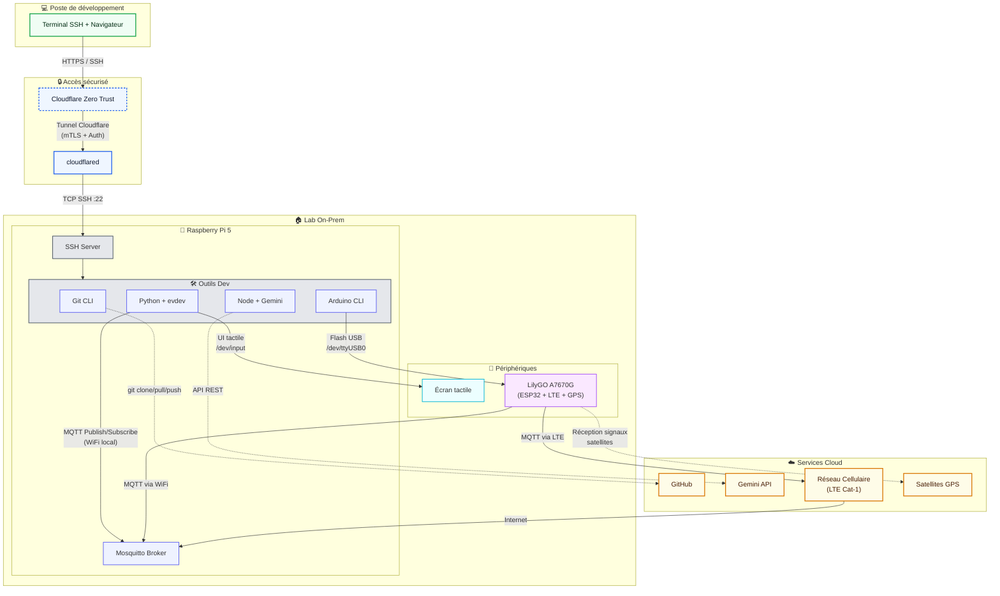

<div style="background: linear-gradient(90deg, #0ea5e9, #6366f1); padding: 18px 20px; color: #f8fafc; border-radius: 14px; box-shadow: 0 4px 12px rgba(0,0,0,0.15);">
  <h1 style="margin: 0; font-size: 28px;">Labo 2 — Communication sans fil et télémétrie IoT</h1>
  <p style="margin: 6px 0 0; font-size: 15px;">Du câble série au réseau cellulaire : communication MQTT via WiFi et LTE avec géolocalisation GPS.</p>
</div>

---

## 📐 Architecture du système



Ce diagramme illustre la nouvelle architecture avec communication sans fil:
- **Zone Client (vert):** Votre poste de développement
- **Zone d'accès sécurisé (bleu):** Cloudflare Zero Trust et tunnel
- **Zone Lab (gris):** Raspberry Pi 5 avec broker MQTT et périphériques IoT
- **Zone Cloud (jaune):** Services externes incluant le réseau cellulaire et GPS
- **Communication sans fil (violet):** LilyGO communique via WiFi ou LTE

---

## 🧭 Plan du guide
- [Prérequis](#-prérequis)
- [Introduction au protocole MQTT](#1-introduction-au-protocole-mqtt)
- [Communication MQTT via WiFi](#2-communication-mqtt-via-wifi)
- [Activation du modem LTE](#3-activation-du-modem-lte)
- [Communication MQTT via LTE](#4-communication-mqtt-via-lte)
- [Intégration GPS](#5-intégration-gps)
- [Devoir : montage sur breadboard](#6-devoir-montage-sur-breadboard)
- [Au prochain laboratoire](#-au-prochain-laboratoire)
- [Commandes de vérification](#-commandes-de-vérification-utiles)

<div style="height: 6px; background: linear-gradient(90deg, #22d3ee, #22c55e); border-radius: 999px; margin: 18px 0;"></div>

## 📋 Prérequis

<div style="background:#fef9c3; border:1px solid #facc15; padding:12px 14px; border-radius:10px;">
<strong>⚠️ Avant de commencer</strong>
<p>Assurez-vous d'avoir complété:</p>
<ul>
  <li>✅ Le Labo 1 complet (environnement de programmation distant)</li>
  <li>✅ Le devoir de préparation (installation Mosquitto et test WiFi)</li>
  <li>✅ Accès SSH distant à votre Raspberry Pi via Cloudflare Tunnel</li>
  <li>✅ Arduino CLI configuré pour ESP32</li>
  <li>✅ Carte SIM activée et insérée dans le LilyGO</li>
  <li>✅ Antennes GPS et LTE correctement branchées</li>
</ul>
</div>

### Vérification rapide

```bash
# Vérifier que Mosquitto est actif
sudo systemctl status mosquitto

# Vérifier Arduino CLI
arduino-cli version

# Vérifier les bibliothèques nécessaires
arduino-cli lib list | grep -E "TinyGSM|PubSubClient|ArduinoJson"
```

<div style="height: 5px; background: linear-gradient(90deg, #f59e0b, #fb7185); border-radius: 999px; margin: 22px 0;"></div>

## 1. Introduction au protocole MQTT
> 🎯 **Objectif :** comprendre MQTT et ses avantages pour l'IoT.

### 💡 Concepts clés

**Qu'est-ce que MQTT?**

MQTT (Message Queuing Telemetry Transport) est un protocole de messagerie léger conçu pour l'IoT. Développé à l'origine par IBM en 1999 pour surveiller des pipelines de pétrole via liaison satellite, il est devenu le standard de facto pour la communication entre appareils connectés.

**Pourquoi MQTT plutôt que HTTP?**

| Caractéristique | HTTP | MQTT |
|-----------------|------|------|
| Architecture | Requête/Réponse | Publish/Subscribe |
| Connexion | Nouvelle connexion par requête | Connexion persistante |
| Overhead | Headers volumineux (~200-800 bytes) | Headers minimaux (~2 bytes) |
| Bande passante | Élevée | Très faible |
| Latence | Moyenne à élevée | Faible |
| QoS | Non natif | 3 niveaux intégrés |
| Hors ligne | Pas de gestion | Messages en attente |
| Batterie | Consommation élevée | Optimisé pour économie |

**Architecture Publish/Subscribe:**

Dans MQTT, les appareils ne communiquent pas directement entre eux. Ils passent par un **broker** (courtier) central:

```
[Publisher] --publish--> [Broker] --deliver--> [Subscriber(s)]
                           ↕
                    [Topics/Routes]
```

**Exemple concret:**
```
LilyGO (publisher) → Topic: "iot/temperature" → Broker → Raspberry Pi (subscriber)
                                                       → Application mobile
                                                       → Cloud dashboard
```

**Avantages:**
- ✅ **Découplage:** Le publisher ne sait pas qui reçoit ses messages
- ✅ **Scalabilité:** Un message peut avoir 0, 1 ou 1000 abonnés
- ✅ **Flexibilité:** On peut ajouter/retirer des abonnés sans toucher au publisher

**Topics (sujets):**

Les topics sont des chaînes hiérarchiques qui organisent les messages, comme un système de fichiers:

```
iot/                          # Racine
├── sensors/                  # Groupe de capteurs
│   ├── temperature           # Température
│   ├── humidity              # Humidité
│   └── pressure              # Pression
├── gps/                      # Géolocalisation
│   ├── latitude
│   ├── longitude
│   └── altitude
└── status/                   # État système
    ├── battery
    └── signal
```

**Wildcards (jokers):**
- `+` : un niveau quelconque → `iot/sensors/+` écoute température, humidité, pression
- `#` : tous les sous-niveaux → `iot/#` écoute TOUT sous iot/

**Quality of Service (QoS):**

MQTT offre 3 niveaux de garantie de livraison:

| QoS | Nom | Garantie | Usage |
|-----|-----|----------|-------|
| 0 | At most once | Au plus une fois (peut être perdu) | Données temps réel non critiques (température, GPS toutes les secondes) |
| 1 | At least once | Au moins une fois (peut être dupliqué) | Données importantes mais tolérantes aux doublons |
| 2 | Exactly once | Exactement une fois (garanti unique) | Données critiques (alertes, commandes de contrôle) |

**Retained Messages:**

Un message **retained** est stocké par le broker et envoyé immédiatement à tout nouvel abonné. Utile pour:
- État actuel d'un système (ON/OFF)
- Dernière valeur connue d'un capteur
- Configuration persistante

**Last Will and Testament (LWT):**

Le "testament" MQTT permet à un appareil de préparer un message automatique envoyé par le broker si l'appareil se déconnecte brutalement (batterie vide, perte réseau, crash).

**Exemple:**
```
Topic LWT: "iot/lilygo/status"
Message LWT: "offline"
```

Si le LilyGO perd la connexion, le broker publie automatiquement `"offline"` sur ce topic.

### 1.1 Test du broker Mosquitto

#### Vérifier que Mosquitto est actif

```bash
sudo systemctl status mosquitto
```

Vous devriez voir: `Active: active (running)`

#### Test pub/sub local

**Terminal 1 - Subscriber:**
```bash
mosquitto_sub -h localhost -t "test/demo" -v
```

**Terminal 2 - Publisher:**
```bash
mosquitto_pub -h localhost -t "test/demo" -m "Hello MQTT!"
```

**Explication:**
- `-h localhost` : se connecter au broker local
- `-t "test/demo"` : topic utilisé
- `-m "Hello MQTT!"` : message à publier
- `-v` : verbose (affiche le topic avec le message)

#### Test avec QoS

**Subscriber avec QoS 1:**
```bash
mosquitto_sub -h localhost -t "test/qos" -q 1 -v
```

**Publisher avec QoS 1:**
```bash
mosquitto_pub -h localhost -t "test/qos" -q 1 -m "Message garanti!"
```

#### Test de retained message

**Publier un message retained:**
```bash
mosquitto_pub -h localhost -t "test/retained" -r -m "Je persiste!"
```

**S'abonner APRÈS la publication:**
```bash
mosquitto_sub -h localhost -t "test/retained" -v
```

Vous recevrez immédiatement `"Je persiste!"` même si le message a été publié avant votre abonnement.

#### Test de wildcards

**Terminal 1:**
```bash
mosquitto_sub -h localhost -t "sensors/#" -v
```

**Terminal 2:**
```bash
mosquitto_pub -h localhost -t "sensors/temperature" -m "22.5"
mosquitto_pub -h localhost -t "sensors/humidity" -m "65"
mosquitto_pub -h localhost -t "sensors/pressure" -m "1013"
```

Le subscriber reçoit tous les messages car `#` capture tous les sous-topics.

<div style="background:#dbeafe; border:1px solid #3b82f6; padding:10px 12px; border-radius:10px;">
<strong>💡 Astuce tmux</strong>
<p>Pour gérer plusieurs terminaux simultanément:</p>
<pre><code>tmux
# Nouvelle fenêtre: Ctrl+b puis c
# Naviguer: Ctrl+b puis n (next) / p (previous)
# Split vertical: Ctrl+b puis %
# Split horizontal: Ctrl+b puis "
# Naviguer entre panes: Ctrl+b puis flèches</code></pre>
</div>

<div style="height: 5px; background: linear-gradient(90deg, #22c55e, #84cc16); border-radius: 999px; margin: 22px 0;"></div>

## 2. Communication MQTT via WiFi
> 📡 **Objectif :** remplacer la communication série par MQTT via WiFi.

### 💡 Concepts clés

**Évolution de l'architecture:**

**Labo 1 (Série):**
```
[Interface tactile] → [Python Serial] → [Câble USB] → [LilyGO]
```

**Labo 2 (MQTT WiFi):**
```
[Interface tactile] → [MQTT Pub] → [Broker] → [MQTT Sub] → [LilyGO (WiFi)]
```

**Avantages du passage à MQTT:**
- ✅ **Sans fil:** Plus besoin de câble USB
- ✅ **Bidirectionnel:** L'interface et le LilyGO peuvent tous deux publier et s'abonner
- ✅ **Multi-clients:** Plusieurs interfaces peuvent contrôler le LilyGO
- ✅ **Logs centralisés:** Tous les messages passent par le broker
- ✅ **Extensible:** Facile d'ajouter un dashboard web, une app mobile, etc.

**Bibliothèque PubSubClient:**

PubSubClient est la bibliothèque Arduino de référence pour MQTT. Elle gère:
- Connexion au broker
- Publish de messages
- Subscribe à des topics
- Callback automatique sur réception
- Reconnexion automatique

### 2.1 Code Arduino - MQTT via WiFi

#### Créer le projet

```bash
mkdir -p ~/243-4J5-LI/labo2/mqtt-wifi
cd ~/243-4J5-LI/labo2/mqtt-wifi
nano mqtt-wifi.ino
```

#### Code complet

```cpp
#include <WiFi.h>
#include <PubSubClient.h>

// Configuration WiFi
const char* ssid = "VOTRE_SSID";
const char* password = "VOTRE_PASSWORD";

// Configuration MQTT
const char* mqtt_server = "192.168.1.9";  // IP de votre Raspberry Pi
const int mqtt_port = 1883;
const char* mqtt_client_id = "lilygo-esp32";

// Topics MQTT
const char* topic_command = "iot/led/command";      // Commandes vers LilyGO
const char* topic_status = "iot/led/status";        // Status depuis LilyGO
const char* topic_lwt = "iot/lilygo/status";        // Last Will

// Pins LED
#define LED_RED 25
#define LED_GREEN 26

// Clients
WiFiClient espClient;
PubSubClient mqttClient(espClient);

void setup() {
  Serial.begin(115200);
  delay(1000);

  // Configuration LEDs
  pinMode(LED_RED, OUTPUT);
  pinMode(LED_GREEN, OUTPUT);
  digitalWrite(LED_RED, LOW);
  digitalWrite(LED_GREEN, LOW);

  Serial.println("=========================");
  Serial.println("LilyGO - MQTT via WiFi");
  Serial.println("=========================");

  // Connexion WiFi
  connectWiFi();

  // Configuration MQTT
  mqttClient.setServer(mqtt_server, mqtt_port);
  mqttClient.setCallback(mqttCallback);

  // Connexion MQTT
  connectMQTT();
}

void loop() {
  // Maintenir la connexion MQTT
  if (!mqttClient.connected()) {
    connectMQTT();
  }
  mqttClient.loop();

  // Heartbeat toutes les 10 secondes
  static unsigned long lastHeartbeat = 0;
  if (millis() - lastHeartbeat > 10000) {
    mqttClient.publish(topic_lwt, "online", true);  // Retained
    lastHeartbeat = millis();
  }
}

void connectWiFi() {
  Serial.print("Connexion WiFi à: ");
  Serial.println(ssid);

  WiFi.begin(ssid, password);

  int attempts = 0;
  while (WiFi.status() != WL_CONNECTED && attempts < 20) {
    delay(500);
    Serial.print(".");
    attempts++;
  }

  if (WiFi.status() == WL_CONNECTED) {
    Serial.println("\n✓ WiFi connecté!");
    Serial.print("IP: ");
    Serial.println(WiFi.localIP());
    Serial.print("Signal: ");
    Serial.print(WiFi.RSSI());
    Serial.println(" dBm");
  } else {
    Serial.println("\n✗ Échec connexion WiFi");
    Serial.println("Redémarrage dans 5s...");
    delay(5000);
    ESP.restart();
  }
}

void connectMQTT() {
  while (!mqttClient.connected()) {
    Serial.print("Connexion MQTT au broker ");
    Serial.print(mqtt_server);
    Serial.print(":");
    Serial.print(mqtt_port);
    Serial.print("...");

    // Connexion avec Last Will
    if (mqttClient.connect(mqtt_client_id, topic_lwt, 1, true, "offline")) {
      Serial.println(" ✓ Connecté!");

      // S'abonner aux commandes
      mqttClient.subscribe(topic_command, 1);  // QoS 1
      Serial.print("Abonné au topic: ");
      Serial.println(topic_command);

      // Publier le status online
      mqttClient.publish(topic_lwt, "online", true);  // Retained
      mqttClient.publish(topic_status, "{\"status\":\"ready\",\"leds\":{\"red\":\"off\",\"green\":\"off\"}}");

    } else {
      Serial.print(" ✗ Échec, rc=");
      Serial.println(mqttClient.state());
      Serial.println("Nouvelle tentative dans 5s...");
      delay(5000);
    }
  }
}

void mqttCallback(char* topic, byte* payload, unsigned int length) {
  // Convertir payload en String
  String message = "";
  for (int i = 0; i < length; i++) {
    message += (char)payload[i];
  }

  Serial.print("Message reçu [");
  Serial.print(topic);
  Serial.print("]: ");
  Serial.println(message);

  // Traiter les commandes
  if (String(topic) == topic_command) {
    handleCommand(message);
  }
}

void handleCommand(String command) {
  command.trim();
  command.toLowerCase();

  if (command == "red") {
    digitalWrite(LED_RED, HIGH);
    digitalWrite(LED_GREEN, LOW);
    mqttClient.publish(topic_status, "{\"led\":\"red\",\"state\":\"on\"}");
    Serial.println("→ LED ROUGE allumée");

  } else if (command == "green") {
    digitalWrite(LED_RED, LOW);
    digitalWrite(LED_GREEN, HIGH);
    mqttClient.publish(topic_status, "{\"led\":\"green\",\"state\":\"on\"}");
    Serial.println("→ LED VERTE allumée");

  } else if (command == "off") {
    digitalWrite(LED_RED, LOW);
    digitalWrite(LED_GREEN, LOW);
    mqttClient.publish(topic_status, "{\"led\":\"all\",\"state\":\"off\"}");
    Serial.println("→ LEDs éteintes");

  } else {
    Serial.print("✗ Commande inconnue: ");
    Serial.println(command);
    mqttClient.publish(topic_status, "{\"error\":\"unknown_command\"}");
  }
}
```

<div style="background:#fef9c3; border:1px solid #facc15; padding:10px 12px; border-radius:10px;">
<strong>📖 Explication du code</strong>
<ul>
  <li><code>WiFi.begin()</code> → Connexion au réseau WiFi</li>
  <li><code>mqttClient.setServer()</code> → Configuration du broker MQTT</li>
  <li><code>mqttClient.setCallback()</code> → Fonction appelée lors de réception de message</li>
  <li><code>mqttClient.connect()</code> → Connexion avec Last Will Testament</li>
  <li><code>mqttClient.subscribe()</code> → S'abonner au topic des commandes</li>
  <li><code>mqttClient.publish()</code> → Publier un message (status, heartbeat)</li>
  <li><code>mqttClient.loop()</code> → Traiter les messages entrants (à appeler dans loop())</li>
  <li>Paramètre <code>true</code> dans publish → Message retained</li>
  <li>QoS 1 → Garantie de livraison au moins une fois</li>
</ul>

<strong>⚙️ À personnaliser</strong>
<ul>
  <li><code>ssid</code> et <code>password</code> → Vos identifiants WiFi</li>
  <li><code>mqtt_server</code> → IP de votre Raspberry Pi (192.168.1.9 ou autre)</li>
  <li><code>LED_RED</code> et <code>LED_GREEN</code> → Pins GPIO selon votre circuit</li>
</ul>
</div>

#### Compilation et téléversement

```bash
arduino-cli compile --fqbn esp32:esp32:esp32 mqtt-wifi.ino
arduino-cli upload -p /dev/ttyUSB0 --fqbn esp32:esp32:esp32 mqtt-wifi.ino
```

#### Monitoring

```bash
arduino-cli monitor -p /dev/ttyUSB0 -c baudrate=115200
```

### 2.2 Test de la communication MQTT

#### Tester depuis la ligne de commande

**Surveiller tous les messages:**
```bash
mosquitto_sub -h localhost -t "iot/#" -v
```

**Envoyer des commandes:**
```bash
# Allumer LED rouge
mosquitto_pub -h localhost -t "iot/led/command" -m "red"

# Allumer LED verte
mosquitto_pub -h localhost -t "iot/led/command" -m "green"

# Éteindre toutes les LEDs
mosquitto_pub -h localhost -t "iot/led/command" -m "off"
```

Vous devriez voir:
- Les messages de commande sur `iot/led/command`
- Les réponses de status sur `iot/led/status`
- Les heartbeats sur `iot/lilygo/status`

#### Vérifier le Last Will Testament

**S'abonner au status:**
```bash
mosquitto_sub -h localhost -t "iot/lilygo/status" -v
```

**Débrancher le LilyGO** (ou appuyer sur RESET):
Le broker devrait automatiquement publier `"offline"` sur le topic.

### 2.3 Interface Python MQTT

#### Modifier l'interface tactile

Adaptez votre `touch_ui.py` du Labo 1 pour utiliser MQTT au lieu du port série.

**Installer la bibliothèque MQTT Python:**
```bash
sudo apt install -y python3-paho-mqtt
```

**Extrait de code pour intégration:**
```python
import paho.mqtt.client as mqtt

# Configuration MQTT
MQTT_BROKER = "localhost"
MQTT_PORT = 1883
MQTT_TOPIC_COMMAND = "iot/led/command"
MQTT_TOPIC_STATUS = "iot/led/status"

# Créer client MQTT
mqtt_client = mqtt.Client("touchscreen-ui")

def on_connect(client, userdata, flags, rc):
    print(f"Connecté au broker MQTT avec code: {rc}")
    client.subscribe(MQTT_TOPIC_STATUS)

def on_message(client, userdata, msg):
    print(f"Message reçu: {msg.topic} -> {msg.payload.decode()}")

mqtt_client.on_connect = on_connect
mqtt_client.on_message = on_message
mqtt_client.connect(MQTT_BROKER, MQTT_PORT, 60)
mqtt_client.loop_start()  # Thread séparé pour MQTT

# Dans votre gestionnaire de bouton tactile:
def handle_red_button():
    mqtt_client.publish(MQTT_TOPIC_COMMAND, "red")

def handle_green_button():
    mqtt_client.publish(MQTT_TOPIC_COMMAND, "green")
```

<div style="background:#dbeafe; border:1px solid #3b82f6; padding:10px 12px; border-radius:10px;">
<strong>💡 Exercice</strong>
<p>Modifiez complètement <code>touch_ui.py</code> pour:</p>
<ul>
  <li>Remplacer la communication série par MQTT</li>
  <li>Afficher le status de connexion du LilyGO (online/offline)</li>
  <li>Afficher les réponses de status reçues</li>
  <li>Ajouter un compteur de messages reçus</li>
</ul>
</div>

<div style="height: 5px; background: linear-gradient(90deg, #f59e0b, #f97316); border-radius: 999px; margin: 22px 0;"></div>

## 3. Activation du modem LTE
> 📶 **Objectif :** configurer le modem A7670G pour la connectivité cellulaire.

### 💡 Concepts clés

**Qu'est-ce que le modem A7670G?**

Le **A7670G** est un modem cellulaire multi-bande supportant:
- **2G:** GSM 850/900/1800/1900 MHz
- **3G:** UMTS/HSPA+ (bandes 1/2/4/5/6/8)
- **4G LTE Cat-1:** Jusqu'à 10 Mbps DL / 5 Mbps UL (bandes 1/2/3/4/5/7/8/12/13/18/19/20/25/26/28/66)

**LTE Cat-1 vs autres catégories:**

| Catégorie | Débit descendant | Débit montant | Usage |
|-----------|------------------|---------------|-------|
| LTE Cat-1 | 10 Mbps | 5 Mbps | IoT, M2M, télémétrie |
| LTE Cat-4 | 150 Mbps | 50 Mbps | Smartphones |
| LTE Cat-M1 (eMTC) | 1 Mbps | 1 Mbps | IoT basse consommation |
| NB-IoT | 250 kbps | 250 kbps | Capteurs ultra basse consommation |

**Cat-1** est idéal pour l'IoT car:
- ✅ Débit suffisant pour télémétrie, GPS, images basse résolution
- ✅ Couverture mondiale (fallback 2G/3G)
- ✅ Coût modéré
- ✅ Consommation raisonnable

**Communication AT Commands:**

Les modems cellulaires se contrôlent via **commandes AT** (ATtention commands), héritées des modems téléphoniques des années 80.

**Format:**
```
AT+COMMANDE=PARAMETRE
```

**Exemples:**
- `AT` → Test de communication
- `AT+CPIN?` → Vérifier le PIN de la SIM
- `AT+CREG?` → État de l'enregistrement réseau
- `AT+CSQ` → Qualité du signal

**Communication série avec le modem:**

Sur le LilyGO, l'ESP32 communique avec le A7670G via **UART série**:
```
ESP32 (Serial1) ←→ A7670G Modem
  TX → RX
  RX ← TX
```

**TinyGSM:** Bibliothèque qui abstrait les commandes AT et facilite l'utilisation du modem.

**APN (Access Point Name):**

L'**APN** est le point d'accès réseau de votre opérateur cellulaire. C'est comme le "SSID" du réseau cellulaire.

**APNs courants au Canada:**
- **Rogers:** `internet.com`
- **Bell/Virgin:** `inet.bell.ca` ou `pda.bell.ca`
- **Telus/Koodo:** `sp.telus.com`
- **Fido:** `internet.fido.ca`
- **Chatr:** `chatrweb.apn`

### 3.1 Vérification matérielle

**Avant de commencer:**

<div style="background:#fee2e2; border:1px solid #ef4444; padding:10px 12px; border-radius:10px;">
<strong>⚠️ Checklist matériel</strong>
<ul>
  <li>✅ Carte SIM activée et insérée correctement (coin coupé vers le connecteur)</li>
  <li>✅ Antenne LTE vissée sur le connecteur LTE (pas GPS!)</li>
  <li>✅ Antenne GPS vissée sur le connecteur GPS</li>
  <li>✅ Alimentation stable (USB-C du PC ou adaptateur)</li>
  <li>✅ PIN de la SIM désactivé (ou connu)</li>
</ul>

<strong>🔧 Désactiver le PIN de la SIM</strong>
<p>Insérez la SIM dans un téléphone et allez dans:</p>
<code>Réglages → Sécurité → Carte SIM → Verrouillage PIN → Désactiver</code>
<p>Cela évite d'avoir à saisir le PIN à chaque connexion.</p>
</div>

**Identifier les connecteurs:**

```
LilyGO A7670G (vue de dessus):
┌─────────────────────────────┐
│  [ANT GPS]      [ANT LTE]   │ ← Connecteurs antennes (à visser)
│                              │
│      [Slot SIM] →            │ ← Carte SIM (face vers le bas)
│                              │
│         [ESP32]              │
│                              │
│      [USB-C]                 │ ← Alimentation et programmation
└─────────────────────────────┘
```

### 3.2 Code de test du modem

#### Créer le projet

```bash
mkdir -p ~/243-4J5-LI/labo2/modem-test
cd ~/243-4J5-LI/labo2/modem-test
nano modem-test.ino
```

#### Code de diagnostic

```cpp
// Test du modem A7670G
// Vérifie la SIM, le signal et l'enregistrement réseau

#define MODEM_TX 27
#define MODEM_RX 26
#define MODEM_PWRKEY 4
#define MODEM_DTR 32
#define MODEM_RI 33
#define MODEM_FLIGHT 25
#define MODEM_STATUS 34

HardwareSerial SerialAT(1);  // UART1 pour le modem

void setup() {
  Serial.begin(115200);
  delay(2000);

  Serial.println("=========================");
  Serial.println("Test Modem A7670G");
  Serial.println("=========================");

  // Configuration pins
  pinMode(MODEM_PWRKEY, OUTPUT);
  pinMode(MODEM_FLIGHT, OUTPUT);
  digitalWrite(MODEM_FLIGHT, HIGH);  // Mode normal

  // Initialiser communication série avec modem
  SerialAT.begin(115200, SERIAL_8N1, MODEM_RX, MODEM_TX);

  Serial.println("Démarrage du modem...");
  powerOnModem();

  delay(5000);  // Laisser le modem s'initialiser

  // Tests
  testModem();
}

void loop() {
  // Relayer les commandes AT manuelles
  if (Serial.available()) {
    SerialAT.write(Serial.read());
  }
  if (SerialAT.available()) {
    Serial.write(SerialAT.read());
  }
}

void powerOnModem() {
  // Séquence de démarrage
  digitalWrite(MODEM_PWRKEY, HIGH);
  delay(100);
  digitalWrite(MODEM_PWRKEY, LOW);
  delay(1000);
  digitalWrite(MODEM_PWRKEY, HIGH);

  Serial.println("✓ Séquence power ON envoyée");
}

void testModem() {
  Serial.println("\n--- Tests de communication ---");

  // Test 1: Communication basique
  Serial.print("Test AT... ");
  sendAT("AT");
  delay(500);

  // Test 2: Identité du modem
  Serial.print("\nInfo modem: ");
  sendAT("ATI");
  delay(500);

  // Test 3: Vérifier SIM
  Serial.print("\nTest SIM: ");
  sendAT("AT+CPIN?");
  delay(500);

  // Test 4: Qualité signal
  Serial.print("\nQualité signal: ");
  sendAT("AT+CSQ");
  delay(500);

  // Test 5: Enregistrement réseau
  Serial.print("\nEnregistrement réseau: ");
  sendAT("AT+CREG?");
  delay(500);

  // Test 6: Opérateur
  Serial.print("\nOpérateur: ");
  sendAT("AT+COPS?");
  delay(1000);

  Serial.println("\n--- Tests terminés ---");
  Serial.println("Vous pouvez maintenant envoyer des commandes AT manuellement.");
}

void sendAT(const char* cmd) {
  SerialAT.println(cmd);
  delay(100);

  // Lire réponse
  unsigned long timeout = millis() + 2000;
  while (millis() < timeout) {
    if (SerialAT.available()) {
      String response = SerialAT.readString();
      Serial.println(response);
      return;
    }
  }
  Serial.println("✗ Timeout");
}
```

#### Compiler et téléverser

```bash
arduino-cli compile --fqbn esp32:esp32:esp32 modem-test.ino
arduino-cli upload -p /dev/ttyUSB0 --fqbn esp32:esp32:esp32 modem-test.ino
arduino-cli monitor -p /dev/ttyUSB0 -c baudrate=115200
```

### 3.3 Interpréter les résultats

**Réponses attendues:**

```
Test AT...
OK

Info modem:
A7670G

Test SIM:
+CPIN: READY
OK

Qualité signal:
+CSQ: 18,99
OK

Enregistrement réseau:
+CREG: 0,1
OK

Opérateur:
+COPS: 0,0,"Rogers",7
OK
```

<div style="background:#fef9c3; border:1px solid #facc15; padding:10px 12px; border-radius:10px;">
<strong>📖 Interprétation</strong>

<strong>+CPIN: READY</strong>
<ul>
  <li>✅ SIM détectée et prête</li>
  <li>Si <code>+CPIN: SIM PIN</code> → PIN requis</li>
  <li>Si <code>+CME ERROR: 10</code> → SIM absente</li>
</ul>

<strong>+CSQ: 18,99</strong>
<ul>
  <li>Premier nombre (18) = RSSI (Received Signal Strength Indicator)</li>
  <li>0-31 = Signal valide (18 = -89 dBm, bon signal)</li>
  <li>99 = Pas de signal</li>
  <li>Qualité: 0-9: mauvais, 10-14: moyen, 15-19: bon, 20-31: excellent</li>
</ul>

<strong>+CREG: 0,1</strong>
<ul>
  <li>Deuxième nombre (1) = État d'enregistrement</li>
  <li>0 = Non enregistré, pas de recherche</li>
  <li>1 = Enregistré, réseau domestique ✅</li>
  <li>2 = Recherche en cours</li>
  <li>3 = Enregistrement refusé</li>
  <li>5 = Enregistré, itinérance (roaming)</li>
</ul>

<strong>+COPS: 0,0,"Rogers",7</strong>
<ul>
  <li>"Rogers" = Nom de l'opérateur</li>
  <li>7 = LTE (mode réseau)</li>
  <li>Autres: 0=GSM, 2=UMTS, 3=EDGE, 7=LTE</li>
</ul>
</div>

**Si les tests échouent:**

<div style="background:#fee2e2; border:1px solid #ef4444; padding:10px 12px; border-radius:10px;">
<strong>⚡ Dépannage</strong>
<ul>
  <li><strong>Pas de réponse AT:</strong> Vérifier pins TX/RX, baudrate (essayer 9600), séquence de power</li>
  <li><strong>SIM PIN requis:</strong> Désactiver le PIN dans un téléphone</li>
  <li><strong>+CSQ: 99,99:</strong> Vérifier antenne LTE, position (près d'une fenêtre), attendre 1-2 minutes</li>
  <li><strong>+CREG: 0,2 (searching):</strong> Patienter, peut prendre 30s-2min</li>
  <li><strong>+CREG: 0,3 (denied):</strong> SIM non activée, APN incorrect, plan de données requis</li>
</ul>
</div>

<div style="height: 5px; background: linear-gradient(90deg, #22d3ee, #3b82f6); border-radius: 999px; margin: 22px 0;"></div>

## 4. Communication MQTT via LTE
> 🌍 **Objectif :** publier des messages MQTT via le réseau cellulaire.

### 💡 Concepts clés

**Architecture finale:**

```
[LilyGO] → [Modem A7670G] → [Tour cellulaire] → [Internet] → [Broker MQTT Raspberry Pi]
                                                                      ↓
                                                              [Interface tactile]
```

**Avantages:**
- ✅ **Mobilité totale:** Fonctionne n'importe où avec couverture cellulaire
- ✅ **Indépendant du WiFi:** Pas besoin de configuration réseau
- ✅ **Toujours connecté:** Roaming automatique entre antennes
- ✅ **Cas d'usage réels:** Véhicules, zones rurales, déploiements temporaires

**Défis:**
- ❌ Consommation électrique plus élevée que WiFi
- ❌ Latence légèrement supérieure
- ❌ Coût données cellulaires (généralement faible pour MQTT)

### 4.1 Configuration Cloudflare Tunnel pour MQTT

Pour que le LilyGO puisse se connecter au broker MQTT du Raspberry Pi depuis l'extérieur, il faut exposer le port 1883.

#### Option 1: Tunnel MQTT direct (recommandé)

**Sur le Raspberry Pi, éditer la config Cloudflare:**
```bash
nano /home/fpoisson/.cloudflared/config.yml
```

**Ajouter la règle MQTT:**
```yaml
tunnel: <TON-UUID-ICI>
credentials-file: /home/fpoisson/.cloudflared/<TON-UUID-ICI>.json

ingress:
  - hostname: rpi.edxo.ca
    service: ssh://localhost:22
  - hostname: mqtt.edxo.ca
    service: tcp://localhost:1883
  - service: http_status:404
```

**Créer l'entrée DNS:**
```bash
cloudflared tunnel route dns rpi-ssh mqtt.edxo.ca
```

**Redémarrer le tunnel:**
```bash
sudo systemctl restart cloudflared
```

#### Option 2: Broker MQTT public (pour tests)

Utilisez un broker public comme:
- `test.mosquitto.org:1883` (non sécurisé)
- `broker.hivemq.com:1883`

**⚠️ Attention:** Les brokers publics sont **non sécurisés** et visibles par tous. Ne pas utiliser en production!

### 4.2 Code Arduino - MQTT via LTE

#### Créer le projet

```bash
mkdir -p ~/243-4J5-LI/labo2/mqtt-lte
cd ~/243-4J5-LI/labo2/mqtt-lte
nano mqtt-lte.ino
```

#### Code complet

```cpp
#define TINY_GSM_MODEM_SIM7600  // Compatible avec A7670G
#include <TinyGsmClient.h>
#include <PubSubClient.h>

// Pins modem
#define MODEM_TX 27
#define MODEM_RX 26
#define MODEM_PWRKEY 4
#define MODEM_DTR 32
#define MODEM_RI 33
#define MODEM_FLIGHT 25

// Pins LED
#define LED_RED 25
#define LED_GREEN 26

// Configuration réseau cellulaire
const char* apn = "internet.com";  // Rogers - À adapter selon opérateur
const char* gprsUser = "";
const char* gprsPass = "";

// Configuration MQTT
const char* mqtt_server = "mqtt.edxo.ca";  // Ou broker public
const int mqtt_port = 1883;
const char* mqtt_client_id = "lilygo-lte";

// Topics MQTT
const char* topic_command = "iot/led/command";
const char* topic_status = "iot/led/status";
const char* topic_lwt = "iot/lilygo/status";
const char* topic_network = "iot/lilygo/network";

// Clients
HardwareSerial SerialAT(1);
TinyGsm modem(SerialAT);
TinyGsmClient gsmClient(modem);
PubSubClient mqttClient(gsmClient);

void setup() {
  Serial.begin(115200);
  delay(2000);

  // Configuration LEDs
  pinMode(LED_RED, OUTPUT);
  pinMode(LED_GREEN, OUTPUT);
  digitalWrite(LED_RED, LOW);
  digitalWrite(LED_GREEN, LOW);

  // Configuration modem pins
  pinMode(MODEM_PWRKEY, OUTPUT);
  pinMode(MODEM_FLIGHT, OUTPUT);
  digitalWrite(MODEM_FLIGHT, HIGH);

  Serial.println("=========================");
  Serial.println("LilyGO - MQTT via LTE");
  Serial.println("=========================");

  // Initialiser modem
  SerialAT.begin(115200, SERIAL_8N1, MODEM_RX, MODEM_TX);

  Serial.println("Démarrage modem...");
  powerOnModem();
  delay(3000);

  // Connexion réseau cellulaire
  connectCellular();

  // Configuration MQTT
  mqttClient.setServer(mqtt_server, mqtt_port);
  mqttClient.setCallback(mqttCallback);
  mqttClient.setKeepAlive(60);

  // Connexion MQTT
  connectMQTT();
}

void loop() {
  // Maintenir connexions
  if (!modem.isNetworkConnected()) {
    Serial.println("✗ Réseau cellulaire perdu, reconnexion...");
    connectCellular();
  }

  if (!mqttClient.connected()) {
    connectMQTT();
  }
  mqttClient.loop();

  // Heartbeat toutes les 30 secondes
  static unsigned long lastHeartbeat = 0;
  if (millis() - lastHeartbeat > 30000) {
    publishNetworkInfo();
    mqttClient.publish(topic_lwt, "online", true);
    lastHeartbeat = millis();
  }
}

void powerOnModem() {
  digitalWrite(MODEM_PWRKEY, HIGH);
  delay(100);
  digitalWrite(MODEM_PWRKEY, LOW);
  delay(1000);
  digitalWrite(MODEM_PWRKEY, HIGH);
}

void connectCellular() {
  Serial.println("Initialisation du modem...");

  if (!modem.restart()) {
    Serial.println("✗ Échec restart modem");
    delay(5000);
    ESP.restart();
  }

  String modemInfo = modem.getModemInfo();
  Serial.print("Modem: ");
  Serial.println(modemInfo);

  // Attendre enregistrement réseau
  Serial.print("Attente réseau cellulaire");
  if (!modem.waitForNetwork(60000L)) {
    Serial.println("\n✗ Échec enregistrement réseau");
    delay(5000);
    ESP.restart();
  }
  Serial.println(" ✓");

  // Connexion GPRS
  Serial.print("Connexion GPRS");
  if (!modem.gprsConnect(apn, gprsUser, gprsPass)) {
    Serial.println(" ✗ Échec");
    delay(5000);
    ESP.restart();
  }
  Serial.println(" ✓");

  // Afficher info réseau
  printNetworkInfo();
}

void printNetworkInfo() {
  Serial.println("\n--- Info réseau ---");

  int csq = modem.getSignalQuality();
  Serial.print("Signal (CSQ): ");
  Serial.println(csq);

  String cop = modem.getOperator();
  Serial.print("Opérateur: ");
  Serial.println(cop);

  IPAddress ip = modem.localIP();
  Serial.print("IP locale: ");
  Serial.println(ip);

  Serial.println("-------------------\n");
}

void publishNetworkInfo() {
  int csq = modem.getSignalQuality();
  String cop = modem.getOperator();
  IPAddress ip = modem.localIP();

  String payload = "{";
  payload += "\"signal\":" + String(csq) + ",";
  payload += "\"operator\":\"" + cop + "\",";
  payload += "\"ip\":\"" + ip.toString() + "\"";
  payload += "}";

  mqttClient.publish(topic_network, payload.c_str());
}

void connectMQTT() {
  int attempts = 0;
  while (!mqttClient.connected() && attempts < 3) {
    Serial.print("Connexion MQTT à ");
    Serial.print(mqtt_server);
    Serial.print("...");

    if (mqttClient.connect(mqtt_client_id, topic_lwt, 1, true, "offline")) {
      Serial.println(" ✓");

      mqttClient.subscribe(topic_command, 1);
      mqttClient.publish(topic_lwt, "online", true);
      mqttClient.publish(topic_status, "{\"status\":\"ready\",\"connection\":\"lte\"}");

      publishNetworkInfo();

    } else {
      Serial.print(" ✗ rc=");
      Serial.println(mqttClient.state());
      attempts++;
      delay(5000);
    }
  }

  if (!mqttClient.connected()) {
    Serial.println("Échec connexion MQTT, redémarrage...");
    delay(5000);
    ESP.restart();
  }
}

void mqttCallback(char* topic, byte* payload, unsigned int length) {
  String message = "";
  for (int i = 0; i < length; i++) {
    message += (char)payload[i];
  }

  Serial.print("MQTT [");
  Serial.print(topic);
  Serial.print("]: ");
  Serial.println(message);

  if (String(topic) == topic_command) {
    handleCommand(message);
  }
}

void handleCommand(String command) {
  command.trim();
  command.toLowerCase();

  if (command == "red") {
    digitalWrite(LED_RED, HIGH);
    digitalWrite(LED_GREEN, LOW);
    mqttClient.publish(topic_status, "{\"led\":\"red\",\"state\":\"on\"}");
    Serial.println("→ LED ROUGE");

  } else if (command == "green") {
    digitalWrite(LED_RED, LOW);
    digitalWrite(LED_GREEN, HIGH);
    mqttClient.publish(topic_status, "{\"led\":\"green\",\"state\":\"on\"}");
    Serial.println("→ LED VERTE");

  } else if (command == "off") {
    digitalWrite(LED_RED, LOW);
    digitalWrite(LED_GREEN, LOW);
    mqttClient.publish(topic_status, "{\"led\":\"all\",\"state\":\"off\"}");
    Serial.println("→ LEDs OFF");

  } else if (command == "status") {
    publishNetworkInfo();

  } else {
    mqttClient.publish(topic_status, "{\"error\":\"unknown_command\"}");
  }
}
```

<div style="background:#fef9c3; border:1px solid #facc15; padding:10px 12px; border-radius:10px;">
<strong>⚙️ À personnaliser</strong>
<ul>
  <li><code>apn</code> → APN de votre opérateur cellulaire</li>
  <li><code>mqtt_server</code> → Votre domaine Cloudflare (mqtt.edxo.ca) ou broker public</li>
  <li><code>LED_RED</code> / <code>LED_GREEN</code> → Pins selon votre circuit</li>
</ul>
</div>

#### Compilation et test

```bash
arduino-cli compile --fqbn esp32:esp32:esp32 mqtt-lte.ino
arduino-cli upload -p /dev/ttyUSB0 --fqbn esp32:esp32:esp32 mqtt-lte.ino
arduino-cli monitor -p /dev/ttyUSB0 -c baudrate=115200
```

**Sortie attendue:**
```
=========================
LilyGO - MQTT via LTE
=========================
Démarrage modem...
Initialisation du modem...
Modem: A7670G
Attente réseau cellulaire ✓
Connexion GPRS ✓

--- Info réseau ---
Signal (CSQ): 18
Opérateur: Rogers
IP locale: 10.177.xxx.xxx
-------------------

Connexion MQTT à mqtt.edxo.ca... ✓
```

### 4.3 Test de bout en bout

**Sur le Raspberry Pi (ou PC distant):**

```bash
# S'abonner aux topics
mosquitto_sub -h localhost -t "iot/#" -v
```

**Envoyer une commande:**
```bash
mosquitto_pub -h localhost -t "iot/led/command" -m "red"
```

**Vous devriez voir:**
- Le LilyGO reçoit la commande (même connecté via LTE!)
- La LED rouge s'allume
- Un message de status est publié sur `iot/led/status`
- Les infos réseau sur `iot/lilygo/network`

**Tester en mobilité:**
- Débranchez le LilyGO de l'USB (utilisez une batterie externe)
- Déplacez-vous dans une autre pièce
- Les commandes fonctionnent toujours via le réseau cellulaire!

<div style="height: 5px; background: linear-gradient(90deg, #c084fc, #22d3ee); border-radius: 999px; margin: 22px 0;"></div>

## 5. Intégration GPS
> 📍 **Objectif :** récupérer la position GPS et l'envoyer via MQTT.

### 💡 Concepts clés

**GNSS vs GPS:**

**GPS** (Global Positioning System) est le système américain. **GNSS** (Global Navigation Satellite System) inclut:
- GPS (USA)
- GLONASS (Russie)
- Galileo (Europe)
- BeiDou (Chine)

Le modem A7670G supporte **GPS + GLONASS + Galileo** simultanément pour une meilleure précision.

**Format NMEA:**

Les données GPS sont transmises au format **NMEA** (National Marine Electronics Association), une norme de communication série.

**Exemple de trame NMEA:**
```
$GNGGA,123519,4807.038,N,01131.000,E,1,08,0.9,545.4,M,46.9,M,,*47
```

**Décodage:**
- `GNGGA` → Type de trame (Global Navigation - GPS Fix Data)
- `123519` → Heure UTC (12:35:19)
- `4807.038,N` → Latitude 48°07.038' Nord
- `01131.000,E` → Longitude 11°31.000' Est
- `1` → Fix quality (1 = GPS fix)
- `08` → Nombre de satellites
- `0.9` → HDOP (précision horizontale)
- `545.4,M` → Altitude 545.4 mètres

**TinyGPSPlus:** Bibliothèque qui parse les trames NMEA et extrait les données facilement.

**Cold start vs Warm start:**
- **Cold start:** Première acquisition GPS, peut prendre 30s-5min (téléchargement almanach satellites)
- **Warm start:** GPS utilisé récemment, acquisition en 5-30s
- **Hot start:** GPS juste éteint, acquisition en <5s

### 5.1 Installation bibliothèque GPS

```bash
arduino-cli lib install "TinyGPSPlus"
```

### 5.2 Code intégré GPS + MQTT LTE

#### Créer le projet

```bash
mkdir -p ~/243-4J5-LI/labo2/gps-mqtt-lte
cd ~/243-4J5-LI/labo2/gps-mqtt-lte
nano gps-mqtt-lte.ino
```

#### Code complet

```cpp
#define TINY_GSM_MODEM_SIM7600
#include <TinyGsmClient.h>
#include <PubSubClient.h>
#include <TinyGPSPlus.h>

// Pins modem
#define MODEM_TX 27
#define MODEM_RX 26
#define MODEM_PWRKEY 4
#define MODEM_FLIGHT 25

// Pins LED
#define LED_RED 25
#define LED_GREEN 26

// Configuration
const char* apn = "internet.com";
const char* mqtt_server = "mqtt.edxo.ca";
const int mqtt_port = 1883;
const char* mqtt_client_id = "lilygo-gps-lte";

// Topics
const char* topic_command = "iot/led/command";
const char* topic_status = "iot/led/status";
const char* topic_gps = "iot/gps/location";
const char* topic_lwt = "iot/lilygo/status";

// Clients
HardwareSerial SerialAT(1);
TinyGsm modem(SerialAT);
TinyGsmClient gsmClient(modem);
PubSubClient mqttClient(gsmClient);
TinyGPSPlus gps;

// GPS tracking
unsigned long lastGPSPublish = 0;
const unsigned long GPS_PUBLISH_INTERVAL = 10000;  // Publier GPS toutes les 10s

void setup() {
  Serial.begin(115200);
  delay(2000);

  pinMode(LED_RED, OUTPUT);
  pinMode(LED_GREEN, OUTPUT);
  pinMode(MODEM_PWRKEY, OUTPUT);
  pinMode(MODEM_FLIGHT, OUTPUT);
  digitalWrite(MODEM_FLIGHT, HIGH);

  Serial.println("=========================");
  Serial.println("LilyGO - GPS + MQTT LTE");
  Serial.println("=========================");

  SerialAT.begin(115200, SERIAL_8N1, MODEM_RX, MODEM_TX);

  powerOnModem();
  delay(3000);

  connectCellular();
  enableGPS();

  mqttClient.setServer(mqtt_server, mqtt_port);
  mqttClient.setCallback(mqttCallback);
  mqttClient.setKeepAlive(60);

  connectMQTT();
}

void loop() {
  // Maintenir connexions
  if (!modem.isNetworkConnected()) {
    connectCellular();
  }
  if (!mqttClient.connected()) {
    connectMQTT();
  }
  mqttClient.loop();

  // Lire données GPS
  readGPS();

  // Publier position GPS périodiquement
  if (millis() - lastGPSPublish > GPS_PUBLISH_INTERVAL) {
    if (gps.location.isValid()) {
      publishGPS();
    } else {
      Serial.println("GPS: En attente de fix...");
      mqttClient.publish(topic_gps, "{\"status\":\"no_fix\"}");
    }
    lastGPSPublish = millis();
  }
}

void powerOnModem() {
  digitalWrite(MODEM_PWRKEY, HIGH);
  delay(100);
  digitalWrite(MODEM_PWRKEY, LOW);
  delay(1000);
  digitalWrite(MODEM_PWRKEY, HIGH);
}

void connectCellular() {
  Serial.println("Connexion réseau cellulaire...");

  if (!modem.restart()) {
    Serial.println("✗ Échec restart");
    delay(5000);
    ESP.restart();
  }

  if (!modem.waitForNetwork(60000L)) {
    Serial.println("✗ Pas de réseau");
    delay(5000);
    ESP.restart();
  }

  if (!modem.gprsConnect(apn, "", "")) {
    Serial.println("✗ Échec GPRS");
    delay(5000);
    ESP.restart();
  }

  Serial.println("✓ Réseau cellulaire connecté");
  Serial.print("IP: ");
  Serial.println(modem.localIP());
}

void enableGPS() {
  Serial.println("Activation GPS...");

  // Activer GPS
  SerialAT.println("AT+CGPS=1,1");
  delay(200);

  // Lire réponse
  while (SerialAT.available()) {
    Serial.write(SerialAT.read());
  }

  Serial.println("✓ GPS activé (acquisition en cours...)");
  Serial.println("Patientez 30s-2min pour le premier fix GPS");
}

void readGPS() {
  // Demander position GPS
  SerialAT.println("AT+CGPSINFO");
  delay(100);

  // Lire et parser réponse NMEA
  while (SerialAT.available()) {
    char c = SerialAT.read();
    gps.encode(c);
  }
}

void publishGPS() {
  String payload = "{";
  payload += "\"latitude\":" + String(gps.location.lat(), 6) + ",";
  payload += "\"longitude\":" + String(gps.location.lng(), 6) + ",";
  payload += "\"altitude\":" + String(gps.altitude.meters(), 1) + ",";
  payload += "\"speed\":" + String(gps.speed.kmph(), 1) + ",";
  payload += "\"satellites\":" + String(gps.satellites.value()) + ",";
  payload += "\"hdop\":" + String(gps.hdop.value() / 100.0, 2) + ",";
  payload += "\"timestamp\":\"" + getGPSTimestamp() + "\"";
  payload += "}";

  mqttClient.publish(topic_gps, payload.c_str());

  Serial.println("GPS publié:");
  Serial.print("  Lat: ");
  Serial.println(gps.location.lat(), 6);
  Serial.print("  Lon: ");
  Serial.println(gps.location.lng(), 6);
  Serial.print("  Alt: ");
  Serial.print(gps.altitude.meters());
  Serial.println(" m");
  Serial.print("  Satellites: ");
  Serial.println(gps.satellites.value());
}

String getGPSTimestamp() {
  if (!gps.time.isValid() || !gps.date.isValid()) {
    return "invalid";
  }

  char timestamp[32];
  snprintf(timestamp, sizeof(timestamp), "%04d-%02d-%02dT%02d:%02d:%02dZ",
           gps.date.year(), gps.date.month(), gps.date.day(),
           gps.time.hour(), gps.time.minute(), gps.time.second());

  return String(timestamp);
}

void connectMQTT() {
  Serial.print("Connexion MQTT...");
  if (mqttClient.connect(mqtt_client_id, topic_lwt, 1, true, "offline")) {
    Serial.println(" ✓");
    mqttClient.subscribe(topic_command, 1);
    mqttClient.publish(topic_lwt, "online", true);
  } else {
    Serial.print(" ✗ rc=");
    Serial.println(mqttClient.state());
    delay(5000);
  }
}

void mqttCallback(char* topic, byte* payload, unsigned int length) {
  String message = "";
  for (int i = 0; i < length; i++) {
    message += (char)payload[i];
  }

  Serial.print("MQTT [");
  Serial.print(topic);
  Serial.print("]: ");
  Serial.println(message);

  if (String(topic) == topic_command) {
    handleCommand(message);
  }
}

void handleCommand(String command) {
  command.trim();
  command.toLowerCase();

  if (command == "red") {
    digitalWrite(LED_RED, HIGH);
    digitalWrite(LED_GREEN, LOW);
    mqttClient.publish(topic_status, "{\"led\":\"red\"}");
  } else if (command == "green") {
    digitalWrite(LED_RED, LOW);
    digitalWrite(LED_GREEN, HIGH);
    mqttClient.publish(topic_status, "{\"led\":\"green\"}");
  } else if (command == "off") {
    digitalWrite(LED_RED, LOW);
    digitalWrite(LED_GREEN, LOW);
    mqttClient.publish(topic_status, "{\"led\":\"off\"}");
  } else if (command == "gps") {
    if (gps.location.isValid()) {
      publishGPS();
    } else {
      mqttClient.publish(topic_gps, "{\"status\":\"no_fix\"}");
    }
  }
}
```

#### Compilation et test

```bash
arduino-cli compile --fqbn esp32:esp32:esp32 gps-mqtt-lte.ino
arduino-cli upload -p /dev/ttyUSB0 --fqbn esp32:esp32:esp32 gps-mqtt-lte.ino
arduino-cli monitor -p /dev/ttyUSB0 -c baudrate=115200
```

### 5.3 Visualisation GPS

**S'abonner aux données GPS:**
```bash
mosquitto_sub -h localhost -t "iot/gps/location" -v
```

**Exemple de message reçu:**
```json
{
  "latitude": 45.501689,
  "longitude": -73.567256,
  "altitude": 35.2,
  "speed": 0.0,
  "satellites": 8,
  "hdop": 1.2,
  "timestamp": "2025-12-05T18:23:45Z"
}
```

**Visualiser sur une carte:**

Utilisez un service comme:
- **Google Maps:** `https://www.google.com/maps?q=45.501689,-73.567256`
- **OpenStreetMap:** `https://www.openstreetmap.org/?mlat=45.501689&mlon=-73.567256&zoom=15`

**Créer un tracker en temps réel:**

Script Python simple pour afficher les positions:

```python
import paho.mqtt.client as mqtt
import json

def on_message(client, userdata, msg):
    data = json.loads(msg.payload.decode())
    lat = data['latitude']
    lon = data['longitude']
    alt = data.get('altitude', 0)
    sats = data.get('satellites', 0)

    print(f"\n📍 Position GPS:")
    print(f"   Lat: {lat:.6f}")
    print(f"   Lon: {lon:.6f}")
    print(f"   Alt: {alt:.1f} m")
    print(f"   Satellites: {sats}")
    print(f"   Google Maps: https://www.google.com/maps?q={lat},{lon}")

client = mqtt.Client("gps-tracker")
client.on_message = on_message
client.connect("localhost", 1883, 60)
client.subscribe("iot/gps/location")
client.loop_forever()
```

<div style="height: 5px; background: linear-gradient(90deg, #10b981, #06b6d4); border-radius: 999px; margin: 22px 0;"></div>

## 6. Devoir : montage sur breadboard
> 🎯 **Objectif :** assembler le circuit minimal du LilyGO A7670G sur breadboard et valider l'alimentation, la connectivité et les LED. Le cahier des charges complet du projet de mi-session (conception du shield PCB) est désormais dans `../Projet-mi-session.md`; ce labo se limite au câblage.

### Étapes conseillées
1. **Préparer la breadboard** : placer le LilyGO sur un support stable, installer la carte SIM, brancher les antennes LTE et GPS, puis relier le module à la breadboard pour distribuer 5V et GND.
2. **Alimentation** : utiliser l'USB ou une alimentation 5V régulée, ajouter un condensateur de découplage (100 µF) sur l'alim breadboard si disponible, et vérifier l'absence de court-circuit avant mise sous tension.
3. **LEDs et boutons** : câbler deux LEDs (rouge/verte) avec résistances de 220–330 Ω sur des GPIO libres (ex. 12 et 13) et un bouton poussoir (reset ou user) avec pull-up interne activé.
4. **Test rapide** : flasher l'exemple minimal du labo (connexion WiFi ou LTE + toggling LED) et vérifier dans le moniteur série que le module s'enregistre sur le réseau et que les commandes MQTT allument/éteignent les LEDs.

### Livrables
- 2 à 3 photos nettes du montage breadboard (vue globale et détail des branchements).
- Capture du moniteur série montrant la connexion réseau et un échange MQTT ou un clignotement commandé.
- Court paragraphe (150–200 mots) décrivant le câblage et les tests effectués, incluant les broches utilisées pour les LEDs/bouton.

<div style="height: 5px; background: linear-gradient(90deg, #f59e0b, #f97316); border-radius: 999px; margin: 22px 0;"></div>

## 🔮 Au prochain laboratoire

### De la breadboard au PCB professionnel

**Labo 3 (aperçu) - Conception de shield pour LilyGO A7670G:**

Maintenant que vous maîtrisez la programmation du LilyGO et la communication sans fil, vous allez concevoir votre propre **shield** (carte d'extension) pour créer un système IoT complet et professionnel.

**🎯 Objectif:** Concevoir un PCB personnalisé qui se connecte au LilyGO A7670G et intègre tous les capteurs et actuateurs nécessaires pour un projet IoT autonome.

### 📐 Composants du shield

**1. LEDs d'indication:**
- LED d'alimentation (verte)
- LED de statut réseau (bleue)
- LED d'alerte (rouge)
- LED GPS fix (jaune)
- Contrôle via GPIO avec résistances appropriées

**2. Boutons tactiles:**
- Bouton RESET
- Bouton MODE (changement de mode opération)
- Bouton USER (fonction programmable)
- Circuits anti-rebond matériels

**3. Accéléromètre (MPU6050 ou ADXL345):**
- Communication I2C
- Détection de mouvement, vibrations, chocs
- Applications: tracking de véhicule, alarme de mouvement, comptage de pas
- Interruptions matérielles pour économie d'énergie

**4. Interface audio:**
- **Microphone MEMS** (SPH0645 ou INMP441)
  - Interface I2S pour audio numérique
  - Détection de bruit ambiant
  - Enregistrement vocal pour commandes
- **Speaker / Buzzer**
  - Amplificateur classe D (PAM8403 ou similaire)
  - Alertes sonores
  - Feedback utilisateur

**5. Alimentation et gestion d'énergie:**
- Connecteur batterie LiPo
- Circuit de charge (TP4056 ou similaire)
- Régulateur 3.3V pour composants
- Monitoring de tension batterie

**6. Connecteurs et extensions:**
- Headers pour GPIO disponibles
- Connecteur I2C externe (expansion)
- Connecteur UART pour débogage
- Pads de test pour signaux critiques

### 🛠️ Outils et logiciels

Au prochain laboratoire, vous apprendrez à utiliser:

**Altium Designer (logiciel de conception PCB):**
- Création du schéma électrique
- Sélection des composants et empreintes
- Routage des pistes
- Génération des fichiers Gerber/ODB++
- Vérification DRC (Design Rule Check)

**Calculs et dimensionnement:**
- Calcul de résistances de limitation de courant
- Sélection de condensateurs de découplage
- Dimensionnement de pistes (largeur selon courant)
- Impédance de traces pour signaux haute fréquence

**Fabrication:**
- Génération des fichiers de fabrication (Gerber, drill files)
- Soumission à un fabricant (JLCPCB, PCBWay, OSH Park)
- Lecture de devis et spécifications de fabrication

### 📋 Contenu du Labo 3

**Partie 1: Conception du schéma électrique**
- Dessin du schéma avec Altium
- Connexions GPIO du LilyGO A7670G
- Circuits de conditionnement de signaux
- Alimentations et découplage

**Partie 2: Layout du PCB**
- Placement des composants
- Routage des pistes (2 couches)
- Plans de masse et d'alimentation
- Zones critiques (RF, analogique, numérique)

**Partie 3: Vérification et export**
- Design Rule Check (DRC)
- Electrical Rule Check (ERC)
- Génération des fichiers Gerber
- Liste de matériel (BOM)

**Partie 4: Prototype sur breadboard**
- Validation du circuit sur plaquette
- Tests des capteurs et actuateurs
- Code Arduino pour le shield
- Débogage avant fabrication

### 🎓 Compétences développées

À la fin du Labo 3, vous serez capable de:
- ✅ Lire et comprendre un schéma électrique complexe
- ✅ Concevoir un PCB à 2 couches avec Altium
- ✅ Sélectionner des composants adaptés (specs, empreintes)
- ✅ Respecter les contraintes de fabrication PCB
- ✅ Intégrer plusieurs protocoles de communication (I2C, I2S, GPIO)
- ✅ Optimiser l'agencement pour performance et EMI
- ✅ Préparer des fichiers de fabrication professionnels

### 💡 Applications concrètes

Votre shield pourra servir de base pour:
- **Tracker de véhicule** avec détection de choc (accéléromètre) et alertes sonores
- **Station météo mobile** avec GPS et reporting vocal
- **Système de sécurité** avec détection de mouvement et alarme
- **Logger de transport** avec monitoring de vibrations et conditions
- **Système d'urgence** avec bouton SOS et localisation GPS

**Architecture finale:**
```
┌─────────────────────────────────────────────┐
│          Shield PCB personnalisé            │
│  ┌───────┐ ┌──────┐ ┌─────────┐ ┌────────┐ │
│  │ LEDs  │ │Boutons│ │Accéléro│ │ Audio  │ │
│  └───┬───┘ └───┬──┘ └────┬────┘ └───┬────┘ │
│      │         │         │          │      │
│      └─────────┴─────────┴──────────┘      │
│                  GPIO                       │
└──────────────────┬──────────────────────────┘
                   │ Headers
          ┌────────▼────────┐
          │  LilyGO A7670G  │
          │  ESP32 + LTE    │
          │     + GPS       │
          └─────────────────┘
```

<div style="background:#eff6ff; border:1px solid #3b82f6; padding:12px 14px; border-radius:10px;">
<strong>💡 Préparation recommandée</strong>
<p>Avant le Labo 3, vous pouvez:</p>
<ul>
  <li>Installer Altium Designer ou s'assurer d'un accès laboratoire</li>
  <li>Regarder des tutoriels Altium pour vous familiariser avec l'interface</li>
  <li>Lire les datasheets des composants (MPU6050, INMP441, PAM8403)</li>
  <li>Explorer les contraintes de fabrication des fabricants de PCB (JLCPCB, etc.)</li>
  <li>Tester l'accéléromètre MPU6050 ou ADXL345 sur breadboard si disponible</li>
</ul>
</div>

<div style="height: 5px; background: linear-gradient(90deg, #22d3ee, #a855f7); border-radius: 999px; margin: 22px 0;"></div>

## 📚 Devoir de préparation (à faire avant le Labo 3)

Pour bien préparer le Labo 3 sur la conception de PCB, vous devez **prototyper le circuit sur plaquette de prototypage (breadboard)** et tester tous les composants avec le LilyGO A7670G.

### 🎯 Objectif du devoir

Créer un prototype fonctionnel sur breadboard qui intègre tous les composants du futur shield:
- LEDs d'indication
- Boutons tactiles
- Accéléromètre (MPU6050 ou ADXL345)
- Speaker/Buzzer
- Microphone MEMS (optionnel si disponible)

### 📦 Matériel requis

<div style="background:#ecfeff; border:1px solid #06b6d4; padding:12px 14px; border-radius:10px;">
<strong>Liste de composants à se procurer:</strong>
<ul>
  <li>Plaquette de prototypage (breadboard) 830 points</li>
  <li>4 LEDs (rouge, verte, bleue, jaune) standard 5mm</li>
  <li>4 résistances 220Ω ou 330Ω (pour LEDs)</li>
  <li>3 boutons poussoirs (tactile switch)</li>
  <li>3 résistances 10kΩ (pull-up/pull-down pour boutons)</li>
  <li>Module accéléromètre MPU6050 ou ADXL345 (avec breakout board)</li>
  <li>Buzzer actif 3.3V ou 5V (pour alarmes et tonalités simples)</li>
  <li>Module amplificateur audio I2S MAX98357A ou PAM8403 (pour speaker)</li>
  <li>Petit speaker 3W 4Ω ou 8Ω (pour audio et messages vocaux)</li>
  <li>Microphone MEMS INMP441 ou MAX4466 (optionnel)</li>
  <li>Fils de connexion jumper mâle-mâle (assortiment)</li>
  <li>Condensateurs de découplage 0.1µF (optionnel mais recommandé)</li>
</ul>
</div>

### 📐 Schéma de connexion

**Pins GPIO du LilyGO A7670G à utiliser:**

| Composant | Pin GPIO | Notes |
|-----------|----------|-------|
| LED Rouge | GPIO 12 | Via résistance 220Ω |
| LED Verte | GPIO 13 | Via résistance 220Ω |
| LED Bleue | GPIO 14 | Via résistance 220Ω |
| LED Jaune | GPIO 15 | Via résistance 220Ω |
| Bouton RESET | GPIO 16 | Pull-up 10kΩ |
| Bouton MODE | GPIO 17 | Pull-up 10kΩ |
| Bouton USER | GPIO 18 | Pull-up 10kΩ |
| Accéléromètre SDA | GPIO 21 | I2C Data (ne pas oublier pull-ups si non présents sur module) |
| Accéléromètre SCL | GPIO 22 | I2C Clock |
| Buzzer | GPIO 19 | PWM pour tonalités/alarmes |
| Speaker (ampli I2S) BCLK | GPIO 26 | I2S Bit Clock |
| Speaker (ampli I2S) LRCLK | GPIO 25 | I2S Word Select / Frame Sync |
| Speaker (ampli I2S) DIN | GPIO 23 | I2S Data Input |
| Microphone I2S WS | GPIO 35 | Word Select (optionnel) |
| Microphone I2S SD | GPIO 33 | Serial Data (optionnel) |
| Microphone I2S SCK | GPIO 32 | Serial Clock (optionnel) |

<div style="background:#fef9c3; border:1px solid #facc15; padding:10px 12px; border-radius:10px;">
<strong>⚠️ Important - Niveaux de tension</strong>
<ul>
  <li>Le LilyGO A7670G fonctionne en <strong>3.3V logique</strong></li>
  <li>Vérifiez que vos modules sont compatibles 3.3V (la plupart le sont)</li>
  <li>Les LEDs peuvent être alimentées en 3.3V ou 5V (via résistances appropriées)</li>
  <li>L'accéléromètre MPU6050 fonctionne en 3.3V ou 5V</li>
  <li><strong>Ne jamais appliquer 5V sur les GPIO du LilyGO!</strong></li>
</ul>
</div>

### 🛠️ Tâches à réaliser

**1. Montage du circuit sur breadboard**
- Disposer les composants de manière organisée
- Respecter les connexions selon le tableau ci-dessus
- Utiliser des fils de couleurs différentes pour faciliter le débogage
  - Rouge: 3.3V
  - Noir: GND
  - Autres couleurs: signaux

**2. Code de test pour chaque composant**

Créer un sketch Arduino qui teste séquentiellement chaque fonction:

```cpp
// Sketch de test du prototype shield
// À compléter et adapter

#include <Wire.h>
#include <MPU6050.h>  // ou ADXL345

// Définition des pins
#define LED_RED 12
#define LED_GREEN 13
#define LED_BLUE 14
#define LED_YELLOW 15

#define BTN_RESET 16
#define BTN_MODE 17
#define BTN_USER 18

#define BUZZER 19

// Speaker I2S
#define I2S_BCLK 26
#define I2S_LRCLK 25
#define I2S_DIN 23

// Microphone I2S (optionnel)
#define MIC_WS 35
#define MIC_SD 33
#define MIC_SCK 32

// I2C pour accéléromètre (pins 21, 22 par défaut)

void setup() {
  Serial.begin(115200);

  // Configuration LEDs
  pinMode(LED_RED, OUTPUT);
  pinMode(LED_GREEN, OUTPUT);
  pinMode(LED_BLUE, OUTPUT);
  pinMode(LED_YELLOW, OUTPUT);

  // Configuration boutons
  pinMode(BTN_RESET, INPUT_PULLUP);
  pinMode(BTN_MODE, INPUT_PULLUP);
  pinMode(BTN_USER, INPUT_PULLUP);

  // Configuration buzzer
  pinMode(BUZZER, OUTPUT);

  // Initialisation I2C et accéléromètre
  Wire.begin(21, 22);  // SDA, SCL
  // TODO: initialiser votre accéléromètre

  Serial.println("=== Test du prototype shield ===");
  testAllComponents();
}

void loop() {
  // Lire les boutons et réagir
  checkButtons();

  // Lire l'accéléromètre
  readAccelerometer();

  delay(100);
}

void testAllComponents() {
  Serial.println("Test des LEDs...");
  testLEDs();

  Serial.println("Test du buzzer...");
  testBuzzer();

  Serial.println("Test du speaker I2S...");
  testSpeaker();

  Serial.println("Appuyez sur les boutons pour tester...");
  // Les boutons seront testés dans la loop

  Serial.println("Test de l'accéléromètre...");
  // TODO: implémenter test accéléromètre
}

void testLEDs() {
  digitalWrite(LED_RED, HIGH);
  delay(500);
  digitalWrite(LED_RED, LOW);

  digitalWrite(LED_GREEN, HIGH);
  delay(500);
  digitalWrite(LED_GREEN, LOW);

  digitalWrite(LED_BLUE, HIGH);
  delay(500);
  digitalWrite(LED_BLUE, LOW);

  digitalWrite(LED_YELLOW, HIGH);
  delay(500);
  digitalWrite(LED_YELLOW, LOW);
}

void testBuzzer() {
  tone(BUZZER, 1000, 200);  // 1kHz pendant 200ms
  delay(300);
  tone(BUZZER, 2000, 200);  // 2kHz pendant 200ms
}

void testSpeaker() {
  // TODO: Implémenter test speaker avec I2S
  // Nécessite configuration I2S et bibliothèque ESP8266Audio ou similaire
  // Exemple:
  // #include "AudioOutputI2S.h"
  // AudioOutputI2S *out = new AudioOutputI2S();
  // out->SetPinout(I2S_BCLK, I2S_LRCLK, I2S_DIN);
  // Jouer un son de test ou tonalité

  Serial.println("Speaker I2S: à implémenter (voir exemples ESP8266Audio)");
}

void checkButtons() {
  if (digitalRead(BTN_RESET) == LOW) {
    Serial.println("Bouton RESET pressé");
    digitalWrite(LED_RED, HIGH);
    delay(100);
    digitalWrite(LED_RED, LOW);
  }

  if (digitalRead(BTN_MODE) == LOW) {
    Serial.println("Bouton MODE pressé");
    digitalWrite(LED_GREEN, HIGH);
    delay(100);
    digitalWrite(LED_GREEN, LOW);
  }

  if (digitalRead(BTN_USER) == LOW) {
    Serial.println("Bouton USER pressé");
    digitalWrite(LED_BLUE, HIGH);
    tone(BUZZER, 1500, 100);
    delay(100);
    digitalWrite(LED_BLUE, LOW);
  }
}

void readAccelerometer() {
  // TODO: implémenter lecture accéléromètre
  // Exemple pour MPU6050:
  // int16_t ax, ay, az;
  // mpu.getAcceleration(&ax, &ay, &az);
  // Serial.printf("Accel: X=%d Y=%d Z=%d\n", ax, ay, az);
}
```

**3. Tests fonctionnels**

Pour chaque composant, vérifier:

**LEDs:**
- [ ] Les 4 LEDs s'allument correctement lors du test
- [ ] Luminosité appropriée (ajuster résistances si nécessaire)
- [ ] Pas de scintillement

**Boutons:**
- [ ] Chaque bouton déclenche l'action appropriée
- [ ] Pas de rebonds (si rebonds: ajouter condensateur 0.1µF en parallèle)
- [ ] LED de confirmation s'allume lors de l'appui

**Accéléromètre:**
- [ ] Communication I2C fonctionnelle (vérifier avec `i2cdetect`)
- [ ] Lecture des valeurs X, Y, Z cohérentes
- [ ] Détection de mouvement (bouger le breadboard et observer les valeurs)

**Buzzer:**
- [ ] Sons clairs aux différentes fréquences
- [ ] Volume suffisant mais pas assourdissant
- [ ] Pas de bruit parasite

**Speaker (ampli I2S):**
- [ ] Amplificateur correctement alimenté
- [ ] Connexions I2S fonctionnelles (BCLK, LRCLK, DIN)
- [ ] Sortie audio claire (test avec tonalité ou fichier WAV)
- [ ] Pas de distorsion ou bruit de fond
- [ ] Volume contrôlable

**4. Documentation**

Créer un document (texte ou photos annotées) qui montre:
- Photo du montage complet sur breadboard
- Photo en gros plan des connexions critiques
- Schéma de connexion (dessiné à la main OK)
- Résultats des tests (captures du moniteur série)
- Problèmes rencontrés et solutions

**5. Code avancé (optionnel - bonus)**

Intégrer le prototype avec MQTT:
- Publier les valeurs de l'accéléromètre via MQTT
- Contrôler les LEDs via commandes MQTT
- Déclencher le buzzer via MQTT
- Envoyer l'état des boutons via MQTT

### 📤 Livraison

**À remettre sur Git:**

```bash
mkdir -p ~/243-4J5-LI/labo2/devoir-shield-prototype
cd ~/243-4J5-LI/labo2/devoir-shield-prototype

# Ajouter votre code
# Ajouter vos photos
# Ajouter votre documentation

git add .
cd ~/243-4J5-LI
git commit -m "Devoir préparation Labo 3: Prototype shield sur breadboard"
git push origin prenom-nom/labo2
```

**Contenu attendu:**
- `shield-test.ino` - Code Arduino de test complet
- `README.md` - Documentation du prototype
- `photos/` - Photos du montage
- `schema-connexions.png` ou `.jpg` - Schéma des connexions (photo ou dessin)

<div style="background:#fee2e2; border:1px solid #ef4444; padding:10px 12px; border-radius:10px;">
<strong>⚠️ Date limite</strong>
<p>Ce devoir doit être complété <strong>AVANT</strong> le Labo 3. Le prototype fonctionnel servira de base pour la conception du PCB. Sans prototype validé, vous ne pourrez pas concevoir un PCB fiable.</p>
</div>

<div style="background:#f0fdf4; border:1px solid #22c55e; padding:10px 12px; border-radius:10px;">
<strong>💡 Conseils</strong>
<ul>
  <li>Commencez simple: testez un composant à la fois</li>
  <li>Utilisez le moniteur série pour déboguer</li>
  <li>Si un composant ne fonctionne pas, vérifiez d'abord les connexions et l'alimentation</li>
  <li>Pour l'I2C, utilisez <code>i2cdetect -y 1</code> sur Raspberry Pi ou un scanner I2C Arduino</li>
  <li>Documentez au fur et à mesure (ne pas tout faire à la dernière minute)</li>
  <li>N'hésitez pas à utiliser Gemini CLI pour vous aider avec le code!</li>
</ul>
</div>

<div style="height: 5px; background: linear-gradient(90deg, #22d3ee, #a855f7); border-radius: 999px; margin: 22px 0;"></div>

## 📚 Commandes de vérification utiles

### MQTT

```bash
# Vérifier Mosquitto
sudo systemctl status mosquitto

# Logs Mosquitto
sudo journalctl -u mosquitto -f

# Tester pub/sub local
mosquitto_sub -h localhost -t "test" -v
mosquitto_pub -h localhost -t "test" -m "hello"

# Écouter tous les topics
mosquitto_sub -h localhost -t "#" -v

# Publier avec QoS et retained
mosquitto_pub -h localhost -t "test" -q 1 -r -m "persistent"
```

### Réseau LTE

```bash
# Vérifier ports série
ls -la /dev/ttyUSB* /dev/ttyACM*

# Permissions port série
sudo usermod -a -G dialout $USER

# Surveiller connexions réseau (sur Raspberry Pi)
watch -n 1 'netstat -an | grep 1883'

# Test de latence vers broker
ping -c 10 mqtt.edxo.ca
```

### Git

```bash
# Statut
git status

# Voir les modifications
git diff

# Historique
git log --oneline --graph --all

# Créer une branche
git checkout -b prenom-nom/labo2

# Pousser une branche
git push -u origin prenom-nom/labo2

# Synchroniser avec main
git fetch origin
git merge origin/main
```

### Arduino CLI

```bash
# Lister les boards connectées
arduino-cli board list

# Lister les bibliothèques installées
arduino-cli lib list

# Chercher une bibliothèque
arduino-cli lib search GPS

# Voir les logs de compilation détaillés
arduino-cli compile --verbose --fqbn esp32:esp32:esp32 sketch.ino

# Monitor avec filtre
arduino-cli monitor -p /dev/ttyUSB0 | grep -E "GPS|MQTT"
```

### Utilitaires système

```bash
# Espace disque
df -h

# Mémoire
free -h

# Processus
htop

# Logs système
sudo journalctl -f

# Température Raspberry Pi
vcgencmd measure_temp

# tmux (sessions multiples)
tmux new -s mqtt
tmux attach -t mqtt
tmux ls
```

---

<div style="background: linear-gradient(90deg, #0ea5e9, #6366f1); padding: 18px 20px; color: #f8fafc; border-radius: 14px; text-align: center;">
  <h2 style="margin: 0;">Félicitations!</h2>
  <p style="margin: 8px 0 0;">Vous maîtrisez maintenant la communication sans fil IoT via MQTT, WiFi, LTE et GPS.</p>
</div>
