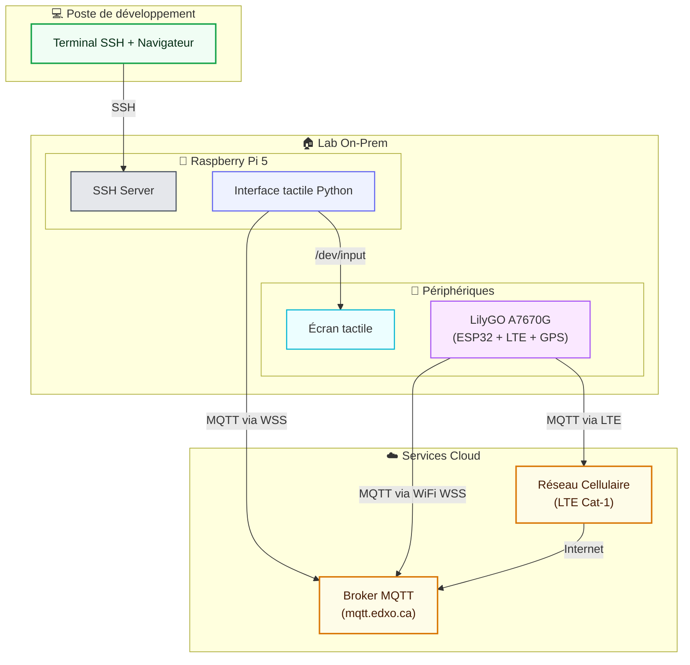

<div style="background: linear-gradient(90deg, #0ea5e9, #6366f1); padding: 18px 20px; color: #f8fafc; border-radius: 14px; box-shadow: 0 4px 12px rgba(0,0,0,0.15);">
  <h1 style="margin: 0; font-size: 28px;">Labo 2 — Communication sans fil et télémétrie IoT</h1>
  <p style="margin: 6px 0 0; font-size: 15px;">Du câble série au réseau cellulaire : communication MQTT via WiFi et LTE avec contrôle de LEDs.</p>
</div>

---

## 📐 Architecture du système



Ce diagramme illustre l'architecture avec communication sans fil:
- **Zone Client (vert):** Votre poste de développement
- **Zone Lab (gris):** Raspberry Pi 5 avec interface tactile Python
- **Zone Cloud (jaune):** Broker MQTT et réseau cellulaire
- **Communication sans fil (violet):** LilyGO communique via WiFi ou LTE

---

## 🧭 Plan du guide
- [Matériel et branchements](#-matériel-et-branchements)
- [Introduction au protocole MQTT](#1-introduction-au-protocole-mqtt)
- [Diagnostic du modem LTE](#2-diagnostic-du-modem-lte)
- [Communication MQTT via WiFi](#3-communication-mqtt-via-wifi)
- [Communication MQTT via LTE](#4-communication-mqtt-via-lte)
- [Interface tactile Python](#5-interface-tactile-python)
- [Exercice : Montage complet](#6-exercice-montage-complet)

<div style="height: 6px; background: linear-gradient(90deg, #22d3ee, #22c55e); border-radius: 999px; margin: 18px 0;"></div>

## 🎒 Matériel et branchements

### Matériel requis

<div style="background:#ecfeff; border:1px solid #06b6d4; padding:12px 14px; border-radius:10px;">
<ul style="margin:0;">
  <li>LilyGO T-SIM A7670G avec antennes GPS et LTE</li>
  <li>Carte SIM avec forfait de données actif</li>
  <li>Raspberry Pi 5 avec écran tactile</li>
  <li>2 LEDs (rouge et verte)</li>
  <li>2 boutons poussoirs</li>
  <li>Résistances (220Ω-330Ω pour LEDs, 10kΩ pour boutons)</li>
  <li>Plaquette de prototypage et fils de connexion</li>
  <li>Câble USB-A vers USB-C</li>
</ul>
</div>

### Configuration des GPIO

Tous les codes de ce laboratoire utilisent les mêmes pins GPIO :

| Composant | GPIO | Description |
|-----------|------|-------------|
| **LED 1 (Rouge)** | GPIO 32 | Sortie - Connecter avec résistance 220Ω |
| **LED 2 (Verte)** | GPIO 33 | Sortie - Connecter avec résistance 220Ω |
| **Bouton 1** | GPIO 34 | Entrée avec pull-up interne |
| **Bouton 2** | GPIO 35 | Entrée avec pull-up interne |

### Schéma de branchement

```
LilyGO A7670G
┌─────────────────────────────────┐
│                                 │
│  GPIO 32 ──[220Ω]──[LED ROUGE]──┤─── GND
│  GPIO 33 ──[220Ω]──[LED VERTE]──┤─── GND
│                                 │
│  GPIO 34 ──[BTN1]───────────────┤─── GND
│  GPIO 35 ──[BTN2]───────────────┤─── GND
│                                 │
│  [ANT LTE]     [ANT GPS]        │
│  [Slot SIM]    [USB-C]          │
└─────────────────────────────────┘
```

<div style="background:#fee2e2; border:1px solid #ef4444; padding:10px 12px; border-radius:10px;">
<strong>⚠️ Important avant de commencer</strong>
<ul>
  <li>Carte SIM avec forfait de données actif et PIN désactivé</li>
  <li>Antenne LTE vissée sur le connecteur LTE (pas GPS!)</li>
  <li>Antenne GPS vissée sur le connecteur GPS</li>
  <li>Les boutons sont connectés entre GPIO et GND (pull-up interne activé)</li>
</ul>
</div>

<div style="height: 5px; background: linear-gradient(90deg, #f59e0b, #fb7185); border-radius: 999px; margin: 22px 0;"></div>

## 1. Introduction au protocole MQTT

> 🎯 **Objectif :** comprendre MQTT et ses avantages pour l'IoT.

### 💡 Concepts clés

**Qu'est-ce que MQTT?**

MQTT (Message Queuing Telemetry Transport) est un protocole de messagerie léger conçu pour l'IoT. Il utilise une architecture **publish/subscribe** où les appareils communiquent via un **broker** central.

**Architecture Publish/Subscribe:**

```
[Publisher] --publish--> [Broker] --deliver--> [Subscriber(s)]
                           ↕
                    [Topics/Routes]
```

**Topics (sujets):**

Les topics sont des chaînes hiérarchiques qui organisent les messages :

```
esp32-123456/
├── led/
│   ├── 1/set        # Commande LED rouge (ON/OFF)
│   └── 2/set        # Commande LED verte (ON/OFF)
└── button/
    ├── 1/state      # État bouton 1 (PRESSED/RELEASED)
    └── 2/state      # État bouton 2 (PRESSED/RELEASED)
```

**Avantages de MQTT pour l'IoT:**
- ✅ **Léger:** Headers minimaux (~2 bytes)
- ✅ **Bidirectionnel:** Publish et subscribe sur le même canal
- ✅ **Découplé:** L'interface ne dépend pas directement du LilyGO
- ✅ **Extensible:** Plusieurs clients peuvent contrôler le même appareil

<div style="height: 5px; background: linear-gradient(90deg, #22c55e, #84cc16); border-radius: 999px; margin: 22px 0;"></div>

## 2. Diagnostic du modem LTE

> 🔍 **Objectif :** vérifier le bon fonctionnement du modem A7670G et de la carte SIM.

### 2.1 Code de diagnostic

Le code de diagnostic se trouve dans `labo2/code/diagnostic_modem/diagnostic_modem.ino`.

**Téléverser le code :**
```bash
cd ~/243-4J5-LI/labo2/code/diagnostic_modem
arduino-cli compile --fqbn esp32:esp32:esp32 diagnostic_modem.ino
arduino-cli upload -p /dev/ttyUSB0 --fqbn esp32:esp32:esp32 diagnostic_modem.ino
arduino-cli monitor -p /dev/ttyUSB0 -c baudrate=115200
```

### 2.2 Interprétation des résultats

Le diagnostic effectue plusieurs tests et affiche les résultats :

**Test SIM (+CPIN?):**
- `+CPIN: READY` → SIM détectée et prête ✅
- `+CPIN: SIM PIN` → PIN requis, désactivez-le dans un téléphone
- `+CME ERROR: 10` → SIM absente ou mal insérée

**Qualité signal (+CSQ):**
- Format : `+CSQ: XX,99` où XX est le niveau de signal
- 0-9: mauvais, 10-14: moyen, 15-19: bon, 20-31: excellent
- 99: pas de signal

**Enregistrement réseau (+CREG?):**
- `+CREG: 0,1` → Enregistré sur réseau domestique ✅
- `+CREG: 0,2` → Recherche en cours, patientez
- `+CREG: 0,3` → Enregistrement refusé (SIM non activée?)
- `+CREG: 0,5` → Enregistré en itinérance (roaming)

**Opérateur (+COPS?):**
- Affiche le nom de l'opérateur et le mode réseau
- Ex: `+COPS: 0,0,"Rogers",7` (7 = LTE)

<div style="background:#dbeafe; border:1px solid #3b82f6; padding:10px 12px; border-radius:10px;">
<strong>💡 Mode passthrough</strong>
<p>Après les tests automatiques, le programme passe en mode passthrough. Vous pouvez envoyer des commandes AT manuellement via le moniteur série pour diagnostiquer davantage.</p>
</div>

### 2.3 Code de diagnostic avancé

Pour un diagnostic plus complet, utilisez `labo2/code/diagnostic_modem/diagnostic_avance.ino` qui teste également la connexion GPRS.

<div style="height: 5px; background: linear-gradient(90deg, #f59e0b, #f97316); border-radius: 999px; margin: 22px 0;"></div>

## 3. Communication MQTT via WiFi

> 📡 **Objectif :** contrôler les LEDs via MQTT en utilisant le WiFi.

### 3.1 Configuration (auth.h)

Le code WiFi se trouve dans `labo2/code/lilygo_wifi_mschapv2/`.

**Créer le fichier de configuration :**
```bash
cd ~/243-4J5-LI/labo2/code/lilygo_wifi_mschapv2
cp auth.h.example auth.h
nano auth.h
```

**Configuration pour WiFi WPA2-Personal (réseau domestique) :**
```cpp
// Définir le type de sécurité WiFi
#define WIFI_SECURITY_WPA2_PERSONAL

// Configuration WiFi
const char* WIFI_SSID = "VotreReseauWiFi";
const char* WIFI_PASSWORD = "VotreMotDePasse";

// Configuration MQTT
const char* MQTT_BROKER = "mqtt.edxo.ca";
const char* MQTT_USER = "esp_user";
const char* MQTT_PASS = "VOTRE_MOT_DE_PASSE";
const char* MQTT_CLIENT_ID = "esp32-XXXXXX";  // Sera affiché au démarrage
```

**Configuration pour WiFi WPA2-Enterprise (réseau du Cégep) :**
```cpp
#define WIFI_SECURITY_WPA2_ENTERPRISE

const char* WIFI_SSID = "NomReseauCegep";
const char* EAP_IDENTITY = "votre_identifiant";
const char* EAP_USERNAME = "votre_identifiant";
const char* EAP_PASSWORD = "votre_mot_de_passe";

// ... reste de la config MQTT
```

### 3.2 Compilation et téléversement

```bash
cd ~/243-4J5-LI/labo2/code/lilygo_wifi_mschapv2
arduino-cli compile --fqbn esp32:esp32:esp32 lilygo_wifi_mschapv2.ino
arduino-cli upload -p /dev/ttyUSB0 --fqbn esp32:esp32:esp32 lilygo_wifi_mschapv2.ino
arduino-cli monitor -p /dev/ttyUSB0 -c baudrate=115200
```

### 3.3 Fonctionnement

Au démarrage, le moniteur série affiche :
```
=== LilyGo WiFi - MQTT via WebSocket SSL ===

Connexion WiFi a VotreReseauWiFi
Using WPA2-Personal connection.
.....
WiFi connecte!
Adresse IP: 192.168.1.xxx

[MQTT] Device ID: esp32-XXXXXX
[SSL] Configuration du client SSL...
[WSS] Connexion SSL...
[WSS] SSL connecte, envoi handshake WebSocket...
[WSS] Handshake WebSocket reussi!
[MQTT] Connexion au broker...
[MQTT] Connecte!
[MQTT] Souscriptions envoyees

=== Systeme pret ===
```

**Notez le Device ID** (ex: `esp32-123456`) - vous en aurez besoin pour l'interface Python.

### 3.4 Topics MQTT

Le code s'abonne automatiquement aux topics de commande :
- `{device_id}/led/1/set` → Recevoir "ON" ou "OFF" pour LED rouge
- `{device_id}/led/2/set` → Recevoir "ON" ou "OFF" pour LED verte

Et publie l'état des boutons :
- `{device_id}/button/1/state` → Envoie "PRESSED" ou "RELEASED"
- `{device_id}/button/2/state` → Envoie "PRESSED" ou "RELEASED"

<div style="height: 5px; background: linear-gradient(90deg, #22d3ee, #3b82f6); border-radius: 999px; margin: 22px 0;"></div>

## 4. Communication MQTT via LTE

> 🌍 **Objectif :** contrôler les LEDs via MQTT en utilisant le réseau cellulaire.

### 4.1 Configuration (auth.h)

Le code LTE se trouve dans `labo2/code/lilygo_lte_mqtt/`.

**Créer le fichier de configuration :**
```bash
cd ~/243-4J5-LI/labo2/code/lilygo_lte_mqtt
cp auth.h.example auth.h
nano auth.h
```

**Configuration APN selon votre opérateur :**
```cpp
// Configuration APN (Access Point Name)
const char APN[] = "internet.com";  // Voir tableau ci-dessous
const char APN_USER[] = "";         // Généralement vide au Canada
const char APN_PASS[] = "";         // Généralement vide au Canada

// Configuration MQTT
const char MQTT_BROKER[] = "mqtt.edxo.ca";
const char MQTT_USER[] = "esp_user";
const char MQTT_PASS[] = "VOTRE_MOT_DE_PASSE";
const char MQTT_CLIENT_ID[] = "lte-XXXXXX";  // Généré depuis l'IMEI
```

**APNs par opérateur au Canada :**

| Opérateur | APN |
|-----------|-----|
| Rogers | `internet.com` ou `ltemobile.apn` |
| Bell | `inet.bell.ca` ou `pda.bell.ca` |
| Telus | `sp.telus.com` ou `isp.telus.com` |
| Fido | `internet.fido.ca` |
| Koodo | `sp.koodo.com` |
| Virgin | `media.bell.ca` |
| Videotron | `media.videotron` |

### 4.2 Bibliothèques requises

Installez les bibliothèques nécessaires :
```bash
arduino-cli lib install "TinyGSM"
arduino-cli lib install "PubSubClient"
```

### 4.3 Compilation et téléversement

```bash
cd ~/243-4J5-LI/labo2/code/lilygo_lte_mqtt
arduino-cli compile --fqbn esp32:esp32:esp32 lilygo_lte_mqtt.ino
arduino-cli upload -p /dev/ttyUSB0 --fqbn esp32:esp32:esp32 lilygo_lte_mqtt.ino
arduino-cli monitor -p /dev/ttyUSB0 -c baudrate=115200
```

### 4.4 Séquence de démarrage

```
=== LilyGo T-SIM A7670G - MQTT via LTE + WebSocket SSL ===

[MODEM] Allumage du modem...
[MODEM] Modem allume
[MODEM] Initialisation...
[MODEM] Info: SIMCOM_A7670G
[MODEM] IMEI: 123456789012345
[MQTT] Device ID: lte-012345

[NETWORK] Configuration de l'APN...
[NETWORK] APN configure
[NETWORK] Connexion au reseau cellulaire...
[NETWORK] Operateur: Rogers
[NETWORK] Signal: -67 dBm

[GPRS] Connexion GPRS...
[GPRS] IP: 10.123.45.67
[GPRS] Connecte

[SSL] Configuration du client SSL...
[WSS] Connexion SSL...
[WSS] Handshake WebSocket reussi!
[MQTT] Connexion au broker...
[MQTT] Connecte!

=== Systeme pret ===
```

<div style="background:#fef9c3; border:1px solid #facc15; padding:10px 12px; border-radius:10px;">
<strong>⏱️ Temps de démarrage</strong>
<p>La connexion LTE prend plus de temps que le WiFi (~30-60 secondes) car le modem doit:</p>
<ul>
  <li>S'initialiser (~3 secondes)</li>
  <li>Rechercher le réseau cellulaire (jusqu'à 60 secondes)</li>
  <li>Établir la connexion GPRS/LTE</li>
  <li>Se connecter au broker MQTT</li>
</ul>
</div>

### 4.5 Différences WiFi vs LTE

| Caractéristique | WiFi | LTE |
|----------------|------|-----|
| **Device ID** | `esp32-` + MAC | `lte-` + IMEI |
| **Temps démarrage** | ~5 secondes | ~30-60 secondes |
| **Mobilité** | Limitée au réseau WiFi | Couverture cellulaire |
| **Consommation** | Faible | Moyenne à élevée |
| **Coût** | Gratuit (WiFi existant) | Forfait de données |

<div style="height: 5px; background: linear-gradient(90deg, #c084fc, #22d3ee); border-radius: 999px; margin: 22px 0;"></div>

## 5. Interface tactile Python

> 📱 **Objectif :** contrôler les LEDs depuis l'écran tactile du Raspberry Pi via MQTT.

### 5.1 Installation des dépendances

```bash
sudo apt update
sudo apt install -y python3-paho-mqtt python3-evdev
```

### 5.2 Configuration

Le code Python se trouve dans `labo2/led-control/`.

**Créer le fichier de configuration :**
```bash
cd ~/243-4J5-LI/labo2/led-control
cp mqtt_config.py.example mqtt_config.py
nano mqtt_config.py
```

**Configuration :**
```python
MQTT_CONFIG = {
    # Broker MQTT
    "broker": "mqtt.edxo.ca",
    "port": 443,  # Port WSS (WebSocket Secure)

    # Identifiants Mosquitto
    "username": "esp_user",
    "password": "VOTRE_MOT_DE_PASSE",

    # Device ID de votre ESP32/LTE
    # WiFi: "esp32-XXXXXX" (affiché au démarrage)
    # LTE: "lte-XXXXXX" (affiché au démarrage)
    "device_id": "esp32-123456",
}
```

### 5.3 Lancement de l'interface

**Depuis SSH (pour tests) :**
```bash
cd ~/243-4J5-LI/labo2/led-control
sudo python3 touch_ui_mqtt.py
```

**Sur l'écran tactile local :**
```bash
cd ~/243-4J5-LI/labo2/led-control
./launch_on_screen.sh
```

Ou manuellement :
```bash
sudo chvt 1
sudo setsid sh -c 'exec </dev/tty1 >/dev/tty1 2>&1 python3 /home/$USER/243-4J5-LI/labo2/led-control/touch_ui_mqtt.py'
```

### 5.4 Utilisation de l'interface

L'interface affiche :
- **LED ROUGE** : Toggle ON/OFF pour la LED 1 (GPIO 32)
- **LED VERTE** : Toggle ON/OFF pour la LED 2 (GPIO 33)
- **QUITTER** : Ferme l'application

**Indicateurs :**
- **MQTT CONNECTÉ** (vert) : Connexion établie
- **MQTT DÉCONNECTÉ** (rouge) : Pas de connexion
- **Zone feedback** : Affiche les messages MQTT envoyés/reçus

**Raccourci clavier :** Appuyez sur `q` pour quitter.

<div style="height: 5px; background: linear-gradient(90deg, #10b981, #06b6d4); border-radius: 999px; margin: 22px 0;"></div>

## 6. Exercice : Montage complet

> 🎯 **Objectif :** assembler et tester le système complet.

### Étapes

1. **Monter le circuit** sur la plaquette de prototypage selon le schéma de branchement
   - 2 LEDs avec résistances sur GPIO 32 et 33
   - 2 boutons entre GPIO 34/35 et GND

2. **Choisir le mode de communication** :
   - **WiFi** : Si vous avez accès à un réseau WiFi
   - **LTE** : Si vous avez une carte SIM avec données

3. **Configurer et téléverser le code Arduino** approprié

4. **Noter le Device ID** affiché dans le moniteur série

5. **Configurer l'interface Python** avec le bon Device ID

6. **Tester le système** :
   - Appuyer sur les boutons toggle de l'interface → Les LEDs s'allument/éteignent
   - Appuyer sur les boutons physiques → L'état s'affiche dans l'interface

### Validation

<div style="background:#f0fdf4; border:1px solid #22c55e; padding:10px 12px; border-radius:10px;">
<strong>✅ À vérifier :</strong>
<ul>
  <li>Les LEDs répondent aux commandes de l'interface tactile</li>
  <li>L'état des boutons physiques s'affiche dans l'interface</li>
  <li>La connexion MQTT est stable (indicateur vert)</li>
  <li>Les messages sont visibles dans la zone feedback</li>
</ul>
</div>

### Dépannage

<div style="background:#fef3c7; border:1px solid #f59e0b; padding:10px 12px; border-radius:10px;">
<strong>⚡ Problèmes courants</strong>
<ul>
  <li><strong>LEDs ne s'allument pas :</strong> Vérifier le sens des LEDs et les résistances</li>
  <li><strong>MQTT déconnecté :</strong> Vérifier le Device ID et les identifiants</li>
  <li><strong>Pas de réponse aux boutons :</strong> Vérifier les connexions GPIO 34/35 vers GND</li>
  <li><strong>LTE ne se connecte pas :</strong> Vérifier l'APN et la carte SIM</li>
</ul>
</div>

<div style="height: 5px; background: linear-gradient(90deg, #a855f7, #ec4899); border-radius: 999px; margin: 22px 0;"></div>

## 📚 Commandes de vérification utiles

```bash
# Vérifier la connexion au broker MQTT
mosquitto_sub -h mqtt.edxo.ca -p 1883 -u esp_user -P VOTRE_MOT_DE_PASSE -t "#" -v

# Envoyer une commande manuellement
mosquitto_pub -h mqtt.edxo.ca -p 1883 -u esp_user -P VOTRE_MOT_DE_PASSE \
  -t "esp32-123456/led/1/set" -m "ON"

# Lister les ports série disponibles
arduino-cli board list

# Moniteur série
arduino-cli monitor -p /dev/ttyUSB0 -c baudrate=115200
```

<div style="height: 5px; background: linear-gradient(90deg, #22d3ee, #a855f7); border-radius: 999px; margin: 22px 0;"></div>

## 📂 Structure des fichiers

```
labo2/
├── Labo2-communication-sans-fil-MQTT-LTE.md  # Cet énoncé
├── code/
│   ├── diagnostic_modem/
│   │   ├── diagnostic_modem.ino      # Diagnostic de base
│   │   └── diagnostic_avance.ino     # Diagnostic complet
│   ├── lilygo_wifi_mschapv2/
│   │   ├── lilygo_wifi_mschapv2.ino  # Code WiFi MQTT
│   │   └── auth.h.example            # Template configuration
│   └── lilygo_lte_mqtt/
│       ├── lilygo_lte_mqtt.ino       # Code LTE MQTT
│       ├── auth.h.example            # Template configuration
│       └── trust_anchors.h           # Certificats SSL
└── led-control/
    ├── touch_ui_mqtt.py              # Interface tactile Python
    ├── mqtt_config.py.example        # Template configuration
    ├── launch_on_screen.sh           # Script de lancement
    └── requirements.txt              # Dépendances Python
```
