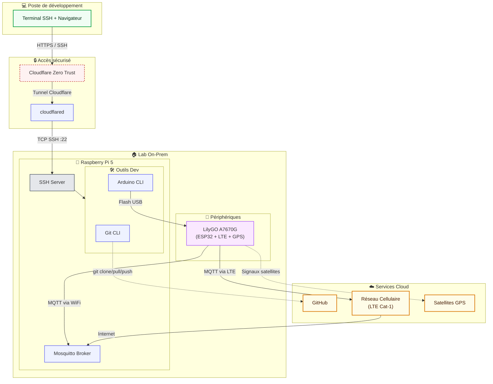

<div style="background: linear-gradient(90deg, #0ea5e9, #6366f1); padding: 18px 20px; color: #f8fafc; border-radius: 14px; box-shadow: 0 4px 12px rgba(0,0,0,0.15);">
  <h1 style="margin: 0; font-size: 28px;">Labo 2 — Communication sans fil et télémétrie IoT</h1>
  <p style="margin: 6px 0 0; font-size: 15px;">Du câble série au réseau cellulaire : communication MQTT via WiFi et LTE avec géolocalisation GPS.</p>
</div>

---

## 📐 Architecture du système



---

## 🧭 Plan du guide

- [Prérequis](#-prérequis)
- [Introduction au protocole MQTT](#1-introduction-au-protocole-mqtt)
- [Communication MQTT via WiFi](#2-communication-mqtt-via-wifi)
- [Activation du modem LTE](#3-activation-du-modem-lte)
- [Communication MQTT via LTE](#4-communication-mqtt-via-lte)
- [Intégration GPS](#5-intégration-gps)
- [Exercice pratique](#6-exercice-pratique)

<div style="height: 6px; background: linear-gradient(90deg, #22d3ee, #22c55e); border-radius: 999px; margin: 18px 0;"></div>

## 📋 Prérequis

<div style="background:#fef9c3; border:1px solid #facc15; padding:12px 14px; border-radius:10px;">
<strong>⚠️ Avant de commencer</strong>
<ul>
  <li>✅ Le Labo 1 complet (environnement de programmation distant)</li>
  <li>✅ Le devoir de préparation (installation Mosquitto et test WiFi)</li>
  <li>✅ Arduino CLI configuré pour ESP32</li>
  <li>✅ Carte SIM activée et insérée dans le LilyGO</li>
  <li>✅ Antennes GPS et LTE correctement branchées</li>
</ul>
</div>

### Vérification rapide

```bash
# Vérifier que Mosquitto est actif
sudo systemctl status mosquitto

# Vérifier Arduino CLI
arduino-cli version

# Vérifier les bibliothèques nécessaires
arduino-cli lib list | grep -E "TinyGSM|PubSubClient|ArduinoJson|TinyGPSPlus"
```

<div style="height: 5px; background: linear-gradient(90deg, #f59e0b, #fb7185); border-radius: 999px; margin: 22px 0;"></div>

## 1. Introduction au protocole MQTT

> 🎯 **Objectif :** comprendre MQTT et ses avantages pour l'IoT.

### 💡 Concepts clés

**MQTT** (Message Queuing Telemetry Transport) est un protocole de messagerie léger conçu pour l'IoT. Il utilise une architecture **Publish/Subscribe** avec un **broker** central.

**Pourquoi MQTT plutôt que HTTP?**

| Caractéristique | HTTP | MQTT |
|-----------------|------|------|
| Architecture | Requête/Réponse | Publish/Subscribe |
| Connexion | Nouvelle connexion par requête | Connexion persistante |
| Overhead | Headers volumineux | Headers minimaux (~2 bytes) |
| Bande passante | Élevée | Très faible |

**Topics (sujets):** Chaînes hiérarchiques qui organisent les messages:
```
iot/sensors/temperature
iot/gps/location
iot/led/command
```

**Wildcards:**
- `+` : un niveau quelconque → `iot/sensors/+`
- `#` : tous les sous-niveaux → `iot/#`

**Quality of Service (QoS):**
- QoS 0 : Au plus une fois (peut être perdu)
- QoS 1 : Au moins une fois (peut être dupliqué)
- QoS 2 : Exactement une fois (garanti unique)

### 1.1 Test du broker Mosquitto

**Terminal 1 - Subscriber:**
```bash
mosquitto_sub -h localhost -t "test/demo" -v
```

**Terminal 2 - Publisher:**
```bash
mosquitto_pub -h localhost -t "test/demo" -m "Hello MQTT!"
```

<div style="height: 5px; background: linear-gradient(90deg, #22c55e, #84cc16); border-radius: 999px; margin: 22px 0;"></div>

## 2. Communication MQTT via WiFi

> 📡 **Objectif :** remplacer la communication série par MQTT via WiFi.

### 💡 Évolution de l'architecture

**Labo 1 (Série):**
```
[Interface tactile] → [Câble USB] → [LilyGO]
```

**Labo 2 (MQTT WiFi):**
```
[Interface tactile] → [MQTT Pub] → [Broker] → [MQTT Sub] → [LilyGO (WiFi)]
```

### 2.1 Code Arduino

Le code se trouve dans: `labo2/mqtt-wifi/mqtt-wifi.ino`

**Avant d'utiliser le code, personnalisez:**
- `ssid` et `password` → Vos identifiants WiFi
- `mqtt_server` → IP de votre Raspberry Pi
- `LED_RED` et `LED_GREEN` → Pins GPIO selon votre circuit

### 2.2 Compilation et téléversement

```bash
cd ~/243-4J5-LI/labo2/mqtt-wifi
arduino-cli compile --fqbn esp32:esp32:esp32 mqtt-wifi.ino
arduino-cli upload -p /dev/ttyUSB0 --fqbn esp32:esp32:esp32 mqtt-wifi.ino
arduino-cli monitor -p /dev/ttyUSB0 -c baudrate=115200
```

### 2.3 Test de la communication

**Surveiller tous les messages:**
```bash
mosquitto_sub -h localhost -t "iot/#" -v
```

**Envoyer des commandes:**
```bash
mosquitto_pub -h localhost -t "iot/led/command" -m "red"
mosquitto_pub -h localhost -t "iot/led/command" -m "green"
mosquitto_pub -h localhost -t "iot/led/command" -m "off"
```

<div style="height: 5px; background: linear-gradient(90deg, #f59e0b, #f97316); border-radius: 999px; margin: 22px 0;"></div>

## 3. Activation du modem LTE

> 📶 **Objectif :** configurer le modem A7670G pour la connectivité cellulaire.

### 💡 Concepts clés

Le **A7670G** est un modem cellulaire supportant 2G/3G/4G LTE Cat-1. Il se contrôle via **commandes AT**.

**APNs courants au Canada:**
- Rogers: `internet.com`
- Bell: `inet.bell.ca`
- Telus: `sp.telus.com`
- Fido: `internet.fido.ca`

### 3.1 Vérification matérielle

<div style="background:#fee2e2; border:1px solid #ef4444; padding:10px 12px; border-radius:10px;">
<strong>⚠️ Checklist matériel</strong>
<ul>
  <li>✅ Carte SIM activée et insérée correctement</li>
  <li>✅ Antenne LTE vissée sur le connecteur LTE</li>
  <li>✅ Antenne GPS vissée sur le connecteur GPS</li>
  <li>✅ PIN de la SIM désactivé</li>
</ul>
</div>

### 3.2 Code de test du modem

Le code se trouve dans: `labo2/modem-test/modem-test.ino`

```bash
cd ~/243-4J5-LI/labo2/modem-test
arduino-cli compile --fqbn esp32:esp32:esp32 modem-test.ino
arduino-cli upload -p /dev/ttyUSB0 --fqbn esp32:esp32:esp32 modem-test.ino
arduino-cli monitor -p /dev/ttyUSB0 -c baudrate=115200
```

### 3.3 Interpréter les résultats

**Réponses attendues:**
- `+CPIN: READY` → SIM détectée et prête
- `+CSQ: 18,99` → Signal OK (18 = bon signal)
- `+CREG: 0,1` → Enregistré sur le réseau
- `+COPS: 0,0,"Rogers",7` → Opérateur et mode LTE

<div style="height: 5px; background: linear-gradient(90deg, #22d3ee, #3b82f6); border-radius: 999px; margin: 22px 0;"></div>

## 4. Communication MQTT via LTE

> 🌍 **Objectif :** publier des messages MQTT via le réseau cellulaire.

### 💡 Architecture finale

```
[LilyGO] → [Modem A7670G] → [Tour cellulaire] → [Internet] → [Broker MQTT]
```

### 4.1 Code Arduino

Le code se trouve dans: `labo2/mqtt-lte/mqtt-lte.ino`

**Avant d'utiliser le code, personnalisez:**
- `apn` → APN de votre opérateur cellulaire
- `mqtt_server` → Votre domaine ou broker public
- `LED_RED` et `LED_GREEN` → Pins selon votre circuit

### 4.2 Compilation et test

```bash
cd ~/243-4J5-LI/labo2/mqtt-lte
arduino-cli compile --fqbn esp32:esp32:esp32 mqtt-lte.ino
arduino-cli upload -p /dev/ttyUSB0 --fqbn esp32:esp32:esp32 mqtt-lte.ino
arduino-cli monitor -p /dev/ttyUSB0 -c baudrate=115200
```

<div style="height: 5px; background: linear-gradient(90deg, #c084fc, #22d3ee); border-radius: 999px; margin: 22px 0;"></div>

## 5. Intégration GPS

> 📍 **Objectif :** récupérer la position GPS et l'envoyer via MQTT.

### 💡 Concepts clés

Le modem A7670G supporte **GPS + GLONASS + Galileo** pour une meilleure précision.

**Cold start vs Warm start:**
- Cold start: 30s-5min (première acquisition)
- Warm start: 5-30s (GPS utilisé récemment)

### 5.1 Installation bibliothèque GPS

```bash
arduino-cli lib install "TinyGPSPlus"
```

### 5.2 Code intégré GPS + MQTT LTE

Le code se trouve dans: `labo2/gps-mqtt-lte/gps-mqtt-lte.ino`

```bash
cd ~/243-4J5-LI/labo2/gps-mqtt-lte
arduino-cli compile --fqbn esp32:esp32:esp32 gps-mqtt-lte.ino
arduino-cli upload -p /dev/ttyUSB0 --fqbn esp32:esp32:esp32 gps-mqtt-lte.ino
arduino-cli monitor -p /dev/ttyUSB0 -c baudrate=115200
```

### 5.3 Visualisation GPS

**S'abonner aux données GPS:**
```bash
mosquitto_sub -h localhost -t "iot/gps/location" -v
```

**Exemple de message reçu:**
```json
{
  "latitude": 45.501689,
  "longitude": -73.567256,
  "altitude": 35.2,
  "satellites": 8
}
```

<div style="height: 5px; background: linear-gradient(90deg, #10b981, #06b6d4); border-radius: 999px; margin: 22px 0;"></div>

## 6. Exercice pratique

> 🎯 **Objectif :** assembler le circuit et valider la communication sans fil.

### Étapes

1. **Monter le circuit** sur breadboard avec 2 LEDs (rouge et verte)
2. **Configurer** les fichiers de code avec vos paramètres (WiFi, MQTT, pins)
3. **Tester WiFi** avec `mqtt-wifi.ino`
4. **Tester LTE** avec `mqtt-lte.ino`
5. **Tester GPS** avec `gps-mqtt-lte.ino`

### Livrables

- Photo du montage breadboard
- Capture du moniteur série montrant la connexion
- Démonstration de contrôle des LEDs via MQTT

<div style="height: 5px; background: linear-gradient(90deg, #f59e0b, #f97316); border-radius: 999px; margin: 22px 0;"></div>

## 📚 Commandes de vérification utiles

### MQTT
```bash
sudo systemctl status mosquitto
mosquitto_sub -h localhost -t "#" -v
mosquitto_pub -h localhost -t "test" -m "hello"
```

### Arduino CLI
```bash
arduino-cli board list
arduino-cli lib list
arduino-cli monitor -p /dev/ttyUSB0 -c baudrate=115200
```

### Git
```bash
git status
git add .
git commit -m "Labo 2 terminé"
git push origin prenom-nom/labo2
```

---

<div style="background: linear-gradient(90deg, #0ea5e9, #6366f1); padding: 18px 20px; color: #f8fafc; border-radius: 14px; text-align: center;">
  <h2 style="margin: 0;">Félicitations!</h2>
  <p style="margin: 8px 0 0;">Vous maîtrisez maintenant la communication sans fil IoT via MQTT, WiFi, LTE et GPS.</p>
</div>
