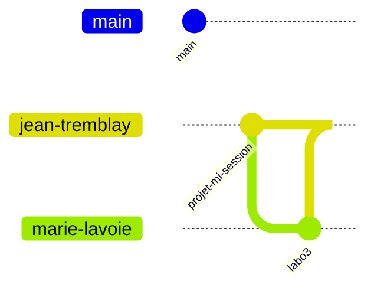
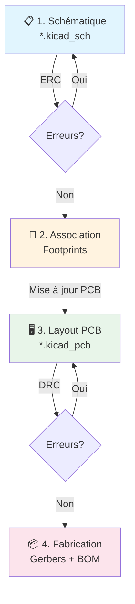

# Labo 3 — Workflow complet KiCad

**Cours:** 243-4J5-LI – Objets connectés
**Durée:** 5 heures (2h théorie + 3h pratique)
**Objectif:** Maîtriser le workflow complet de conception PCB avec KiCad, de la capture schématique à la génération des fichiers de fabrication.

---

## Objectifs d'apprentissage

À la fin de ce laboratoire, vous serez capable de:
- Utiliser GitHub Desktop pour gérer vos fichiers et travailler sur votre branche
- Créer un projet KiCad et naviguer dans l'interface
- Réaliser une capture schématique complète avec symboles et connexions
- Exécuter et corriger les erreurs ERC (Electrical Rules Check)
- Associer les empreintes (footprints) aux symboles
- Placer et router un PCB 2 couches
- Configurer et exécuter le DRC (Design Rules Check)
- Générer les fichiers de fabrication (Gerbers, drill, BOM)

---

## 0. Environnement de travail

> **Lien avec le Labo 1:** Vous avez appris à utiliser Git en ligne de commande sur le Raspberry Pi (section 4 du Labo 1). Dans ce labo, nous utilisons **GitHub Desktop** sur Windows, qui offre une interface graphique pour les mêmes opérations.

### Correspondance Git CLI ↔ GitHub Desktop

| Git CLI (Labo 1 - Raspberry Pi) | GitHub Desktop (Labo 3 - Windows) |
|---------------------------------|-----------------------------------|
| `git clone <url>` | Fichier → Cloner un dépôt |
| `git checkout -b prenom-nom` | Branche actuelle → Nouvelle branche |
| `git status` | Onglet **Modifications** (liste automatique) |
| `git add .` | Cases à cocher dans Modifications (auto) |
| `git commit -m "message"` | Résumé + **Commiter vers branche** |
| `git push origin branche` | **Pousser origin** |
| `git fetch origin` | **Récupérer origin** |
| `git pull origin main` | **Tirer origin** |

Les deux méthodes font exactement la même chose — GitHub Desktop ajoute simplement une interface visuelle.

### 0.1 Installation de GitHub Desktop

GitHub Desktop permet de gérer vos fichiers et de synchroniser votre travail avec le dépôt du cours.

1. Télécharger GitHub Desktop: https://desktop.github.com/
2. Installer et lancer l'application
3. Se connecter avec votre compte GitHub (créer un compte si nécessaire)

### 0.2 Cloner le dépôt du cours

1. Dans GitHub Desktop: **Fichier → Cloner un dépôt...**
2. Onglet **URL**
3. Entrer l'URL du dépôt du cours: `https://github.com/[organisation]/243-4J5-LI`
4. Choisir un emplacement local (ex: `C:\Users\VotreNom\Documents\GitHub\`)
5. Cliquer sur **Cloner**

### 0.3 Créer votre branche personnelle

Chaque étudiant travaille sur sa propre branche pour éviter les conflits.

1. Dans GitHub Desktop, s'assurer que le dépôt `243-4J5-LI` est sélectionné
2. Cliquer sur **Branche actuelle** (en haut)
3. Cliquer sur **Nouvelle branche**
4. Nommer la branche: `prenom-nom` (ex: `jean-tremblay`)
5. Cliquer sur **Créer une branche**



### 0.4 Workflow Git quotidien

**Au début de chaque séance:**
1. Ouvrir GitHub Desktop
2. S'assurer d'être sur votre branche (`prenom-nom`)
3. Cliquer sur **Récupérer origin** pour vérifier les mises à jour

**Pendant le travail:**
- Sauvegarder régulièrement vos fichiers dans KiCad

**À la fin de chaque séance:**
1. Dans GitHub Desktop, vos modifications apparaissent dans l'onglet **Modifications**
2. Écrire un résumé dans **Résumé** (ex: "Schéma terminé, début routage")
3. Cliquer sur **Commiter vers prenom-nom**
4. Cliquer sur **Pousser origin** pour envoyer vers GitHub

### 0.5 Structure de votre projet

Créer votre projet KiCad dans le dossier du dépôt:

```
C:\Users\VotreNom\Documents\GitHub\243-4J5-LI\
└── labo3-kicad/          ← Votre dossier de travail
    ├── circuit-test.kicad_pro
    ├── circuit-test.kicad_sch
    ├── circuit-test.kicad_pcb
    └── gerbers/
```

---

## 1. Introduction à KiCad

### 1.1 Présentation de KiCad

KiCad est une suite logicielle open-source de conception électronique (EDA) qui comprend:

| Application | Fonction |
|-------------|----------|
| **KiCad** | Gestionnaire de projet |
| **Eeschema** | Éditeur de schémas |
| **PCB Editor** | Éditeur de circuits imprimés |
| **Footprint Editor** | Éditeur d'empreintes |
| **Symbol Editor** | Éditeur de symboles |
| **Gerber Viewer** | Visualiseur de fichiers Gerber |
| **3D Viewer** | Visualisation 3D du PCB |

### 1.2 Installation (Windows)

1. Télécharger KiCad depuis le site officiel: https://www.kicad.org/download/windows/
2. Exécuter l'installateur et suivre les instructions
3. **Version recommandée:** 8.0 ou plus récente
4. Lors de l'installation, cocher **toutes les bibliothèques** (symboles, empreintes, modèles 3D)

**Vérifier l'installation:**
- Lancer KiCad depuis le menu Démarrer
- Le gestionnaire de projet doit s'ouvrir sans erreur

### 1.3 Workflow de conception PCB



**Résumé des étapes:**
| Étape | Fichier | Action |
|-------|---------|--------|
| 1. Schématique | `*.kicad_sch` | Capture du circuit, symboles, connexions |
| 2. Footprints | - | Associer chaque symbole à une empreinte physique |
| 3. Layout PCB | `*.kicad_pcb` | Placement des composants, routage des pistes |
| 4. Fabrication | `gerbers/` | Génération des fichiers pour le fabricant |

---

## 2. Création du projet

### 2.1 Nouveau projet

1. Lancer **KiCad**
2. **Fichier → Nouveau projet...**
3. Créer un dossier `labo3-kicad` et nommer le projet `circuit-test`
4. KiCad crée automatiquement:
   - `circuit-test.kicad_pro` (fichier projet)
   - `circuit-test.kicad_sch` (schématique)
   - `circuit-test.kicad_pcb` (PCB)

### 2.2 Structure recommandée

```
labo3-kicad/
├── circuit-test.kicad_pro
├── circuit-test.kicad_sch
├── circuit-test.kicad_pcb
├── gerbers/                    # Fichiers de fabrication
├── libs/                       # Bibliothèques personnalisées (optionnel)
└── docs/                       # Documentation
```

---

## 3. Capture schématique

### 3.1 Circuit à réaliser

Pour ce labo, nous allons créer un circuit minimaliste pour apprendre le workflow complet:

**Composants:**
- 1 connecteur 3 broches (VCC, Signal, GND)
- 1 résistance 330Ω
- 1 LED

**Schéma:**
```
    Connecteur J1
    ┌─────┐
    │  1  │─── VCC (3.3V) ──────── R1 330Ω ──── LED1 (Anode)
    │  2  │─── Signal                               │
    │  3  │─── GND ─────────────────────────────────┘ (Cathode)
    └─────┘
```

Ce circuit simple permet d'apprendre toutes les étapes du workflow sans complexité inutile.


### 3.2 Ouvrir l'éditeur de schéma

1. Double-cliquer sur `circuit-test.kicad_sch` dans le gestionnaire de projet
2. L'éditeur **Eeschema** s'ouvre

### 3.3 Raccourcis clavier essentiels

| Raccourci | Action |
|-----------|--------|
| `A` | Ajouter un symbole |
| `P` | Ajouter une alimentation (power) |
| `W` | Tracer un fil (wire) |
| `L` | Ajouter un label |
| `R` | Rotation (pendant le placement) |
| `M` | Déplacer |
| `C` | Copier |
| `E` | Éditer les propriétés |
| `Delete` | Supprimer |
| `Ctrl+Z` | Annuler |
| `F` | Zoom fit |

### 3.4 Ajouter les symboles

1. **Appuyer sur `A`** pour ouvrir la bibliothèque de symboles
2. Rechercher et placer les composants suivants:

| Composant | Bibliothèque | Symbole | Quantité |
|-----------|--------------|---------|----------|
| Résistance | Device | R | 1 |
| LED | Device | LED | 1 |
| Connecteur | Connector_Generic | Conn_01x03 | 1 |

3. **Symboles d'alimentation** (appuyer sur `P`):
   - `+3.3V` (ou `+3V3`)
   - `GND`

### 3.5 Éditer les valeurs des composants

1. Double-cliquer sur un composant ou appuyer sur `E`
2. Modifier le champ **Valeur**:

| Référence | Valeur |
|-----------|--------|
| R1 | 330 |
| D1 | LED_Rouge |
| J1 | Conn_3pin |

### 3.6 Connecter les composants

1. **Appuyer sur `W`** pour tracer des fils
2. Cliquer sur une broche, puis sur la broche de destination
3. Les jonctions (points de connexion) apparaissent automatiquement

**Connexions à réaliser:**
- Broche 1 du connecteur (VCC) → symbole `+3.3V`
- Broche 1 du connecteur → une patte de R1
- Autre patte de R1 → Anode de la LED (triangle)
- Cathode de la LED (barre) → symbole `GND`
- Broche 3 du connecteur → symbole `GND`

**Conseils:**
- Garder les fils horizontaux et verticaux (pas de diagonales)
- Utiliser des **labels** (`L`) pour les connexions longues ou complexes

### 3.7 Ajouter des annotations

1. **Texte**: Cliquer droit → Ajouter → Texte
2. **Cadre de titre**: Fichier → Paramètres de la page
   - Remplir: Titre, Date, Révision, Auteur

### 3.8 Annoter les composants

Les composants doivent avoir des références uniques (R1, R2, C1, etc.)

1. **Outils → Annoter la schématique...**
2. Options recommandées:
   - Portée: Schématique entière
   - Ordre: De gauche à droite, de haut en bas
3. Cliquer sur **Annoter**

---

## 4. Vérification électrique (ERC)

### 4.1 Exécuter l'ERC

1. **Inspection → Vérificateur de règles électriques** (ou icône dans la barre d'outils)
2. Cliquer sur **Exécuter l'ERC**

### 4.2 Types d'erreurs courantes

| Type | Description | Solution |
|------|-------------|----------|
| **Broche non connectée** | Une broche n'est reliée à rien | Connecter ou ajouter un flag "No Connect" |
| **Conflit de type** | Deux sorties connectées ensemble | Vérifier le circuit |
| **Entrée non pilotée** | Entrée sans source | Ajouter pull-up/pull-down |
| **Alimentation non connectée** | Symbol power isolé | Connecter au réseau |

### 4.3 Flag "No Connect"

Pour les broches intentionnellement non connectées:
1. Appuyer sur `Q` ou **Placer → No Connect Flag**
2. Placer le X sur la broche non utilisée

### 4.4 Power Flags (Drapeaux d'alimentation)

**Erreur courante:** "Pin connected to other pins, but not driven by any pin"

Cette erreur apparaît lorsque KiCad ne détecte pas de source d'alimentation active dans le circuit. Elle est fréquente quand l'alimentation provient d'une source externe (connecteur, câble).

**Solution — Ajouter des Power Flags:**

1. Appuyer sur `P` pour ouvrir les symboles d'alimentation
2. Rechercher **PWR_FLAG**
3. Placer un PWR_FLAG sur:
   - La ligne **VCC/+3.3V/+5V** (selon votre alimentation)
   - La ligne **GND**

```
Exemple de placement:

    ┌──────────┐
    │ PWR_FLAG │
    └────┬─────┘
         │
    ─────┴──────── +3.3V ────────

    ─────┬──────── GND ──────────
         │
    ┌────┴─────┐
    │ PWR_FLAG │
    └──────────┘
```

**Explication:**
- Le PWR_FLAG indique à KiCad qu'une alimentation externe sera connectée à ce réseau
- Sans ce flag, KiCad considère que rien ne "pilote" la ligne d'alimentation
- C'est particulièrement nécessaire pour les circuits alimentés par connecteur externe

### 4.5 Corriger jusqu'à 0 erreur

- L'ERC doit afficher **0 erreurs** et idéalement **0 avertissements**
- Certains avertissements peuvent être ignorés si justifiés

---

## 5. Association des empreintes (Footprints)

### 5.1 Ouvrir l'éditeur d'empreintes

1. **Outils → Assigner les empreintes...** (ou icône dans la barre)
2. L'interface affiche trois colonnes:
   - Bibliothèques d'empreintes (gauche)
   - Composants du schéma (centre)
   - Empreintes filtrées (droite)

### 5.2 Choisir les empreintes

| Composant | Empreinte recommandée | Bibliothèque |
|-----------|----------------------|--------------|
| R (330Ω) | `R_0805_2012Metric` | Resistor_SMD |
| LED | `LED_0805_2012Metric` | LED_SMD |
| Conn_01x03 | `PinHeader_1x03_P2.54mm_Vertical` | Connector_PinHeader_2.54mm |

**Alternative THT (traversant, plus facile à souder):**

| Composant | Empreinte THT | Bibliothèque |
|-----------|---------------|--------------|
| R (330Ω) | `R_Axial_DIN0207_L6.3mm_D2.5mm_P7.62mm_Horizontal` | Resistor_THT |
| LED | `LED_D5.0mm` | LED_THT |
| Conn_01x03 | `PinHeader_1x03_P2.54mm_Vertical` | Connector_PinHeader_2.54mm |

### 5.3 Types d'empreintes

**SMD (Surface Mount Device):**
- Notation: `XXXX_YYYY` où XXXX = taille impériale, YYYY = taille métrique
- Exemples: 0805, 0603, 0402 (plus petit = plus difficile à souder)
- Recommandé pour débutants: **0805** ou **1206**

**THT (Through-Hole Technology):**
- Composants traversants avec pattes
- Plus facile à souder manuellement
- Prend plus de place sur le PCB

### 5.4 Appliquer et sauvegarder

1. Cliquer sur **Appliquer, Sauvegarder la Schématique et Continuer**
2. Vérifier dans le schéma que chaque composant a une empreinte assignée

---

## 6. Création du PCB

### 6.1 Mise à jour du PCB depuis le schéma

1. Dans Eeschema: **Outils → Mettre à jour le PCB depuis la schématique...** (F8)
2. Dans la boîte de dialogue:
   - Vérifier les correspondances
   - Cliquer sur **Mettre à jour le PCB**
3. L'éditeur de PCB s'ouvre avec les composants regroupés

### 6.2 Interface de l'éditeur PCB

**Couches importantes:**
| Couche | Couleur | Fonction |
|--------|---------|----------|
| F.Cu | Rouge | Cuivre face avant (top) |
| B.Cu | Bleu | Cuivre face arrière (bottom) |
| F.SilkS | Jaune | Sérigraphie avant |
| Edge.Cuts | Jaune | Contour de la carte |
| F.Mask | Violet | Masque de soudure avant |

### 6.3 Définir le contour de la carte

1. Sélectionner la couche **Edge.Cuts**
2. **Placer → Ligne** ou utiliser l'outil rectangle
3. Dessiner un rectangle pour le contour (ex: 50mm × 40mm)

```
Dimensions suggérées pour ce labo: 50mm × 40mm
```

### 6.4 Formes de PCB personnalisées

KiCad permet de créer des PCB de formes variées (circulaires, polygonales, etc.):

**PCB circulaire:**
1. Sélectionner la couche **Edge.Cuts**
2. Utiliser l'outil **Cercle** (`C`) dans la barre d'outils de dessin
3. Cliquer pour définir le centre, puis glisser pour le rayon
4. Pour un diamètre précis, utiliser les coordonnées ou ajuster la grille

**Personnaliser la grille pour plus de précision:**
- Clic droit sur le canevas → **Grille** → Sélectionner un espacement personnalisé
- Exemple: grille de 0.5mm pour un placement précis

**PCB avec coins arrondis:**
1. Dessiner un rectangle de base
2. Utiliser l'outil **Arc** pour créer des coins arrondis
3. Supprimer les coins droits et connecter les arcs

**Formes complexes:**
- Importer un fichier DXF: **Fichier → Importer → Graphiques...**
- Formats supportés: DXF, SVG
- S'assurer que le contour est fermé et sur la couche Edge.Cuts

### 6.5 Ajouter des trous de montage

Les trous de montage permettent de fixer le PCB dans un boîtier:

1. **Placer → Empreinte** (ou appuyer sur `O`)
2. Rechercher "MountingHole" dans la bibliothèque
3. Choisir parmi les options disponibles:

| Empreinte | Usage |
|-----------|-------|
| `MountingHole_2.7mm_M2.5` | Vis M2.5 |
| `MountingHole_3.2mm_M3` | Vis M3 (standard) |
| `MountingHole_3.5mm` | Trou générique 3.5mm |
| `MountingHole_4.3mm_M4` | Vis M4 |

4. Placer les trous dans les coins ou au centre selon le design
5. **Distance minimale du bord:** 3mm recommandé

**Bonnes pratiques:**
- Placer au moins 2 trous pour stabilité (idéalement 4 aux coins)
- Respecter une distance égale des bords pour un aspect professionnel
- Pour un PCB circulaire, un trou central peut suffire

### 6.6 Configurer les règles de conception

1. **Fichier → Configuration de la carte...**
2. **Règles de conception → Contraintes**

**Règles recommandées pour JLCPCB:**
| Paramètre | Valeur minimum |
|-----------|----------------|
| Largeur de piste | 0.2 mm (0.15 mm possible) |
| Espacement | 0.2 mm |
| Diamètre de via | 0.6 mm |
| Perçage de via | 0.3 mm |
| Anneau de cuivre | 0.15 mm |

3. **Classes de pistes:**
   - Défaut: 0.25 mm
   - Alimentation: 0.4 mm ou plus

---

## 7. Placement des composants

### 7.1 Principes de placement

1. **Placer les connecteurs** en premier (ils définissent l'interface mécanique)
2. **Regrouper par fonction**: alimentation, entrées, sorties
3. **Minimiser les croisements** de pistes
4. **Orientation cohérente**: tous les composants SMD dans le même sens si possible

### 7.2 Raccourcis utiles

| Raccourci | Action |
|-----------|--------|
| `M` | Déplacer |
| `R` | Rotation (90°) |
| `F` | Flip (changer de face) |
| `E` | Éditer propriétés |
| `X` | Routage de piste |
| `V` | Ajouter un via (pendant le routage) |
| `Escape` | Annuler l'action en cours |

### 7.3 Placement suggéré

```
┌─────────────────────────────┐
│                             │
│   ┌─────┐                   │
│   │ J1  │    [R1]──[LED1]   │
│   │ 1 2 │                   │
│   │ 3   │                   │
│   └─────┘                   │
│                             │
└─────────────────────────────┘

Dimensions suggérées: 30mm × 20mm
```

<!-- TODO: Ajouter screenshot du placement des composants -->

### 7.4 Vérifier le ratsnest

Le **ratsnest** (chevelu) montre les connexions à router:
- Lignes fines = connexions non routées
- **Affichage → Ratsnest** pour afficher/masquer

### 7.5 Placement des condensateurs de découplage

Les condensateurs de découplage (bypass capacitors) sont essentiels pour la stabilité des circuits intégrés et des composants sensibles.

**Rôle des condensateurs de découplage:**
- Filtrer le bruit haute fréquence sur l'alimentation
- Fournir un réservoir de courant local pour les pics de consommation
- Stabiliser la tension d'alimentation des composants

**Règles de placement:**

| Règle | Explication |
|-------|-------------|
| **Le plus près possible** | Placer le condensateur au plus près des broches VCC/GND du composant |
| **Connexion directe** | Piste courte et directe vers les broches d'alimentation |
| **Un par CI** | Chaque circuit intégré devrait avoir son propre condensateur de découplage |
| **Côté composant** | Placer sur la même face que le composant si possible |

**Exemple — LEDs WS2812B (NeoPixel):**
```
    ┌─────────────┐
    │   WS2812B   │
    │  VCC   GND  │
    └──┬──────┬───┘
       │      │
    ┌──┴──────┴──┐
    │ 100nF (C1) │  ← Le plus près possible des broches
    └────────────┘
```

**Valeurs typiques:**
| Composant | Condensateur recommandé |
|-----------|------------------------|
| Microcontrôleur | 100nF (0.1µF) par broche VCC + 10µF global |
| LED WS2812B | 100nF par LED |
| Capteur/CI générique | 100nF |
| Régulateur de tension | Selon datasheet (souvent 10µF entrée/sortie) |

**Bonnes pratiques de routage:**
1. Router les condensateurs de découplage en premier (avant les autres pistes)
2. Utiliser des vias proches si le plan de masse est sur l'autre face
3. Éviter les longs chemins entre le condensateur et les broches d'alimentation
4. Pour les circuits critiques, utiliser plusieurs valeurs en parallèle (ex: 100nF + 10µF)

---

## 8. Routage

### 8.1 Routage manuel

1. Appuyer sur `X` ou sélectionner l'outil de routage
2. Cliquer sur un pad pour commencer
3. Tracer la piste jusqu'au pad de destination
4. Cliquer pour fixer les points de passage

### 8.2 Techniques de routage

**Changer de couche:**
- Appuyer sur `V` pendant le routage pour ajouter un via et changer de couche

**Largeur de piste:**
- Utiliser les classes de pistes définies
- Pistes d'alimentation plus larges (0.4-0.5 mm)
- Pistes de signal standard (0.25 mm)

**Bonnes pratiques:**
- Éviter les angles à 90° (préférer 45°)
- Pistes courtes et directes
- Ne pas passer entre les pads d'un composant SMD

### 8.3 Plan de masse (Ground Plane)

Un plan de masse améliore les performances électriques et simplifie le routage.

1. Sélectionner la couche **B.Cu** (face arrière)
2. **Placer → Zone remplie** (ou icône)
3. Dans la boîte de dialogue:
   - Net: `GND`
   - Couche: B.Cu
   - Clearance: 0.3 mm
   - Minimum width: 0.2 mm
4. Dessiner le contour de la zone (suivre Edge.Cuts)
5. Appuyer sur `B` pour remplir les zones

**Optionnel:** Ajouter un plan de masse sur F.Cu également pour les zones libres.

### 8.4 Vias de couture (Stitching Vias)

Pour connecter les plans de masse des deux faces:
1. **Placer → Via**
2. Placer plusieurs vias connectés à GND dans les zones libres
3. Espacement recommandé: tous les 10-15 mm

---

## 9. Vérification du design (DRC)

### 9.1 Exécuter le DRC

1. **Inspection → Vérificateur de règles de conception** (ou icône)
2. Cliquer sur **Exécuter le DRC**

### 9.2 Types d'erreurs courantes

| Erreur | Description | Solution |
|--------|-------------|----------|
| **Clearance** | Espacement insuffisant | Déplacer pistes/composants |
| **Track width** | Piste trop étroite | Élargir la piste |
| **Unconnected** | Connexion manquante | Router la connexion |
| **Via hole too small** | Perçage trop petit | Modifier les règles ou le via |
| **Courtyard overlap** | Composants qui se chevauchent | Déplacer les composants |

### 9.3 Corriger jusqu'à 0 erreur

- Le DRC doit afficher **0 erreurs**
- Les **avertissements** peuvent être acceptables selon le contexte

---

## 10. Visualisation 3D

### 10.1 Ouvrir la vue 3D

1. **Affichage → Visionneuse 3D** (Alt+3)
2. Navigation:
   - Molette: zoom
   - Clic gauche + glisser: rotation
   - Clic milieu + glisser: déplacement

### 10.2 Vérifications visuelles

- Orientation des composants
- Hauteur des composants (interférences)
- Position des connecteurs
- Lisibilité de la sérigraphie

<!-- TODO: Ajouter screenshot de la vue 3D -->

---

## 11. Personnalisation du PCB (Graphiques et texte)

### 11.1 Ajouter du texte sur le PCB

Le texte peut être ajouté sur différentes couches pour différents usages:

1. **Placer → Texte** (ou raccourci `T`)
2. Dans la fenêtre "Propriétés du texte":
   - **Texte:** Contenu à afficher
   - **Couche:** Choisir selon l'usage (voir tableau)
   - **Taille/Épaisseur:** Ajuster pour la lisibilité

| Couche | Résultat | Usage |
|--------|----------|-------|
| F.SilkS | Sérigraphie (impression) | Labels, nom du projet, version |
| B.SilkS | Sérigraphie arrière | URL, informations de contact |
| F.Cu | Gravé dans le cuivre | Numéro de version dans le métal |
| B.Cu | Cuivre arrière | Identifiants permanents |

**Bonnes pratiques:**
- Taille minimale recommandée: 1mm de hauteur pour lisibilité
- Épaisseur du trait: au moins 0.15mm (vérifier avec fabricant)
- Éviter le texte trop près des composants ou des pistes

### 11.2 Ajouter des graphiques personnalisés (logos)

KiCad permet d'intégrer des images et logos sur le PCB via le **Bitmap to Component Converter**.

**Méthode 1 — Image Converter (recommandé pour KiCad 8+):**

1. Ouvrir **Image Converter** depuis le menu KiCad principal
2. Charger l'image (PNG, JPG, BMP supportés)
3. Paramètres importants:
   - **Seuil noir/blanc:** Ajuster pour un bon contraste
   - **Taille de sortie:** Vérifier les dimensions en mm
   - **Négatif:** Inverser si nécessaire
4. Exporter comme empreinte (.kicad_mod)
5. Ajouter la bibliothèque au projet:
   - **Préférences → Gérer les bibliothèques d'empreintes...**
   - Onglet **Spécifiques au projet**
   - Ajouter la bibliothèque créée
6. Placer l'empreinte sur le PCB comme n'importe quel composant

**Méthode 2 — Import SVG:**

1. Préparer un fichier SVG simplifié (noir et blanc)
2. Dans l'éditeur PCB: **Fichier → Importer → Graphiques...**
3. Sélectionner le fichier SVG
4. Choisir la couche de destination (F.SilkS généralement)
5. Ajuster la position et l'échelle

**Conseils pour les logos:**
- Utiliser des images haute résolution en entrée
- Simplifier le logo (supprimer les détails fins)
- Tester différents seuils pour trouver le meilleur rendu
- Vérifier dans la vue 3D avant fabrication
- Taille minimale recommandée: 5mm × 5mm pour un logo reconnaissable

### 11.3 Modifier les références et valeurs

Les textes de référence (R1, C1) et valeurs (330Ω) sont modifiables:

1. Double-cliquer sur le texte dans le PCB
2. Modifier le contenu dans la fenêtre de propriétés
3. Options disponibles:
   - Masquer/afficher
   - Changer de couche
   - Modifier taille et orientation

**Note:** Le texte sur la couche F.SilkS apparaîtra imprimé sur le PCB final.

---

## 12. Génération des fichiers de fabrication

### 12.1 Fichiers Gerber

Les fichiers Gerber sont le standard industriel pour la fabrication de PCB.

1. **Fichier → Tracer...** (ou Fichier → Fabrication Outputs → Gerbers)
2. Configuration:

**Couches à inclure:**
| Couche | Extension | Description |
|--------|-----------|-------------|
| F.Cu | .gtl | Cuivre top |
| B.Cu | .gbl | Cuivre bottom |
| F.SilkS | .gto | Sérigraphie top |
| B.SilkS | .gbo | Sérigraphie bottom |
| F.Mask | .gts | Masque soudure top |
| B.Mask | .gbs | Masque soudure bottom |
| Edge.Cuts | .gm1 | Contour carte |

**Options:**
- Format: Gerber X2 (ou 4.6 pour compatibilité)
- Utiliser les extensions Protel
- Exclure la valeur des footprints de la sérigraphie

3. **Dossier de sortie:** `gerbers/`
4. Cliquer sur **Tracer**

### 12.2 Fichiers de perçage (Drill)

1. Dans la même fenêtre, cliquer sur **Générer le fichier de perçage...**
2. Options:
   - Format: Excellon
   - Unités: mm
   - Zéros: Format décimal
3. Cliquer sur **Générer le fichier de perçage**

### 12.3 Bill of Materials (BOM)

1. **Fichier → Fabrication Outputs → BOM...**
2. Choisir un format (CSV recommandé)
3. Sauvegarder dans le dossier du projet

Ou exporter depuis Eeschema:
1. Dans le schéma: **Outils → Générer la BOM...**
2. Utiliser le plugin `bom_csv_grouped_by_value`

### 12.4 Fichier de position (Pick and Place)

Pour l'assemblage automatisé:
1. **Fichier → Fabrication Outputs → Component Placement...**
2. Format: CSV
3. Unités: mm

### 12.5 Vérifier les Gerbers

1. **Outils → Visionneuse Gerber externe** ou utiliser le Gerber Viewer intégré
2. Ouvrir tous les fichiers générés
3. Vérifier:
   - Toutes les couches sont présentes
   - Les pistes sont complètes
   - Le contour est correct
   - Les perçages sont bien placés

---

## 13. Soumission pour fabrication

### 13.1 Préparer l'archive

**Windows:**
1. Ouvrir le dossier `gerbers/` dans l'Explorateur de fichiers
2. Sélectionner tous les fichiers (Ctrl+A)
3. Clic droit → **Envoyer vers → Dossier compressé**
4. Renommer le fichier ZIP en `circuit-test-gerbers.zip`

### 13.2 Fabricants recommandés

| Fabricant | URL | Délai | Prix (5 PCB) |
|-----------|-----|-------|--------------|
| JLCPCB | jlcpcb.com | 7-15 jours | ~$2 + livraison |
| PCBWay | pcbway.com | 7-15 jours | ~$5 + livraison |
| OSH Park | oshpark.com | 12 jours | ~$10 (US) |

### 13.3 Paramètres typiques

- **Couches:** 2
- **Épaisseur:** 1.6 mm
- **Cuivre:** 1 oz (35 µm)
- **Finition:** HASL (ou ENIG pour SMD fin)
- **Couleur:** Vert (standard), autres +$

---

## 14. Exercice pratique

### 14.1 À réaliser

Créer un PCB fonctionnel avec:

1. **Connecteur 3 broches** (VCC, Signal, GND)
2. **1 résistance** 330Ω
3. **1 LED**

C'est un circuit minimaliste qui permet de valider la maîtrise du workflow complet.

### 14.2 Livrables

À la fin du labo, vous devez avoir:

- [ ] Schéma complet avec ERC = 0 erreurs
- [ ] PCB routé avec DRC = 0 erreurs
- [ ] Capture d'écran de la vue 3D
- [ ] Dossier `gerbers/` avec tous les fichiers
- [ ] Fichier BOM (CSV)

### 14.3 Structure de remise

```
labo3-kicad/
├── circuit-test.kicad_pro
├── circuit-test.kicad_sch
├── circuit-test.kicad_pcb
├── gerbers/
│   ├── circuit-test-F_Cu.gtl
│   ├── circuit-test-B_Cu.gbl
│   ├── circuit-test-F_SilkS.gto
│   ├── circuit-test-F_Mask.gts
│   ├── circuit-test-B_Mask.gbs
│   ├── circuit-test-Edge_Cuts.gm1
│   └── circuit-test.drl
├── bom.csv
└── screenshots/
    ├── schema.png
    ├── pcb-2d.png
    └── pcb-3d.png
```

---

## 15. Ressources supplémentaires

### Documentation
- [Documentation officielle KiCad](https://docs.kicad.org/)
- [Getting Started with KiCad](https://docs.kicad.org/8.0/en/getting_started_in_kicad/getting_started_in_kicad.html)

### Tutoriels vidéo
- KiCad 8 Tutorial (YouTube - rechercher "KiCad 8 beginner tutorial")
- Digikey KiCad Series

### Bibliothèques additionnelles
- [SnapEDA](https://www.snapeda.com/) - Symboles et empreintes gratuits
- [Ultra Librarian](https://www.ultralibrarian.com/) - Bibliothèques de fabricants
- [Component Search Engine](https://componentsearchengine.com/)

### Calculateurs utiles
- [PCB Track Width Calculator](https://www.4pcb.com/trace-width-calculator.html)
- [Saturn PCB Toolkit](https://saturnpcb.com/pcb_toolkit/)

---

## Checklist finale

Avant de quitter le labo, vérifiez:

- [ ] Projet KiCad sauvegardé
- [ ] ERC passé sans erreurs
- [ ] DRC passé sans erreurs
- [ ] Gerbers générés et vérifiés
- [ ] BOM exportée
- [ ] Captures d'écran prises
- [ ] Fichiers compressés pour remise

---

**Prochain labo:** Projet de mi-session — Vous appliquerez ces compétences pour concevoir votre shield LilyGO A7670G avec 2 DELs, 2 boutons, 2 potentiomètres et un accéléromètre.
