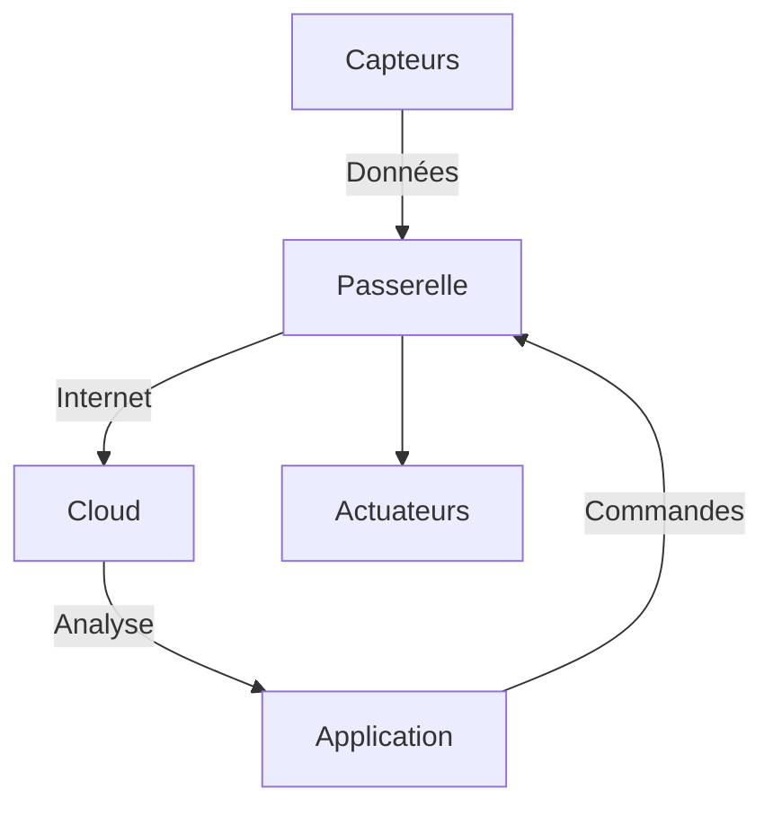
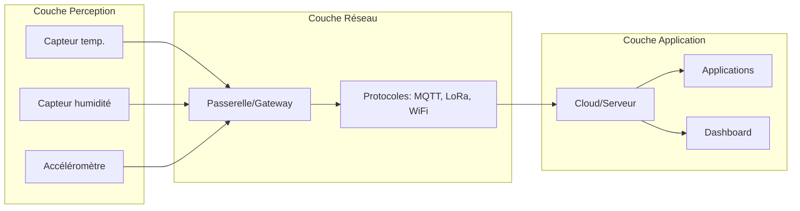
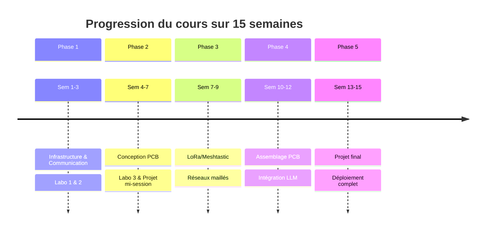
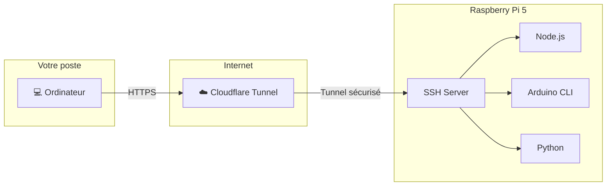
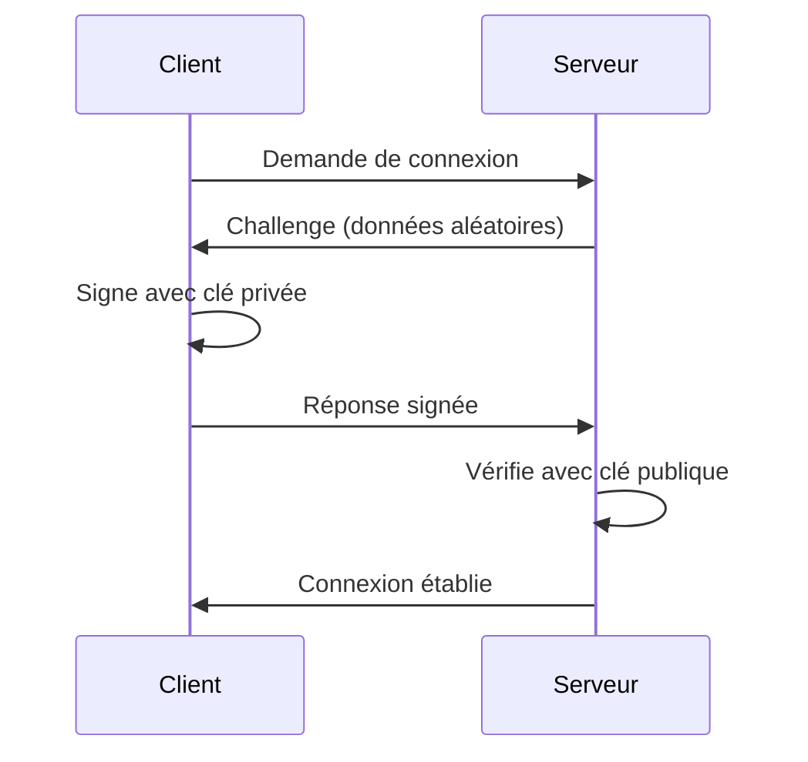
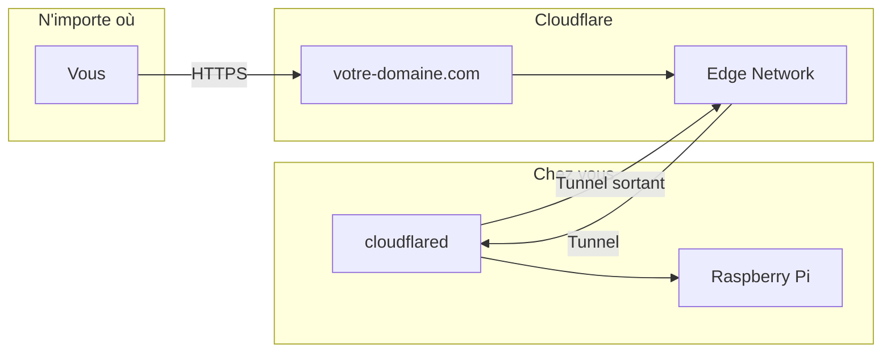
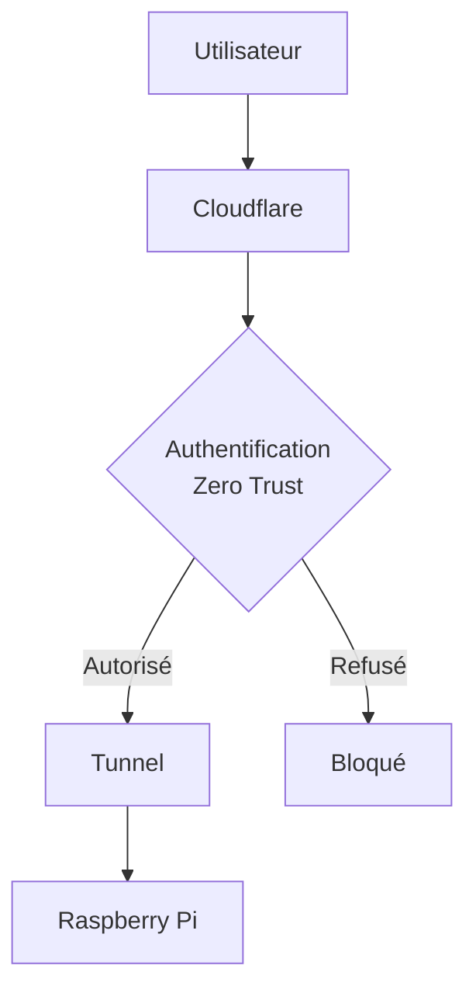

# Objets connectés
## 243-4J5-LI

Semaine 1 - Introduction et mise en contexte

<div class="pt-12">
  <span class="px-2 py-1 rounded cursor-pointer" hover="bg-white bg-opacity-10">
    Francis Poisson - Cégep Limoilou - H26
  </span>
</div>

---
layout: section
---

# Partie 1
## Mise en contexte

---
layout: two-cols
---

# Qu'est-ce que l'IoT?

**Internet of Things** (Internet des objets)

Réseau d'appareils physiques connectés qui collectent et échangent des données.

<v-click>

### Exemples quotidiens
- 🏠 Thermostats intelligents
- ⌚ Montres connectées
- 🚗 Véhicules connectés
- 🏭 Capteurs industriels

</v-click>

::right::

<v-click>



</v-click>

---

# L'IoT en chiffres

<div class="grid grid-cols-3 gap-4 mt-8">

<div class="text-center p-4 bg-blue-500 bg-opacity-20 rounded-lg">
  <div class="text-4xl font-bold text-blue-400">15+ milliards</div>
  <div class="text-sm mt-2">Appareils IoT en 2024</div>
</div>

<div class="text-center p-4 bg-green-500 bg-opacity-20 rounded-lg">
  <div class="text-4xl font-bold text-green-400">30+ milliards</div>
  <div class="text-sm mt-2">Prévus en 2030</div>
</div>

<div class="text-center p-4 bg-purple-500 bg-opacity-20 rounded-lg">
  <div class="text-4xl font-bold text-purple-400">1.5 trillion $</div>
  <div class="text-sm mt-2">Marché mondial 2030</div>
</div>

</div>

<v-click>

### Secteurs clés
- **Industriel** - Industrie 4.0, maintenance prédictive
- **Santé** - Monitoring patients, équipements médicaux
- **Agriculture** - Irrigation intelligente, suivi du bétail
- **Villes intelligentes** - Trafic, éclairage, déchets

</v-click>

---
layout: center
---

# Architecture typique IoT



---

# Défis de l'IoT

<div class="grid grid-cols-2 gap-8 mt-4">

<div>

### Techniques
- Alimentation et autonomie
- Connectivité dans zones reculées
- Interopérabilité des protocoles
- Traitement temps réel

</div>

<div>

### Sécurité
- Authentification des appareils
- Chiffrement des communications
- Mises à jour firmware
- Protection des données

</div>

</div>

<v-click>

<div class="mt-8 p-4 bg-yellow-500 bg-opacity-20 rounded-lg">

### Ce que vous apprendrez dans ce cours
Concevoir, programmer et déployer des objets connectés sécurisés en utilisant des protocoles modernes (MQTT, LoRa) et des outils professionnels (KiCad, Cloudflare).

</div>

</v-click>

---
layout: section
---

# Partie 2
## Présentation du plan de cours

---

# Informations générales

<div class="grid grid-cols-2 gap-8">

<div>

| | |
|---|---|
| **Code** | 243-4J5-LI |
| **Titre** | Objets connectés |
| **Pondération** | 2-3-2 |
| **Crédits** | 2.33 |
| **Session** | Hiver 2026 |

</div>

<div>

### Répartition hebdomadaire

- **2h** - Théorie en classe
- **3h** - Laboratoire pratique
- **2h** - Travail personnel

<v-click>

### Enseignant
**Francis Poisson**

</v-click>

</div>

</div>

---

# Compétences développées

<div class="grid grid-cols-2 gap-6 mt-4">

<div class="p-4 bg-blue-500 bg-opacity-20 rounded-lg">

### Compétence 1 (45%)
**Concevoir et programmer des objets connectés**

- Fondamentaux IoT et architectures
- Programmation Python pour IoT
- Interfaçage GPIO, capteurs, actuateurs
- Conception de PCB (KiCad)
- Traitement et visualisation de données

</div>

<div class="p-4 bg-green-500 bg-opacity-20 rounded-lg">

### Compétence 2 (50%)
**Maîtriser les protocoles de communication IoT**

- Protocole MQTT
- Configuration broker sécurisé
- Gestion QoS et authentification
- API REST et WebSocket
- Intégration LLM pour automatisation

</div>

</div>

---

# Structure du cours - 5 phases



---

# Évaluations sommatives

| Évaluation | Semaine | Comp. 1 | Comp. 2 | Total |
|-----------|:------:|:------:|:------:|:-----:|
| Lab capteurs et Python | 3 | 15% | - | **15%** |
| Projet mi-session (PCB) | 7 | 15% | 5% | **20%** |
| TP Intégration LLM | 9 | 15% | 5% | **20%** |
| Projet final | 15 | 10% | 25% | **35%** |

<v-click>

<div class="mt-4 p-3 bg-red-500 bg-opacity-20 rounded-lg">

### Seuil de réussite
- **60%** note globale minimum
- **45%** minimum pour la Compétence 1
- **50%** minimum pour la Compétence 2

</div>

</v-click>

---

# Matériel requis

<div class="grid grid-cols-2 gap-6">

<div>

### Matériel fourni
- Raspberry Pi 5 + carte SD 64GB
- Écran tactile
- LilyGO A7670G (ESP32 + LTE)
- T-Beam SUPREME (LoRa)
- Composants électroniques

</div>

<div>

### À votre charge
- Compte Claude/Gemini/ChatGPT (~30$/mois)
- Compte Cloudflare (gratuit)
- Nom de domaine (~15$/an)
- Carte SIM avec données

</div>

</div>

<v-click>

<div class="mt-6 p-3 bg-yellow-500 bg-opacity-20 rounded-lg">

⚠️ **Important**: Vous êtes responsable du matériel prêté. Tout dommage ou perte sera facturé.

</div>

</v-click>

---

# Règles de fonctionnement

<div class="grid grid-cols-2 gap-6">

<div>

### En laboratoire
- Pas de nourriture près des ordinateurs
- Comportement respectueux
- Appareils pour usage pédagogique uniquement
- Téléphones en mode silencieux
- Rangement du poste de travail

</div>

<div>

### Travaux et remises
- **-10%** par jour de retard
- Maximum 5 jours de retard
- Qualité du français évaluée
- Pas de plagiat (tolérance zéro)

</div>

</div>

---
layout: section
---

# Partie 3
## Introduction au Laboratoire 1

---

# Objectif du Labo 1

<div class="text-xl mb-6">

Mettre en place un **environnement de développement distant** sur Raspberry Pi 5

</div>



---

# Architecture du système

```mermaid {scale: 0.65}
graph TB
    subgraph "Raspberry Pi 5"
        OS[Ubuntu Server 24.04]

        subgraph "Services"
            SSH[SSH Server]
            CF[Cloudflare Tunnel]
        end

        subgraph "Outils de développement"
            GIT[Git CLI]
            NODE[Node.js]
            ARDUINO[Arduino CLI]
            PYTHON[Python 3]
        end

        subgraph "Interface"
            TOUCH[Écran tactile]
            UI[Interface curses]
        end
    end

    subgraph "Matériel externe"
        LILYGO[LilyGO A7670G]
        LED[LEDs]
        BTN[Boutons]
    end

    OS --> Services
    OS --> Outils de développement
    OS --> Interface

    ARDUINO -->|Serial| LILYGO
    UI --> LED
    UI --> BTN
```

---
layout: two-cols
---

# Ubuntu Server vs Desktop

### Pourquoi Server?

<v-clicks>

- **Ressources minimales**
  - Pas d'interface graphique
  - Plus de RAM disponible
  - CPU libre pour vos applications

- **Optimisé pour serveur**
  - Services au démarrage
  - Stabilité à long terme
  - Mises à jour sécurité

- **Administration distante**
  - SSH natif
  - Pas besoin d'écran permanent

</v-clicks>

::right::

<v-click>

### Comparaison ressources

| | Desktop | Server |
|---|:---:|:---:|
| RAM au repos | ~1.5 GB | ~300 MB |
| Espace disque | ~8 GB | ~2 GB |
| Services | 150+ | 50 |

</v-click>

<v-click>

```bash
# Vérifier les ressources
free -h
df -h
htop
```

</v-click>

---

# Configuration réseau - Netplan

<div class="grid grid-cols-2 gap-4">

<div>

### Qu'est-ce que Netplan?

Outil de configuration réseau Ubuntu utilisant des fichiers YAML.

```yaml
network:
  version: 2
  ethernets:
    eth0:
      dhcp4: true
  wifis:
    wlan0:
      access-points:
        "MonWiFi":
          password: "motdepasse"
      dhcp4: true
```

</div>

<div>

<v-click>

### Commandes essentielles

```bash
# Appliquer la configuration
sudo netplan apply

# Tester avant d'appliquer
sudo netplan try

# Debug
sudo netplan --debug apply
```

</v-click>

</div>

</div>

---

# SSH - Secure Shell

<div class="grid grid-cols-2 gap-6">

<div>

### Principe

Protocole de communication sécurisé pour:
- Connexion distante
- Transfert de fichiers
- Tunneling de ports

```bash
# Connexion basique
ssh user@192.168.1.100

# Avec clé privée
ssh -i ~/.ssh/ma_cle user@host

# Copie de fichiers
scp fichier.txt user@host:/chemin/
```

</div>

<div>

<v-click>

### Authentification par clés



</v-click>

</div>

</div>

---

# Cloudflare Tunnel

### Problème à résoudre

Comment accéder à votre Raspberry Pi depuis l'extérieur sans:
- IP publique fixe
- Configuration routeur/NAT
- Ouverture de ports

<v-click>

### Solution: Cloudflare Tunnel



</v-click>

---

# Cloudflare Zero Trust

### Sécurité renforcée

<div class="grid grid-cols-2 gap-6">

<div>

**Sans Zero Trust**
- URL publique accessible à tous
- Seul le mot de passe SSH protège

**Avec Zero Trust**
- Authentification supplémentaire
- Politique d'accès par email/domaine
- Journalisation des accès

</div>

<div>



</div>

</div>

---

# GPIO - General Purpose Input/Output

<div class="grid grid-cols-2 gap-4">

<div>

### Qu'est-ce que le GPIO?

Broches programmables pour:
- **Entrées**: lire des capteurs, boutons
- **Sorties**: contrôler LEDs, relais

### Caractéristiques Raspberry Pi
- Tension: **3.3V** (pas 5V!)
- Courant max: ~16mA par broche
- Modes: INPUT, OUTPUT, PWM

</div>

<div>

```python
import RPi.GPIO as GPIO

# Configuration
GPIO.setmode(GPIO.BCM)
GPIO.setup(17, GPIO.OUT)
GPIO.setup(18, GPIO.IN,
           pull_up_down=GPIO.PUD_UP)

# Utilisation
GPIO.output(17, GPIO.HIGH)  # LED ON
state = GPIO.input(18)      # Lire bouton

# Nettoyage
GPIO.cleanup()
```

</div>

</div>

---

# Arduino CLI

### Pourquoi Arduino CLI?

Permet de compiler et téléverser du code Arduino **sans interface graphique**.

```bash
# Installer une plateforme
arduino-cli core install esp32:esp32

# Compiler un sketch
arduino-cli compile --fqbn esp32:esp32:esp32 MonSketch/

# Téléverser
arduino-cli upload -p /dev/ttyUSB0 --fqbn esp32:esp32:esp32 MonSketch/

# Moniteur série
arduino-cli monitor -p /dev/ttyUSB0 -b 115200
```

<v-click>

### Avantages
- **Scriptable** - Automatisation possible
- **Léger** - Pas besoin de GUI
- **CI/CD** - Intégration continue

</v-click>

---

# LilyGO A7670G

<div class="grid grid-cols-2 gap-6">

<div>

### Caractéristiques

| Composant | Spécification |
|-----------|---------------|
| MCU | ESP32 |
| Modem | A7670G LTE Cat-1 |
| GPS | Intégré |
| Connectivité | WiFi, Bluetooth, LTE |

### Cas d'utilisation
- Communication cellulaire
- Géolocalisation
- IoT mobile

</div>

<div>

### GPIO utilisés

| Composant | GPIO | Note |
|-----------|------|------|
| LED Rouge | 32 | + résistance 220Ω |
| LED Verte | 33 | + résistance 220Ω |
| Bouton 1 | 34 | Pull-up interne |
| Bouton 2 | 35 | Pull-up interne |

</div>

</div>

---

# Travail de la semaine

<div class="grid grid-cols-2 gap-6">

<div>

### À faire en laboratoire

1. Installer Ubuntu Server sur SD
2. Configuration réseau WiFi
3. Installation des outils:
   - Git, Node.js, Python
   - Arduino CLI
4. Configuration SSH
5. Mise en place Cloudflare Tunnel

</div>

<div>

### Pour la semaine prochaine

- Terminer la configuration de base
- Tester l'accès distant
- Premier test avec LilyGO:
  - Compilation
  - Téléversement
  - Communication série

</div>

</div>

<v-click>

<div class="mt-4 p-3 bg-blue-500 bg-opacity-20 rounded-lg">

📚 **Documentation**: Suivez le guide `Labo1-environnement de programmation distant sur rPi.md`

</div>

</v-click>

---
layout: center
class: text-center
---

# Questions?

<div class="text-xl mt-8">
Semaine prochaine: Introduction à MQTT et début du Labo 2
</div>

---
layout: end
---

# Merci!

243-4J5-LI - Objets connectés

Semaine 1
