# Objets connectés
## 243-4J5-LI

Semaine 2 - Protocole MQTT et communication sans fil

<div class="pt-12">
  <span class="px-2 py-1 rounded cursor-pointer" hover="bg-white bg-opacity-10">
    Francis Poisson - Cégep Limoilou - H26
  </span>
</div>

---
layout: section
---

# Partie 1
## Introduction à MQTT

---

# MQTT - Message Queuing Telemetry Transport

<div class="grid grid-cols-2 gap-6">

<div>

### Historique

- Créé en **1999** par IBM et Arcom
- Conçu pour la **télémétrie** (pipelines pétroliers)
- Standard **OASIS** depuis 2014
- Version actuelle: **MQTT 5.0**

### Caractéristiques clés

- **Léger** - En-tête minimal (2 octets)
- **Bidirectionnel** - Pub/Sub
- **Fiable** - QoS configurable
- **Sécurisé** - TLS/SSL support

</div>

<div>

### Pourquoi MQTT pour l'IoT?

| Critère | HTTP | MQTT |
|---------|:----:|:----:|
| Overhead | ~700B | ~2B |
| Pattern | Req/Res | Pub/Sub |
| Connexion | Courte | Persistante |
| Push | Polling | Natif |
| Batterie | Élevée | Faible |

</div>

</div>

---

# Architecture Publish/Subscribe

```mermaid {scale: 0.75}
graph TB
    subgraph "Publishers"
        P1[Capteur Temp]
        P2[Capteur Humidité]
        P3[Capteur Mouvement]
    end

    subgraph "Broker MQTT"
        B[Mosquitto]
    end

    subgraph "Subscribers"
        S1[Dashboard]
        S2[Application Mobile]
        S3[Système Alerte]
    end

    P1 -->|publish| B
    P2 -->|publish| B
    P3 -->|publish| B

    B -->|deliver| S1
    B -->|deliver| S2
    B -->|deliver| S3
```



<v-click>

<div class="mt-4 text-center">

Les **publishers** et **subscribers** ne se connaissent pas directement.

Le **broker** gère tout le routage des messages.

</div>

</v-click>

---

# Avantages du Publish/Subscribe

<div class="grid grid-cols-3 gap-4 mt-4">

<div class="p-4 bg-blue-500 bg-opacity-20 rounded-lg text-center">

### Découplage spatial

Les clients n'ont pas besoin de connaître l'adresse IP des autres

```
Publisher ─► Broker ◄─ Subscriber
```

</div>

<div class="p-4 bg-green-500 bg-opacity-20 rounded-lg text-center">

### Découplage temporel

Les messages sont livrés même si le destinataire est hors ligne

```
📤 → 💾 → 📥
     (stocké)
```

</div>

<div class="p-4 bg-purple-500 bg-opacity-20 rounded-lg text-center">

### Découplage de synchronisation

Pas de blocage pendant les opérations

```
async publish()
async subscribe()
```

</div>

</div>

---

# Topics MQTT

### Structure hiérarchique

Les topics utilisent `/` comme séparateur de niveaux.

```
maison/salon/temperature
maison/salon/humidite
maison/cuisine/temperature
garage/porte/etat
```

<v-click>

### Conventions de nommage

| ✅ Bonnes pratiques | ❌ À éviter |
|-------------------|-----------|
| `etudiant/jean-dupont/sensors/temp` | `CAPTEUR_TEMP_123` |
| `building/floor1/room101/hvac` | `data` |
| Minuscules, tirets | Espaces, caractères spéciaux |
| Hiérarchie logique | Structure plate |

</v-click>

---

# Wildcards - Caractères joker

<div class="grid grid-cols-2 gap-6">

<div>

### `+` - Single Level Wildcard

Remplace **un seul niveau**.

```
maison/+/temperature
```

Correspond à:
- ✅ `maison/salon/temperature`
- ✅ `maison/cuisine/temperature`
- ❌ `maison/etage1/salon/temperature`

</div>

<div>

### `#` - Multi Level Wildcard

Remplace **tous les niveaux** restants.

```
maison/#
```

Correspond à:
- ✅ `maison/salon`
- ✅ `maison/salon/temperature`
- ✅ `maison/etage1/salon/lumiere`

⚠️ Doit être en fin de topic

</div>

</div>

---

# QoS - Quality of Service

<div class="mt-4">


</div>

<v-click>

<div class="mt-2">


</div>

</v-click>

<v-click>

<div class="mt-2">


</div>

</v-click>

---

# Comparaison des niveaux QoS

| QoS | Garantie | Messages | Latence | Usage |
|:---:|----------|:--------:|:-------:|-------|
| **0** | Au plus une fois | 1 | ⚡ Faible | Données fréquentes (capteurs) |
| **1** | Au moins une fois | ≥1 | Moyenne | Commandes importantes |
| **2** | Exactement une fois | 1 | 🐢 Élevée | Transactions critiques |

<v-click>

### Quand utiliser quel QoS?

- **QoS 0**: Température toutes les secondes (si une lecture manque, pas grave)
- **QoS 1**: Commande d'allumer une lumière (duplicata acceptable)
- **QoS 2**: Transaction de paiement, alarme incendie

</v-click>

---

# Messages retenus (Retained)

<div class="grid grid-cols-2 gap-6">

<div>

### Problème

Un nouveau subscriber ne reçoit les messages que **après** son abonnement.


</div>

<div>

### Solution: Retained Message

```mermaid {scale: 0.6}
sequenceDiagram
    Publisher->>Broker: temp = 22°C [RETAIN]
    Note over Broker: Stocke le message
    Note over Subscriber: Se connecte
    Subscriber->>Broker: subscribe(temp)
    Broker->>Subscriber: temp = 22°C
    Note over Subscriber: Reçoit immédiatement!
```



</div>

</div>

<v-click>

```python
# Publier avec retain
client.publish("maison/salon/temp", "22", retain=True)
```

</v-click>

---

# Last Will and Testament (LWT)

### Testament en cas de déconnexion

<div class="grid grid-cols-2 gap-6">

<div>

**Problème**: Comment savoir si un appareil est hors ligne?

**Solution**: Le client configure un message "testament" à la connexion.

Si le client se déconnecte **anormalement**, le broker publie ce message.

</div>

<div>

```python
# Configuration du LWT à la connexion
client.will_set(
    topic="device/capteur1/status",
    payload="offline",
    qos=1,
    retain=True
)

client.connect(broker)

# Publier le statut online
client.publish(
    "device/capteur1/status",
    "online",
    retain=True
)
```

</div>

</div>

---
layout: section
---

# Partie 2
## Broker Mosquitto

---

# Mosquitto - Broker MQTT Open Source

<div class="grid grid-cols-2 gap-6">

<div>

### Caractéristiques

- **Open source** (Eclipse Foundation)
- **Léger** - Faible empreinte mémoire
- **Complet** - MQTT 3.1, 3.1.1, 5.0
- **Sécurisé** - TLS, authentification
- **Extensible** - Plugins

### Installation

```bash
# Ubuntu/Debian
sudo apt install mosquitto mosquitto-clients

# Vérifier le statut
sudo systemctl status mosquitto
```

</div>

<div>

### Architecture

```mermaid {scale: 0.6}
graph TB
    subgraph "Mosquitto"
        L1[Listener :1883<br/>MQTT]
        L2[Listener :8883<br/>MQTT/TLS]
        L3[Listener :9001<br/>WebSocket]
        AUTH[Auth Plugin]
        STORE[Message Store]
    end

    C1[Client MQTT] --> L1
    C2[Client sécurisé] --> L2
    C3[Browser] --> L3

    L1 --> AUTH
    L2 --> AUTH
    L3 --> AUTH
```



</div>

</div>

---

# Configuration Mosquitto

### Fichier `/etc/mosquitto/mosquitto.conf`

```bash
# Désactiver l'accès anonyme
allow_anonymous false

# Fichier de mots de passe
password_file /etc/mosquitto/passwd

# Listener MQTT standard (local seulement)
listener 1883 localhost

# Listener WebSocket (pour accès web/tunnel)
listener 9001
protocol websockets
```

<v-click>

### Gestion des utilisateurs

```bash
# Créer un utilisateur
sudo mosquitto_passwd -c /etc/mosquitto/passwd mon_user

# Ajouter un utilisateur
sudo mosquitto_passwd /etc/mosquitto/passwd autre_user

# Redémarrer le service
sudo systemctl restart mosquitto
```

</v-click>

---

# Test avec mosquitto_pub et mosquitto_sub

<div class="grid grid-cols-2 gap-4">

<div>

### Terminal 1 - Subscriber

```bash
# S'abonner à un topic
mosquitto_sub -h localhost \
  -t "test/capteur" \
  -u mon_user -P mon_password

# Avec wildcards
mosquitto_sub -h localhost \
  -t "maison/#" \
  -u mon_user -P mon_password
```

</div>

<div>

### Terminal 2 - Publisher

```bash
# Publier un message
mosquitto_pub -h localhost \
  -t "test/capteur" \
  -m "25.5" \
  -u mon_user -P mon_password

# Message JSON
mosquitto_pub -h localhost \
  -t "test/capteur" \
  -m '{"temp": 25.5, "hum": 60}' \
  -u mon_user -P mon_password
```

</div>

</div>

---

# WebSocket - Communication temps réel

### Pourquoi WebSocket?

<div class="grid grid-cols-2 gap-6">

<div>

**HTTP traditionnel**
```
Client ──► GET /data ──► Server
Client ◄── Response ◄── Server
Client ──► GET /data ──► Server
Client ◄── Response ◄── Server
(polling répétitif)
```

**WebSocket**
```
Client ◄──────────────► Server
       connexion bidirectionnelle
       persistante
```

</div>

<div>

### Avantages

- **Temps réel** - Push instantané
- **Efficace** - Pas de polling
- **Bidirectionnel** - Les deux sens
- **Compatible navigateur** - JavaScript natif

### MQTT over WebSocket

Permet aux navigateurs web de communiquer en MQTT!

</div>

</div>

---

# WSS - WebSocket Secure

### TLS/SSL pour WebSocket

```mermaid {scale: 0.7}
graph LR
    subgraph "Client (Browser)"
        JS[JavaScript]
    end

    subgraph "Internet"
        TLS[🔒 TLS 1.3]
    end

    subgraph "Serveur"
        WS[WebSocket :443]
        MQTT[Mosquitto]
    end

    JS -->|wss://| TLS
    TLS --> WS
    WS --> MQTT
```



<v-click>

### Configuration Mosquitto avec TLS

```bash
listener 9001
protocol websockets
certfile /etc/letsencrypt/live/domain/fullchain.pem
keyfile /etc/letsencrypt/live/domain/privkey.pem
```

</v-click>

---
layout: section
---

# Partie 3
## WiFi Enterprise (WPA-EAP)

---

# WPA-EAP vs WPA-PSK

<div class="grid grid-cols-2 gap-6">

<div>

### WPA-PSK (Personnel)

- **Un mot de passe** partagé
- Tous les utilisateurs = même clé
- Révocation difficile
- Usage: maison, petit bureau

```
WiFi: MonReseau
Pass: motdepasse123
(tout le monde partage)
```

</div>

<div>

### WPA-EAP (Entreprise)

- **Identifiants individuels**
- Chaque utilisateur = ses credentials
- Révocation facile
- Usage: entreprises, écoles

```
WiFi: CegepSecure
User: jean.dupont
Pass: personnel123
(identifiant unique)
```

</div>

</div>

---

# Architecture WPA-EAP

```mermaid {scale: 0.7}
graph LR
    subgraph "Client"
        DEV[Appareil WiFi]
        SUPP[Supplicant]
    end

    subgraph "Réseau"
        AP[Point d'accès]
        AUTH[Authenticator]
    end

    subgraph "Backend"
        RADIUS[Serveur RADIUS]
        LDAP[Annuaire LDAP/AD]
    end

    DEV --> SUPP
    SUPP -->|EAP| AP
    AP --> AUTH
    AUTH -->|RADIUS| RADIUS
    RADIUS --> LDAP
```



<v-click>

### Méthode utilisée: PEAP-MSCHAPv2

- **PEAP** - Protected EAP (tunnel TLS)
- **MSCHAPv2** - Microsoft Challenge-Handshake (authentification)

</v-click>

---

# Configuration WiFi Enterprise - ESP32

```cpp
#include <WiFi.h>
#include "esp_wpa2.h"

// Configuration réseau
const char* ssid = "Reseau-Entreprise";
const char* username = "mon.utilisateur";
const char* password = "monMotDePasse";

void setup() {
    WiFi.mode(WIFI_STA);
    WiFi.disconnect();

    // Configuration EAP
    esp_wifi_sta_wpa2_ent_set_identity(
        (uint8_t*)username, strlen(username));
    esp_wifi_sta_wpa2_ent_set_username(
        (uint8_t*)username, strlen(username));
    esp_wifi_sta_wpa2_ent_set_password(
        (uint8_t*)password, strlen(password));

    esp_wifi_sta_wpa2_ent_enable();
    WiFi.begin(ssid);
}
```

---
layout: section
---

# Partie 4
## Introduction au Laboratoire 2

---

# Objectifs du Labo 2

<div class="text-xl mb-6">

Établir une **communication MQTT sécurisée** entre le LilyGO et le Raspberry Pi

</div>


---

# Architecture détaillée

```mermaid {scale: 0.6}
graph TB
    subgraph "LilyGO A7670G"
        direction TB
        ESP32[ESP32]
        MODEM[Modem A7670G]

        subgraph "GPIO"
            LED_R[LED Rouge - GPIO 32]
            LED_G[LED Verte - GPIO 33]
            BTN_1[Bouton 1 - GPIO 34]
            BTN_2[Bouton 2 - GPIO 35]
        end

        ESP32 --> GPIO
        ESP32 --> MODEM
    end

    subgraph "Réseau"
        WIFI[WiFi Cégep<br/>WPA-EAP]
        CELL[Réseau cellulaire<br/>LTE Cat-1]
    end

    subgraph "Cloudflare"
        CF_EDGE[Edge Network]
        CF_TUNNEL[Tunnel]
    end

    subgraph "Raspberry Pi 5"
        MOSQUITTO[Mosquitto<br/>:9001 WSS]
        PYTHON_UI[Interface Python<br/>Écran tactile]
    end

    ESP32 -->|Option 1| WIFI
    MODEM -->|Option 2| CELL
    WIFI --> CF_EDGE
    CELL --> CF_EDGE
    CF_EDGE --> CF_TUNNEL
    CF_TUNNEL --> MOSQUITTO
    MOSQUITTO <--> PYTHON_UI
```



---

# Topics MQTT du projet

```
etudiant/{prenom-nom}/
├── sensors/
│   ├── buttons    → {"btn1": true, "btn2": false}
│   └── status     → {"uptime": 3600, "rssi": -65}
│
├── actuators/
│   ├── led1       ← {"state": "on"} ou {"state": "off"}
│   └── led2       ← {"state": "on"} ou {"state": "off"}
│
└── config/        ← {"interval": 1000}
```

<v-click>

### Flux de données

| Direction | Topic | Données |
|-----------|-------|---------|
| LilyGO → RPi | `sensors/buttons` | État des boutons |
| LilyGO → RPi | `sensors/status` | Uptime, signal |
| RPi → LilyGO | `actuators/led1` | Commande LED |
| RPi → LilyGO | `config` | Configuration |

</v-click>

---

# Connexion via Cloudflare Tunnel

### Pourquoi passer par Cloudflare?

```mermaid {scale: 0.65}
graph LR
    subgraph "Sans Cloudflare"
        L1[LilyGO] -->|❌ Bloqué| FW[Pare-feu<br/>NAT]
        FW -->|❌| R1[RPi]
    end
```




<v-click>

### Avantages

- ✅ Pas besoin d'IP publique sur le RPi
- ✅ Pas de configuration routeur
- ✅ Chiffrement de bout en bout
- ✅ Fonctionne depuis n'importe où (WiFi ou LTE)

</v-click>

---

# Configuration du tunnel MQTT

### Sur le Raspberry Pi

```bash
# Créer le tunnel pour MQTT WebSocket
cloudflared tunnel route dns mon-tunnel mqtt.mondomaine.com

# Configuration dans config.yml
ingress:
  - hostname: mqtt.mondomaine.com
    service: http://localhost:9001
  - service: http_status:404
```

<v-click>

### Connexion depuis LilyGO

```cpp
// WebSocket sécurisé via Cloudflare
const char* mqtt_host = "mqtt.mondomaine.com";
const int mqtt_port = 443;  // HTTPS/WSS

webSocket.beginSSL(mqtt_host, mqtt_port, "/", "", "mqtt");
```

</v-click>

---

# Montage électronique

<div class="grid grid-cols-2 gap-6">

<div>

### Composants

| Composant | Quantité |
|-----------|:--------:|
| LED rouge | 1 |
| LED verte | 1 |
| Résistance 220Ω | 2 |
| Bouton poussoir | 2 |
| Fils de connexion | ~10 |

</div>

<div>

### Schéma de connexion

```
GPIO 32 ──[220Ω]──[LED R]── GND
GPIO 33 ──[220Ω]──[LED V]── GND

GPIO 34 ──[BTN 1]── GND
GPIO 35 ──[BTN 2]── GND
```

⚠️ Pull-up interne activé pour les boutons

</div>

</div>

---

# Travail de la semaine

<div class="grid grid-cols-2 gap-6">

<div>

### En laboratoire

1. **Configuration Mosquitto**
   - Créer utilisateur
   - Activer WebSocket
   - Test local

2. **Configuration Cloudflare**
   - Créer tunnel MQTT
   - Configurer DNS

3. **Premier test WiFi**
   - Configuration WPA-EAP
   - Connexion MQTT

</div>

<div>

### Livrables

- Broker Mosquitto fonctionnel
- Tunnel Cloudflare configuré
- LEDs contrôlables via MQTT
- Documentation de votre configuration

</div>

</div>

<v-click>

<div class="mt-4 p-3 bg-blue-500 bg-opacity-20 rounded-lg">

📚 **Documentation**: `Labo2-communication-sans-fil-MQTT-LTE.md`

</div>

</v-click>

---
layout: center
class: text-center
---

# Questions?

<div class="text-xl mt-8">
Semaine prochaine: Communication LTE et préparation à l'évaluation
</div>

---
layout: end
---

# Merci!

243-4J5-LI - Objets connectés

Semaine 2
