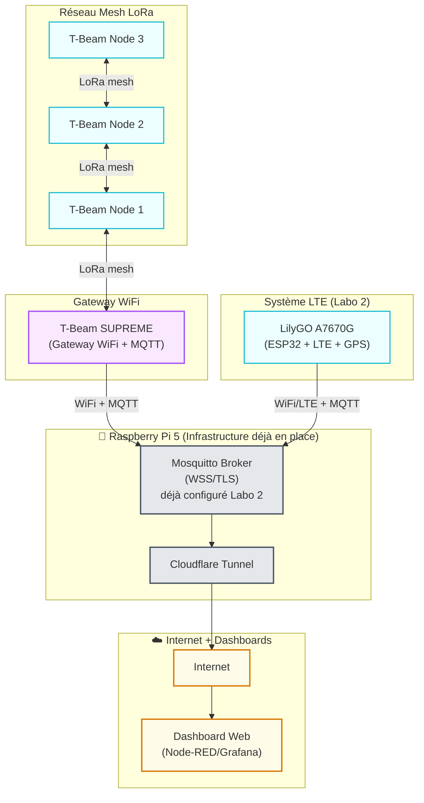
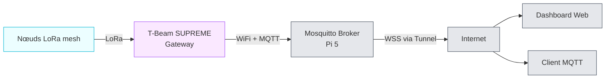

# Semaines LoRa/Meshtastic — T-Beam SUPREME
**Cours:** 243-4J5-LI – Objets connectés
**Semaines 7-9:** Introduction et maîtrise de Meshtastic/LoRa
**Phase 3:** Intégration des savoirs dans un cas d'usage concret

---

## 🔗 Contexte et continuité de la session

### Acquis des semaines précédentes (Semaines 1-6)

**Phase 1 (Semaines 1-3) — Labo 1 & 2: Infrastructure et communications**
Vous avez déjà:
- ✅ Configuré votre **Raspberry Pi 5 comme serveur** (exposition sécurisée via Cloudflare Tunnel)
- ✅ Installé et configuré un **courtier MQTT Mosquitto** avec WSS/TLS
- ✅ Travaillé avec le **LilyGO A7670G** (ESP32 + LTE + GPS)
- ✅ Développé une **interface tactile Python** sur le Raspberry Pi
- ✅ Mis en œuvre des communications **MQTT via WiFi et LTE**
- ✅ Maîtrisé les **bases de Python** pour l'acquisition de données et l'interfaçage GPIO

**Phase 2 (Semaines 4-6) — PCB et communications avancées**
Vous avez:
- ✅ Conçu et routé un **PCB dans Altium** pour interfacer capteurs/actionneurs
- ✅ Envoyé le PCB en **fabrication** (réception prévue semaine 10)
- ✅ Complété le **TP Communications MQTT/HTTP** (pipeline pub/sub, API REST)
- ✅ Sécurisé vos communications (authentification, chiffrement TLS)

### Nouvelle phase: LoRa et réseau mesh (Semaines 7-9)

**Objectifs de cette phase:**
Maintenant que vous maîtrisez:
- La programmation Python
- Les protocoles MQTT et HTTP
- L'infrastructure serveur (Raspberry Pi, cloudflared)
- La conception PCB

Vous allez **ajouter une nouvelle couche de communication**: le **réseau mesh LoRa** avec Meshtastic.

**Pourquoi LoRa/Meshtastic?**
- **Complémentarité:** LoRa couvre les zones sans WiFi/cellulaire (là où MQTT LTE ne passe pas)
- **Résilience:** Le mesh permet des communications décentralisées sans infrastructure
- **Longue portée:** Communication jusqu'à plusieurs kilomètres en ligne de vue
- **Faible consommation:** Idéal pour des nœuds alimentés par batterie/solaire

**Lien avec le projet final (Semaines 13-15):**
Le PCB que vous avez conçu (semaines 4-6) sera assemblé (semaine 10) et intégré au réseau Meshtastic pour créer un **système IdO complet** combinant:
- Acquisition de données (capteurs sur PCB)
- Communication locale (LoRa mesh)
- Communication Internet (MQTT via gateway)
- Monitoring et contrôle (dashboards, LLM)

---

## 🟦 Semaine 7 — Introduction + Prise en main

### 🔄 Réutilisation des acquis précédents
Dans cette semaine, vous allez **réutiliser** vos compétences déjà acquises:
- **GPS (Labo 2 avec LilyGO A7670G):** Le T-Beam SUPREME intègre un GPS similaire (format NMEA)
- **Python:** Les mêmes compétences pour interagir avec les modules (via CLI ou API)
- **ESP32:** Le T-Beam SUPREME utilise un ESP32-S3, même famille que le A7670G
- **Formats de données:** JSON que vous maîtrisez déjà pour structurer les données

**Nouveau matériel:** **T-Beam SUPREME** (LilyGO) avec module LoRa intégré
**Nouveauté technologique:** Au lieu de communiquer via MQTT/WiFi/LTE (Labo 2), vous utiliserez **LoRa** pour des communications mesh décentralisées, sans infrastructure.

### 🎯 Objectifs de la semaine
- Comprendre les principes de Meshtastic et du réseau mesh LoRa
- Configurer des T-Beam SUPREME de base
- Effectuer les premiers essais de communication LoRa
- Comprendre l'architecture d'un réseau mesh décentralisé
- **Réutiliser** les compétences GPS acquises au Labo 1

### 📚 Contenus théoriques (2h)

#### Architecture du réseau mesh Meshtastic
- **Topologie mesh vs architecture centralisée**
  - Différences avec les réseaux traditionnels (client-serveur)
  - Avantages : résilience, portée étendue, décentralisation
  - Cas d'usage : communications d'urgence, zones reculées, événements

- **Protocole LoRa et modulation**
  - Rappels du cours 243-3J5-LI (Signaux radio et modulations)
  - Caractéristiques LoRa : longue portée, faible consommation
  - Bandes ISM (863-928 MHz selon région)
  - Distinction LoRa vs LoRaWAN

- **Architecture Meshtastic**
  - Pile logicielle (firmware open-source)
  - Types de nœuds : Client, Router, Router-Critical, Repeater
  - Canaux de communication et chiffrement
  - Protocole de routage mesh

#### Matériel : T-Beam SUPREME
- **Composants du T-Beam SUPREME**
  - ESP32-S3 (microcontrôleur principal)
  - Module LoRa SX1262/SX1276
  - GPS NEO-6M/NEO-8M
  - Gestion de l'alimentation (batterie 18650)
  - Connecteurs d'antenne (LoRa, GPS)

- **Antennes LoRa**
  - Types : dipôle, quart d'onde, colinéaire
  - Importance de l'adaptation d'impédance
  - Risques : antenne mal adaptée → dommages au module LoRa

- **GPS intégré**
  - Fonctionnement du GPS pour la géolocalisation
  - Format NMEA et intégration Meshtastic
  - Mode Beacon GPS (partage de position)

### 🛠️ Activités pratiques (3h)

#### 1. Installation du firmware Meshtastic
**Étapes:**
1. Accéder au **Web Flasher** : https://flasher.meshtastic.org
2. Connecter le T-Beam SUPREME via USB-C
3. Sélectionner le modèle : **LILYGO TTGO T-Beam SUPREME**
4. Flasher la version stable du firmware
5. Vérifier l'installation (LED, écran OLED si présent)

**Commandes de vérification (CLI):**
```bash
# Installation de meshtastic-python
pip install meshtastic

# Vérifier la connexion
meshtastic --info

# Obtenir la configuration actuelle
meshtastic --get lora
```

#### 2. Configuration de base
**Paramètres minimaux:**
```bash
# Définir le nom du nœud
meshtastic --set-owner "Noeud-01"

# Configurer la région (Amérique du Nord)
meshtastic --set lora.region NAM1

# Vérifier le canal par défaut
meshtastic --get channels
```

**Configuration via l'application mobile:**
- Installation de l'app Meshtastic (iOS/Android)
- Connexion Bluetooth au T-Beam
- Configuration du nom, région, canal

#### 3. Mise en réseau de 2 nœuds
**Objectif:** Établir une communication basique entre deux T-Beam

**Procédure:**
1. Configurer deux T-Beam avec la même région LoRa
2. S'assurer qu'ils utilisent le même canal (canal par défaut ou personnalisé)
3. Envoyer des messages texte entre les deux nœuds
4. Observer les indicateurs : RSSI, SNR, temps de transmission

**Données à collecter:**
- RSSI (Received Signal Strength Indicator)
- SNR (Signal-to-Noise Ratio)
- Temps de latence des messages
- Taux de paquets perdus

#### 4. Test de portée locale
**Protocole de test:**
1. **Configuration fixe:**
   - Nœud A : fixe (point de référence)
   - Nœud B : mobile

2. **Mesures à différentes distances:**
   - 10 m, 50 m, 100 m, 200 m, 500 m
   - En ligne de vue directe (LOS)
   - Noter : RSSI, SNR, qualité de réception

3. **Variables à tester:**
   - Effet des obstacles (murs, bâtiments)
   - Hauteur des antennes
   - Orientation des antennes

### 📝 Travail personnel (2h)
- **Installation et configuration:** Finaliser le flashage et la configuration de base
- **Documentation:** Créer un journal de configuration avec captures d'écran
- **Lecture recommandée:**
  - Documentation officielle Meshtastic : https://meshtastic.org/docs/introduction
  - Comprendre les bases de LoRa et SF/BW/CR
- **Préparation semaine suivante:** Réviser les notions de spreading factor (SF), bandwidth (BW), coding rate (CR)

### ✅ Livrables formatifs
- T-Beam SUPREME flashé et fonctionnel
- Communication établie entre 2 nœuds
- Journal de configuration initial
- Tableau de mesures de portée (distances, RSSI, SNR)

---

## 🟩 Semaine 8 — Réseau Mesh et Configuration avancée

### 🔄 Réutilisation des acquis précédents
Cette semaine s'appuie sur:
- **Signaux radio et modulations (243-3J5-LI):** Vous allez appliquer concrètement les notions de modulation, portée, et interférences
- **Gestion de l'alimentation:** Optimisation de la consommation (comme pour le PCB conçu semaines 4-6)
- **Architecture réseau:** Topologie et routage (principes déjà vus en réseaux et télécommunications)

**Nouveauté:** Configuration fine des paramètres radio (SF/BW/CR) pour optimiser portée vs consommation.

### 🎯 Objectifs de la semaine
- Configurer des relais mesh (rôles Router / Router-Critical)
- Comprendre l'impact des paramètres LoRa : SF, BW, CR
- Ajuster la portée, stabilité et consommation énergétique
- Mettre en place un réseau mesh multi-nœuds
- **Appliquer** les connaissances en modulation radio acquises en session 3

### 📚 Contenus théoriques (2h)

#### Paramètres LoRa : SF, BW, CR

**1. Spreading Factor (SF)**
- **Définition:** Taux d'étalement du signal dans le temps
- **Valeurs:** SF7 à SF12
- **Impact:**
  - **SF7:** Débit élevé (~5.5 kbps), portée courte, faible consommation
  - **SF12:** Débit faible (~250 bps), portée maximale, haute consommation
  - Relation : SF élevé = portée étendue, mais vitesse réduite

**Tableau comparatif:**
| SF  | Débit (bps) | Portée | Consommation | Sensibilité (dBm) |
|-----|-------------|--------|--------------|-------------------|
| SF7 | ~5470       | Courte | Faible       | -123              |
| SF9 | ~1760       | Moyenne| Moyenne      | -129              |
| SF12| ~250        | Longue | Élevée       | -137              |

**2. Bandwidth (BW)**
- **Définition:** Largeur de bande du signal
- **Valeurs courantes:** 125 kHz, 250 kHz, 500 kHz
- **Impact:**
  - BW élevée = débit élevé, sensibilité réduite
  - BW faible = meilleure sensibilité, portée accrue

**3. Coding Rate (CR)**
- **Définition:** Taux de correction d'erreur (FEC - Forward Error Correction)
- **Valeurs:** CR 4/5, 4/6, 4/7, 4/8
- **Impact:**
  - CR élevé (4/8) = meilleure robustesse aux interférences, mais débit réduit
  - CR faible (4/5) = débit plus élevé, moins de robustesse

**Compromis à considérer:**
- **Portée vs Débit:** SF élevé augmente la portée mais réduit le débit
- **Consommation vs Robustesse:** SF élevé consomme plus d'énergie
- **Choix selon l'application:** messages courts vs télémétrie continue

#### Configuration réseau LoRa dans Meshtastic

**Rôles des nœuds:**
1. **Client (par défaut):**
   - Nœud utilisateur standard
   - Envoie et reçoit des messages
   - Relaie les messages si nécessaire

2. **Router:**
   - Relais optimisé pour étendre la portée
   - Bluetooth désactivé (économie d'énergie)
   - Idéal pour relais fixe alimenté en continu

3. **Router-Critical:**
   - Comme Router, mais ne se met jamais en veille
   - Utilisation : relais permanent (alimenté secteur ou solaire)

4. **Repeater:**
   - Relais pur, sans écran ni interface utilisateur
   - Consommation ultra-faible

**Configuration des rôles:**
```bash
# Configurer en Router
meshtastic --set device.role ROUTER

# Configurer en Router-Critical
meshtastic --set device.role ROUTER_CLIENT_MUTE
```

#### Mode Beacon GPS
- **Fonctionnalité:** Partage périodique de la position GPS
- **Cas d'usage:** Suivi de véhicules, randonnée, SAR (Search and Rescue)
- **Configuration:**
  ```bash
  # Activer le GPS
  meshtastic --set position.gps_enabled true

  # Intervalle de broadcast (secondes)
  meshtastic --set position.broadcast_secs 300
  ```

### 🛠️ Activités pratiques (3h)

#### 1. Mise en réseau de 4–6 nœuds

**Topologie suggérée:**
```
Nœud A (Client)
    |
Nœud B (Router) ←→ Nœud C (Client)
    |
Nœud D (Client) ←→ Nœud E (Client)
```

**Procédure:**
1. Configurer tous les nœuds sur le même canal
2. Assigner les rôles : 1-2 Routers, 3-4 Clients
3. Tester la communication multi-sauts (hop count)
4. Vérifier le routage automatique des messages

**Mesures à effectuer:**
- Nombre de sauts pour atteindre chaque nœud
- Latence selon le nombre de sauts
- Taux de perte de paquets dans le mesh

#### 2. Tests SF7 / SF9 / SF12

**Objectif:** Comparer l'impact du Spreading Factor sur la portée et le débit

**Protocole de test:**

**Configuration SF7:**
```bash
meshtastic --set lora.modem_preset SHORT_FAST
# Équivalent : SF7, BW 250 kHz
```

**Configuration SF9:**
```bash
meshtastic --set lora.modem_preset MEDIUM_FAST
# Équivalent : SF9, BW 250 kHz
```

**Configuration SF12:**
```bash
meshtastic --set lora.modem_preset LONG_SLOW
# Équivalent : SF12, BW 125 kHz
```

**Tests à effectuer pour chaque SF:**
1. Mesurer la portée maximale (LOS)
2. Chronométrer le temps d'envoi d'un message
3. Mesurer la consommation (si possible avec ampèremètre)
4. Noter RSSI/SNR à différentes distances

**Tableau de résultats attendus:**
| Configuration | Portée max | Latence | Consommation |
|---------------|------------|---------|--------------|
| SHORT_FAST    |            |         |              |
| MEDIUM_FAST   |            |         |              |
| LONG_SLOW     |            |         |              |

#### 3. Mise en place d'un relais fixe

**Objectif:** Installer un nœud Router permanent pour étendre la couverture

**Matériel recommandé:**
- T-Beam SUPREME configuré en ROUTER
- Alimentation : USB 5V permanent ou batterie + panneau solaire
- Antenne LoRa de qualité (demi-onde ou colinéaire)
- Boîtier étanche (pour installation extérieure)

**Configuration du relais:**
```bash
# Rôle Router-Critical (toujours actif)
meshtastic --set device.role ROUTER_CLIENT_MUTE

# Désactiver Bluetooth (économie d'énergie)
meshtastic --set bluetooth.enabled false

# Activer WiFi pour monitoring à distance (optionnel)
meshtastic --set network.wifi_enabled true
meshtastic --set network.wifi_ssid "VotreSSID"
meshtastic --set network.wifi_psk "VotreMotDePasse"

# Augmenter la puissance de transmission (max 30 dBm pour NAM1)
meshtastic --set lora.tx_power 30
```

**Installation:**
1. Placer le relais en hauteur (toit, mât)
2. Orienter l'antenne verticalement
3. Vérifier l'alimentation stable
4. Tester la couverture avant/après installation

**Monitoring:**
- Vérifier la connectivité toutes les heures
- Observer le nombre de nœuds atteignables
- Surveiller la consommation énergétique

### 📝 Travail personnel (2h)
- **Expérimentation:** Comparer les différents presets SF sur vos propres nœuds
- **Documentation:** Compléter le journal de configuration avec les tests SF
- **Analyse:** Créer un tableau comparatif des résultats SF7/SF9/SF12
- **Préparation:** Lire la documentation sur les gateways MQTT Meshtastic

### ✅ Livrables formatifs
- Réseau mesh de 4-6 nœuds fonctionnel
- Tableau comparatif des tests SF (portée, latence, RSSI)
- Relais fixe installé et opérationnel
- Journal de configuration mis à jour

---

## 🟧 Semaine 9 — Gateway T-Beam WiFi + MQTT + Tests terrain

### 🔄 Réutilisation des acquis précédents
**Cette semaine est une SYNTHÈSE de tout ce que vous avez appris!**

Vous allez **réutiliser massivement** vos acquis:
- **Raspberry Pi 5 serveur (Labos 1-2, Semaines 1-3):** Même infrastructure avec Cloudflare Tunnel
- **Courtier MQTT Mosquitto (Labo 2, Semaines 2-3):** Le MÊME broker que vous utilisez déjà pour le LilyGO A7670G
- **Configuration WSS/TLS (Labo 2):** Même configuration de certificats et WebSocket Secure
- **Python (Labos 1-2):** Scripts pour interagir avec MQTT (déjà maîtrisé)
- **Configuration WiFi (Labo 2):** Même approche que pour le A7670G

**Architecture complète intégrée:**



**Intégration LoRa + LTE:**
- Le **T-Beam SUPREME** communique **directement** via WiFi au broker Mosquitto (pas besoin de gateway séparée!)
- Le **même broker Mosquitto** sert les deux systèmes (A7670G et T-Beam)
- **Redondance de communication:** LTE (A7670G) + LoRa mesh (T-Beam)

**Nouveauté:** Le T-Beam SUPREME agit comme **mini-gateway autonome** WiFi→MQTT, intégrant le réseau mesh LoRa dans votre infrastructure MQTT **existante**.

### 🎯 Objectifs de la semaine
- Configurer le **T-Beam SUPREME** comme gateway WiFi → MQTT **autonome**
- Connecter le T-Beam au **même broker Mosquitto** que le A7670G
- Créer des **dashboards Web** temps réel (Node-RED/Grafana)
- Effectuer des **tests sur le terrain** (portée, latence, stabilité)
- Créer une **carte de couverture LoRa** avec données GPS
- **Combiner** LoRa + MQTT + LTE dans une architecture unifiée

### 📚 Contenus théoriques (2h)

#### T-Beam SUPREME comme gateway WiFi autonome

**Concept de gateway LoRa → Internet:**
- **Fonction:** Le T-Beam SUPREME agit comme pont entre le réseau mesh LoRa et Internet via MQTT
- **Architecture:** T-Beam WiFi connecté **directement** au broker Mosquitto (déjà configuré au Labo 2)
- **Avantages:**
  - Monitoring à distance des nœuds mesh
  - Logging centralisé des messages sur le serveur
  - Intégration avec l'infrastructure existante (même broker que le A7670G)
  - Alertes et notifications automatisées
  - **Compacité:** Pas besoin de Raspberry Pi additionnel



#### Activation WiFi et MQTT sur T-Beam SUPREME

**Prérequis (déjà en place):**
- ✅ Broker Mosquitto avec WSS/TLS configuré (Labo 2)
- ✅ Cloudflare Tunnel actif
- ✅ Certificats TLS installés
- ✅ Réseau WiFi disponible

**Configuration WiFi sur le T-Beam:**
- Activation du module WiFi (désactive Bluetooth automatiquement)
- Connexion au même réseau WiFi que le Raspberry Pi 5
- Obtention d'une adresse IP locale

**Topics MQTT Meshtastic:**
- Structure : `meshtastic/2/c/{channel}/{msgType}`
  - Exemple : `meshtastic/2/c/LongFast/Position`
  - Types de messages : Position, Text, Telemetry, NodeInfo
- **Compatible** avec les topics du A7670G (même broker)

**Connexion au broker existant:**
Le T-Beam se connecte au **même broker Mosquitto** que le LilyGO A7670G:
- Même adresse (IP locale du Raspberry Pi 5)
- Même port (1883 local ou 8883 TLS)
- Authentification (optionnelle, mais recommandée)

#### Dashboards Web temps réel

**1. Node-RED:**
- Interface de programmation visuelle (flow-based)
- Intégration MQTT native
- Création de dashboards interactifs

**2. Grafana:**
- Visualisation avancée de métriques
- Requêtes sur bases de données (InfluxDB, Prometheus)
- Alertes configurables

**3. Home Assistant:**
- Plateforme domotique open-source
- Intégration MQTT Discovery
- Automatisations basées sur les messages LoRa

### 🛠️ Activités pratiques (3h)

#### 1. Activer WiFi et MQTT sur le T-Beam SUPREME

**Objectif:** Transformer le T-Beam SUPREME en gateway WiFi→MQTT autonome

**Étape 1: Configuration WiFi**

Via CLI (connecter le T-Beam en USB):
```bash
# Installer meshtastic-python si pas encore fait
pip install meshtastic

# Activer WiFi sur le T-Beam (désactive Bluetooth)
meshtastic --set network.wifi_enabled true
meshtastic --set network.wifi_ssid "VotreSSID"
meshtastic --set network.wifi_psk "VotreMotDePasse"

# Redémarrer le T-Beam
meshtastic --reboot
```

**Vérification de la connexion WiFi:**
```bash
# Attendre 10-20 secondes après le redémarrage
meshtastic --info

# Chercher dans la sortie:
# WiFi IP: 192.168.x.x  (adresse IP obtenue)
```

**Étape 2: Configuration MQTT**

```bash
# Activer le module MQTT
meshtastic --set mqtt.enabled true

# Configurer l'adresse du broker (IP LOCALE du Raspberry Pi 5)
# Exemple si le Pi est à 192.168.1.100:
meshtastic --set mqtt.address "192.168.1.100"

# OU via nom d'hôte si DNS local configuré:
# meshtastic --set mqtt.address "raspberrypi.local"

# Activer l'uplink LoRa → MQTT
meshtastic --set lora.ok_to_mqtt true

# Redémarrer
meshtastic --reboot
```

**Note:** Pas besoin de TLS si connexion locale au broker sur le même réseau.

#### 2. Tester la communication bidirectionnelle LoRa ↔ MQTT

**Test 1: LoRa → MQTT**

1. Envoyer un message depuis un **autre T-Beam** (nœud LoRa mesh):
   ```bash
   meshtastic --sendtext "Test LoRa vers MQTT"
   ```

2. Observer la réception sur MQTT depuis votre **ordinateur** (connecté au même réseau):
   ```bash
   # S'abonner aux topics Meshtastic
   mosquitto_sub -h 192.168.1.100 -t "meshtastic/#" -v

   # Vous devriez voir:
   # meshtastic/2/c/LongFast/Text {"sender":"!12345678","text":"Test LoRa vers MQTT","rssi":-45,"snr":8.5}
   ```

**Test 2: MQTT → LoRa**

1. Publier un message via MQTT:
   ```bash
   mosquitto_pub -h 192.168.1.100 -t "meshtastic/2/c/LongFast/Text" \
     -m '{"text":"Test MQTT vers LoRa","sender":"gateway"}'
   ```

2. Vérifier la réception sur les autres T-Beam du réseau mesh (via l'app mobile ou écran OLED)

**Test 3: Positions GPS**

1. Activer le beacon GPS sur un nœud mobile:
   ```bash
   meshtastic --set position.gps_enabled true
   meshtastic --set position.broadcast_secs 60  # Toutes les 60 secondes
   ```

2. Observer les positions GPS publiées sur MQTT:
   ```bash
   mosquitto_sub -h 192.168.1.100 -t "meshtastic/2/c/LongFast/Position" -v
   ```

#### 3. Tests sur le terrain (portée, latence, stabilité)

**Objectif:** Évaluer les performances réelles du réseau mesh LoRa

**Protocole de test:**

**a) Test de portée maximale**

1. **Configuration:**
   - Nœud fixe (gateway T-Beam SUPREME WiFi) en hauteur au laboratoire
   - Nœud mobile avec GPS activé (SF12 pour portée maximale)

2. **Procédure:**
   - Configurer le nœud mobile en LONG_SLOW:
     ```bash
     meshtastic --set lora.modem_preset LONG_SLOW
     ```
   - Se déplacer en s'éloignant progressivement
   - Envoyer des messages horodatés toutes les 100m
   - Observer la réception sur MQTT

3. **Données à collecter:**
   - Distance max où les messages passent
   - RSSI/SNR à différentes distances
   - Effet des obstacles (bâtiments)

**b) Test de latence**

1. Script Python pour mesurer la latence:
```python
import paho.mqtt.client as mqtt
import time
import json

latencies = []

def on_message(client, userdata, msg):
    payload = json.loads(msg.payload.decode())
    if 'timestamp' in payload:
        latency = time.time() - payload['timestamp']
        latencies.append(latency)
        print(f"Latence: {latency:.2f}s")

client = mqtt.Client()
client.on_message = on_message
client.connect("192.168.1.100", 1883)
client.subscribe("meshtastic/#")
client.loop_forever()
```

**c) Test de stabilité WiFi (24h)**

1. Laisser le gateway T-Beam SUPREME en fonction 24h
2. Monitorer:
   - Nombre de déconnexions WiFi
   - Nombre de messages perdus
   - Stabilité de la connexion MQTT

#### 4. Cartographie de couverture LoRa

**Collecte des données GPS:**

1. Configurer la collecte via MQTT:
```bash
# S'abonner aux positions et sauvegarder dans un fichier
mosquitto_sub -h 192.168.1.100 -t "meshtastic/2/c/LongFast/Position" -v >> positions.log
```

2. Effectuer un parcours en ville/campus avec le nœud mobile

**Conversion en GPX:**

Script Python pour convertir les logs MQTT en GPX:
```python
import json
import gpxpy
import gpxpy.gpx

gpx = gpxpy.gpx.GPX()
track = gpxpy.gpx.GPXTrack()
gpx.tracks.append(track)
segment = gpxpy.gpx.GPXTrackSegment()
track.segments.append(segment)

with open('positions.log', 'r') as f:
    for line in f:
        try:
            # Parser le message MQTT
            topic, payload = line.split(' ', 1)
            data = json.loads(payload)

            if 'latitude' in data and 'longitude' in data:
                point = gpxpy.gpx.GPXTrackPoint(
                    data['latitude'],
                    data['longitude'],
                    elevation=data.get('altitude', 0)
                )
                # Ajouter RSSI/SNR comme attributs
                point.comment = f"RSSI: {data.get('rssi', 'N/A')}, SNR: {data.get('snr', 'N/A')}"
                segment.points.append(point)
        except:
            continue

with open('coverage.gpx', 'w') as f:
    f.write(gpx.to_xml())

print(f"Fichier GPX créé: coverage.gpx ({len(segment.points)} points)")
```

**Visualisation:**

1. **Google Earth:**
   - Importer `coverage.gpx`
   - Code couleur selon RSSI/SNR

2. **QGIS (recommandé):**
   - Charger le GPX
   - Créer une heatmap de couverture
   - Superposer sur carte OpenStreetMap

3. **Outils en ligne:**
   - https://www.gpsvisualizer.com/
   - https://mapstogpx.com/

#### 5. Dashboard Node-RED (optionnel, bonus)

Si le temps le permet, créer un dashboard temps réel avec Node-RED sur le Raspberry Pi 5.

**Installation rapide:**
```bash
# Sur le Raspberry Pi 5
bash <(curl -sL https://raw.githubusercontent.com/node-red/linux-installers/master/deb/update-nodejs-and-nodered)

# Installer le module dashboard
cd ~/.node-red
npm install node-red-dashboard

# Démarrer Node-RED
node-red-start
```

**Flow simple:**
1. Nœud MQTT In → Écouter `meshtastic/#`
2. Nœud Function → Parser JSON
3. Nœud Dashboard → Afficher messages en temps réel
4. Nœud Chart → Graphique RSSI/SNR

**Accès:** `http://<IP_Pi5>:1880/ui`

### 📝 Travail personnel (2h)
- **Finalisation gateway:** Stabiliser la connexion WiFi/MQTT du T-Beam
- **Tests terrain:** Compléter la collecte de données GPS (min. 10 points de mesure)
- **Cartographie:** Créer la carte de couverture LoRa (fichier GPX + visualisation)
- **Documentation:** Rapport de tests avec données RSSI/SNR/latence, photos du terrain
- **Préparation évaluation:** Réviser tous les concepts LoRa/Meshtastic (semaines 7-9)

### ✅ Livrables pour évaluation sommative (Semaine 9)
**TP Intégration LLM et automatisation — Flux capteurs→traitement→action (20%)**

**Livrables techniques:**

1. **T-Beam SUPREME comme gateway WiFi→MQTT autonome:**
   - Configuration WiFi fonctionnelle (adresse IP obtenue)
   - Connexion MQTT au broker Mosquitto du Raspberry Pi 5
   - Flux bidirectionnel LoRa ↔ MQTT opérationnel
   - Test de stabilité 24h minimum

2. **Réseau mesh LoRa stable:**
   - Minimum 3-4 nœuds dont 1 gateway WiFi
   - Tests multi-sauts (hop count)
   - Taux de perte < 10% sur 1h de test continu

3. **Carte de couverture LoRa réelle:**
   - Fichier GPX avec positions GPS et métadonnées (RSSI, SNR)
   - Minimum 10 points de mesure à différentes distances
   - Visualisation (Google Earth, QGIS ou équivalent)
   - Analyse de la portée et des zones de couverture

4. **Tests de performance documentés:**
   - Tableau de résultats (portée, latence, RSSI/SNR)
   - Analyse comparative selon obstacles/distance
   - Photos/captures d'écran des tests terrain

5. **Documentation technique complète:**
   - Journal de configuration (WiFi, MQTT, LoRa)
   - Schéma d'architecture du réseau mesh
   - Analyse comparative SF7/SF9/SF12 (semaine 8)
   - Rapport final avec recommandations

**Intégration LLM (optionnel pour bonus):**
- Script Python automatisé de traitement de données MQTT
- Alertes basées sur seuils (RSSI faible, nœud hors ligne)
- Analyse automatisée des logs via LLM

---

## 🟦 BONUS — Objectifs optionnels avancés

Ces activités peuvent être réalisées pour approfondir vos connaissances et améliorer votre projet final.

### 1. Construction d'un relais solaire autonome

**Objectif:** Créer un nœud relais 100% autonome alimenté par énergie solaire

**Matériel requis:**
- T-Beam SUPREME configuré en ROUTER_CLIENT_MUTE
- Batterie LiFePO4 (3.2V, 3000 mAh+) ou 18650 (3.7V)
- Panneau solaire 5-6V, 2-5W
- Régulateur de charge solaire MPPT (TP4056 ou équivalent)
- Boîtier étanche IP65/IP67
- Antenne LoRa extérieure (1/2 onde ou colinéaire)

**Schéma de connexion:**
```
[Panneau Solaire] → [Régulateur MPPT] → [Batterie LiFePO4] → [T-Beam SUPREME]
```

**Configuration logicielle:**
```bash
# Mode Router-Critical (jamais en veille)
meshtastic --set device.role ROUTER_CLIENT_MUTE

# Optimisation consommation
meshtastic --set bluetooth.enabled false
meshtastic --set display.screen_on_secs 0  # Éteindre écran

# Puissance TX optimale
meshtastic --set lora.tx_power 22  # Adapter selon portée nécessaire
```

**Dimensionnement énergétique:**
- Consommation T-Beam (Router) : ~50-100 mA (sans WiFi)
- Consommation quotidienne : 1.2-2.4 Ah (24h)
- Batterie recommandée : 3000 mAh minimum (autonomie 1.5-2 jours sans soleil)
- Panneau solaire : 5W (génère ~1A à 5V en plein soleil)

### 2. Optimisation antennes

**Objectif:** Améliorer la portée en optimisant le système d'antenne

**Types d'antennes LoRa:**

**a) Antenne quart d'onde (1/4 λ):**
- **Longueur:** ~8.2 cm pour 915 MHz (NAM1)
- **Gain:** ~2 dBi
- **Avantages:** Compacte, omnidirectionnelle
- **Inconvénients:** Gain faible

**b) Antenne demi-onde (1/2 λ):**
- **Longueur:** ~16.4 cm pour 915 MHz
- **Gain:** ~5 dBi
- **Avantages:** Meilleur gain, omnidirectionnelle
- **Inconvénients:** Plus encombrante

**c) Antenne colinéaire (5/8 λ ou 2× 1/2 λ):**
- **Gain:** ~8-9 dBi
- **Avantages:** Gain élevé, portée maximale
- **Inconvénients:** Directivité (angle de rayonnement réduit)

**Mesure du VSWR (Voltage Standing Wave Ratio):**
- VSWR < 1.5:1 → Excellent
- VSWR 1.5-2:1 → Acceptable
- VSWR > 2:1 → Mauvaise adaptation (risque de dommage au module LoRa)

**Test d'antenne DIY:**
```python
# Script Python pour tester la portée avec différentes antennes
# Envoyer des paquets de test et mesurer RSSI/SNR à distance fixe

import meshtastic
import time

interface = meshtastic.serial_interface.SerialInterface()

for i in range(100):
    interface.sendText(f"Test antenne {i}")
    time.sleep(5)
```

### 3. Script Python sur MQTT (alertes, monitoring)

**Objectif:** Automatiser le monitoring du réseau mesh via MQTT

**Exemple de script d'alertes:**
```python
import paho.mqtt.client as mqtt
import json
from datetime import datetime

# Configuration MQTT
BROKER = "mqtt.edxo.ca"
PORT = 8883
USERNAME = "votre_username"
PASSWORD = "votre_password"
TOPIC = "meshtastic/2/c/LongFast/#"

# Seuils d'alerte
RSSI_THRESHOLD = -100  # dBm
SNR_THRESHOLD = -5     # dB

def on_connect(client, userdata, flags, rc):
    print(f"Connecté au broker MQTT avec code {rc}")
    client.subscribe(TOPIC)

def on_message(client, userdata, msg):
    try:
        payload = json.loads(msg.payload.decode())

        # Vérifier RSSI/SNR
        rssi = payload.get('rssi', 0)
        snr = payload.get('snr', 0)
        sender = payload.get('sender', 'Unknown')

        if rssi < RSSI_THRESHOLD or snr < SNR_THRESHOLD:
            alert = f"⚠️ ALERTE: Signal faible du nœud {sender} | RSSI: {rssi} dBm, SNR: {snr} dB"
            print(alert)
            # Envoi notification (email, SMS, etc.)
            send_notification(alert)

        # Logging
        log_entry = f"{datetime.now()} | {sender} | RSSI: {rssi} | SNR: {snr}"
        with open('mesh_log.txt', 'a') as f:
            f.write(log_entry + '\n')

    except Exception as e:
        print(f"Erreur : {e}")

def send_notification(message):
    # Intégration avec service de notification (IFTTT, Pushover, etc.)
    pass

# Client MQTT
client = mqtt.Client()
client.username_pw_set(USERNAME, PASSWORD)
client.tls_set(ca_certs="ca.crt")  # TLS
client.on_connect = on_connect
client.on_message = on_message

client.connect(BROKER, PORT, 60)
client.loop_forever()
```

**Fonctionnalités avancées:**
- **Surveillance de nœuds:** Détecter les nœuds hors ligne
- **Analyse de couverture:** Générer des statistiques RSSI/SNR
- **Alertes géographiques:** Alertes si un nœud sort d'une zone définie
- **Intégration LLM:** Utiliser un LLM pour analyser les logs et détecter des anomalies

### 4. Mini serveur Web Meshtastic (Linux-native)

**Objectif:** Interface Web pour gérer le réseau mesh

**Installation:**
```bash
# Installer Flask (framework Web Python)
pip install flask flask-socketio

# Créer l'application Web
# Fichier : app.py
```

**Exemple d'application Web:**
```python
from flask import Flask, render_template, jsonify
from flask_socketio import SocketIO
import paho.mqtt.client as mqtt
import json

app = Flask(__name__)
socketio = SocketIO(app)

# État du réseau mesh
nodes = {}

def on_mqtt_message(client, userdata, msg):
    try:
        data = json.loads(msg.payload.decode())
        node_id = data.get('sender')
        nodes[node_id] = data

        # Émettre vers les clients WebSocket
        socketio.emit('node_update', data)
    except Exception as e:
        print(f"Erreur MQTT : {e}")

# Route principale
@app.route('/')
def index():
    return render_template('index.html')

# API REST : Liste des nœuds
@app.route('/api/nodes')
def get_nodes():
    return jsonify(nodes)

# Démarrage du serveur MQTT
mqtt_client = mqtt.Client()
mqtt_client.username_pw_set("username", "password")
mqtt_client.tls_set(ca_certs="ca.crt")
mqtt_client.on_message = on_mqtt_message
mqtt_client.connect("mqtt.edxo.ca", 8883, 60)
mqtt_client.subscribe("meshtastic/#")
mqtt_client.loop_start()

if __name__ == '__main__':
    socketio.run(app, host='0.0.0.0', port=5000)
```

**Interface Web (templates/index.html):**
```html
<!DOCTYPE html>
<html>
<head>
    <title>Meshtastic Dashboard</title>
    <script src="https://cdn.socket.io/4.0.0/socket.io.min.js"></script>
</head>
<body>
    <h1>Réseau Mesh Meshtastic</h1>
    <div id="nodes"></div>

    <script>
        var socket = io();
        socket.on('node_update', function(data) {
            console.log('Nœud mis à jour:', data);
            // Mettre à jour l'interface
            document.getElementById('nodes').innerHTML +=
                `<p>Nœud ${data.sender} | RSSI: ${data.rssi} dBm</p>`;
        });
    </script>
</body>
</html>
```

---

## 📚 Ressources complémentaires

### Documentation officielle
- **Meshtastic:** https://meshtastic.org/docs/
- **LoRa Alliance:** https://lora-alliance.org/
- **MQTT Specification:** https://mqtt.org/

### Outils recommandés
- **Meshtastic App (iOS/Android):** Configuration des nœuds
- **MQTT Explorer:** Visualisation des topics MQTT
- **QGIS:** Cartographie de couverture
- **Node-RED:** Dashboards personnalisés

### Communauté
- **Forum Meshtastic:** https://meshtastic.discourse.group/
- **Discord Meshtastic:** https://discord.gg/meshtastic
- **GitHub Meshtastic:** https://github.com/meshtastic/

---

**Fin du document — Semaines LoRa/Meshtastic**
