# Objets connectés
## 243-4J5-LI

Semaine 1 - Introduction et mise en contexte

<div class="pt-12">
  <span class="px-2 py-1 rounded cursor-pointer" hover="bg-white bg-opacity-10">
    Francis Poisson - Cégep Limoilou - H26
  </span>
</div>

---
layout: section
---

# Partie 1
## Mise en contexte

---
layout: two-cols
---

# Qu'est-ce que l'IoT?

**Internet of Things** (Internet des objets)

Réseau d'appareils physiques connectés qui collectent et échangent des données.

<v-click>

### Exemples quotidiens
- 🏠 Thermostats intelligents
- ⌚ Montres connectées
- 🚗 Véhicules connectés
- 🏭 Capteurs industriels

</v-click>

::right::

<v-click>

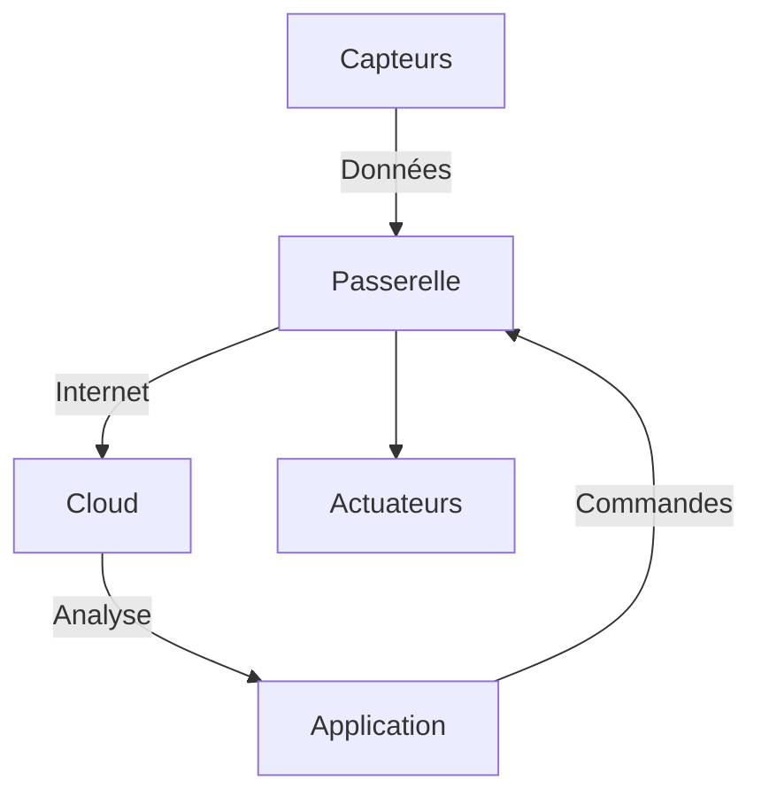

</v-click>

---

# L'IoT en chiffres

<div class="grid grid-cols-3 gap-4 mt-8">

<div class="text-center p-4 bg-blue-500 bg-opacity-20 rounded-lg">
  <div class="text-4xl font-bold text-blue-400">15+ milliards</div>
  <div class="text-sm mt-2">Appareils IoT en 2024</div>
</div>

<div class="text-center p-4 bg-green-500 bg-opacity-20 rounded-lg">
  <div class="text-4xl font-bold text-green-400">30+ milliards</div>
  <div class="text-sm mt-2">Prévus en 2030</div>
</div>

<div class="text-center p-4 bg-purple-500 bg-opacity-20 rounded-lg">
  <div class="text-4xl font-bold text-purple-400">1.5 trillion $</div>
  <div class="text-sm mt-2">Marché mondial 2030</div>
</div>

</div>

<v-click>

### Secteurs clés
- **Industriel** - Industrie 4.0, maintenance prédictive
- **Santé** - Monitoring patients, équipements médicaux
- **Agriculture** - Irrigation intelligente, suivi du bétail
- **Villes intelligentes** - Trafic, éclairage, déchets

</v-click>

---

# Défis de l'IoT

<div class="grid grid-cols-2 gap-8 mt-4">

<div>

### Techniques
- Alimentation et autonomie
- Connectivité dans zones reculées
- Interopérabilité des protocoles
- Traitement temps réel

</div>

<div>

### Sécurité
- Authentification des appareils
- Chiffrement des communications
- Mises à jour firmware
- Protection des données

</div>

</div>

<v-click>

<div class="mt-8 p-4 bg-yellow-500 bg-opacity-20 rounded-lg">

### Ce que vous apprendrez dans ce cours
Concevoir, programmer et déployer des objets connectés sécurisés en utilisant des protocoles modernes (MQTT, LoRa) et des outils professionnels (KiCad, Cloudflare).

</div>

</v-click>

---
layout: section
---

# Partie 2
## Présentation du plan de cours

---

# Informations générales

<div class="grid grid-cols-2 gap-8">

<div>

| | |
|---|---|
| **Code** | 243-4J5-LI |
| **Titre** | Objets connectés |
| **Pondération** | 2-3-2 |
| **Crédits** | 2.33 |
| **Session** | Hiver 2026 |

</div>

<div>

### Répartition hebdomadaire

- **2h** - Théorie en classe
- **3h** - Laboratoire pratique
- **2h** - Travail personnel

<v-click>

### Enseignant
**Francis Poisson**

</v-click>

</div>

</div>

---

# Capacités développées

<div class="grid grid-cols-2 gap-6 mt-4">

<div class="p-4 bg-blue-500 bg-opacity-20 rounded-lg">

### Capacité 1 (60%)
**Concevoir et programmer des objets connectés**

- Fondamentaux IoT et architectures
- Programmation Python pour IoT
- Interfaçage GPIO, capteurs, actuateurs
- Conception de PCB (KiCad)
- Traitement et visualisation de données

</div>

<div class="p-4 bg-green-500 bg-opacity-20 rounded-lg">

### Capacité 2 (40%)
**Maîtriser les protocoles de communication IoT**

- Protocole MQTT
- Configuration broker sécurisé
- Gestion QoS et authentification
- API REST et WebSocket
- Intégration LLM pour automatisation

</div>

</div>

---

# Structure du cours - 5 phases

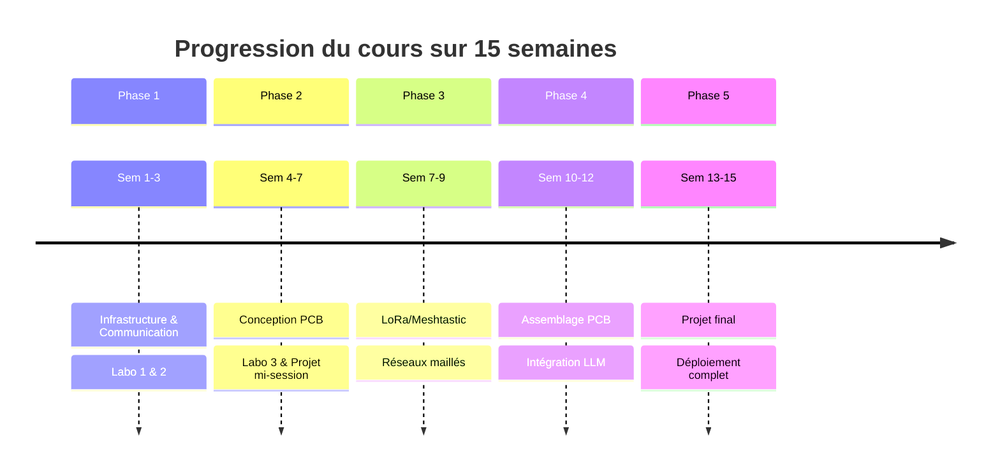

---

# Du breadboard au PCB

<div class="grid grid-cols-2 gap-6">

<div>

### En 243-2N5-LI

<v-clicks>

- Prototypes sur **breadboard**
- Fils volants partout
- Connexions **fragiles**
- Pas déployable sur le terrain

</v-clicks>

<v-click>

<div class="mt-2 p-2 bg-yellow-500 bg-opacity-20 rounded-lg text-sm">

Un breadboard, ça tombe en panne dès qu'on le bouge...

</div>

</v-click>

</div>

<div>

<v-click>

### En 243-4J5-LI

- Conception de **vrais PCB**
- Circuits **solides** et fiables
- **Déployables** sur le terrain
- Aspect **professionnel**

</v-click>

<v-click>

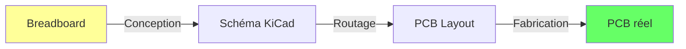

</v-click>

</div>

</div>

---

# KiCad - Conception de PCB

<div class="grid grid-cols-2 gap-6">

<div>

### Qu'est-ce que KiCad?

<v-clicks>

- Logiciel **open source** de conception PCB
- Utilisé par des **professionnels**
- Éditeur de **schémas** électriques
- Éditeur de **circuits imprimés**
- Visualisation **3D**

</v-clicks>

</div>

<div>

<v-click>

### Workflow KiCad

1. **Schéma** - Dessiner le circuit
2. **Symboles** - Choisir les composants
3. **Empreintes** - Associer les boîtiers
4. **Routage** - Tracer les pistes
5. **Gerber** - Exporter pour fabrication

</v-click>

<v-click>

<div class="mt-2 p-2 bg-blue-500 bg-opacity-20 rounded-lg text-sm">

**Phase 2** : Vous concevrez un PCB pour votre projet IoT!

</div>

</v-click>

</div>

</div>

---

# Pourquoi le PCB est crucial en IoT?

<div class="grid grid-cols-3 gap-4 mt-4">

<v-click>

<div class="p-3 bg-blue-500 bg-opacity-20 rounded-lg text-center">

### Fiabilité

Un capteur déployé **6 mois** sur le terrain ne peut pas avoir de fils qui se déconnectent

</div>

</v-click>

<v-click>

<div class="p-3 bg-green-500 bg-opacity-20 rounded-lg text-center">

### Reproductibilité

Fabriquer **100 unités** identiques serait impossible avec des breadboards

</div>

</v-click>

<v-click>

<div class="p-3 bg-purple-500 bg-opacity-20 rounded-lg text-center">

### Compacité

Un PCB peut être **10x plus petit** qu'un prototype breadboard

</div>

</v-click>

</div>

<v-click>

<div class="mt-6 p-3 bg-yellow-500 bg-opacity-20 rounded-lg text-center">

**Dans ce cours** : Vous passerez du prototype breadboard → schéma → PCB → assemblage → déploiement

</div>

</v-click>

---

# Évaluations sommatives

| Évaluation | Semaine | Cap. 1 | Cap. 2 | Total |
|-----------|:------:|:------:|:------:|:-----:|
| Laboratoire capteurs et Python | 3 | 15% | - | **15%** |
| Projet mi-session | 7 | 20% | 10% | **30%** |
| Laboratoire intégration LLM | 9 | 15% | 5% | **20%** |
| Projet final | 15 | 10% | 25% | **35%** |

<v-click>

<div class="mt-4 p-3 bg-red-500 bg-opacity-20 rounded-lg">

### Seuil de réussite
- **60%** note globale minimum
- Atteinte des capacités selon le jugement de l'enseignant

</div>

</v-click>

---

# Matériel requis

<div class="grid grid-cols-2 gap-6">

<div>

### Matériel fourni
- Raspberry Pi 5 + carte SD 64GB
- Écran tactile
- LilyGO A7670G (ESP32 + LTE)
- T-Beam SUPREME (LoRa)
- Carte SIM avec données
- Composants électroniques

</div>

<div>

### À votre charge
- Compte Claude/Gemini/ChatGPT (~30$/mois)
- Compte Cloudflare (gratuit)
- Nom de domaine (~15$/an)

</div>

</div>

<v-click>

<div class="mt-6 p-3 bg-yellow-500 bg-opacity-20 rounded-lg">

⚠️ **Important**: Vous êtes responsable du matériel prêté. Tout dommage ou perte sera facturé.

</div>

</v-click>

---

# Règles de fonctionnement

<div class="grid grid-cols-2 gap-6">

<div>

### En laboratoire
- Pas de nourriture près des ordinateurs
- Comportement respectueux
- Appareils pour usage pédagogique uniquement
- Téléphones en mode silencieux
- Rangement du poste de travail

</div>

<div>

### Travaux et remises
- **-10%** par jour de retard
- Maximum 5 jours de retard
- Qualité du français évaluée
- Pas de plagiat (tolérance zéro)

</div>

</div>

---
layout: section
---

# Partie 3
## Construire notre environnement IoT

<div class="text-lg mt-4 opacity-80">
Chaque outil résout un problème... qui en crée un nouveau
</div>

---

# Retour sur 243-2N5-LI

<div class="text-xl text-center mb-6">

En **Communication numérique**, vous avez programmé des ESP32...

</div>

<div class="grid grid-cols-2 gap-6">

<div>

### Comment faisiez-vous?

<v-clicks>

- **Arduino IDE** sur votre laptop
- ESP32 branché en **USB direct**
- Questions à **ChatGPT/Claude.ai** dans le navigateur
- Copier-coller le code généré

</v-clicks>

</div>

<div>

<v-click>

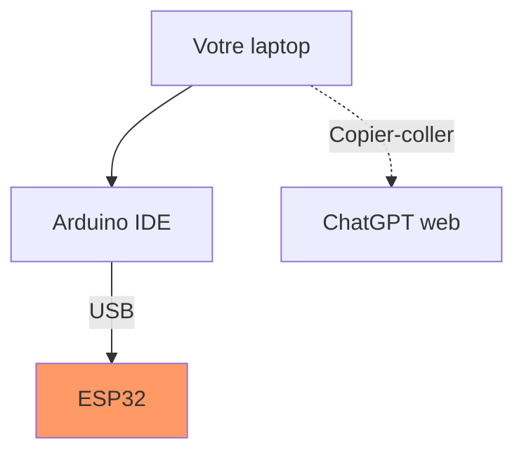

</v-click>

</div>

</div>

---

# Questions pour vous

<div class="grid grid-cols-2 gap-8">

<div class="p-4 bg-blue-500 bg-opacity-20 rounded-lg">

### Avez-vous déjà vécu ça?

<v-clicks>

- 🔌 "J'ai oublié mon ESP32 à la maison..."
- 📋 Copier-coller entre ChatGPT et l'IDE
- 🤔 "C'est quelle version du code qui marchait?"
- 🔄 Re-expliquer le contexte à chaque question
- 💥 "Mon code marchait hier, plus maintenant!"

</v-clicks>

</div>

<div class="p-4 bg-yellow-500 bg-opacity-20 rounded-lg">

<v-click>

### Limitations de cette approche

- L'ESP32 doit être **physiquement présent**
- Pas d'**historique** des modifications
- L'IA **perd le contexte** entre les messages
- Pas de **travail d'équipe** possible
- **Dépendant** de votre laptop

</v-click>

</div>

</div>

---

# Ce semestre : On passe au niveau supérieur

<div class="grid grid-cols-2 gap-4">

<div>

### Avant (243-2N5-LI)

| Aspect | Méthode |
|--------|---------|
| IDE | Arduino IDE (GUI) |
| Connexion | USB direct |
| IA | Chat web (copier-coller) |
| Versions | Aucune gestion |
| Lieu | Au Cégep seulement |

</div>

<div>

<v-click>

### Maintenant (243-4J5-LI)

| Aspect | Méthode |
|--------|---------|
| IDE | Arduino CLI + IA |
| Connexion | SSH distant |
| IA | CLI intégré au projet |
| Versions | Git |
| Lieu | N'importe où! |

</v-click>

</div>

</div>

<v-click>

<div class="mt-4 p-3 bg-green-500 bg-opacity-20 rounded-lg text-center">

**Objectif** : Travailler comme un professionnel IoT, pas comme un étudiant en labo

</div>

</v-click>

---

# Le défi du cours

<div class="grid grid-cols-2 gap-6">

<div>

### Ce qu'on veut faire

<v-clicks>

- Programmer un **microcontrôleur** (LilyGO)
- Le déployer sur un **site distant**
- Le mettre à jour **sans y aller physiquement**
- Travailler **efficacement** en équipe

</v-clicks>

</div>

<div>

<v-click>

### Le problème

On ne peut pas brancher un câble USB à travers Internet...

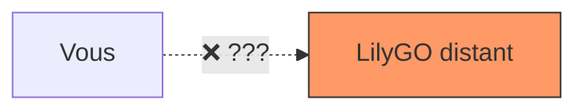

</v-click>

<v-click>

**Comment faire?**

</v-click>

</div>

</div>

---

# Solution : Une station relais

<div class="text-center mb-4">

On place un **Raspberry Pi** sur le site distant

</div>


<v-click>

<div class="mt-4 p-3 bg-blue-500 bg-opacity-20 rounded-lg">

Le RPi devient notre **station de programmation distante** : on s'y connecte, et lui programme le LilyGO via USB.

</div>

</v-click>

<v-click>

<div class="mt-2 text-center text-lg">

**Nouveau problème** : Comment se connecter au RPi à travers Internet?

</div>

</v-click>

---

# Objectif du Labo 1

<div class="text-xl mb-6">

Mettre en place un **environnement de développement distant** sur Raspberry Pi 5 et programmer le **LilyGO A7670G**

</div>

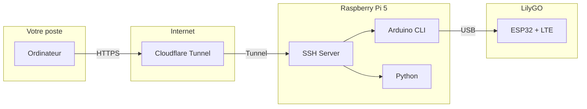

---

# Architecture du système

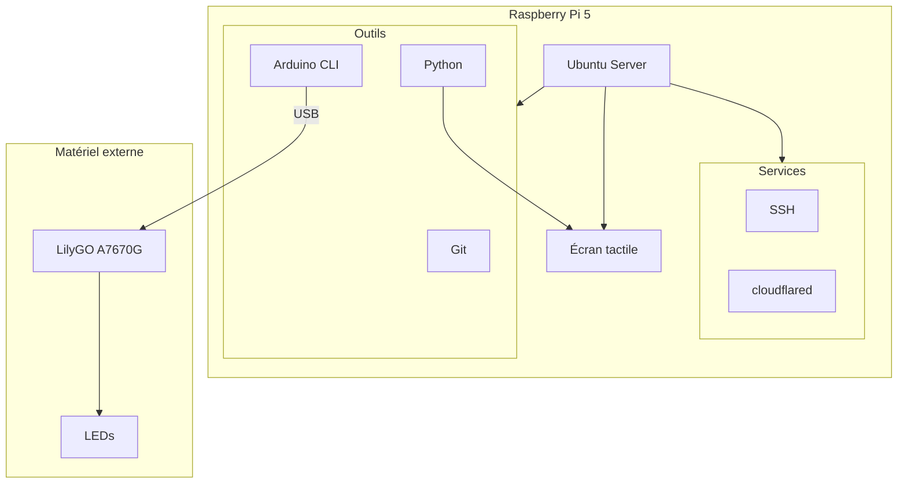

---
layout: two-cols
---

# Ubuntu Server vs Desktop

### Pourquoi Server?

<v-click>

- **Ressources minimales** - Pas de GUI

</v-click>

<v-click>

- **Optimisé serveur** - Stable, sécurisé

</v-click>

<v-click>

- **Administration distante** - SSH natif

</v-click>

::right::

<v-click>

### Comparaison

| | Desktop | Server |
|---|:---:|:---:|
| RAM | ~1.5 GB | ~300 MB |
| Disque | ~8 GB | ~2 GB |
| Services | 150+ | 50 |

</v-click>

<v-click>

```bash
# Vérifier les ressources
free -h
df -h
```

</v-click>

---

# Configuration réseau - Netplan

<div class="grid grid-cols-2 gap-4">

<div>

### Qu'est-ce que Netplan?

Outil de configuration réseau Ubuntu utilisant des fichiers YAML.

```yaml
network:
  version: 2
  ethernets:
    eth0:
      dhcp4: true
  wifis:
    wlan0:
      access-points:
        "MonWiFi":
          password: "motdepasse"
      dhcp4: true
```

</div>

<div>

<v-click>

### Commandes essentielles

```bash
# Appliquer la configuration
sudo netplan apply

# Tester avant d'appliquer
sudo netplan try

# Debug
sudo netplan --debug apply
```

</v-click>

</div>

</div>

---

# Problème 1 : Se connecter au RPi

<div class="text-center text-xl mb-6">

Le RPi est sur un réseau distant. Comment y accéder de façon **sécurisée**?

</div>

<v-click>

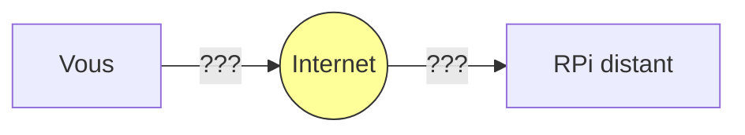

</v-click>

<v-click>

<div class="mt-4 p-3 bg-green-500 bg-opacity-20 rounded-lg text-center">

**Solution** : SSH (Secure Shell) - Le protocole standard pour l'administration distante

</div>

</v-click>

---

# SSH - Secure Shell

<div class="grid grid-cols-2 gap-6">

<div>

### Principe

Protocole de communication sécurisé pour:
- Connexion distante
- Transfert de fichiers
- Tunneling de ports

```bash
# Connexion basique
ssh user@192.168.1.100

# Avec clé privée
ssh -i ~/.ssh/ma_cle user@host

# Copie de fichiers
scp fichier.txt user@host:/chemin/
```

</div>

<div>

<v-click>

### Authentification par clés

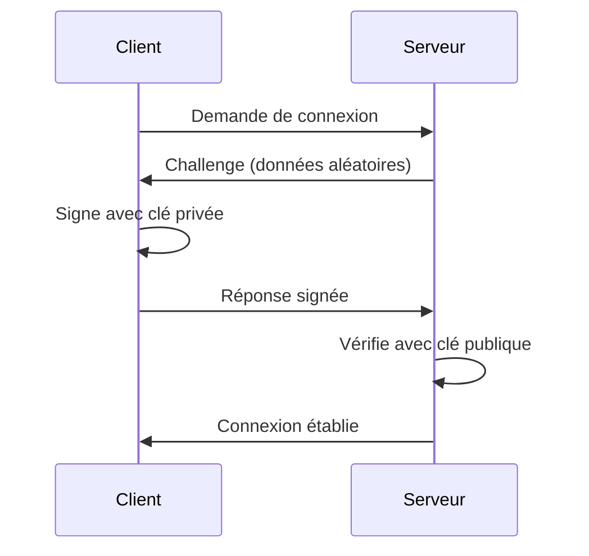

</v-click>

</div>

</div>

---

# Problème 2 : Pas d'IP publique

<div class="grid grid-cols-2 gap-6">

<div>

### SSH fonctionne, mais...

<v-clicks>

- Le RPi est derrière un **routeur/NAT**
- Pas d'**IP publique fixe**
- Le Cégep/entreprise **bloque les ports**
- Configuration réseau **complexe**

</v-clicks>

</div>

<div>

<v-click>

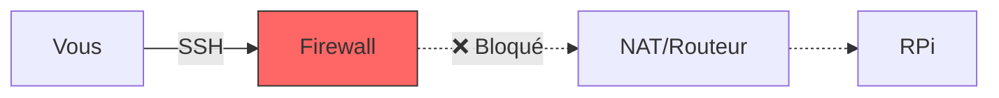

</v-click>

<v-click>

<div class="mt-2 p-2 bg-green-500 bg-opacity-20 rounded-lg text-center text-sm">

**Solution** : Cloudflare Tunnel - Connexion sortante qui contourne le NAT

</div>

</v-click>

</div>

</div>

---

# Cloudflare Tunnel

### Comment ça résout le problème?

Le tunnel est initié **depuis le RPi** (connexion sortante = autorisée), puis Cloudflare route le trafic vers lui.

<v-click>

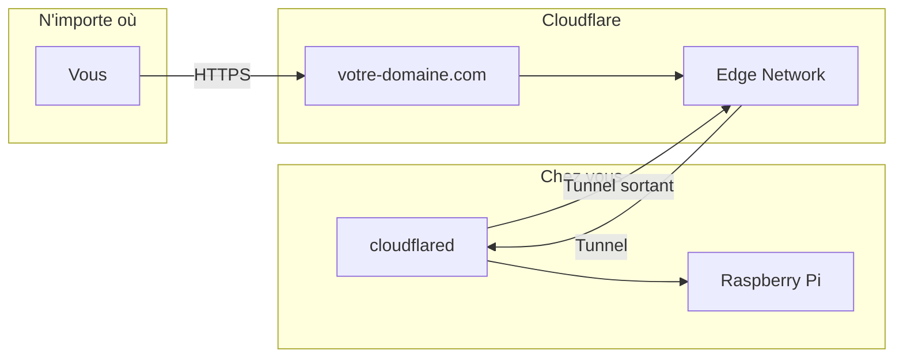

</v-click>

---

# Cloudflare Zero Trust

### Sécurité renforcée

<div class="grid grid-cols-2 gap-6">

<div>

**Sans Zero Trust**
- URL publique accessible à tous
- Seul le mot de passe SSH protège

**Avec Zero Trust**
- Authentification supplémentaire
- Politique d'accès par email/domaine
- Journalisation des accès

</div>

<div>

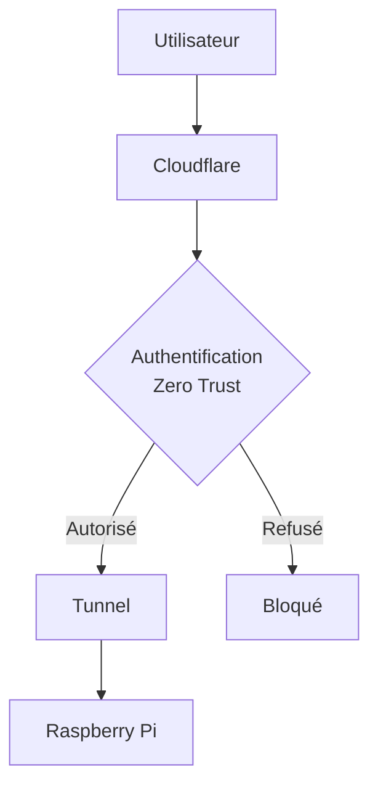

</div>

</div>

---

# Problème 3 : Synchroniser le code

<div class="grid grid-cols-2 gap-6">

<div>

### On peut se connecter, mais...

<v-clicks>

- Je code sur mon **laptop**
- Le code doit aller sur le **RPi**
- Comment **transférer** les fichiers?
- Comment gérer les **versions**?

</v-clicks>

</div>

<div>

<v-click>

### Options?

| Méthode | Problème |
|---------|----------|
| Clé USB | Pas pratique à distance |
| Email | Confusion de versions |
| scp | Pas d'historique |

</v-click>

<v-click>

<div class="mt-2 p-2 bg-green-500 bg-opacity-20 rounded-lg text-center text-sm">

**Solution** : Git - Versionnage + synchronisation

</div>

</v-click>

</div>

</div>

---

# Git - Contrôle de version

<div class="grid grid-cols-2 gap-6">

<div>

### Pourquoi Git?

<v-clicks>

- **Historique** - Chaque modification est sauvegardée
- **Collaboration** - Travail en équipe sans conflits
- **Sécurité** - Retour arrière possible à tout moment
- **Branches** - Expérimenter sans casser le code

</v-clicks>

</div>

<div>

<v-click>

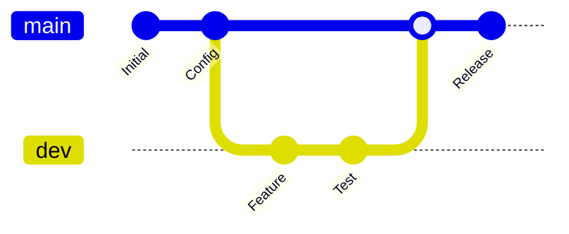

</v-click>

</div>

</div>

---

# Git - Concepts de base

<div class="grid grid-cols-3 gap-4 mt-4">

<v-click>

<div class="p-4 bg-blue-500 bg-opacity-20 rounded-lg text-center">

### Repository
Dossier contenant votre projet et son historique

```bash
git init
git clone <url>
```

</div>

</v-click>

<v-click>

<div class="p-4 bg-green-500 bg-opacity-20 rounded-lg text-center">

### Commit
Point de sauvegarde dans l'historique

```bash
git add .
git commit -m "message"
```

</div>

</v-click>

<v-click>

<div class="p-4 bg-purple-500 bg-opacity-20 rounded-lg text-center">

### Branch
Ligne de développement parallèle

```bash
git branch ma-feature
git checkout ma-feature
```

</div>

</v-click>

</div>

---

# Git - Pourquoi c'est essentiel pour l'IoT?

<div class="grid grid-cols-2 gap-4">

<div>

<v-click>

### Scénario réel

1. Vous codez sur votre **laptop** à la maison
2. Vous **push** vers GitHub
3. Sur le **RPi distant**, vous **pull** le code
4. Vous flashez le **LilyGO** via Arduino CLI
5. Bug! Vous faites un **rollback** vers la version précédente

</v-click>

</div>

<div>

<v-click>

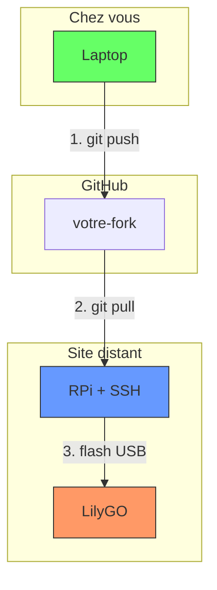

</v-click>

</div>

</div>

<v-click>

<div class="mt-2 p-2 bg-blue-500 bg-opacity-20 rounded-lg text-sm">

**Sans Git?** Clé USB, copier-coller, confusion de versions, perte de code...

</div>

</v-click>

---

# Git - Autre scénario : expérimentation

<div class="grid grid-cols-2 gap-4">

<div>

<v-click>

### Tester sans risque

Vous voulez essayer un nouveau protocole LoRa mais sans casser le code qui fonctionne.

</v-click>

<v-click>

```bash
# Créer une branche de test
git checkout -b test-lora-sf12

# Expérimenter...
# Si ça marche pas:
git checkout main  # Retour au code stable

# Si ça marche:
git merge test-lora-sf12
```

</v-click>

</div>

<div>

<v-click>

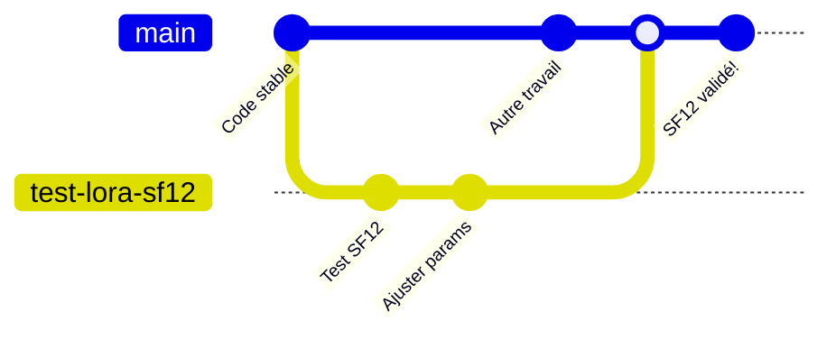

</v-click>

</div>

</div>

---

# Git - Autre scénario : récupération

<div class="grid grid-cols-2 gap-4">

<div>

<v-click>

### La carte SD du RPi est corrompue!

Sans Git :
- Tout est perdu
- Recommencer de zéro

</v-click>

<v-click>

Avec Git :
1. Réinstaller Ubuntu sur nouvelle SD
2. `git clone` votre fork
3. Tout votre code est récupéré!

</v-click>

</div>

<div>

<v-click>

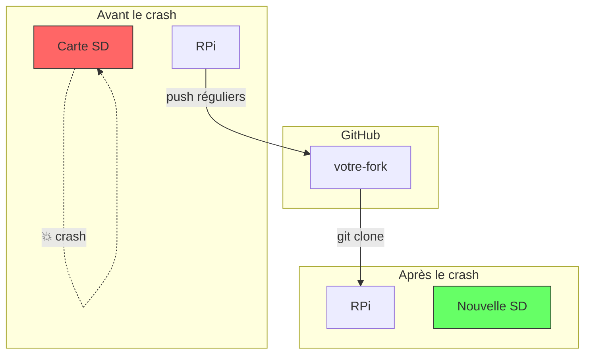

</v-click>

</div>

</div>

<v-click>

<div class="mt-2 p-2 bg-green-500 bg-opacity-20 rounded-lg text-sm">

**Leçon** : Faites des `git push` régulièrement = sauvegarde automatique dans le cloud!

</div>

</v-click>

---

# Git - Workflow quotidien

```bash {1-2|4-5|7-8|10-11|13-14|all}
# 1. Récupérer les dernières modifications
git pull origin main

# 2. Voir ce qui a changé
git status

# 3. Ajouter vos modifications
git add .

# 4. Créer un commit
git commit -m "Ajout interface tactile"

# 5. Envoyer vers GitHub
git push origin ma-branche
```

---

# Git - Qu'est-ce qu'un Fork?

<div class="grid grid-cols-2 gap-6">

<div>

<v-clicks>

- **Fork** = Copie complète d'un repo sur votre compte GitHub
- Vous devenez **propriétaire** de cette copie
- Indépendant du repo original
- Permet de modifier sans affecter l'original

</v-clicks>

<v-click>

### Fork vs Clone

| Fork | Clone |
|------|-------|
| Copie sur GitHub | Copie locale |
| Votre compte | Votre PC/RPi |
| Via interface web | Via `git clone` |

</v-click>

</div>

<div>

<v-click>

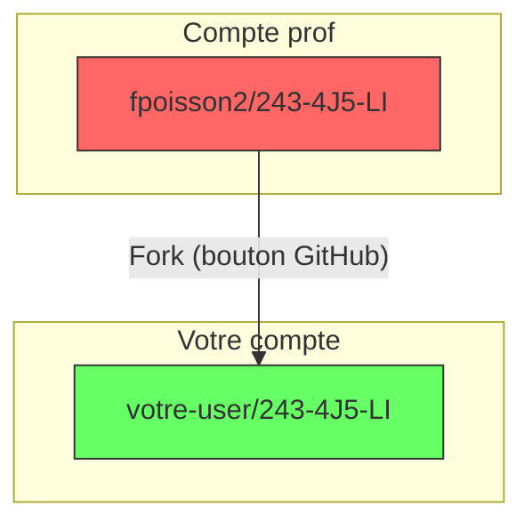

</v-click>

</div>

</div>

---

# Git - Fork et workflow

<div class="grid grid-cols-2 gap-6">

<div>

### Workflow du cours

<v-clicks>

1. **Fork** le repo du cours sur GitHub
2. **Clone** votre fork sur le RPi
3. **Travaillez** sur votre copie
4. **Push** vers votre fork

</v-clicks>

<v-click>

```bash
# Cloner VOTRE fork
git clone https://github.com/
  VOTRE-USER/243-4J5-LI.git
```

</v-click>

</div>

<div>

<v-click>

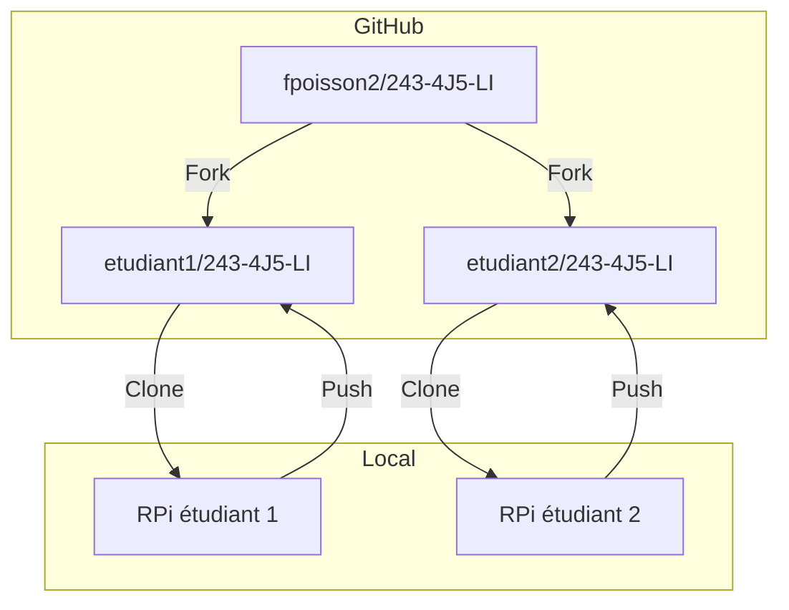

</v-click>

</div>

</div>

---

# Git - Synchroniser avec l'original

<div class="grid grid-cols-2 gap-6">

<div>

### Pourquoi synchroniser?

<v-clicks>

- Le prof ajoute du nouveau contenu
- Corrections ou mises à jour
- Garder votre fork à jour

</v-clicks>

<v-click>

```bash
# 1. Ajouter le repo original (une seule fois)
git remote add upstream
  https://github.com/fpoisson2/243-4J5-LI.git

# 2. Récupérer les mises à jour
git fetch upstream

# 3. Fusionner dans votre branche
git merge upstream/main
```

</v-click>

</div>

<div>

<v-click>

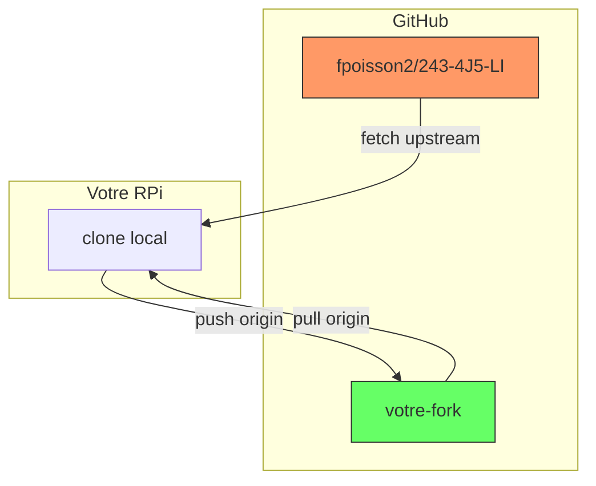

</v-click>

<v-click>

### Deux "remotes"
- **origin** = votre fork (push)
- **upstream** = repo prof (pull)

</v-click>

</div>

</div>

---

# Problème 5 : Compiler et flasher le code

<div class="grid grid-cols-2 gap-6">

<div>

### L'IA a écrit le code, mais...

<v-clicks>

- Comment **compiler** pour ESP32?
- Comment **téléverser** sur le LilyGO?
- Pas d'Arduino IDE sur le RPi...
- Interface graphique = impossible via SSH

</v-clicks>

</div>

<div>

<v-click>

<div class="p-2 bg-green-500 bg-opacity-20 rounded-lg text-center">

**Solution** : Arduino CLI

Toutes les fonctions de l'Arduino IDE... en ligne de commande!

</div>

</v-click>

</div>

</div>

---

# Arduino CLI

### Pourquoi Arduino CLI?

Permet de compiler et téléverser du code Arduino **sans interface graphique**.

```bash
# Installer une plateforme
arduino-cli core install esp32:esp32

# Compiler un sketch
arduino-cli compile --fqbn esp32:esp32:esp32 MonSketch/

# Téléverser
arduino-cli upload -p /dev/ttyUSB0 --fqbn esp32:esp32:esp32 MonSketch/

# Moniteur série
arduino-cli monitor -p /dev/ttyUSB0 -b 115200
```

<v-click>

### Avantages
- **Scriptable** - Automatisation possible
- **Léger** - Pas besoin de GUI
- **CI/CD** - Intégration continue

</v-click>

---

# Problème 4 : Coder efficacement en terminal

<div class="grid grid-cols-2 gap-6">

<div>

### On a tout configuré, mais...

<v-clicks>

- On travaille via **SSH** (terminal)
- Pas d'**IDE graphique** (VS Code...)
- Écrire du code en **ligne de commande**?
- Chercher la doc des **GPIO/API**?

</v-clicks>

</div>

<div>

<v-click>

```bash
# Votre quotidien via SSH...
nano sketch.ino
# 😰 Écrire du code ESP32 dans nano?
```

</v-click>

<v-click>

<div class="mt-2 p-2 bg-green-500 bg-opacity-20 rounded-lg text-center text-sm">

**Solution** : Assistants IA en CLI - Ils codent pour vous!

</div>

</v-click>

</div>

</div>

---

# Assistants IA : Chat web vs CLI

<div class="grid grid-cols-2 gap-4">

<div>

### Chat web (ChatGPT, Claude.ai...)

<v-click>

1. Copier le code dans le chat
2. Poser la question
3. Copier la réponse
4. Coller dans le fichier
5. Tester... erreur!
6. Recopier l'erreur dans le chat
7. Répéter...

</v-click>

<v-click>

<div class="mt-2 p-2 bg-red-500 bg-opacity-20 rounded-lg text-sm">

❌ Lent, copier-coller, perte de contexte

</div>

</v-click>

</div>

<div>

### CLI (Claude Code, Gemini CLI...)

<v-click>

1. Lancer l'outil dans le projet
2. Poser la question
3. L'outil modifie les fichiers
4. Tester... erreur!
5. "Corrige cette erreur"
6. L'outil corrige directement

</v-click>

<v-click>

<div class="mt-2 p-2 bg-green-500 bg-opacity-20 rounded-lg text-sm">

✓ Contexte complet, édition directe, via SSH

</div>

</v-click>

</div>

</div>

---

# Les assistants de code IA - Outils

<div class="grid grid-cols-2 gap-4">

<div>

### Outils en ligne de commande

<v-clicks>

| Outil | Fournisseur |
|-------|-------------|
| **Claude Code** | Anthropic |
| **Codex CLI** | OpenAI |
| **Gemini CLI** | Google |
| **Aider** | Open source |
| **OpenCode** | Open source |

</v-clicks>

</div>

<div>

<v-click>

### Pourquoi en CLI?

- Fonctionne via **SSH** sur le RPi
- Pas besoin d'interface graphique
- **Contexte du projet** automatique
- Édition de fichiers directe
- Exécution de commandes

</v-click>

</div>

</div>

<v-click>

<div class="mt-2 p-2 bg-blue-500 bg-opacity-20 rounded-lg text-sm">

**Dans ce cours** : Vous utiliserez ces outils pour accélérer le développement sur le RPi distant

</div>

</v-click>

---

# Claude Code - Exemple concret

<div class="grid grid-cols-2 gap-4">

<div>

### Scénario

Vous êtes connecté en SSH au RPi et voulez créer un sketch Arduino pour le LilyGO.

<v-click>

```bash
# Lancer Claude Code dans le projet
cd ~/243-4J5-LI
claude

# Demander à Claude
> Crée un sketch Arduino pour faire
  clignoter la LED sur GPIO 32 du
  LilyGO A7670G
```

</v-click>

</div>

<div>

<v-click>

### Claude va :

1. Créer le fichier `.ino`
2. Écrire le code approprié
3. Proposer de compiler :

```bash
arduino-cli compile \
  --fqbn esp32:esp32:esp32 \
  MonSketch/
```

4. Proposer de téléverser :

```bash
arduino-cli upload \
  -p /dev/ttyUSB0 \
  --fqbn esp32:esp32:esp32 \
  MonSketch/
```

</v-click>

</div>

</div>

---

# Claude Code - Débogage

<div class="grid grid-cols-2 gap-4">

<div>

### Erreur de compilation?

```bash
> La compilation échoue avec
  "GPIO 32 not available"
```

<v-click>

Claude va :
- Analyser l'erreur
- Consulter la doc du LilyGO
- Proposer un GPIO alternatif
- Modifier le code automatiquement

</v-click>

</div>

<div>

<v-click>

### Avantages pour l'IoT

- **Pas besoin de chercher** la doc des GPIO
- **Génération de code** adapté au matériel
- **Débogage assisté** des erreurs
- Apprentissage **interactif**

</v-click>

<v-click>

<div class="mt-4 p-2 bg-yellow-500 bg-opacity-20 rounded-lg text-sm">

⚠️ **Important** : Toujours vérifier le code généré avant de l'exécuter sur du matériel!

</div>

</v-click>

</div>

</div>

---

# LilyGO A7670G

<div class="grid grid-cols-2 gap-6">

<div>

### Caractéristiques

| Composant | Spécification |
|-----------|---------------|
| MCU | ESP32 |
| Modem | A7670G LTE Cat-1 |
| GPS | Intégré |
| Connectivité | WiFi, Bluetooth, LTE |

### Cas d'utilisation
- Communication cellulaire
- Géolocalisation
- IoT mobile

</div>

<div>

### GPIO utilisés

| Composant | GPIO | Note |
|-----------|------|------|
| LED Rouge | 32 | + résistance 220Ω |
| LED Verte | 33 | + résistance 220Ω |
| Bouton 1 | 34 | Pull-up interne |
| Bouton 2 | 35 | Pull-up interne |

</div>

</div>

---

# Récapitulatif : La chaîne complète

<div class="text-sm">

| Problème | Solution | Résultat |
|----------|----------|----------|
| Programmer un appareil distant | **Raspberry Pi** comme relais | Station sur le site |
| Se connecter au RPi | **SSH** | Accès terminal sécurisé |
| Pas d'IP publique | **Cloudflare Tunnel** | Accès depuis partout |
| Synchroniser le code | **Git + GitHub** | Versionnage et transfert |
| Coder efficacement en terminal | **Claude Code / IA CLI** | Assistance intelligente |
| Compiler/flasher sans GUI | **Arduino CLI** | IDE en ligne de commande |

</div>

<v-click>

```mermaid {scale: 0.5}
graph LR
    A[Laptop] -->|Git push| B[GitHub]
    B -->|Git pull| C[RPi]
    C -->|Arduino CLI| D[LilyGO]
    A -.->|SSH via Cloudflare| C
    A -.->|Claude Code| C

    style A fill:#6f6
    style C fill:#69f
    style D fill:#f96
```

</v-click>

---

# Travail de la semaine

<div class="grid grid-cols-2 gap-6">

<div>

### À faire en laboratoire

1. Installer Ubuntu Server sur SD
2. Configuration réseau WiFi
3. Installation des outils:
   - Git, Node.js, Python
   - Arduino CLI
4. Configuration SSH
5. Mise en place Cloudflare Tunnel

</div>

<div>

### Pour la semaine prochaine

- Terminer la configuration de base
- Tester l'accès distant
- Premier test avec LilyGO:
  - Compilation
  - Téléversement
  - Communication série

</div>

</div>

<v-click>

<div class="mt-4 p-3 bg-blue-500 bg-opacity-20 rounded-lg">

📚 **Documentation**: Suivez le guide `Labo1-environnement de programmation distant sur rPi.md`

</div>

</v-click>

---
layout: center
class: text-center
---

# Questions?

<div class="text-xl mt-8">
Semaine prochaine: Introduction à MQTT et début du Labo 2
</div>

---
layout: end
---

# Merci!

243-4J5-LI - Objets connectés

Semaine 1
