# Objets connectés
## 243-4J5-LI

Semaine 3 - Communication LTE et sécurité IoT

<div class="pt-12">
  <span class="px-2 py-1 rounded cursor-pointer" hover="bg-white bg-opacity-10">
    Francis Poisson - Cégep Limoilou - H26
  </span>
</div>

---
layout: section
---

# Récapitulatif
## Notre chaîne IoT jusqu'ici

---

# Les semaines précédentes

<div class="grid grid-cols-2 gap-4">

<div>

### Semaine 1 : Infrastructure

<v-clicks>

- RPi comme station distante
- SSH + Cloudflare Tunnel
- Git pour synchroniser
- Claude Code pour coder
- Arduino CLI pour compiler

</v-clicks>

</div>

<div>

### Semaine 2 : Communication

<v-clicks>

- MQTT pour échanger des données
- Mosquitto comme broker
- WebSocket via Cloudflare
- WiFi Enterprise (WPA-EAP)

</v-clicks>

</div>

</div>

<v-click>

<div class="mt-4 p-2 bg-green-500 bg-opacity-20 rounded-lg text-center">

On peut **programmer** à distance et **communiquer** via WiFi!

</div>

</v-click>

---

# Mais il reste un problème...

<div class="grid grid-cols-2 gap-6">

<div>

### Le WiFi a ses limites

<v-clicks>

- Portée **~100 mètres** maximum
- Nécessite une **infrastructure**
- Pas de **mobilité** réelle
- Zones rurales = **aucun WiFi**

</v-clicks>

<v-click>

**Et si notre capteur est sur un tracteur? Dans une forêt? Sur un camion de livraison?**

</v-click>

</div>

<div>

<v-click>

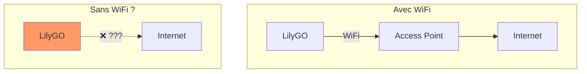

</v-click>

<v-click>

<div class="mt-2 p-2 bg-green-500 bg-opacity-20 rounded-lg text-center text-sm">

**Solution** : Communication cellulaire LTE

Le réseau mobile est partout!

</div>

</v-click>

</div>

</div>

---

# Notre chaîne s'enrichit encore

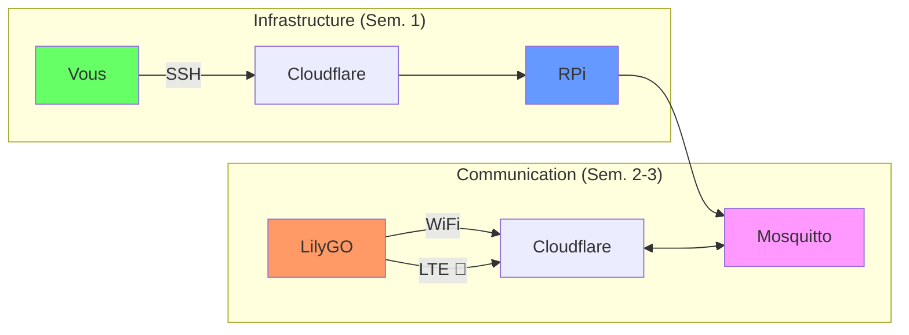

<v-click>

<div class="mt-4 p-3 bg-blue-500 bg-opacity-20 rounded-lg text-center">

**Cette semaine** : Ajouter le LTE pour que le LilyGO fonctionne **n'importe où**!

</div>

</v-click>

---
layout: section
---

# Partie 1
## Communication cellulaire LTE

---

# Pourquoi la communication cellulaire?

<div class="grid grid-cols-2 gap-6">

<div>

### Limitations du WiFi

- ❌ Portée limitée (~100m)
- ❌ Dépendant d'infrastructure
- ❌ Pas de mobilité réelle
- ❌ Congestion en zones denses

</div>

<div>

### Avantages LTE

- ✅ Couverture étendue (km)
- ✅ Mobilité complète
- ✅ Infrastructure existante
- ✅ Fiabilité opérateur

</div>

</div>

<v-click>

### Cas d'utilisation IoT

| Application | Pourquoi LTE? |
|-------------|---------------|
| Véhicules connectés | Mobilité constante |
| Agriculture | Zones sans WiFi |
| Logistique | Suivi en temps réel |
| Urgence | Indépendance réseau local |

</v-click>

---

# Catégories LTE pour IoT

<div class="mt-4">

| Catégorie | Débit descendant | Débit montant | Usage |
|-----------|:----------------:|:-------------:|-------|
| **Cat-1** | 10 Mbps | 5 Mbps | IoT général |
| Cat-M1 (LTE-M) | 1 Mbps | 1 Mbps | Wearables, trackers |
| NB-IoT | 250 kbps | 250 kbps | Capteurs statiques |
| Cat-4 | 150 Mbps | 50 Mbps | Routeurs, caméras |
| Cat-6 à Cat-18 | 300-1200 Mbps | 50-150 Mbps | **Téléphones** |

</div>

<v-click>

### LilyGO A7670G - Cat-1

- **Idéal pour**: Communication bidirectionnelle régulière
- **Avantages**: Bonne bande passante, latence acceptable, **faible consommation**
- **Consommation**: ~200mA (vs ~500mA+ pour Cat-6)

</v-click>

---

# Architecture du modem A7670G

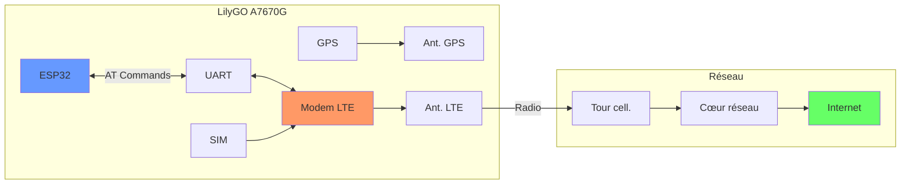

---

# Commandes AT - Hayes Command Set

### Communication avec le modem

<div class="grid grid-cols-2 gap-4">

<div>

### Commandes de base

```
AT              → OK (test connexion)
ATI             → Info modem
AT+CPIN?        → État SIM
AT+CSQ          → Force signal
AT+CREG?        → État réseau
AT+CGATT?       → Attachement GPRS
```

</div>

<div>

### Commandes données

```
AT+CGDCONT=1,"IP","APN"  → Config APN
AT+CGACT=1,1             → Activer PDP
AT+CIPSTART="TCP",...    → Connexion TCP
AT+CIPSEND               → Envoyer données
AT+CIPCLOSE              → Fermer connexion
```

</div>

</div>

<v-click>

### Exemple de dialogue

```
ESP32: AT+CSQ
Modem: +CSQ: 18,0    (signal: 18/31 = bon)
       OK
```

</v-click>

---

# Configuration APN

### Access Point Name

L'APN est le point d'entrée vers le réseau de données de l'opérateur.

<div class="grid grid-cols-2 gap-6 mt-4">

<div>

### APN courants

| Opérateur | APN |
|-----------|-----|
| Rogers/Fizz | ltemobile.apn |
| Bell | pda.bell.ca |
| Telus | sp.telus.com |
| **Hologram** | hologram |
| **Soracom** | soracom.io |

</div>

<div>

### Fournisseurs IoT

<v-click>

| Service | Avantage |
|---------|----------|
| **Hologram** | SIM globale 200+ pays |
| **Soracom** | Console cloud intégrée |
| **Twilio** | API programmable |

Ces services offrent des **SIM multi-opérateurs** idéales pour l'IoT!

</v-click>

</div>

</div>

---

# Configuration APN dans le code

<div class="grid grid-cols-2 gap-6">

<div>

### Configuration de base

```cpp
// Définir l'APN
sendATCommand("AT+CGDCONT=1,\"IP\",\"ltemobile.apn\"");

// Activer le contexte PDP
sendATCommand("AT+CGACT=1,1");

// Vérifier l'IP assignée
sendATCommand("AT+CGPADDR=1");
// +CGPADDR: 1,"10.45.128.xxx"
```

</div>

<div>

### Avec Hologram

```cpp
// APN Hologram (pas d'auth requise)
sendATCommand("AT+CGDCONT=1,\"IP\",\"hologram\"");

// Activer
sendATCommand("AT+CGACT=1,1");
```

<v-click>

<div class="mt-2 p-2 bg-blue-500 bg-opacity-20 rounded-lg text-sm">

**Avantage Hologram** : Même SIM fonctionne partout dans le monde!

</div>

</v-click>

</div>

</div>

---

# Force du signal - CSQ et RSSI

### Interprétation de AT+CSQ

```
AT+CSQ
+CSQ: <rssi>,<ber>
```

| CSQ | RSSI (dBm) | Qualité |
|:---:|:----------:|---------|
| 0 | -113 ou moins | Aucun signal |
| 1-9 | -111 à -95 | Marginal |
| 10-14 | -93 à -85 | Acceptable |
| 15-19 | -83 à -75 | Bon |
| 20-30 | -73 à -53 | Excellent |
| 31 | -51 ou plus | Maximum |

<v-click>

### Dans votre code

```cpp
int getSignalStrength() {
    String response = sendATCommand("AT+CSQ");
    // Parser "+CSQ: XX,Y"
    int csq = parseCSQ(response);
    int rssi_dbm = (csq == 99) ? 0 : (-113 + 2 * csq);
    return rssi_dbm;
}
```

</v-click>

---

# Carte SIM et sécurité

<div class="grid grid-cols-2 gap-6">

<div>

### Identifiants SIM

| ID | Description |
|----|-------------|
| **ICCID** | Numéro de la carte physique |
| **IMSI** | Identité abonné (opérateur) |
| **IMEI** | Identité du modem |
| **PIN** | Code de protection |
| **PUK** | Code de déblocage |

</div>

<div>

### Commandes SIM

```cpp
// Vérifier état SIM
AT+CPIN?
// +CPIN: READY (OK)
// +CPIN: SIM PIN (besoin PIN)
// +CPIN: SIM PUK (bloquée)

// Entrer le PIN
AT+CPIN="1234"

// Lire ICCID
AT+CCID
// +CCID: 8901260...
```

</div>

</div>

---

# Processus de connexion LTE

<div class="grid grid-cols-2 gap-4">

<div>

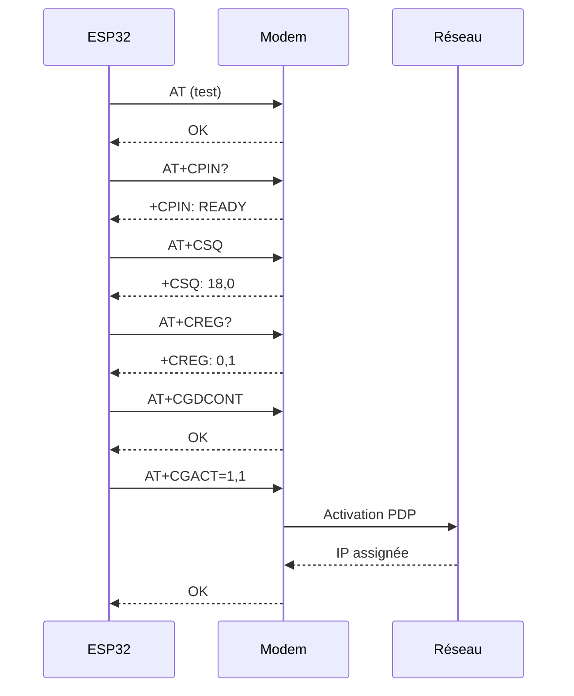

</div>

<div>

### Étapes de connexion

1. **Test** : `AT` → `OK`
2. **SIM** : `AT+CPIN?` → `READY`
3. **Signal** : `AT+CSQ` → force
4. **Réseau** : `AT+CREG?` → enregistré
5. **APN** : `AT+CGDCONT` → config
6. **Activation** : `AT+CGACT` → IP

<v-click>

<div class="mt-2 p-2 bg-green-500 bg-opacity-20 rounded-lg text-sm">

Une fois l'IP obtenue, on peut établir des connexions TCP/UDP!

</div>

</v-click>

</div>

</div>

---

# On communique de partout... mais est-ce sécurisé?

<div class="grid grid-cols-2 gap-6">

<div>

### Ce qu'on a construit

<v-clicks>

- Communication WiFi et LTE
- Données qui transitent sur **Internet**
- Via des réseaux **publics**
- Vers un broker **distant**

</v-clicks>

</div>

<div>

<v-click>

### Le problème

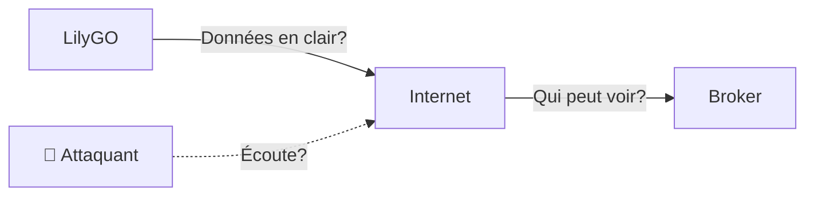

</v-click>

<v-click>

<div class="mt-2 p-2 bg-red-500 bg-opacity-20 rounded-lg text-sm">

**Sans protection**, nos données sont **visibles** par quiconque écoute le réseau!

</div>

</v-click>

</div>

</div>

<v-click>

<div class="mt-4 p-3 bg-green-500 bg-opacity-20 rounded-lg text-center">

**Nouvelle exigence** : Sécuriser toutes nos communications

</div>

</v-click>

---
layout: section
---

# Partie 2
## Sécurité des communications IoT

---

# Menaces sur les systèmes IoT

<div class="grid grid-cols-2 gap-6">

<div>

### Attaques courantes

- **Écoute passive** (sniffing)
- **Man-in-the-Middle** (MITM)
- **Replay attacks**
- **Injection de commandes**
- **Déni de service** (DoS)
- **Compromission physique**

</div>

<div>

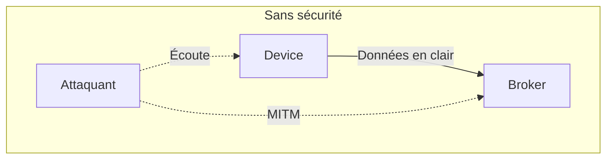

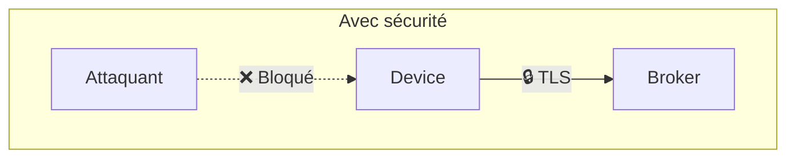

</div>

</div>

---

# TLS/SSL - Transport Layer Security

### Couches de sécurité

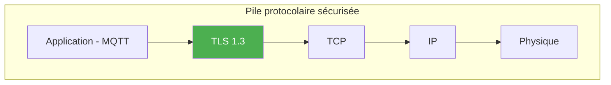

<v-click>

### Ce que TLS fournit

| Propriété | Description |
|-----------|-------------|
| **Confidentialité** | Chiffrement AES-256 |
| **Intégrité** | HMAC - détection modifications |
| **Authentification** | Certificats X.509 |

</v-click>

---

# Certificats X.509

### Chaîne de confiance

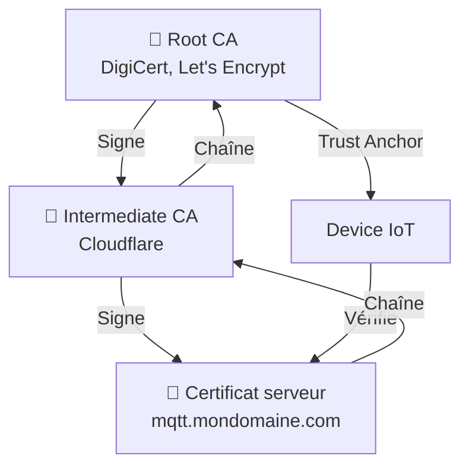

---

# Trust Anchors dans le code

### Ancres de confiance pour TLS

```cpp
// trust_anchors.h
const char* root_ca = R"(
-----BEGIN CERTIFICATE-----
MIIDdzCCAl+gAwIBAgIEAgAAuTANBgkqhkiG9w0BAQsFADBaMQswCQYDVQQGEwJJ
RTESMBAGA1UEChMJQmFsdGltb3JlMRMwEQYDVQQLEwpDeWJlclRydXN0MSIwIAYD
...
-----END CERTIFICATE-----
)";
```

<v-click>

### Utilisation avec WiFiClientSecure

```cpp
WiFiClientSecure client;
client.setCACert(root_ca);  // Définir le trust anchor

// La connexion vérifiera le certificat du serveur
if (client.connect("mqtt.domaine.com", 443)) {
    // Certificat valide, connexion sécurisée
}
```

</v-click>

---

# Authentification MQTT

### Niveaux de sécurité

<div class="grid grid-cols-3 gap-4 mt-4">

<div class="p-3 bg-red-500 bg-opacity-20 rounded-lg">

### Niveau 0
**Aucune auth**

```
allow_anonymous true
```

❌ Production

</div>

<div class="p-3 bg-yellow-500 bg-opacity-20 rounded-lg">

### Niveau 1
**Username/Password**

```
allow_anonymous false
password_file /etc/...
```

⚠️ Acceptable avec TLS

</div>

<div class="p-3 bg-green-500 bg-opacity-20 rounded-lg">

### Niveau 2
**Certificats clients**

```
require_certificate true
use_identity_as_username true
```

✅ Recommandé

</div>

</div>

---

# Gestion sécurisée des secrets

### Ne jamais hardcoder les secrets!

<div class="grid grid-cols-2 gap-6">

<div>

### ❌ Mauvaise pratique

```cpp
// Dans le code source
const char* mqtt_user = "admin";
const char* mqtt_pass = "password123";
const char* wifi_pass = "secret";
```

Risques:
- Commit accidentel sur Git
- Visible dans le binaire
- Difficile à changer

</div>

<div>

### ✅ Bonne pratique

```cpp
// auth.h (dans .gitignore)
#ifndef AUTH_H
#define AUTH_H

const char* MQTT_USER = "mon_user";
const char* MQTT_PASS = "mot_de_passe";
const char* WIFI_PASS = "wifi_secret";

#endif
```

```bash
# .gitignore
auth.h
*_secrets.*
*.pem
```

</div>

</div>

---

# Le fichier .gitignore

### Qu'est-ce que c'est?

Un fichier texte à la racine du projet qui liste les fichiers que Git doit **ignorer**.

<div class="grid grid-cols-2 gap-6 mt-4">

<div>

### Syntaxe

```bash
# Commentaire
fichier.txt      # Fichier spécifique
*.log            # Tous les .log
build/           # Dossier entier
!important.log   # Exception (ne pas ignorer)
**/temp          # temp dans tous les dossiers
```

</div>

<div>

### Exemple IoT

```bash
# Secrets - NE JAMAIS COMMIT
auth.h
*_secrets.*
*.pem
*.key

# Fichiers de build
.pio/
build/

# IDE
.vscode/
*.swp
```

</div>

</div>

<v-click>

<div class="mt-2 p-2 bg-orange-500 bg-opacity-20 rounded-lg text-center text-sm">

⚠️ **Important** : `.gitignore` n'efface pas les fichiers déjà commités! Il faut les retirer manuellement.

</div>

</v-click>

---

# Fichier auth.h.example

### Template pour les utilisateurs

```cpp
// auth.h.example - Copiez ce fichier vers auth.h et remplissez vos valeurs
#ifndef AUTH_H
#define AUTH_H

// === Configuration WiFi ===
const char* WIFI_SSID = "VOTRE_SSID";
const char* WIFI_USER = "votre.utilisateur";  // Pour WPA-EAP
const char* WIFI_PASS = "votre_mot_de_passe";

// === Configuration MQTT ===
const char* MQTT_HOST = "mqtt.votredomaine.com";
const char* MQTT_USER = "votre_user_mqtt";
const char* MQTT_PASS = "votre_pass_mqtt";

// === Configuration LTE ===
const char* APN = "ltemobile.apn";
const char* SIM_PIN = "";  // Laisser vide si pas de PIN

#endif
```

---

# Sécurisé... mais que faire si ça plante?

<div class="grid grid-cols-2 gap-6">

<div>

### Notre système actuel

<v-clicks>

- Communication WiFi/LTE ✅
- Sécurité TLS ✅
- Authentification ✅

</v-clicks>

<v-click>

**Mais un capteur IoT sur le terrain...**

- Est loin de nous
- Doit fonctionner **24/7**
- Ne peut pas être redémarré manuellement

</v-click>

</div>

<div>

<v-click>

### Scénarios réels

- 📶 Perte de signal momentanée
- 🔌 Micro-coupure électrique
- 🌐 Redémarrage du broker
- ⏱️ Timeout réseau

</v-click>

<v-click>

<div class="mt-2 p-2 bg-orange-500 bg-opacity-20 rounded-lg text-sm">

**Question** : Si le LilyGO perd la connexion à 3h du matin, que se passe-t-il?

</div>

</v-click>

</div>

</div>

<v-click>

<div class="mt-4 p-3 bg-green-500 bg-opacity-20 rounded-lg text-center">

**Solution** : Code **résilient** avec reconnexion automatique

</div>

</v-click>

---
layout: section
---

# Partie 3
## Gestion des erreurs et reconnexion

---

# Robustesse des connexions IoT

### Défis en environnement réel

<div class="grid grid-cols-2 gap-6">

<div>

**Problèmes courants**
- Perte de signal WiFi/LTE
- Redémarrage du broker
- Timeout réseau
- Congestion
- Coupure électrique

</div>

<div>

**Conséquences**
- Messages perdus
- État incohérent
- Appareil "zombi"
- Données manquantes

</div>

</div>

<v-click>

### Solution: Code résilient

```
Détection → Diagnostic → Reconnexion → Reprise
```

</v-click>

---

# Pattern de reconnexion

<div class="grid grid-cols-2 gap-4">

<div>

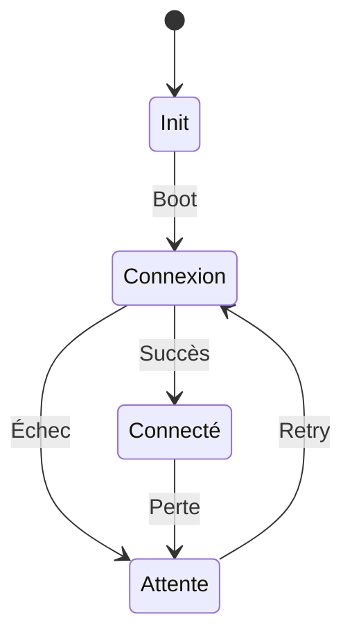

</div>

<div>

### États du système

| État | Description |
|------|-------------|
| **Init** | Démarrage |
| **Connexion** | Tentative en cours |
| **Connecté** | Opération normale |
| **Attente** | Backoff avant retry |

<v-click>

### Cycle de reconnexion

1. Détection de la perte
2. Calcul du délai (backoff)
3. Attente
4. Nouvelle tentative

</v-click>

</div>

</div>

---

# Backoff exponentiel

### Éviter de surcharger le réseau

```cpp
int reconnectAttempts = 0;
const int maxAttempts = 10;
const int baseDelay = 1000;  // 1 seconde
const int maxDelay = 60000;  // 1 minute max

void reconnect() {
    while (!client.connected() && reconnectAttempts < maxAttempts) {
        Serial.printf("Tentative %d/%d...\n",
                      reconnectAttempts + 1, maxAttempts);

        if (client.connect(clientId, user, pass)) {
            reconnectAttempts = 0;  // Reset on success
            resubscribe();
            return;
        }

        // Backoff exponentiel avec jitter
        int delay = min(baseDelay * (1 << reconnectAttempts), maxDelay);
        delay += random(0, 1000);  // Jitter
        reconnectAttempts++;

        Serial.printf("Échec. Attente %d ms\n", delay);
        delay(delay);
    }
}
```

---

# Watchdog Timer

### Protection contre les blocages

```cpp
#include "esp_task_wdt.h"

#define WDT_TIMEOUT 30  // 30 secondes

void setup() {
    // Configurer le watchdog
    esp_task_wdt_init(WDT_TIMEOUT, true);
    esp_task_wdt_add(NULL);

    // ... reste de l'initialisation
}

void loop() {
    // Nourrir le watchdog à chaque itération
    esp_task_wdt_reset();

    // Si cette ligne n'est pas atteinte en 30s
    // → Redémarrage automatique

    processMessages();
    readSensors();
    // ...
}
```

---

# Gestion des erreurs AT

### Timeout et retry pour commandes modem

```cpp
String sendATCommand(const char* cmd, int timeout = 2000, int retries = 3) {
    for (int attempt = 0; attempt < retries; attempt++) {
        Serial2.println(cmd);

        String response = "";
        unsigned long start = millis();

        while (millis() - start < timeout) {
            if (Serial2.available()) {
                response += (char)Serial2.read();
            }
            if (response.indexOf("OK") >= 0 ||
                response.indexOf("ERROR") >= 0) {
                break;
            }
        }

        if (response.indexOf("OK") >= 0) {
            return response;
        }

        Serial.printf("Retry %d for: %s\n", attempt + 1, cmd);
        delay(500);
    }

    return "TIMEOUT";
}
```

---

# Récapitulatif : Notre chaîne IoT complète

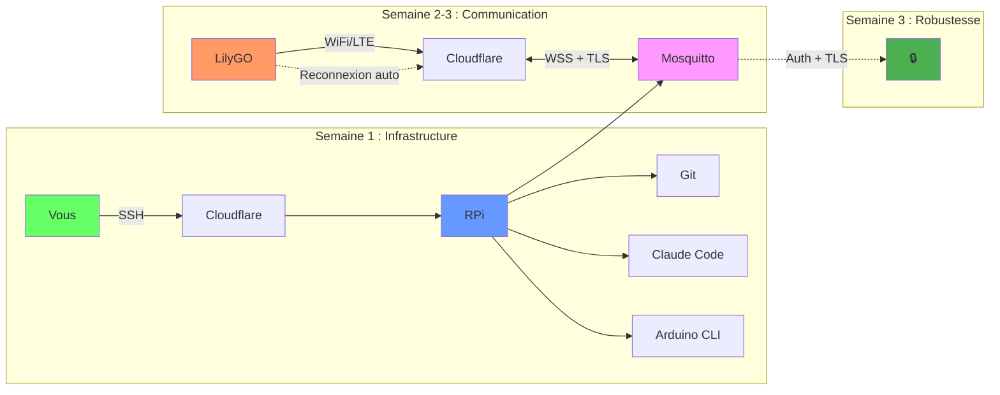

<v-click>

<div class="mt-4 p-3 bg-blue-500 bg-opacity-20 rounded-lg text-center">

| Problème | Solution | Semaine |
|----------|----------|:-------:|
| Accès distant | SSH + Cloudflare | 1 |
| Synchronisation | Git | 1 |
| Communication | MQTT + WSS | 2 |
| Mobilité | LTE | 3 |
| Sécurité | TLS + Auth | 3 |
| Fiabilité | Reconnexion auto | 3 |

</div>

</v-click>

---
layout: section
---

# Partie 4
## Préparation à l'évaluation

---

# Évaluation semaine 3

### Lab capteurs et Python (15%)

<div class="p-4 bg-blue-500 bg-opacity-20 rounded-lg mt-4">

**Objectif**: Démontrer une chaîne de communication IoT complète

</div>

<v-click>

### Éléments évalués

| Critère | Points |
|---------|:------:|
| Configuration Mosquitto fonctionnelle | 20% |
| Communication MQTT via WiFi | 25% |
| Communication MQTT via LTE | 25% |
| Interface Python sur RPi | 20% |
| Qualité du code et documentation | 10% |

</v-click>

---

# Démonstration attendue

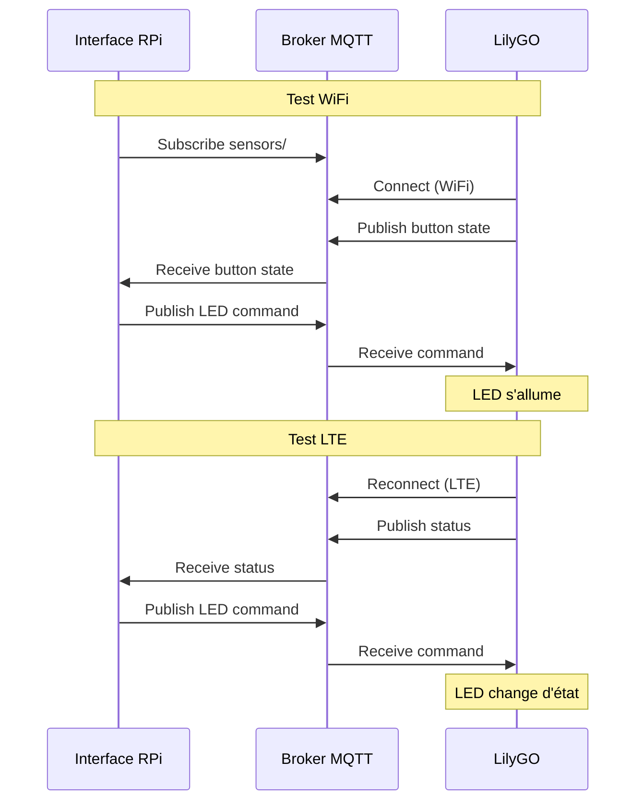

---

# Checklist de préparation

<div class="grid grid-cols-2 gap-6">

<div>

### Infrastructure

- [ ] Mosquitto configuré et sécurisé
- [ ] Cloudflare Tunnel actif
- [ ] DNS pointant vers le tunnel
- [ ] Test connexion externe

### LilyGO - WiFi

- [ ] Connexion WPA-EAP
- [ ] MQTT via WSS
- [ ] Publish boutons
- [ ] Subscribe LEDs

</div>

<div>

### LilyGO - LTE

- [ ] SIM active avec données
- [ ] APN configuré
- [ ] Connexion réseau OK
- [ ] MQTT via Cloudflare

### Raspberry Pi

- [ ] Interface Python fonctionnelle
- [ ] Affichage état capteurs
- [ ] Contrôle des LEDs
- [ ] Gestion reconnexion

</div>

</div>

---

# Erreurs courantes à éviter

<div class="grid grid-cols-2 gap-6">

<div>

### Configuration

❌ Oublier `allow_anonymous false`
❌ Mauvais port (1883 vs 9001)
❌ Certificats expirés
❌ APN incorrect

### Code

❌ Secrets dans le code source
❌ Pas de gestion d'erreur
❌ Boucle bloquante
❌ Timeout trop courts

</div>

<div>

### Matériel

❌ Antenne mal connectée
❌ SIM sans crédit
❌ Mauvais GPIO
❌ Résistances oubliées

### Réseau

❌ Pare-feu bloquant
❌ DNS non propagé
❌ Tunnel non démarré
❌ WiFi corporate mal config

</div>

</div>

---

# Ressources pour révision

### Documentation du cours

- `Labo1-environnement de programmation distant sur rPi.md`
- `Labo2-communication-sans-fil-MQTT-LTE.md`
- `notes_pour_labo2.md`

### Références externes

- [Documentation Mosquitto](https://mosquitto.org/documentation/)
- [MQTT.org](https://mqtt.org/)
- [Cloudflare Tunnel Docs](https://developers.cloudflare.com/cloudflare-one/connections/connect-apps/)
- [ESP32 Arduino Core](https://docs.espressif.com/projects/arduino-esp32/)

---

# Structure de code recommandée

```
projet/
├── src/
│   ├── main.ino           # Point d'entrée
│   ├── wifi_manager.h     # Gestion WiFi
│   ├── lte_manager.h      # Gestion LTE
│   ├── mqtt_handler.h     # Client MQTT
│   └── sensors.h          # Lecture capteurs
├── include/
│   ├── config.h           # Configuration générale
│   ├── auth.h             # Secrets (gitignore!)
│   └── trust_anchors.h    # Certificats CA
├── auth.h.example         # Template secrets
└── README.md              # Documentation
```

---

# Conseils pour l'évaluation

<div class="grid grid-cols-2 gap-6">

<div>

### Avant l'évaluation

1. **Testez tout** la veille
2. Préparez un **backup** de config
3. Vérifiez le **crédit SIM**
4. Chargez les **batteries**
5. Documentez votre **setup**

</div>

<div>

### Pendant l'évaluation

1. **Commencez** par ce qui fonctionne
2. **Expliquez** votre démarche
3. **Débuggez** méthodiquement
4. Utilisez le **moniteur série**
5. **Gardez votre calme**

</div>

</div>

<v-click>

<div class="mt-4 p-3 bg-green-500 bg-opacity-20 rounded-lg text-center">

💡 **Conseil**: Ayez un script de test rapide qui vérifie chaque composant individuellement

</div>

</v-click>

---

# Travail de la semaine

<div class="grid grid-cols-2 gap-6">

<div>

### Finalisation Labo 2

1. Compléter communication LTE
2. Tester les deux modes (WiFi/LTE)
3. Interface Python complète
4. Gestion robuste des erreurs

</div>

<div>

### Préparation évaluation

- Réviser la théorie MQTT
- Pratiquer le dépannage
- Documenter votre configuration
- Préparer questions/réponses

</div>

</div>

<v-click>

<div class="mt-4 p-3 bg-yellow-500 bg-opacity-20 rounded-lg">

⚠️ **Rappel**: L'évaluation compte pour **15%** de la note finale.
Compétence 1 uniquement.

</div>

</v-click>

---
layout: center
class: text-center
---

# Questions?

<div class="text-xl mt-8">
Bonne chance pour l'évaluation!
</div>

<div class="mt-4">
Semaine prochaine: Introduction à KiCad et conception PCB
</div>

---
layout: end
---

# Merci!

243-4J5-LI - Objets connectés

Semaine 3
