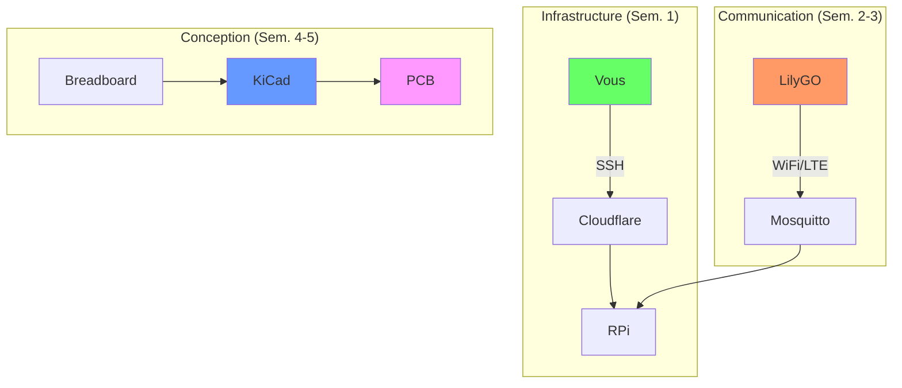
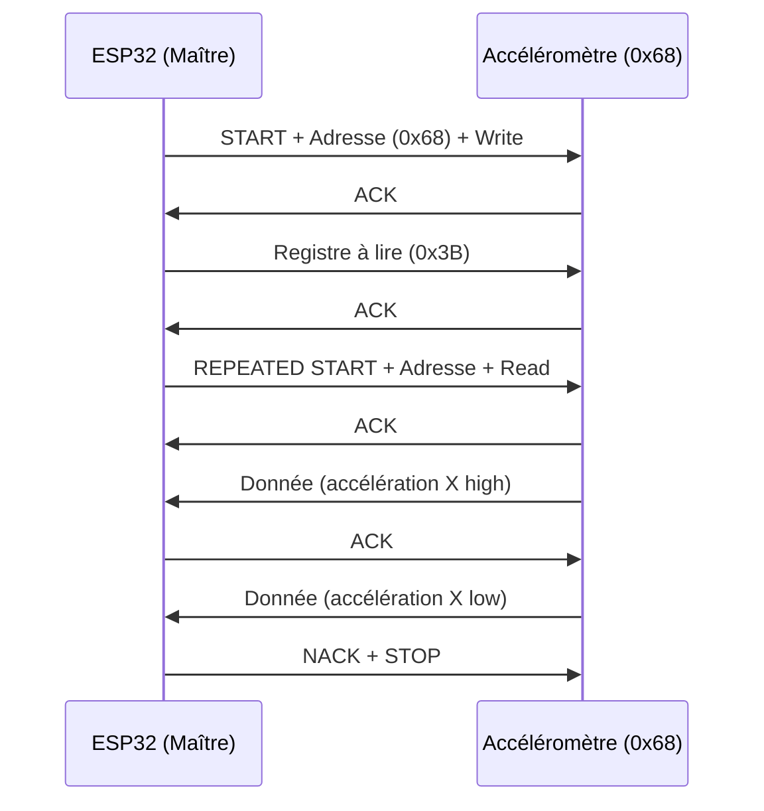
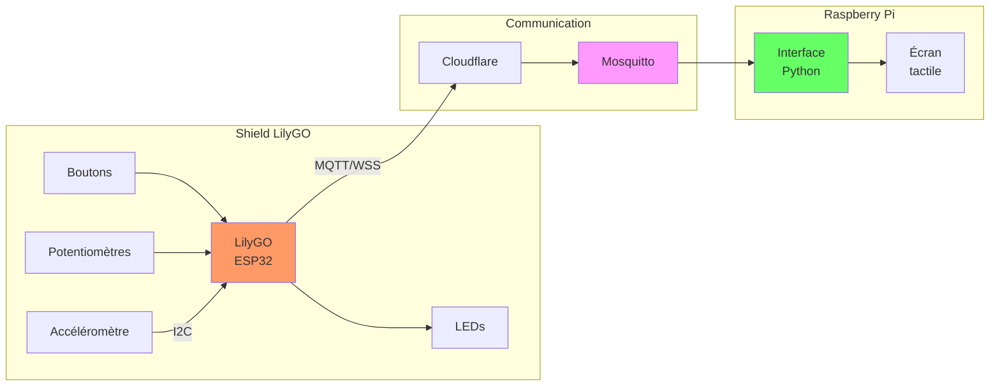
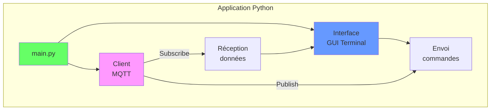

# Objets connectés
## 243-4J5-LI

Semaine 5 - Projet de mi-session : Shield LilyGO A7670G

<div class="pt-12">
  <span class="px-2 py-1 rounded cursor-pointer" hover="bg-white bg-opacity-10">
    Francis Poisson - Cégep Limoilou - H26
  </span>
</div>

---
layout: section
---

# Récapitulatif
## Notre parcours jusqu'ici

---

# Les quatre premières semaines

<div class="grid grid-cols-2 gap-4">

<div>

### Ce qu'on a construit

<v-clicks>

- **Semaine 1** : Infrastructure distante
  - RPi + SSH + Cloudflare
  - Git + Arduino CLI

- **Semaine 2** : Communication
  - MQTT + Mosquitto
  - WiFi + WebSocket (WSS)

- **Semaine 3** : Robustesse
  - LTE cellulaire + TLS
  - Reconnexion automatique

- **Semaine 4** : Conception PCB
  - Introduction à KiCad
  - Workflow schéma → PCB

</v-clicks>

</div>

<div>

<v-click>



</v-click>

<v-click>

<div class="mt-2 p-2 bg-green-500 bg-opacity-20 rounded-lg text-center text-sm">

**Aujourd'hui** : Prototype breadboard complet + documentation!

</div>

</v-click>

</div>

</div>

---

# Où en sommes-nous?

### Le projet de mi-session en perspective

<div class="grid grid-cols-3 gap-3">

<div class="p-3 bg-green-500 bg-opacity-20 rounded-lg">

### Fait (Sem. 1-4)

<v-click>

- Infrastructure RPi
- Communication MQTT
- Sécurité TLS/LTE
- Bases KiCad

</v-click>

</div>

<div class="p-3 bg-blue-500 bg-opacity-20 rounded-lg">

### Cette semaine (5)

<v-click>

- Prototype breadboard
- Code de test complet
- Interface tactile
- Documentation GitHub

</v-click>

</div>

<div class="p-3 bg-purple-500 bg-opacity-20 rounded-lg">

### À venir (Sem. 6-7)

<v-click>

- Schéma KiCad complet
- Routage du PCB
- Génération Gerbers
- Envoi fabrication

</v-click>

</div>

</div>

<v-click>

<div class="mt-4 p-2 bg-orange-500 bg-opacity-20 rounded-lg text-center text-sm">

**Évaluation** : Laboratoires 1-2 (15% - Semaine 3) / Projet mi-session (30% - Semaine 7)

</div>

</v-click>

---
layout: section
---

# Partie 1
## Communication I2C et accéléromètre

---

# Le protocole I2C

### Inter-Integrated Circuit (I²C)

<div class="grid grid-cols-2 gap-6">

<div>

<v-clicks>

- Bus **série** à 2 fils
- **SDA** : données (Serial Data)
- **SCL** : horloge (Serial Clock)
- Un **maître** (ESP32), plusieurs **esclaves**
- Chaque périphérique a une **adresse** unique

</v-clicks>

</div>

<div>

<v-click>

### Schéma de connexion

```
         VCC (3.3V)
          │   │
         [R] [R]  ← Pull-up (4.7kΩ)
          │   │
    SDA ──┴───┼─────┬─────┐
              │     │     │
    SCL ──────┴─────┼─────┼──
                    │     │
                 [Acc]  [Autre]
                  0x68   0x3C
```

</v-click>

<v-click>

<div class="mt-2 p-2 bg-blue-500 bg-opacity-20 rounded-lg text-xs">

Les résistances **pull-up** maintiennent les lignes à l'état haut.

</div>

</v-click>

</div>

</div>

---

# Fonctionnement du protocole I2C

### Séquence de communication

<v-click>



</v-click>

<v-click>

<div class="grid grid-cols-2 gap-4 mt-2">

<div class="p-2 bg-gray-100 rounded text-sm">

**ACK** (Acknowledge) : Le récepteur confirme la réception

</div>

<div class="p-2 bg-gray-100 rounded text-sm">

**NACK** : Fin de lecture, pas d'autres données attendues

</div>

</div>

</v-click>

---

# Vitesses I2C

### Modes de fonctionnement

<div class="grid grid-cols-2 gap-6">

<div>

| Mode | Vitesse | Usage |
|------|---------|-------|
| Standard | 100 kHz | Capteurs simples |
| Fast | 400 kHz | **Notre choix** |
| Fast Plus | 1 MHz | Haute performance |
| High Speed | 3.4 MHz | Applications spéciales |

<v-click>

<div class="mt-2 p-2 bg-green-500 bg-opacity-20 rounded-lg text-sm">

Le mode **Fast (400 kHz)** offre un bon équilibre entre vitesse et compatibilité.

</div>

</v-click>

</div>

<div>

<v-click>

### Avantages I2C

- Seulement **2 fils** (+ GND)
- **Plusieurs** périphériques sur le même bus
- Communication **bidirectionnelle**
- Protocole **standardisé**
- Bien supporté par Arduino

</v-click>

</div>

</div>

---

# L'accéléromètre

### Mesure de l'accélération sur 3 axes

<div class="grid grid-cols-2 gap-6">

<div>

<v-clicks>

- Mesure l'accélération **X, Y, Z**
- Détecte aussi la **gravité** (9.81 m/s²)
- Plage typique : ±2g à ±16g
- Résolution : 16 bits par axe
- Utilisations : orientation, mouvement, chocs

</v-clicks>

</div>

<div>

<v-click>

### Les 3 axes

```
        Y (+)
         │
         │
         │
    ─────┼───── X (+)
        /│
       / │
      /  │
   Z (+)
```

</v-click>

<v-click>

<div class="mt-2 p-2 bg-blue-500 bg-opacity-20 rounded-lg text-sm">

Au repos à plat : X≈0, Y≈0, **Z≈1g** (gravité)

</div>

</v-click>

</div>

</div>

---

# Registres de l'accéléromètre

### Organisation de la mémoire interne

<v-click>

| Registre | Adresse | Fonction |
|----------|---------|----------|
| WHO_AM_I | 0x75 | Identification (vérifie la connexion) |
| PWR_MGMT_1 | 0x6B | Gestion de l'alimentation |
| ACCEL_XOUT_H | 0x3B | Accélération X (poids fort) |
| ACCEL_XOUT_L | 0x3C | Accélération X (poids faible) |
| ACCEL_YOUT_H | 0x3D | Accélération Y (poids fort) |
| ACCEL_YOUT_L | 0x3E | Accélération Y (poids faible) |
| ACCEL_ZOUT_H | 0x3F | Accélération Z (poids fort) |
| ACCEL_ZOUT_L | 0x40 | Accélération Z (poids faible) |

</v-click>

<v-click>

<div class="mt-2 p-2 bg-orange-500 bg-opacity-20 rounded-lg text-sm">

Chaque valeur d'accélération est sur **16 bits** (2 registres de 8 bits).

</div>

</v-click>

---

# Code Arduino - Initialisation I2C

### Configuration de l'accéléromètre

```cpp {all|1-2|4-5|7-11|13-17}
#include <Wire.h>
#define ACCEL_ADDR 0x68  // Adresse I2C de l'accéléromètre

// Broches I2C du LilyGO A7670G
#define I2C_SDA 21
#define I2C_SCL 22

void setup() {
  Serial.begin(115200);

  // Initialiser I2C avec les broches spécifiques
  Wire.begin(I2C_SDA, I2C_SCL);
  Wire.setClock(400000);  // Mode Fast 400 kHz

  // Réveiller l'accéléromètre (sortir du mode sleep)
  Wire.beginTransmission(ACCEL_ADDR);
  Wire.write(0x6B);  // Registre PWR_MGMT_1
  Wire.write(0x00);  // Valeur 0 = réveil
  Wire.endTransmission();

  Serial.println("Accéléromètre initialisé!");
}
```

---

# Code Arduino - Lecture des données

### Récupérer les valeurs d'accélération

```cpp {all|1-5|7-13|15-20}
int16_t readAccelAxis(uint8_t regH) {
  Wire.beginTransmission(ACCEL_ADDR);
  Wire.write(regH);
  Wire.endTransmission(false);  // Repeated start

  Wire.requestFrom(ACCEL_ADDR, 2);
  int16_t value = (Wire.read() << 8) | Wire.read();
  return value;
}

void loop() {
  // Lire les 3 axes
  int16_t ax = readAccelAxis(0x3B);  // X
  int16_t ay = readAccelAxis(0x3D);  // Y
  int16_t az = readAccelAxis(0x3F);  // Z

  // Convertir en g (pour ±2g: diviser par 16384)
  float gx = ax / 16384.0;
  float gy = ay / 16384.0;
  float gz = az / 16384.0;

  Serial.printf("X: %.2fg  Y: %.2fg  Z: %.2fg\n", gx, gy, gz);
  delay(100);
}
```

---

# Bibliothèque Arduino simplifiée

### Alternative avec bibliothèque existante

<div class="grid grid-cols-2 gap-4">

<div>

```cpp
#include <Wire.h>
#include <Adafruit_MPU6050.h>
#include <Adafruit_Sensor.h>

Adafruit_MPU6050 mpu;

void setup() {
  Serial.begin(115200);
  Wire.begin(21, 22);

  if (!mpu.begin()) {
    Serial.println("Erreur MPU6050!");
    while (1) delay(10);
  }

  mpu.setAccelerometerRange(MPU6050_RANGE_2_G);
  Serial.println("MPU6050 prêt!");
}
```

</div>

<div>

```cpp
void loop() {
  sensors_event_t a, g, temp;
  mpu.getEvent(&a, &g, &temp);

  Serial.print("Accel X: ");
  Serial.print(a.acceleration.x);
  Serial.print(" m/s²  Y: ");
  Serial.print(a.acceleration.y);
  Serial.print(" m/s²  Z: ");
  Serial.print(a.acceleration.z);
  Serial.println(" m/s²");

  delay(100);
}
```

<v-click>

<div class="mt-2 p-2 bg-green-500 bg-opacity-20 rounded-lg text-xs">

La bibliothèque gère les détails du protocole I2C pour vous.

</div>

</v-click>

</div>

</div>

---

# Applications de l'accéléromètre

### Idées pour votre projet

<div class="grid grid-cols-2 gap-4">

<div class="p-3 bg-blue-500 bg-opacity-20 rounded-lg">

### Détection d'orientation

<v-click>

- Détecter si l'appareil est à plat, incliné, renversé
- Afficher l'état sur l'interface RPi
- Exemple : alarme si renversé

</v-click>

</div>

<div class="p-3 bg-green-500 bg-opacity-20 rounded-lg">

### Détection de mouvement

<v-click>

- Secouer pour déclencher une action
- Jeu de type "dé virtuel"
- Compteur de pas simplifié

</v-click>

</div>

<div class="p-3 bg-purple-500 bg-opacity-20 rounded-lg">

### Contrôle par inclinaison

<v-click>

- Manette de jeu (incliner = direction)
- Niveau à bulle numérique
- Contrôle de curseur sur écran

</v-click>

</div>

<div class="p-3 bg-orange-500 bg-opacity-20 rounded-lg">

### Mesure de chocs

<v-click>

- Détecter les chutes ou impacts
- Logger les événements
- Alertes en temps réel via MQTT

</v-click>

</div>

</div>

---
layout: section
---

# Partie 2
## Conversion Analogique-Numérique (ADC)

---

# Qu'est-ce qu'un ADC?

### Analog-to-Digital Converter

<div class="grid grid-cols-2 gap-6">

<div>

<v-clicks>

- Convertit une **tension analogique** en **valeur numérique**
- Entrée : 0V à Vref (ex: 3.3V)
- Sortie : nombre entier (0 à 2^n - 1)
- **Résolution** : nombre de bits (12 bits sur ESP32)
- **Plage** : 0 à 4095 (2^12 - 1)

</v-clicks>

</div>

<div>

<v-click>

### Formule de conversion

$$
Valeur_{ADC} = \frac{V_{entrée}}{V_{ref}} \times (2^{bits} - 1)
$$

**Exemple** : Pour 1.65V avec Vref=3.3V et 12 bits

$$
\frac{1.65V}{3.3V} \times 4095 = 2047
$$

</v-click>

</div>

</div>

---

# ADC sur l'ESP32

### Caractéristiques et limitations

<div class="grid grid-cols-2 gap-6">

<div>

### Spécifications

<v-click>

| Caractéristique | Valeur |
|-----------------|--------|
| Résolution | 12 bits (0-4095) |
| Canaux ADC1 | GPIO 32-39 |
| Canaux ADC2 | GPIO 0, 2, 4, 12-15, 25-27 |
| Tension max | 3.3V |
| Fréquence max | ~200 ksps |

</v-click>

</div>

<div>

### Attention!

<v-click>

<div class="p-2 bg-red-500 bg-opacity-20 rounded-lg text-sm">

**ADC2 ne fonctionne PAS quand le WiFi est actif!**

Utilisez uniquement **ADC1** (GPIO 32-39) pour vos potentiomètres.

</div>

</v-click>

<v-click>

<div class="mt-2 p-2 bg-orange-500 bg-opacity-20 rounded-lg text-sm">

L'ADC de l'ESP32 n'est **pas linéaire** aux extrêmes (0-0.1V et 3.2-3.3V).

</div>

</v-click>

</div>

</div>

---

# Le potentiomètre

### Diviseur de tension variable

<div class="grid grid-cols-2 gap-6">

<div>

<v-click>

### Schéma interne

```
    VCC (3.3V)
      │
      │
     [│]
     [│]  ← Résistance variable
     [│]      (10kΩ typique)
      ├────── Sortie (Wiper)
     [│]
     [│]
      │
     GND
```

</v-click>

</div>

<div>

<v-click>

### Fonctionnement

- 3 broches : VCC, GND, Signal
- La broche centrale (wiper) donne une tension proportionnelle à la rotation
- Rotation 0% → 0V
- Rotation 50% → 1.65V
- Rotation 100% → 3.3V

</v-click>

<v-click>

<div class="mt-2 p-2 bg-blue-500 bg-opacity-20 rounded-lg text-sm">

Parfait pour des contrôles de type volume, vitesse, seuil, etc.

</div>

</v-click>

</div>

</div>

---

# Code Arduino - Lecture de potentiomètre

### Lecture simple et conversion

```cpp {all|1-3|5-9|11-17}
// Broches ADC1 disponibles sur LilyGO
#define POT1_PIN 34  // ADC1_CH6
#define POT2_PIN 35  // ADC1_CH7

void setup() {
  Serial.begin(115200);
  // Pas besoin de pinMode pour les entrées ADC
  analogReadResolution(12);  // 12 bits (0-4095)
}

void loop() {
  // Lecture brute
  int valeur1 = analogRead(POT1_PIN);
  int valeur2 = analogRead(POT2_PIN);

  // Conversion en pourcentage
  float pourcent1 = (valeur1 / 4095.0) * 100.0;
  float pourcent2 = (valeur2 / 4095.0) * 100.0;

  Serial.printf("POT1: %d (%.1f%%)  POT2: %d (%.1f%%)\n",
                valeur1, pourcent1, valeur2, pourcent2);
  delay(100);
}
```

---

# Filtrage des valeurs ADC

### Problème : bruit et instabilité

<div class="grid grid-cols-2 gap-6">

<div>

<v-click>

### Le problème

- Les lectures ADC **fluctuent**
- Bruit électrique
- Variations de contact
- Affichage instable

</v-click>

<v-click>

### Solutions

1. **Moyenne mobile** : moyenne des N dernières lectures
2. **Filtre passe-bas** : lissage exponentiel
3. **Zone morte** : ignorer les petits changements

</v-click>

</div>

<div>

<v-click>

### Moyenne mobile simple

```cpp
#define SAMPLES 10
int readings[SAMPLES];
int readIndex = 0;
long total = 0;

int readSmoothed(int pin) {
  total -= readings[readIndex];
  readings[readIndex] = analogRead(pin);
  total += readings[readIndex];
  readIndex = (readIndex + 1) % SAMPLES;

  return total / SAMPLES;
}
```

</v-click>

</div>

</div>

---

# Filtre passe-bas (EMA)

### Exponential Moving Average

<div class="grid grid-cols-2 gap-6">

<div>

<v-click>

### Formule

$$
y_n = \alpha \cdot x_n + (1 - \alpha) \cdot y_{n-1}
$$

- $x_n$ : nouvelle lecture
- $y_{n-1}$ : valeur filtrée précédente
- $\alpha$ : facteur de lissage (0.1 à 0.3)

</v-click>

<v-click>

### Avantages

- Utilise peu de mémoire
- Réponse continue
- Ajustable facilement

</v-click>

</div>

<div>

<v-click>

### Code

```cpp
float alpha = 0.2;  // Ajuster selon besoin
float filtered = 0;

int readFiltered(int pin) {
  int raw = analogRead(pin);
  filtered = alpha * raw +
             (1.0 - alpha) * filtered;
  return (int)filtered;
}
```

</v-click>

<v-click>

<div class="mt-2 p-2 bg-blue-500 bg-opacity-20 rounded-lg text-xs">

**Alpha bas (0.1)** = plus lisse, plus lent
**Alpha haut (0.3)** = plus réactif, plus de bruit

</div>

</v-click>

</div>

</div>

---

# Applications des potentiomètres

### Idées pour votre projet

<div class="grid grid-cols-2 gap-4">

<div class="p-3 bg-blue-500 bg-opacity-20 rounded-lg">

### Contrôle d'intensité

<v-click>

- Luminosité des LEDs (PWM)
- Volume d'un buzzer
- Vitesse d'animation

</v-click>

</div>

<div class="p-3 bg-green-500 bg-opacity-20 rounded-lg">

### Seuils ajustables

<v-click>

- Seuil de détection de mouvement
- Niveau d'alarme
- Temps de délai

</v-click>

</div>

<div class="p-3 bg-purple-500 bg-opacity-20 rounded-lg">

### Interface de jeu

<v-click>

- Contrôle de position (paddle)
- Sélection dans un menu
- Réglage de paramètres

</v-click>

</div>

<div class="p-3 bg-orange-500 bg-opacity-20 rounded-lg">

### Dashboard IoT

<v-click>

- Consigne de température
- Setpoint de régulation
- Niveau de zoom/échelle

</v-click>

</div>

</div>

---
layout: section
---

# Partie 3
## Architecture applicative

---

# Vue d'ensemble du système

### Flux de données complet

<v-click>



</v-click>

<v-click>

<div class="mt-2 p-2 bg-blue-500 bg-opacity-20 rounded-lg text-center text-sm">

**Bidirectionnel** : Les commandes peuvent aller dans les deux sens!

</div>

</v-click>

---

# Structure des topics MQTT

### Organisation hiérarchique

<div class="grid grid-cols-2 gap-4">

<div>

<v-click>

### Convention de nommage

```
iot/[etudiant]/[direction]/[composant]

Exemples:
iot/alice/out/btn1
iot/alice/out/btn2
iot/alice/out/pot1
iot/alice/out/accel
iot/alice/in/led1
iot/alice/in/led2
```

</v-click>

</div>

<div>

<v-click>

### Direction des données

| Direction | Signification |
|-----------|---------------|
| `out` | Du LilyGO **vers** le RPi |
| `in` | Du RPi **vers** le LilyGO |

</v-click>

<v-click>

<div class="mt-2 p-2 bg-green-500 bg-opacity-20 rounded-lg text-sm">

Le LilyGO **publie** sur `out/` et **s'abonne** à `in/`

</div>

</v-click>

</div>

</div>

---

# Format des messages MQTT

### JSON pour les données structurées

<div class="grid grid-cols-2 gap-4">

<div>

### Capteurs → RPi

<v-click>

```json
// Topic: iot/alice/out/btn1
{
  "state": 1,
  "timestamp": 1704067200
}

// Topic: iot/alice/out/pot1
{
  "value": 2048,
  "percent": 50.0
}

// Topic: iot/alice/out/accel
{
  "x": 0.12,
  "y": -0.05,
  "z": 0.98
}
```

</v-click>

</div>

<div>

### RPi → Actionneurs

<v-click>

```json
// Topic: iot/alice/in/led1
{
  "state": 1
}

// Topic: iot/alice/in/led1
{
  "brightness": 128
}

// Topic: iot/alice/in/all
{
  "led1": 1,
  "led2": 0,
  "led3": 1
}
```

</v-click>

</div>

</div>

---

# Code Arduino - Publication MQTT

### Envoyer les données des capteurs

```cpp {all|1-7|9-16|18-25}
// Fonction pour publier un bouton
void publishButton(int btnNum, int state) {
  char topic[50];
  sprintf(topic, "iot/%s/out/btn%d", STUDENT_ID, btnNum);

  char payload[50];
  sprintf(payload, "{\"state\":%d}", state);

  client.publish(topic, payload);
}

// Fonction pour publier l'accéléromètre
void publishAccel(float x, float y, float z) {
  char topic[50];
  sprintf(topic, "iot/%s/out/accel", STUDENT_ID);

  char payload[100];
  sprintf(payload, "{\"x\":%.2f,\"y\":%.2f,\"z\":%.2f}", x, y, z);

  client.publish(topic, payload);
}

// Fonction pour publier un potentiomètre
void publishPot(int potNum, int value) {
  char topic[50];
  sprintf(topic, "iot/%s/out/pot%d", STUDENT_ID, potNum);

  char payload[50];
  sprintf(payload, "{\"value\":%d,\"percent\":%.1f}",
          value, (value / 4095.0) * 100.0);

  client.publish(topic, payload);
}
```

---

# Code Arduino - Réception MQTT

### Traiter les commandes pour les LEDs

```cpp {all|1-4|6-15|17-24}
// S'abonner aux topics de commande
void setupSubscriptions() {
  char topic[50];
  sprintf(topic, "iot/%s/in/#", STUDENT_ID);  // Wildcard #
  client.subscribe(topic);
}

// Callback de réception
void callback(char* topic, byte* payload, unsigned int length) {
  // Parser le JSON reçu
  StaticJsonDocument<200> doc;
  deserializeJson(doc, payload, length);

  // Extraire le composant du topic (ex: "led1")
  String topicStr = String(topic);
  int lastSlash = topicStr.lastIndexOf('/');
  String component = topicStr.substring(lastSlash + 1);

  // Traiter selon le composant
  if (component == "led1") {
    int state = doc["state"];
    digitalWrite(LED1_PIN, state);
  } else if (component == "led2") {
    int state = doc["state"];
    digitalWrite(LED2_PIN, state);
  }
}
```

---

# Interface Python - Structure

### Architecture de l'application RPi

<div class="grid grid-cols-2 gap-4">

<div>

<v-click>



</v-click>

</div>

<div>

<v-click>

### Modules principaux

```python
# Structure de fichiers
project/
├── main.py          # Point d'entrée
├── mqtt_client.py   # Gestion MQTT
├── ui/
│   ├── __init__.py
│   └── terminal.py  # Interface rich
├── config.py        # Configuration
└── requirements.txt
```

</v-click>

</div>

</div>

---

# Interface Python - Code MQTT

### Client MQTT avec paho-mqtt

```python {all|1-8|10-18|20-28}
import paho.mqtt.client as mqtt
import json

# Configuration
BROKER = "votre-broker.example.com"
PORT = 8883
STUDENT_ID = "alice"

# Callback de connexion
def on_connect(client, userdata, flags, rc):
    print(f"Connecté avec code: {rc}")
    # S'abonner aux données du LilyGO
    client.subscribe(f"iot/{STUDENT_ID}/out/#")

# Callback de réception
def on_message(client, userdata, msg):
    topic = msg.topic
    payload = json.loads(msg.payload.decode())
    print(f"Reçu sur {topic}: {payload}")

    # Traiter selon le type de donnée
    if "accel" in topic:
        update_accel_display(payload)
    elif "btn" in topic:
        handle_button_press(payload)
    elif "pot" in topic:
        update_pot_display(payload)
```

---

# Interface GUI Terminal

### Utilisation de la bibliothèque Rich

<div class="grid grid-cols-2 gap-4">

<div>

```python
from rich.console import Console
from rich.table import Table
from rich.live import Live
from rich.panel import Panel

console = Console()

def create_dashboard():
    table = Table(title="Shield LilyGO")

    table.add_column("Composant")
    table.add_column("Valeur")
    table.add_column("État")

    table.add_row("Bouton 1",
                  str(btn1_state),
                  "[green]ON" if btn1_state else "[red]OFF")
    table.add_row("Pot 1",
                  f"{pot1_value}",
                  f"{pot1_percent:.1f}%")
    table.add_row("Accel X",
                  f"{accel_x:.2f}g",
                  get_bar(accel_x))

    return table
```

</div>

<div>

<v-click>

### Affichage en temps réel

```python
from rich.live import Live

def run_dashboard():
    with Live(create_dashboard(),
              refresh_per_second=10) as live:
        while True:
            # Mise à jour automatique
            live.update(create_dashboard())
            time.sleep(0.1)
```

</v-click>

<v-click>

<div class="mt-2 p-2 bg-green-500 bg-opacity-20 rounded-lg text-xs">

Rich permet des interfaces textuelles riches dans le terminal, parfait pour l'écran tactile du RPi.

</div>

</v-click>

</div>

</div>

---
layout: section
---

# Partie 4
## Documentation GitHub

---

# Pourquoi documenter?

### La documentation fait partie du projet

<div class="grid grid-cols-3 gap-3">

<div class="p-3 bg-blue-500 bg-opacity-20 rounded-lg">

### Pour vous

<v-click>

- Retrouver votre logique plus tard
- Comprendre vos propres décisions
- Référence rapide

</v-click>

</div>

<div class="p-3 bg-green-500 bg-opacity-20 rounded-lg">

### Pour les autres

<v-click>

- Collaborateurs peuvent contribuer
- Utilisateurs peuvent utiliser
- Évaluateurs peuvent évaluer!

</v-click>

</div>

<div class="p-3 bg-purple-500 bg-opacity-20 rounded-lg">

### Pour votre carrière

<v-click>

- Portfolio professionnel
- Démontre vos compétences
- Habitude industrielle

</v-click>

</div>

</div>

<v-click>

<div class="mt-4 p-2 bg-orange-500 bg-opacity-20 rounded-lg text-center text-sm">

**Un projet sans documentation est un projet incomplet.**

</div>

</v-click>

---

# Structure d'un README.md efficace

### Les sections essentielles

<div class="grid grid-cols-2 gap-4">

<div>

<v-click>

```markdown
# Nom du projet

Brève description (1-2 phrases)

## Table des matières
- [Fonctionnalités](#fonctionnalités)
- [Installation](#installation)
- [Utilisation](#utilisation)
- [Configuration](#configuration)
- [Architecture](#architecture)
- [API MQTT](#api-mqtt)
- [Auteur](#auteur)

## Fonctionnalités
- Feature 1
- Feature 2
- Feature 3
```

</v-click>

</div>

<div>

<v-click>

```markdown
## Installation

### Prérequis
- Python 3.9+
- Arduino CLI
- Accès au broker MQTT

### Étapes
1. Cloner le dépôt
2. Installer les dépendances
3. Configurer les secrets

## Utilisation

### Démarrage rapide
\`\`\`bash
python main.py
\`\`\`

### Commandes disponibles
- `start` : Démarre l'interface
- `stop` : Arrête proprement
```

</v-click>

</div>

</div>

---

# Syntaxe Markdown essentielle

### Référence rapide

<div class="grid grid-cols-2 gap-4 text-sm">

<div>

<v-click>

### Titres et texte

```markdown
# Titre 1
## Titre 2
### Titre 3

Texte normal
**Gras**
*Italique*
`code inline`
```

</v-click>

<v-click>

### Listes

```markdown
- Item non ordonné
- Autre item
  - Sous-item

1. Premier
2. Deuxième
3. Troisième
```

</v-click>

</div>

<div>

<v-click>

### Code

````markdown
```python
def hello():
    print("Hello!")
```

```cpp
void setup() {
    Serial.begin(115200);
}
```
````

</v-click>

<v-click>

### Tableaux et liens

```markdown
| Col 1 | Col 2 |
|-------|-------|
| A     | B     |

[Texte du lien](https://url.com)

```

</v-click>

</div>

</div>

---

# Documenter l'API MQTT

### Section cruciale pour votre projet

```markdown
## API MQTT

### Topics publiés (LilyGO → RPi)

| Topic | Format | Description |
|-------|--------|-------------|
| `iot/{id}/out/btn1` | `{"state": 0\|1}` | État du bouton 1 |
| `iot/{id}/out/pot1` | `{"value": 0-4095, "percent": 0-100}` | Valeur potentiomètre |
| `iot/{id}/out/accel` | `{"x": float, "y": float, "z": float}` | Accélération en g |

### Topics souscrits (RPi → LilyGO)

| Topic | Format | Description |
|-------|--------|-------------|
| `iot/{id}/in/led1` | `{"state": 0\|1}` | Contrôle LED 1 |
| `iot/{id}/in/led2` | `{"state": 0\|1}` | Contrôle LED 2 |

### Exemple d'utilisation

\`\`\`bash
# Allumer LED 1
mosquitto_pub -t "iot/alice/in/led1" -m '{"state": 1}'
\`\`\`
```

---

# Organisation du dépôt GitHub

### Structure recommandée pour votre projet

```
projet-shield-lilygo/
├── README.md                 # Documentation principale
├── docs/
│   ├── architecture.md       # Détails de l'architecture
│   ├── mqtt-api.md          # Documentation API complète
│   └── images/              # Schémas et captures
├── firmware/
│   ├── src/
│   │   └── main.cpp         # Code Arduino
│   ├── include/
│   │   └── config.h         # Configuration (template)
│   └── platformio.ini       # Config PlatformIO
├── raspberry/
│   ├── main.py              # Application Python
│   ├── requirements.txt     # Dépendances
│   └── config.example.py    # Template de config
├── kicad/
│   └── shield-lilygo/       # Fichiers KiCad
└── .gitignore               # Fichiers à ignorer
```

---

# Fichier .gitignore

### Ne pas versionner les secrets!

```txt
# Secrets et configurations locales
config.h
config.py
auth.h
.env
*.pem
*.key

# Fichiers de build
build/
.pio/
__pycache__/
*.pyc

# Fichiers système
.DS_Store
Thumbs.db

# IDE
.vscode/
.idea/

# Fichiers temporaires
*.log
*.tmp
```

<v-click>

<div class="mt-2 p-2 bg-red-500 bg-opacity-20 rounded-lg text-center text-sm">

**Ne JAMAIS commiter** : mots de passe, clés API, certificats privés, tokens!

</div>

</v-click>

---

# Bonnes pratiques GitHub

### Habitudes professionnelles

<div class="grid grid-cols-2 gap-4">

<div>

### Commits

<v-click>

- Messages **descriptifs** et clairs
- Un commit = une modification logique
- Préfixes utiles :
  - `feat:` nouvelle fonctionnalité
  - `fix:` correction de bug
  - `docs:` documentation
  - `refactor:` restructuration

</v-click>

<v-click>

```bash
git commit -m "feat: ajout lecture accéléromètre I2C"
git commit -m "fix: correction filtrage ADC"
git commit -m "docs: ajout documentation API MQTT"
```

</v-click>

</div>

<div>

### Issues et Projects

<v-click>

- Créer des **Issues** pour suivre les tâches
- Utiliser les **labels** (bug, enhancement, etc.)
- **Projects** pour organiser le travail
- Référencer les issues dans les commits

</v-click>

<v-click>

```bash
git commit -m "fix: correction #12 - LED ne s'allume pas"
```

</v-click>

</div>

</div>

---
layout: section
---

# Travail de la semaine
## Prototype et documentation

---

# Objectifs du laboratoire

### Ce que vous devez accomplir

<div class="grid grid-cols-2 gap-4">

<div>

### Matériel (breadboard)

<v-clicks>

1. Montage complet sur breadboard :
   - LEDs avec résistances
   - Boutons avec pull-down/up
   - Potentiomètres
   - Accéléromètre I2C

2. Validation de chaque composant
3. Connexion au LilyGO

</v-clicks>

</div>

<div>

### Logiciel et documentation

<v-clicks>

4. Code de test Arduino :
   - Lecture de tous les capteurs
   - Contrôle des actionneurs
   - Publication MQTT

5. Ébauche interface Python

6. README.md sur GitHub :
   - Description du projet
   - Schéma fonctionnel
   - Topics MQTT

</v-clicks>

</div>

</div>

---

# Composants par étudiant

### Rappel des assignations

<div class="grid grid-cols-2 gap-6">

<div>

| # | Boutons | LEDs |
|:-:|:-------:|:----:|
| 1 | 2 | 1 |
| 2 | 1 | 2 |
| 3 | 3 | 1 |
| 4 | 1 | 3 |
| 5 | 2 | 2 |
| 6 | 3 | 2 |
| 7 | 2 | 3 |
| 8 | 1 | 4 |

</div>

<div>

### Obligatoire pour tous

<v-click>

- **2 potentiomètres**
- **1 accéléromètre I2C**
- **Connecteurs femelles** pour le LilyGO
- Communication **MQTT fonctionnelle**
- Interface **Python** sur RPi
- **Documentation GitHub**

</v-click>

</div>

</div>

---

# Critères d'évaluation

### Ce qui sera évalué en semaine 7

<div class="grid grid-cols-3 gap-3 text-sm">

<div class="p-3 bg-blue-500 bg-opacity-20 rounded-lg">

### Matériel (10 pts)

- Schéma KiCad complet
- Routage PCB correct
- Fichiers Gerber valides
- Documentation technique

</div>

<div class="p-3 bg-green-500 bg-opacity-20 rounded-lg">

### Logiciel (10 pts)

- Code Arduino fonctionnel
- Communication MQTT
- Interface Python
- Gestion des erreurs

</div>

<div class="p-3 bg-purple-500 bg-opacity-20 rounded-lg">

### Documentation (10 pts)

- README complet
- Schémas clairs
- API documentée
- Organisation du dépôt

</div>

</div>

<v-click>

<div class="mt-4 p-2 bg-orange-500 bg-opacity-20 rounded-lg text-center text-sm">

**Cette semaine** : Prototype breadboard + code de test + début documentation
**Prochaines semaines** : Schéma KiCad → Routage → Gerbers

</div>

</v-click>

---

# Ressources disponibles

### Où trouver de l'aide

<div class="grid grid-cols-2 gap-4">

<div>

### Documentation technique

- Datasheet de l'accéléromètre
- Documentation ESP32 ADC
- Exemples Arduino I2C
- Guide Markdown GitHub

</div>

<div>

### Outils

- Arduino CLI sur le RPi
- VS Code avec extensions
- KiCad 8 sur votre poste
- Claude Code / Gemini CLI

</div>

</div>

<v-click>

<div class="mt-4 p-2 bg-blue-500 bg-opacity-20 rounded-lg text-center">

N'hésitez pas à utiliser les **assistants IA** pour déboguer votre code ou clarifier des concepts!

</div>

</v-click>

---
layout: center
class: text-center
---

# Questions?

<div class="text-xl mt-8">
Prochaine étape : Mise en place du prototype breadboard!
</div>

<div class="mt-4 text-sm">
Semaine prochaine : Schéma KiCad du shield complet
</div>

---
layout: end
---

# Merci!

243-4J5-LI - Objets connectés

Semaine 5
