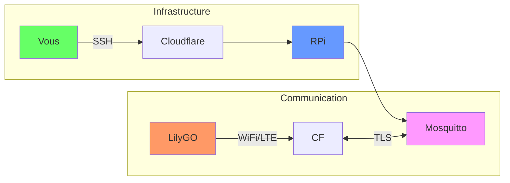
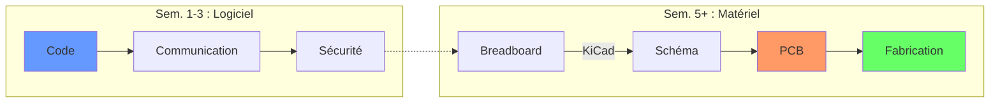
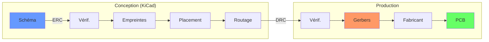

# Objets connectés
## 243-4J5-LI

Semaine 5 - Introduction à KiCad et dessin de PCB

<div class="pt-12">
  <span class="px-2 py-1 rounded cursor-pointer" hover="bg-white bg-opacity-10">
    Francis Poisson - Cégep Limoilou - H26
  </span>
</div>

---
layout: section
---

# Récapitulatif
## Notre parcours jusqu'ici

---

# Les quatre premières semaines

<div class="grid grid-cols-2 gap-4">

<div>

### Ce qu'on a construit

<v-clicks>

- **Semaine 1** : Infrastructure distante
  - RPi + SSH + Cloudflare
  - Git + Gemini-cli + Arduino CLI

- **Semaine 2** : Communication
  - MQTT + Mosquitto
  - WiFi + WebSocket (WSS)

- **Semaine 3** : Robustesse
  - LTE cellulaire
  - Sécurité TLS
  - Reconnexion automatique

- **Semaine 4** : Workflow KiCad (labo pratique)
  - Création de projet KiCad
  - Schéma → PCB → Gerbers

</v-clicks>

</div>

<div>

<v-click>


```mermaid {scale: 0.4}
graph LR
    subgraph "Infrastructure"
        YOU[Vous] -->|SSH| CF[Cloudflare]
        CF --> RPI[RPi]
    end

    subgraph "Communication"
        RPI --> MOSQ[Mosquitto]
        LILY[LilyGO] -->|WiFi/LTE| CF2[CF]
        CF2 <-->|TLS| MOSQ
    end

    style YOU fill:#6f6
    style RPI fill:#69f
    style LILY fill:#f96
    style MOSQ fill:#f9f
```

</v-click>

<v-click>

<div class="mt-2 p-2 bg-green-500 bg-opacity-20 rounded-lg text-center text-sm">

Notre système IoT est **fonctionnel** et **robuste**!

</div>

</v-click>

</div>

</div>

---

# Mais regardez notre prototype...

<div class="grid grid-cols-2 gap-6">

<div>

### L'état actuel

<v-clicks>

- Fils partout sur le **breadboard**
- Connexions **fragiles**
- Impossible à **déplacer**
- Pas **professionnel**
- Difficile à **reproduire**

</v-clicks>

<v-click>

<div class="mt-4 p-2 bg-red-500 bg-opacity-20 rounded-lg text-sm">

**Problème** : Comment transformer ce prototype en produit fiable?

</div>

</v-click>

</div>

<div>

<v-click>

### Breadboard vs PCB

| Breadboard | PCB |
|------------|-----|
| Prototype rapide | Production |
| Connexions fragiles | Soudures permanentes |
| Fils volants | Pistes cuivrées |
| Unique | Reproductible |
| Amateur | Professionnel |

</v-click>

</div>

</div>

---

# Notre chaîne s'agrandit encore!


```mermaid {scale: 0.65}
graph LR
    subgraph "Sem. 1-3 : Logiciel"
        CODE[Code] --> COMM[Communication]
        COMM --> SEC[Sécurité]
    end

    subgraph "Sem. 5+ : Matériel"
        BREAD[Breadboard] -->|KiCad| SCH[Schéma]
        SCH --> PCB[PCB]
        PCB --> FAB[Fabrication]
    end

    SEC -.-> BREAD

    style CODE fill:#69f
    style PCB fill:#f96
    style FAB fill:#6f6
```

<v-click>

<div class="mt-4 p-3 bg-blue-500 bg-opacity-20 rounded-lg text-center">

| Problème | Solution | Semaine |
|----------|----------|:-------:|
| Prototype fragile | Conception PCB | 5-7 |
| Fabrication | Envoi chez fabricant | 7 |
| Assemblage | Soudure du PCB | 10 |

</div>

</v-click>

---
layout: section
---

# Partie 1
## Introduction à la conception PCB

---

# Qu'est-ce qu'un PCB?

### Printed Circuit Board (Circuit imprimé)

<div class="grid grid-cols-2 gap-6">

<div>

<v-clicks>

- Support **isolant** (FR4, fibre de verre)
- **Pistes** de cuivre pour les connexions
- **Pastilles** pour souder les composants
- **Vias** pour connecter les couches
- **Sérigraphie** pour les indications

</v-clicks>

</div>

<div>

<v-click>


</v-click>

</div>

</div>

---

# Pourquoi concevoir un PCB?

<div class="grid grid-cols-3 gap-4">

<div class="p-3 bg-blue-500 bg-opacity-20 rounded-lg">

### Fiabilité

<v-click>

- Connexions **permanentes**
- Pas de fils qui se débranchent
- Résiste aux vibrations
- Durée de vie longue

</v-click>

</div>

<div class="p-3 bg-green-500 bg-opacity-20 rounded-lg">

### Reproductibilité

<v-click>

- **Identique** à chaque fabrication
- Fichiers Gerber standards
- Production en **série**
- Qualité constante

</v-click>

</div>

<div class="p-3 bg-purple-500 bg-opacity-20 rounded-lg">

### Professionnalisme

<v-click>

- Aspect **fini**
- Compact et organisé
- Facilite le **dépannage**
- Documentation intégrée

</v-click>

</div>

</div>

---

# Le workflow de conception PCB


```mermaid {scale: 0.5}
graph LR
    subgraph "Conception (KiCad)"
        A[Schéma] -->|ERC| B[Vérif.]
        B --> C[Empreintes]
        C --> D[Placement]
        D --> E[Routage]
    end

    subgraph "Production"
        E -->|DRC| F[Vérif.]
        F --> G[Gerbers]
        G --> H[Fabricant]
        H --> I[PCB]
    end

    style A fill:#69f
    style G fill:#f96
    style I fill:#6f6
```

<v-click>

<div class="grid grid-cols-2 gap-4 mt-4">

<div>

### Étapes logicielles (KiCad)
1. Saisie du schéma
2. Vérification ERC
3. Assignation des empreintes
4. Placement des composants
5. Routage des pistes
6. Vérification DRC
7. Génération des Gerbers

</div>

<div>

### Étapes physiques
1. Envoi au fabricant
2. Fabrication (~1-2 semaines)
3. Réception du PCB
4. Soudure des composants
5. Tests électriques

</div>

</div>

</v-click>

---
layout: section
---

# Partie 2
## KiCad - L'outil de conception

---

# Pourquoi KiCad?

<div class="grid grid-cols-2 gap-6">

<div>

### Avantages

<v-clicks>

- **Gratuit** et open source
- **Professionnel** (utilisé en industrie)
- **Multi-plateforme** (Win/Mac/Linux)
- **Communauté** active
- Pas de limite de taille de PCB
- Export **Gerber** standard

</v-clicks>

</div>

<div>

<v-click>

### Alternatives

| Logiciel | Prix | Usage |
|----------|------|-------|
| **KiCad** | Gratuit | Pro/Hobby |
| Eagle | Payant | Industrie |
| Altium | $$$ | Industrie |
| EasyEDA | Gratuit | Hobby |
| Fusion 360 | Gratuit* | Hobby |

</v-click>

<v-click>

<div class="mt-2 p-2 bg-green-500 bg-opacity-20 rounded-lg text-sm">

KiCad est le choix idéal pour apprendre sans limites!

</div>

</v-click>

</div>

</div>

---

# Les modules de KiCad

<div class="grid grid-cols-2 gap-4">

<div>

### Éditeur de schéma

<v-click>

- Saisie du circuit électrique
- Symboles des composants
- Connexions logiques
- Vérification ERC

</v-click>

### Éditeur de PCB

<v-click>

- Placement des composants
- Routage des pistes
- Plans de masse
- Vérification DRC

</v-click>

</div>

<div>

### Éditeur de symboles

<v-click>

- Créer ses propres symboles
- Bibliothèques personnalisées

</v-click>

### Éditeur d'empreintes

<v-click>

- Créer ses propres footprints
- Dimensions physiques

</v-click>

### Visualiseur 3D

<v-click>

- Aperçu réaliste du PCB
- Vérification avant fabrication

</v-click>

</div>

</div>

---

# Schéma vs PCB

<div class="grid grid-cols-2 gap-6">

<div>

### Schéma (logique)

<v-click>

Représentation **logique** du circuit électrique

- Connexions **électriques**
- Pas de dimensions physiques
- Symboles normalisés

</v-click>

</div>

<div>

### PCB (physique)

<v-click>

Représentation **physique** des composants

- Dimensions **réelles**
- Emplacement des pistes
- Couches de cuivre

</v-click>

</div>

</div>

<v-click>


</v-click>

---

# Symboles et empreintes

<div class="grid grid-cols-2 gap-6">

<div>

### Symbole (schéma)

<v-click>

Représentation **graphique** dans le schéma.

```
    ┌─────┐
  ──┤1   8├──
  ──┤2   7├──
  ──┤3   6├──
  ──┤4   5├──
    └─────┘
     NE555
```

- Broches numérotées
- Pas de dimensions physiques

</v-click>

</div>

<div>

### Empreinte (PCB)

<v-click>


</v-click>

</div>

</div>

<v-click>

<div class="mt-3 p-2 bg-blue-500 bg-opacity-20 rounded-lg text-center text-sm">

Le **symbole** décrit la logique électrique — l'**empreinte** décrit la forme physique sur le PCB

</div>

</v-click>

---

# Un symbole → plusieurs empreintes

### Exemple : Résistance 10 kΩ

<div class="grid grid-cols-2 gap-6">

<div>

<v-click>

| Empreinte | Type | Taille |
|-----------|------|--------|
| R_Axial_DIN0207 | **THT** | 6.3 × 2.5 mm |
| R_0805_2012Metric | SMD | 2.0 × 1.25 mm |
| R_0603_1608Metric | SMD | 1.6 × 0.8 mm |
| R_0402_1005Metric | SMD | 1.0 × 0.5 mm |

</v-click>

</div>

<div>

<v-click>

### Comment choisir?

- **THT** → prototype, soudure manuelle facile
- **0805** → SMD, soudure à la main possible
- **0603** → SMD compact, fer fin requis
- **0402** → SMD très petit, four recommandé

</v-click>

</div>

</div>

<v-click>

<div class="mt-3 p-2 bg-orange-500 bg-opacity-20 rounded-lg text-center text-sm">

Même valeur électrique (10 kΩ), formes physiques très différentes — **pour ce cours : THT (traversant)**

</div>

</v-click>

---
layout: section
---

# Partie 3
## Saisie du schéma

---

# Créer un nouveau projet

### Étapes dans KiCad

<v-clicks>

1. **File → New Project**
2. Choisir un dossier dédié
3. Donner un nom significatif (ex: `shield-lilygo`)
4. KiCad crée automatiquement :
   - `projet.kicad_pro` (fichier projet)
   - `projet.kicad_sch` (schéma)
   - `projet.kicad_pcb` (PCB)

</v-clicks>

<v-click>

<div class="mt-4 p-2 bg-blue-500 bg-opacity-20 rounded-lg text-sm">

**Bonne pratique** : Un dossier = Un projet. Inclure les datasheets et la documentation.

</div>

</v-click>

---

# Placer des composants

<div class="grid grid-cols-2 gap-6">

<div>

### Dans l'éditeur de schéma

<v-clicks>

1. **Raccourci A** → Ajouter un symbole
2. Rechercher dans la bibliothèque (ex: "LED")
3. Cliquer pour placer
4. **R** pour tourner, **M** pour déplacer

</v-clicks>

</div>

<div>

### Bibliothèques utiles

<v-click>

| Bibliothèque | Contenu |
|--------------|---------|
| Device | Résistances, condensateurs, LEDs |
| Connector | Connecteurs, headers |
| MCU_Module | Arduino, ESP32, RPi |
| Switch | Boutons, interrupteurs |

</v-click>

</div>

</div>

---

# Connexions dans le schéma

<div class="grid grid-cols-2 gap-6">

<div>

### Types de connexions

<v-clicks>

- **Fil (W)** : Connexion directe
- **Label** : Connexion par nom
- **Power symbol** : VCC, GND
- **No Connect (X)** : Broche non utilisée

</v-clicks>

</div>

<div>

<v-click>

### Bonnes pratiques

- Schéma **lisible** (gauche→droite)
- **Labels** pour les signaux importants
- **Annotations** pour clarifier
- Pas de fils qui se croisent inutilement

</v-click>

</div>

</div>

<v-click>

<div class="mt-4 p-2 bg-green-500 bg-opacity-20 rounded-lg text-sm">

**Astuce** : Utilisez des labels pour les connexions longues plutôt que des fils qui traversent tout le schéma.

</div>

</v-click>

---

# ERC - Electrical Rules Check

### Vérification des erreurs électriques

<v-clicks>

- **Inspect → Electrical Rules Checker**
- Détecte les problèmes **avant** le routage

</v-clicks>

<v-click>

### Erreurs courantes

| Erreur | Cause | Solution |
|--------|-------|----------|
| Pin not connected | Broche flottante | Connecter ou marquer NC |
| Power pin not driven | Pas d'alimentation | Ajouter symbole power |
| Conflicting outputs | 2 sorties connectées | Vérifier le circuit |

</v-click>

<v-click>

<div class="mt-2 p-2 bg-orange-500 bg-opacity-20 rounded-lg text-sm">

**Important** : Corriger **toutes** les erreurs ERC avant de passer au PCB!

</div>

</v-click>

---
layout: section
---

# Partie 4
## Assignation des empreintes

---

# Associer symboles et empreintes

### Chaque composant a besoin d'une empreinte

<v-clicks>

1. **Tools → Assign Footprints**
2. Pour chaque composant :
   - Sélectionner dans la liste
   - Choisir l'empreinte appropriée
   - Vérifier les dimensions

</v-clicks>

<v-click>

### Exemple : Résistance

| Type | Empreinte | Taille |
|------|-----------|--------|
| Traversante | R_Axial_DIN0207 | 6.3mm |
| CMS 0805 | R_0805_2012Metric | 2.0×1.25mm |
| CMS 0603 | R_0603_1608Metric | 1.6×0.8mm |

</v-click>

---

# Choisir la bonne empreinte

<div class="grid grid-cols-2 gap-6">

<div>

### Composants traversants (THT)

<v-click>

- **Plus facile** à souder
- Plus **gros**
- Idéal pour **prototypes**
- Résistance mécanique

</v-click>

</div>

<div>

### Composants CMS (SMD)

<v-click>

- Plus **compact**
- **Production** industrielle
- Requiert plus de **précision**
- Soudure au four ou air chaud

</v-click>

</div>

</div>

<v-click>

<div class="mt-4 p-2 bg-blue-500 bg-opacity-20 rounded-lg text-center text-sm">

Pour ce cours, on privilégie les composants **traversants** (plus faciles à souder manuellement)

</div>

</v-click>

---
layout: section
---

# Partie 5
## Début du dessin du PCB

---

# Le projet de mi-session

### Ce n'est pas juste un PCB!

<div class="grid grid-cols-3 gap-3">

<div class="p-2 bg-blue-500 bg-opacity-20 rounded-lg text-sm">

**Matériel**

- Shield PCB pour LilyGO
- Capteurs/actionneurs
- Schéma + routage

</div>

<div class="p-2 bg-green-500 bg-opacity-20 rounded-lg text-sm">

**Code**

- Firmware Arduino
- Lecture capteurs
- Communication MQTT

</div>

<div class="p-2 bg-purple-500 bg-opacity-20 rounded-lg text-sm">

**Infrastructure**

- Broker Mosquitto
- Interface Python
- Cloudflare Tunnel

</div>

</div>

<v-click>

<div class="mt-4 p-2 bg-orange-500 bg-opacity-20 rounded-lg text-center text-sm">

**Cette semaine** : Commencer le schéma KiCad de votre shield!

</div>

</v-click>

---

# Assignation par étudiant

### Composants variables + MPU6050 obligatoire pour tous

<div class="grid grid-cols-2 gap-6">

<div>

| # | Boutons | LEDs | Potentiomètres |
|:-:|:-------:|:----:|:--------------:|
| 1 | 1 | 3 | 3 |
| 2 | 2 | 2 | 3 |
| 3 | 3 | 1 | 3 |
| 4 | 1 | 4 | 2 |
| 5 | 2 | 3 | 2 |
| 6 | 3 | 2 | 2 |
| 7 | 3 | 3 | 1 |
| 8 | 2 | 4 | 1 |

</div>

<div>

### Obligatoire pour tous

<v-click>

- **MPU6050** — accéléromètre I2C (axes X, Y, Z)
- **Connecteurs femelles** compatibles LilyGO A7670G
- **Résistances de limitation** (LEDs : 330 Ω)
- **Pull-up/pull-down** pour les boutons

</v-click>

<v-click>

<div class="mt-2 p-2 bg-blue-500 bg-opacity-20 rounded-lg text-xs">

Le total de composants variables est **identique pour tous** (7). Voir l'énoncé du projet de mi-session.

</div>

</v-click>

</div>

</div>

---

# Travail de la semaine

<div class="grid grid-cols-2 gap-6">

<div>

### Aujourd'hui

1. Créer votre projet KiCad `shield-lilygo`
2. Placer les composants de votre assignation
3. Établir les connexions et labels
4. Viser un **ERC sans erreurs**

</div>

<div>

### Labo 5

- Compléter le schéma KiCad du shield
- Assigner les empreintes (THT)
- Préparer pour le routage (semaine 6)
- Pousser sur GitHub

</div>

</div>

<v-click>

<div class="mt-4 p-3 bg-blue-500 bg-opacity-20 rounded-lg text-center">

**Vous avez déjà fait le workflow complet en Labo 3** — maintenant on l'applique à votre projet!

</div>

</v-click>

---

# Dates limites importantes

<div class="grid grid-cols-2 gap-4">

<div class="p-4 bg-red-500 bg-opacity-20 rounded-lg border border-red-400">

### PCB — Gerbers

<v-click>

<div class="text-2xl font-bold text-red-600 mt-2">Lundi 16 mars 2026</div>
<div class="text-lg font-bold text-red-600">à 8h00</div>

</v-click>

<v-click>

- Remise des fichiers **Gerber** obligatoire
- La commande groupée est passée ce matin-là
- **Note de 0** pour la partie PCB si non remis

</v-click>

</div>

<div class="p-4 bg-orange-500 bg-opacity-20 rounded-lg border border-orange-400">

### Projet complet

<v-click>

<div class="text-2xl font-bold text-orange-600 mt-2">Lundi 23 mars 2026</div>
<div class="text-lg font-bold text-orange-600">à 8h00</div>

</v-click>

<v-click>

- Firmware Arduino
- Interface Python (RPi)
- Documentation complète
- Tout sur GitHub

</v-click>

</div>

</div>

---
layout: center
class: text-center
---

# Questions?

<div class="text-xl mt-8">
Prochaine étape : Schéma KiCad du shield LilyGO!
</div>

<div class="mt-4">
Semaine prochaine : Prototype breadboard complet + début du routage PCB
</div>

---
layout: end
---

# Merci!

243-4J5-LI - Objets connectés

Semaine 5
