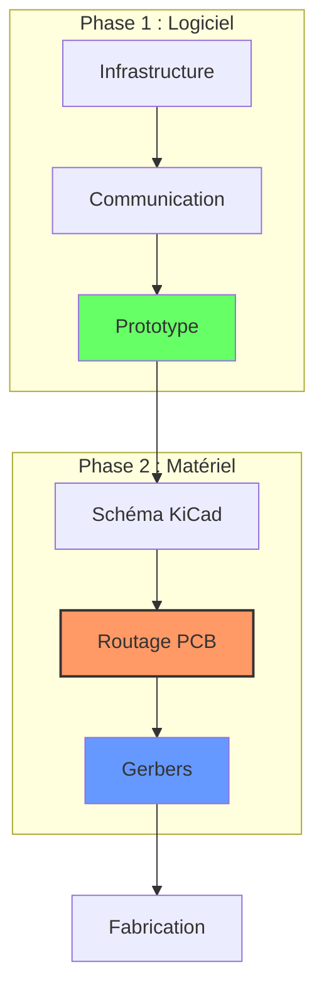

# Objets connectés
## 243-4J5-LI

Semaine 6 - Projet de mi-session : Finalisation PCB

<div class="pt-12">
  <span class="px-2 py-1 rounded cursor-pointer" hover="bg-white bg-opacity-10">
    Francis Poisson - Cégep Limoilou - H26
  </span>
</div>

---
layout: section
---

# Récapitulatif
## Notre parcours vers le PCB

---

# Les cinq premières semaines

<div class="grid grid-cols-2 gap-4">

<div>

### Ce qu'on a construit

<v-clicks>

- **Semaines 1-3** : Infrastructure IoT
  - RPi + MQTT + LTE/WiFi
  - Communication sécurisée TLS

- **Semaine 4** : Introduction KiCad
  - Workflow schéma → PCB
  - Concepts de base

- **Semaine 5** : Prototype breadboard
  - I2C et accéléromètre
  - ADC et potentiomètres
  - Architecture MQTT

</v-clicks>

</div>

<div>

<v-click>



</v-click>

<v-click>

<div class="mt-2 p-2 bg-orange-500 bg-opacity-20 rounded-lg text-center text-sm">

**Aujourd'hui** : Finaliser le routage et générer les Gerbers!

</div>

</v-click>

</div>

</div>

---

# État d'avancement du projet

### Où en êtes-vous?

<div class="grid grid-cols-4 gap-2 text-sm">

<div class="p-2 bg-green-500 bg-opacity-20 rounded-lg">

### Sem. 4-5

<v-click>

- Schéma de base
- Composants placés
- Connexions logiques
- ERC passé

</v-click>

</div>

<div class="p-2 bg-blue-500 bg-opacity-20 rounded-lg">

### Cette semaine

<v-click>

- Empreintes assignées
- Placement optimisé
- Routage complet
- DRC passé

</v-click>

</div>

<div class="p-2 bg-purple-500 bg-opacity-20 rounded-lg">

### Fin de semaine

<v-click>

- Fichiers Gerber
- BOM complète
- Documentation
- Prêt à commander

</v-click>

</div>

<div class="p-2 bg-orange-500 bg-opacity-20 rounded-lg">

### Sem. 7

<v-click>

- **Remise** du projet
- Évaluation 30%
- Commande groupée
- Début LoRa

</v-click>

</div>

</div>

---
layout: section
---

# Partie 1
## Routage avancé

---

# Stratégies de placement

### La clé d'un bon routage

<div class="grid grid-cols-2 gap-6">

<div>

<v-clicks>

- **Placement AVANT routage** : critique!
- Regrouper les composants par fonction
- Minimiser les croisements de pistes
- Respecter les contraintes mécaniques
- Penser au flux du signal

</v-clicks>

</div>

<div>

<v-click>

### Ordre de placement

1. **Connecteurs** : positions fixes (bord du PCB)
2. **Composants critiques** : MCU, régulateurs
3. **Composants associés** : près de leur connexion
4. **Passifs** : résistances, condensateurs
5. **Ajustements** : optimiser les chemins

</v-click>

</div>

</div>

<v-click>

<div class="mt-4 p-2 bg-blue-500 bg-opacity-20 rounded-lg text-center text-sm">

**Règle d'or** : Un bon placement = routage facile. Un mauvais placement = cauchemar!

</div>

</v-click>

---

# Placement pour le shield LilyGO

### Contraintes spécifiques

<div class="grid grid-cols-2 gap-6">

<div>

<v-click>

### Positions imposées

- **Headers femelles** : alignés avec le LilyGO
- **LEDs** : visibles sur le dessus
- **Boutons** : accessibles
- **Potentiomètres** : manipulation aisée

</v-click>

<v-click>

### Positions flexibles

- **Accéléromètre** : proche des broches I2C
- **Résistances** : près des composants associés
- **Condensateurs** : près de l'alimentation

</v-click>

</div>

<div>

<v-click>

### Vue de dessus (exemple)

```
┌─────────────────────────────┐
│  [POT1]           [POT2]    │
│                             │
│  [BTN1] [BTN2]    [LED1]    │
│                   [LED2]    │
│  [ACCEL]                    │
│                             │
│  ═══════════════════════    │
│  │ Header LilyGO (bas)  │   │
│  ═══════════════════════    │
└─────────────────────────────┘
```

</v-click>

</div>

</div>

---

# Routage 2 couches

### Top et Bottom

<div class="grid grid-cols-2 gap-6">

<div>

<v-click>

### Couche Top (rouge)

- Composants traversants
- Pistes de signal principales
- Connexions courtes
- Sérigraphie visible

</v-click>

<v-click>

### Couche Bottom (bleu)

- Plan de masse (GND)
- Pistes secondaires
- Croisements de signaux
- Soudure des composants THT

</v-click>

</div>

<div>

<v-click>

### Stratégie recommandée

```
        TOP (signaux)
┌─────────────────────┐
│  ──────┬────────    │ Pistes horizontales
│        │            │
│  ══════╪════════    │ (composants)
│        │            │
│  ──────┴────────    │
└─────────────────────┘

       BOTTOM (masse)
┌─────────────────────┐
│  ████████████████   │
│  ████████│███████   │ Plan de masse
│  ████████│███████   │ avec vias
│  ████████│███████   │
│  ████████████████   │
└─────────────────────┘
```

</v-click>

</div>

</div>

---

# Le plan de masse

### Pourquoi c'est important

<div class="grid grid-cols-2 gap-6">

<div>

<v-clicks>

- **Référence stable** pour tous les signaux
- **Réduction du bruit** électromagnétique
- **Dissipation thermique** des composants
- **Chemin de retour** du courant
- **Blindage** contre les interférences

</v-clicks>

</div>

<div>

<v-click>

### Comment créer un plan de masse

1. **Place → Add Filled Zone** (ou touche **B**)
2. Sélectionner la couche **Bottom**
3. Choisir le net **GND**
4. Dessiner le contour du PCB
5. **B** pour remplir la zone

</v-click>

<v-click>

<div class="mt-2 p-2 bg-green-500 bg-opacity-20 rounded-lg text-sm">

KiCad connecte automatiquement le plan aux pastilles GND via des **thermal reliefs**.

</div>

</v-click>

</div>

</div>

---

# Vias : connexions entre couches

### Quand et comment les utiliser

<div class="grid grid-cols-2 gap-6">

<div>

<v-click>

### Qu'est-ce qu'un via?

- Trou métallisé traversant le PCB
- Connecte les pistes entre couches
- Diamètre typique : 0.3-0.6mm
- Coût : généralement inclus

</v-click>

<v-click>

### Quand utiliser un via?

- Croiser deux pistes
- Connecter au plan de masse
- Changer de couche stratégiquement
- Éviter un composant

</v-click>

</div>

<div>

<v-click>

### Bonnes pratiques

| Faire | Éviter |
|-------|--------|
| Vias près des pastilles GND | Vias sous les composants |
| Taille cohérente | Vias trop petits |
| Vias de découplage | Trop de changements de couche |

</v-click>

<v-click>

<div class="mt-2 p-2 bg-orange-500 bg-opacity-20 rounded-lg text-sm">

**Dans KiCad** : Pendant le routage, appuyez sur **V** pour placer un via et changer de couche.

</div>

</v-click>

</div>

</div>

---

# Largeur des pistes

### Dimensionnement selon le courant

<v-click>

| Courant | Largeur min. | Usage |
|---------|--------------|-------|
| < 100 mA | 0.2 mm | Signaux logiques |
| 100-500 mA | 0.3-0.5 mm | LEDs, capteurs |
| 500 mA - 1A | 0.5-1.0 mm | Alimentation |
| > 1A | > 1.0 mm | Puissance |

</v-click>

<v-click>

### Notre projet

- **Signaux GPIO** : 0.25 mm (suffisant)
- **Alimentation 3.3V** : 0.4-0.5 mm
- **Masse GND** : Plan de masse (illimité!)

</v-click>

<v-click>

<div class="mt-2 p-2 bg-blue-500 bg-opacity-20 rounded-lg text-center text-sm">

**Règle simplifiée** : 0.3 mm/A pour le cuivre 1oz (35µm) standard.

</div>

</v-click>

---

# Espacement des pistes

### Clearance et isolation

<div class="grid grid-cols-2 gap-6">

<div>

<v-click>

### Règles de clearance

| Tension | Espacement min. |
|---------|-----------------|
| < 50V | 0.15 mm |
| 50-100V | 0.25 mm |
| > 100V | Calcul spécifique |

</v-click>

<v-click>

### Pour notre projet (3.3V)

- Espacement minimum : **0.15 mm**
- Recommandé : **0.2-0.25 mm**
- Plus facile à fabriquer
- Plus de marge pour les erreurs

</v-click>

</div>

<div>

<v-click>

### Configurer dans KiCad

**File → Board Setup → Design Rules**

```
Clearance:
├── Track to track: 0.2 mm
├── Track to pad: 0.2 mm
├── Track to via: 0.2 mm
└── Pad to pad: 0.2 mm

Track width:
├── Default: 0.25 mm
├── Power: 0.5 mm
└── Min: 0.2 mm
```

</v-click>

</div>

</div>

---

# Processus de routage dans KiCad

### Étapes pratiques

<v-clicks>

1. **Importer la netlist** : Tools → Update PCB from Schematic
2. **Définir le contour** : Edge.Cuts layer (rectangle)
3. **Placer les composants** : Drag & rotate
4. **Router les connexions** : Touche **X** pour commencer
5. **Ajouter le plan de masse** : Zone fill sur Bottom
6. **Vérifier DRC** : Inspect → Design Rules Checker

</v-clicks>

<v-click>

### Raccourcis essentiels

| Touche | Action |
|--------|--------|
| **X** | Commencer/continuer une piste |
| **V** | Placer un via |
| **D** | Drag (déplacer avec pistes) |
| **U** | Annuler le segment |
| **/** | Changer de couche |
| **B** | Remplir les zones |

</v-click>

---
layout: section
---

# Partie 2
## Fichiers de fabrication

---

# Le format Gerber

### Standard industriel RS-274X

<div class="grid grid-cols-2 gap-6">

<div>

<v-click>

### Qu'est-ce qu'un Gerber?

- Format **vectoriel** pour PCB
- Un fichier par couche
- Standard depuis les années 1960
- Accepté par tous les fabricants

</v-click>

<v-click>

### Contenu d'un fichier Gerber

- Coordonnées des éléments
- Formes des pastilles (apertures)
- Tracés des pistes
- Zones de cuivre

</v-click>

</div>

<div>

<v-click>

### Fichiers générés

| Extension | Contenu |
|-----------|---------|
| `.GTL` | Top copper (cuivre dessus) |
| `.GBL` | Bottom copper (cuivre dessous) |
| `.GTS` | Top solder mask |
| `.GBS` | Bottom solder mask |
| `.GTO` | Top silkscreen |
| `.GBO` | Bottom silkscreen |
| `.GKO` | Board outline |
| `.DRL` | Drill file (perçage) |

</v-click>

</div>

</div>

---

# Générer les Gerbers dans KiCad

### File → Fabrication Outputs → Gerbers

<div class="grid grid-cols-2 gap-6">

<div>

<v-click>

### Couches à exporter

```
✓ F.Cu (Front Copper)
✓ B.Cu (Back Copper)
✓ F.SilkS (Front Silkscreen)
✓ B.SilkS (Back Silkscreen)
✓ F.Mask (Front Solder Mask)
✓ B.Mask (Back Solder Mask)
✓ Edge.Cuts (Board Outline)
```

</v-click>

<v-click>

### Options importantes

- Format : **Gerber X2** (ou 4.6 pour compatibilité)
- Coordinate format : **4.6** (mm)
- **Cocher** : Use drill/place file origin

</v-click>

</div>

<div>

<v-click>

### Fichier de perçage

**File → Fabrication Outputs → Drill Files**

```
Format: Excellon
Units: Millimeters
Zeros: Decimal format
Map file: Gerber
```

</v-click>

<v-click>

<div class="mt-2 p-2 bg-green-500 bg-opacity-20 rounded-lg text-sm">

**Astuce** : Créer un dossier `gerbers/` dans votre projet et y exporter tous les fichiers.

</div>

</v-click>

</div>

</div>

---

# BOM - Bill of Materials

### Liste des composants

<v-click>

### Pourquoi une BOM?

- Liste complète des composants à acheter
- Référence pour l'assemblage
- Estimation des coûts
- Documentation du projet

</v-click>

<v-click>

### Exemple de BOM

| Ref | Qté | Valeur | Footprint | Description |
|-----|:---:|--------|-----------|-------------|
| R1, R2 | 2 | 330Ω | 0805 | Résistance LED |
| R3, R4 | 2 | 10kΩ | 0805 | Pull-down bouton |
| LED1, LED2 | 2 | Rouge | 5mm | LED indicatrice |
| SW1, SW2 | 2 | - | 6mm | Bouton poussoir |
| U1 | 1 | MPU6050 | - | Accéléromètre |
| J1 | 1 | 1x20 | 2.54mm | Header femelle |

</v-click>

---

# Générer la BOM dans KiCad

### Tools → Generate BOM

<div class="grid grid-cols-2 gap-6">

<div>

<v-click>

### Dans l'éditeur de schéma

1. **Tools → Edit Symbol Fields** (Bulk edit)
2. Vérifier que chaque composant a :
   - **Reference** : R1, C1, LED1...
   - **Value** : 330Ω, 100nF...
   - **Footprint** : assigné
3. **Tools → Generate BOM**
4. Choisir le format (CSV)

</v-click>

</div>

<div>

<v-click>

### Champs utiles à remplir

```
Manufacturer: Yageo
MPN: RC0805FR-07330RL
Supplier: DigiKey
Supplier Part: 311-330CRCT-ND
```

</v-click>

<v-click>

<div class="mt-2 p-2 bg-blue-500 bg-opacity-20 rounded-lg text-sm">

Pour notre projet, une BOM simple avec Reference, Value et Quantity suffit.

</div>

</v-click>

</div>

</div>

---

# Choix d'un fabricant

### Options populaires

<div class="grid grid-cols-3 gap-3 text-sm">

<div class="p-3 bg-blue-500 bg-opacity-20 rounded-lg">

### JLCPCB

<v-click>

- **Prix** : ~2$ pour 5 PCB
- Délai : 3-5 jours + livraison
- Qualité : Excellente
- **Notre choix** recommandé
- Option assemblage SMD

</v-click>

</div>

<div class="p-3 bg-green-500 bg-opacity-20 rounded-lg">

### PCBWay

<v-click>

- Prix : ~5$ pour 5 PCB
- Délai : 3-5 jours
- Qualité : Très bonne
- Plus d'options
- Support réactif

</v-click>

</div>

<div class="p-3 bg-purple-500 bg-opacity-20 rounded-lg">

### OSH Park

<v-click>

- Prix : ~5$/sq inch
- Délai : ~12 jours
- Qualité : Premium
- PCB violets distinctifs
- Fabriqué aux USA

</v-click>

</div>

</div>

<v-click>

<div class="mt-4 p-2 bg-orange-500 bg-opacity-20 rounded-lg text-center text-sm">

**Commande groupée** : L'enseignant peut regrouper les commandes pour économiser sur la livraison.

</div>

</v-click>

---

# Paramètres de fabrication

### Options à spécifier lors de la commande

<v-click>

| Paramètre | Valeur recommandée |
|-----------|-------------------|
| Couches | 2 layers |
| Dimensions | Selon votre PCB |
| Épaisseur PCB | 1.6 mm (standard) |
| Épaisseur cuivre | 1 oz (35µm) |
| Couleur masque | Vert (moins cher) |
| Finition surface | HASL (standard) |
| Quantité | 5 (minimum) |

</v-click>

<v-click>

<div class="mt-2 p-2 bg-green-500 bg-opacity-20 rounded-lg text-center text-sm">

**Coût typique** : ~2-5$ pour 5 PCB + ~15-20$ de livraison (2-3 semaines)

</div>

</v-click>

---

# Vérifier les Gerbers avant commande

### Visualiseur en ligne

<div class="grid grid-cols-2 gap-6">

<div>

<v-click>

### Outils de vérification

- **JLCPCB Gerber Viewer** (en ligne)
- **Gerbv** (logiciel gratuit)
- **KiCad Gerber Viewer** intégré

</v-click>

<v-click>

### Points à vérifier

1. Toutes les couches présentes
2. Contour du PCB correct
3. Perçages bien positionnés
4. Sérigraphie lisible
5. Pas de pistes coupées
6. Pastilles correctement exposées

</v-click>

</div>

<div>

<v-click>

### Dans KiCad

**File → Open → Gerber Viewer**

- Charger tous les fichiers .gbr
- Charger le fichier .drl
- Vérifier chaque couche
- Superposer pour voir l'ensemble

</v-click>

<v-click>

<div class="mt-2 p-2 bg-orange-500 bg-opacity-20 rounded-lg text-sm">

JLCPCB affiche un **aperçu 3D** après upload. Vérifiez-le attentivement!

</div>

</v-click>

</div>

</div>

---
layout: section
---

# Partie 3
## Vérification finale

---

# DRC - Design Rules Check

### Vérification automatique des erreurs

<v-click>

### Inspect → Design Rules Checker

| Type d'erreur | Description |
|---------------|-------------|
| Clearance | Pistes trop proches |
| Track width | Piste trop fine |
| Via drill | Via trop petit |
| Unconnected | Connexion manquante |
| Courtyard | Composants qui se chevauchent |

</v-click>

<v-click>

<div class="mt-4 p-2 bg-red-500 bg-opacity-20 rounded-lg text-center text-sm">

**Règle absolue** : Zéro erreur DRC avant de générer les Gerbers!

</div>

</v-click>

---

# Erreurs DRC courantes

### Et comment les corriger

<div class="grid grid-cols-2 gap-4">

<div>

<v-click>

### Clearance violation

**Cause** : Pistes trop proches

**Solution** :
- Déplacer une piste
- Réduire la largeur
- Changer de couche

</v-click>

<v-click>

### Unconnected items

**Cause** : Connexion oubliée

**Solution** :
- Router la connexion manquante
- Vérifier les ratsnest (lignes jaunes)

</v-click>

</div>

<div>

<v-click>

### Courtyard overlap

**Cause** : Composants trop proches

**Solution** :
- Espacer les composants
- Vérifier l'espace de manipulation

</v-click>

<v-click>

### Drill too small

**Cause** : Via/trou hors limites fab

**Solution** :
- Augmenter le diamètre
- Vérifier les specs du fabricant

</v-click>

</div>

</div>

---

# Revue visuelle du PCB

### Checklist avant génération

<div class="grid grid-cols-2 gap-4">

<div>

<v-click>

### Aspect général

- [ ] Contour du PCB fermé
- [ ] Dimensions correctes
- [ ] Trous de montage (si nécessaire)
- [ ] Orientation des composants logique

</v-click>

<v-click>

### Connexions

- [ ] Toutes les ratsnest routées (0 unconnected)
- [ ] Plan de masse rempli
- [ ] Vias connectent bien les couches
- [ ] Pas de pistes en impasse

</v-click>

</div>

<div>

<v-click>

### Composants

- [ ] Empreintes correctes (vérifier datasheets)
- [ ] Polarité des LEDs/condensateurs
- [ ] Espacement suffisant
- [ ] Texte de référence visible

</v-click>

<v-click>

### Fabrication

- [ ] Largeur de piste ≥ 0.2mm
- [ ] Espacement ≥ 0.2mm
- [ ] Via ≥ 0.3mm
- [ ] Texte sérigraphie ≥ 0.8mm

</v-click>

</div>

</div>

---

# Vérification 3D

### Vue → 3D Viewer

<v-click>

### Pourquoi vérifier en 3D?

- Visualiser l'aspect final
- Vérifier les **hauteurs** des composants
- Détecter les **interférences mécaniques**
- Vérifier l'**orientation** des connecteurs
- Présenter le projet professionnellement

</v-click>

<v-click>

### Points à vérifier

| Élément | Vérification |
|---------|--------------|
| Headers | Orientés vers le LilyGO |
| LEDs | Visibles sur le dessus |
| Boutons | Accessibles |
| Potentiomètres | Axe accessible |
| Accéléromètre | Orientation des axes |

</v-click>

---

# Checklist finale avant commande

### Ne rien oublier!

<div class="grid grid-cols-2 gap-4 text-sm">

<div>

### Schéma

<v-click>

- [ ] ERC passé (0 erreurs)
- [ ] Tous les composants annotés
- [ ] Valeurs correctes
- [ ] Empreintes assignées

</v-click>

### PCB

<v-click>

- [ ] DRC passé (0 erreurs)
- [ ] Plan de masse présent
- [ ] Contour Edge.Cuts fermé
- [ ] Dimensions vérifiées

</v-click>

</div>

<div>

### Fichiers

<v-click>

- [ ] Gerbers générés (toutes couches)
- [ ] Fichier de perçage (.drl)
- [ ] Vérifié dans Gerber Viewer
- [ ] BOM exportée

</v-click>

### Documentation

<v-click>

- [ ] README à jour sur GitHub
- [ ] Schéma PDF exporté
- [ ] Images/screenshots du PCB
- [ ] Topics MQTT documentés

</v-click>

</div>

</div>

---
layout: section
---

# Partie 4
## Erreurs courantes à éviter

---

# Top 10 des erreurs PCB

### Apprenez des erreurs des autres!

<div class="grid grid-cols-2 gap-4 text-sm">

<div>

<v-clicks>

1. **Mauvaise empreinte** : Vérifiez la datasheet!
2. **Polarité inversée** : LEDs, condensateurs
3. **Pistes trop fines** : Respect des minimums
4. **Pas de plan de masse** : Bruit garanti
5. **Connecteur inversé** : Vérifiez l'orientation

</v-clicks>

</div>

<div>

<v-clicks>

6. **DRC ignoré** : Erreurs de fabrication
7. **Perçages manquants** : Vérifiez le fichier .drl
8. **Sérigraphie illisible** : Police trop petite
9. **Composants trop proches** : Impossible à souder
10. **Mauvaises dimensions** : Ne rentre pas!

</v-clicks>

</div>

</div>

<v-click>

<div class="mt-4 p-2 bg-orange-500 bg-opacity-20 rounded-lg text-center text-sm">

**Conseil** : Faites relire votre design par un collègue avant de commander!

</div>

</v-click>

---

# Exemple : Erreur d'empreinte

### Le cauchemar du concepteur

<div class="grid grid-cols-2 gap-6">

<div>

<v-click>

### Le problème

```
Schéma: Condensateur 100µF
Empreinte choisie: 0805 (SMD)
Condensateur réel: Radial 5mm (THT)

Résultat: Impossible à monter!
```

</v-click>

<v-click>

### La solution

1. Toujours vérifier la **datasheet**
2. Mesurer le composant physique
3. Vérifier dans le **3D Viewer**
4. Commander des **composants de test**

</v-click>

</div>

<div>

<v-click>

### Dimensions à vérifier

| Paramètre | Source |
|-----------|--------|
| Pitch (espacement) | Datasheet |
| Diamètre des trous | Datasheet + marge |
| Dimensions du boîtier | Mesure physique |
| Hauteur | Datasheet |

</v-click>

<v-click>

<div class="mt-2 p-2 bg-red-500 bg-opacity-20 rounded-lg text-sm">

Une erreur d'empreinte = PCB inutilisable = recommencer!

</div>

</v-click>

</div>

</div>

---
layout: section
---

# Travail de la semaine
## Finalisation et génération

---

# Objectifs du laboratoire

### Ce que vous devez accomplir aujourd'hui

<div class="grid grid-cols-2 gap-4">

<div>

### Priorité 1 : Schéma

<v-clicks>

- [ ] Schéma complet et vérifié
- [ ] Tous les composants présents
- [ ] Empreintes assignées
- [ ] **ERC : 0 erreurs**

</v-clicks>

### Priorité 2 : Routage

<v-clicks>

- [ ] Placement optimisé
- [ ] Toutes les pistes routées
- [ ] Plan de masse sur Bottom
- [ ] **DRC : 0 erreurs**

</v-clicks>

</div>

<div>

### Priorité 3 : Fabrication

<v-clicks>

- [ ] Fichiers Gerber générés
- [ ] Fichier de perçage (.drl)
- [ ] Vérification dans viewer
- [ ] BOM exportée

</v-clicks>

### Priorité 4 : Documentation

<v-clicks>

- [ ] README.md à jour
- [ ] Schéma PDF sur GitHub
- [ ] Screenshots du PCB 3D
- [ ] Topics MQTT documentés

</v-clicks>

</div>

</div>

---

# Rappel des livrables (Semaine 7)

### Projet de mi-session - 30%

<div class="grid grid-cols-3 gap-3">

<div class="p-3 bg-blue-500 bg-opacity-20 rounded-lg text-sm">

### Matériel (15%)

- Schéma KiCad complet
- Routage PCB correct
- Fichiers Gerber valides
- Respect des contraintes

</div>

<div class="p-3 bg-green-500 bg-opacity-20 rounded-lg text-sm">

### Logiciel (10%)

- Code Arduino fonctionnel
- Communication MQTT
- Interface Python sur RPi
- Gestion des erreurs

</div>

<div class="p-3 bg-purple-500 bg-opacity-20 rounded-lg text-sm">

### Documentation (5%)

- README complet
- API MQTT documentée
- Schémas et images
- Organisation du dépôt

</div>

</div>

<v-click>

<div class="mt-4 p-2 bg-orange-500 bg-opacity-20 rounded-lg text-center text-sm">

**Date limite** : Semaine 7 - Remise des fichiers et démonstration

</div>

</v-click>

---

# Support disponible

### Comment obtenir de l'aide

<div class="grid grid-cols-2 gap-6">

<div>

### Ressources techniques

- Documentation KiCad officielle
- Tutoriels vidéo KiCad
- Forum KiCad
- ChatGPT / Claude pour questions rapides

</div>

<div>

### En classe

- Questions à l'enseignant
- Entraide entre étudiants
- Vérification des Gerbers avant commande
- Révision des erreurs courantes

</div>

</div>

<v-click>

<div class="mt-4 p-2 bg-blue-500 bg-opacity-20 rounded-lg text-center">

N'attendez pas la dernière minute - les problèmes de conception prennent du temps à résoudre!

</div>

</v-click>

---
layout: center
class: text-center
---

# Questions?

<div class="text-xl mt-8">
Prochaine étape : Finaliser votre PCB!
</div>

<div class="mt-4 text-sm">
Semaine prochaine : Remise du projet + Introduction à LoRa/Meshtastic
</div>

---
layout: end
---

# Merci!

243-4J5-LI - Objets connectés

Semaine 6
