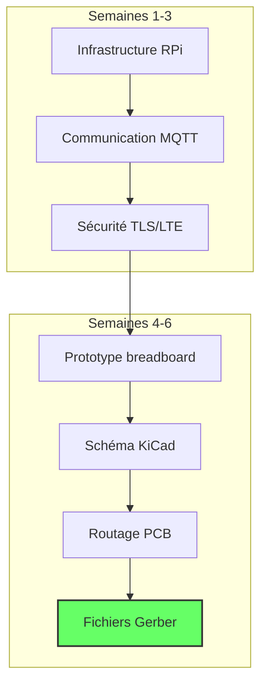
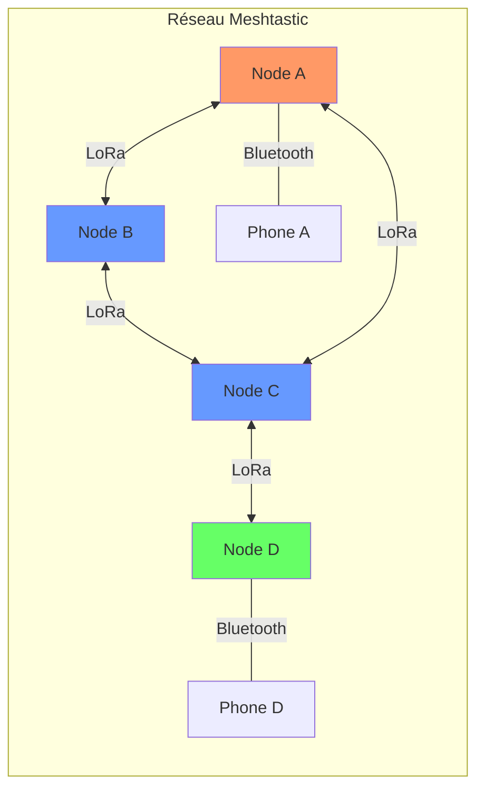

# Objets connectés
## 243-4J5-LI

Semaine 7 - Remise projet mi-session + Introduction LoRa/Meshtastic

<div class="pt-12">
  <span class="px-2 py-1 rounded cursor-pointer" hover="bg-white bg-opacity-10">
    Francis Poisson - Cégep Limoilou - H26
  </span>
</div>

---
layout: section
---

# Projet de mi-session
## Remise et évaluation

---

# Bilan du projet Shield LilyGO

### Ce que vous avez accompli

<div class="grid grid-cols-2 gap-4">

<div>

<v-click>



</v-click>

</div>

<div>

<v-click>

### Compétences développées

- Infrastructure IoT distante
- Communication MQTT sécurisée
- Conception de circuits
- CAO avec KiCad
- Documentation technique
- Gestion de projet GitHub

</v-click>

</div>

</div>

---

# Évaluation du projet

### Pondération : 30% de la note finale

<div class="grid grid-cols-3 gap-3">

<div class="p-3 bg-blue-500 bg-opacity-20 rounded-lg">

### Capacité 1 (20%)

<v-click>

**Matériel et conception**

- Schéma électronique correct
- Routage PCB fonctionnel
- Fichiers Gerber valides
- Respect des contraintes
- Code Arduino fonctionnel

</v-click>

</div>

<div class="p-3 bg-green-500 bg-opacity-20 rounded-lg">

### Capacité 2 (10%)

<v-click>

**Intégration et documentation**

- Communication MQTT
- Interface Python RPi
- Documentation GitHub
- API MQTT documentée
- Organisation du dépôt

</v-click>

</div>

<div class="p-3 bg-purple-500 bg-opacity-20 rounded-lg">

### Critères qualité

<v-click>

- Fonctionnalité
- Respect des normes
- Clarté du code
- Qualité documentation
- Professionnalisme

</v-click>

</div>

</div>

---

# Remise des projets

### Procédure de remise

<v-clicks>

1. **Dépôt GitHub** : Code, documentation, images
2. **Fichiers KiCad** : Projet complet (.kicad_pro, .kicad_sch, .kicad_pcb)
3. **Fichiers Gerber** : Dans un dossier `gerbers/`
4. **Démonstration** : Fonctionnement du prototype breadboard
5. **Questions** : L'enseignant peut poser des questions sur votre conception

</v-clicks>

<v-click>

<div class="mt-4 p-2 bg-orange-500 bg-opacity-20 rounded-lg text-center text-sm">

**Commande des PCB** : Les fichiers Gerber validés seront envoyés au fabricant cette semaine.

</div>

</v-click>

---

# Prochaines étapes du projet

### Après la remise

<div class="grid grid-cols-3 gap-3">

<div class="p-3 bg-gray-200 rounded-lg text-sm">

### Semaine 7-9

<v-click>

- PCB en fabrication
- Début module LoRa
- Apprentissage Meshtastic

</v-click>

</div>

<div class="p-3 bg-blue-500 bg-opacity-20 rounded-lg text-sm">

### Semaine 10

<v-click>

- **Réception des PCB**
- Soudure des composants
- Tests électriques
- Intégration finale

</v-click>

</div>

<div class="p-3 bg-green-500 bg-opacity-20 rounded-lg text-sm">

### Semaine 11+

<v-click>

- Shield fonctionnel
- Intégration avec LoRa
- Projet final

</v-click>

</div>

</div>

---
layout: section
---

# Partie 1
## Introduction à LoRa

---

# Qu'est-ce que LoRa?

### Long Range - Communication longue portée

<div class="grid grid-cols-2 gap-6">

<div>

<v-clicks>

- **Lo**ng **Ra**nge = Longue portée
- Technologie radio **propriétaire** (Semtech)
- Portée : **2-15 km** (rural), **1-5 km** (urbain)
- Faible consommation énergétique
- Faible débit (0.3 - 50 kbps)
- Bande ISM sans licence

</v-clicks>

</div>

<div>

<v-click>

### Caractéristiques clés

| Paramètre | Valeur |
|-----------|--------|
| Fréquence | 915 MHz (Amérique) |
| Portée | 2-15 km |
| Débit | 0.3-50 kbps |
| Consommation | ~50 mA TX |
| Sensibilité | -137 dBm |

</v-click>

</div>

</div>

<v-click>

<div class="mt-2 p-2 bg-blue-500 bg-opacity-20 rounded-lg text-center text-sm">

LoRa sacrifie le **débit** pour gagner en **portée** et **efficacité énergétique**.

</div>

</v-click>

---

# Modulation CSS

### Chirp Spread Spectrum

<div class="grid grid-cols-2 gap-6">

<div>

<v-click>

### Qu'est-ce qu'un chirp?

- Signal dont la fréquence **varie** dans le temps
- **Up-chirp** : fréquence augmente
- **Down-chirp** : fréquence diminue
- Très résistant aux interférences

</v-click>

<v-click>

### Avantages du CSS

- Fonctionne **sous le bruit** (SNR négatif!)
- Résistant au **multipath**
- Faible sensibilité au **Doppler**
- Synchronisation facile

</v-click>

</div>

<div>

<v-click>

### Visualisation d'un chirp

```
Fréquence
    ↑
    │     ╱╲
    │   ╱    ╲
    │ ╱        ╲
    │╱          ╲
    └────────────→ Temps

    Up-chirp    Down-chirp
```

</v-click>

<v-click>

<div class="mt-2 p-2 bg-green-500 bg-opacity-20 rounded-lg text-sm">

Le récepteur cherche la **corrélation** avec le pattern chirp connu.

</div>

</v-click>

</div>

</div>

---

# Paramètres LoRa

### SF, BW et CR

<div class="grid grid-cols-3 gap-3">

<div class="p-3 bg-blue-500 bg-opacity-20 rounded-lg text-sm">

### Spreading Factor (SF)

<v-click>

- SF7 à SF12
- SF élevé = plus de portée
- SF élevé = moins de débit
- Chaque +1 SF = portée x2
- Chaque +1 SF = débit /2

</v-click>

</div>

<div class="p-3 bg-green-500 bg-opacity-20 rounded-lg text-sm">

### Bandwidth (BW)

<v-click>

- 125, 250, 500 kHz
- BW large = plus de débit
- BW étroit = plus de portée
- Typique : **125 kHz**

</v-click>

</div>

<div class="p-3 bg-purple-500 bg-opacity-20 rounded-lg text-sm">

### Coding Rate (CR)

<v-click>

- 4/5, 4/6, 4/7, 4/8
- Redondance pour correction
- Plus élevé = plus robuste
- Typique : **4/5**

</v-click>

</div>

</div>

<v-click>

<div class="mt-4 p-2 bg-orange-500 bg-opacity-20 rounded-lg text-center text-sm">

**Compromis** : Portée ↔ Débit ↔ Consommation

</div>

</v-click>

---

# Portée vs Débit

### Impact du Spreading Factor

<v-click>

| SF | Débit (125kHz) | Portée typique | Temps/256 bytes |
|:--:|:--------------:|:--------------:|:---------------:|
| 7 | 5.5 kbps | 2-3 km | ~0.4 s |
| 8 | 3.1 kbps | 3-5 km | ~0.7 s |
| 9 | 1.8 kbps | 5-7 km | ~1.3 s |
| 10 | 1.0 kbps | 7-10 km | ~2.3 s |
| 11 | 0.6 kbps | 10-13 km | ~4.1 s |
| 12 | 0.3 kbps | 13-15+ km | ~7.4 s |

</v-click>

<v-click>

<div class="mt-2 p-2 bg-blue-500 bg-opacity-20 rounded-lg text-center text-sm">

**SF12** : Un message de 256 octets prend **7 secondes** à transmettre!

</div>

</v-click>

---

# Bandes de fréquences

### Réglementation par région

<v-click>

| Région | Fréquence | Puissance max |
|--------|-----------|---------------|
| **Amérique du Nord** | 902-928 MHz | 30 dBm (1W) |
| Europe | 863-870 MHz | 14 dBm |
| Asie (CN) | 470-510 MHz | 17 dBm |
| Australie | 915-928 MHz | 30 dBm |

</v-click>

<v-click>

### Au Canada (915 MHz)

- Bande ISM **sans licence**
- Puissance max : **30 dBm** (1 Watt)
- Duty cycle : pas de limite légale stricte
- Respecter les bonnes pratiques (partage équitable)

</v-click>

<v-click>

<div class="mt-2 p-2 bg-green-500 bg-opacity-20 rounded-lg text-center text-sm">

**915 MHz** = Notre fréquence pour Meshtastic au Québec!

</div>

</v-click>

---

# LoRa vs autres technologies

### Comparaison

<v-click>

| Technologie | Portée | Débit | Conso. | Coût |
|-------------|--------|-------|--------|------|
| **LoRa** | 15 km | 50 kbps | Faible | Faible |
| WiFi | 100 m | 100+ Mbps | Élevée | Faible |
| LTE | 10 km | 100 Mbps | Élevée | Abonnement |
| Bluetooth | 10 m | 2 Mbps | Faible | Faible |
| Zigbee | 100 m | 250 kbps | Faible | Moyen |
| Sigfox | 50 km | 100 bps | Très faible | Abonnement |

</v-click>

<v-click>

<div class="mt-2 p-2 bg-blue-500 bg-opacity-20 rounded-lg text-center text-sm">

**LoRa** : Le meilleur compromis pour l'IoT longue portée sans abonnement!

</div>

</v-click>

---

# Cas d'utilisation de LoRa

### Applications idéales

<div class="grid grid-cols-2 gap-4">

<div class="p-3 bg-blue-500 bg-opacity-20 rounded-lg">

### Agriculture

<v-click>

- Capteurs de sol (humidité, pH)
- Surveillance du bétail (GPS)
- Stations météo distribuées
- Gestion de l'irrigation

</v-click>

</div>

<div class="p-3 bg-green-500 bg-opacity-20 rounded-lg">

### Ville intelligente

<v-click>

- Compteurs d'eau/gaz
- Stationnement intelligent
- Éclairage public
- Gestion des déchets

</v-click>

</div>

<div class="p-3 bg-purple-500 bg-opacity-20 rounded-lg">

### Industrie

<v-click>

- Surveillance d'équipements
- Tracking d'assets
- Détection de fuites
- Maintenance prédictive

</v-click>

</div>

<div class="p-3 bg-orange-500 bg-opacity-20 rounded-lg">

### Personnel

<v-click>

- Communication hors réseau
- Randonnée/camping
- Urgences/catastrophes
- Événements extérieurs

</v-click>

</div>

</div>

---
layout: section
---

# Partie 2
## Meshtastic

---

# Qu'est-ce que Meshtastic?

### Réseau mesh décentralisé

<div class="grid grid-cols-2 gap-6">

<div>

<v-clicks>

- **Firmware open source** pour radios LoRa
- Réseau **mesh** (maillé) peer-to-peer
- **Aucune infrastructure** requise
- Communication **hors réseau**
- Chiffrement **AES-256**
- GPS intégré pour localisation

</v-clicks>

</div>

<div>

<v-click>

### Fonctionnalités

- Messagerie texte
- Partage de position GPS
- Telemetry (capteurs)
- Canaux multiples
- Répétition automatique
- Interface smartphone (Bluetooth)

</v-click>

</div>

</div>

<v-click>

<div class="mt-2 p-2 bg-green-500 bg-opacity-20 rounded-lg text-center text-sm">

Meshtastic transforme des radios LoRa en **réseau de communication autonome**.

</div>

</v-click>

---

# Architecture mesh

### Comment ça fonctionne?

<v-click>



</v-click>

<v-click>

### Caractéristiques du mesh

- Chaque nœud peut **relayer** les messages
- Pas de nœud **central** (décentralisé)
- Le réseau s'**auto-configure**
- **Résilience** : si un nœud tombe, le réseau s'adapte

</v-click>

---

# Répétition des messages

### Multi-hop routing

<div class="grid grid-cols-2 gap-6">

<div>

<v-click>

### Le problème

- Node A veut parler à Node D
- A et D sont trop loin (hors portée)
- Portée LoRa : ~5 km

</v-click>

<v-click>

### La solution Meshtastic

1. A envoie le message
2. B et C **reçoivent** et **relayent**
3. D reçoit via C
4. Portée effective : **3 x 5 km = 15 km**

</v-click>

</div>

<div>

<v-click>

### Paramètres de répétition

```
Hop Limit: 3 (défaut)
```

| Hops | Portée théorique |
|:----:|:----------------:|
| 1 | 5 km |
| 2 | 10 km |
| 3 | 15 km |
| 4 | 20 km |
| 5 | 25 km |

</v-click>

<v-click>

<div class="mt-2 p-2 bg-orange-500 bg-opacity-20 rounded-lg text-sm">

Plus de hops = plus de latence et trafic réseau.

</div>

</v-click>

</div>

</div>

---

# Canaux Meshtastic

### Organisation de la communication

<div class="grid grid-cols-2 gap-6">

<div>

<v-click>

### Types de canaux

- **Primary** : Canal principal (obligatoire)
- **Secondary** : Canaux additionnels (0-7)
- Chaque canal a sa propre **clé de chiffrement**

</v-click>

<v-click>

### Configuration d'un canal

```
Name: MonCanal
Key: AES-256 (auto-généré)
Uplink: false
Downlink: false
```

</v-click>

</div>

<div>

<v-click>

### Presets de canal

| Preset | SF | BW | Usage |
|--------|:--:|:--:|-------|
| Short/Fast | 7 | 250 | Courte portée, rapide |
| Short/Slow | 8 | 250 | Courte, plus fiable |
| Medium/Fast | 9 | 250 | **Défaut** |
| Medium/Slow | 10 | 250 | Plus de portée |
| Long/Fast | 11 | 125 | Longue portée |
| Long/Slow | 12 | 125 | Maximum portée |

</v-click>

</div>

</div>

---

# Modes de fonctionnement

### Rôles des nœuds

<v-click>

| Mode | Description | Usage |
|------|-------------|-------|
| **Client** | Nœud normal avec app | Utilisateur mobile |
| **Client Mute** | Reçoit sans transmettre | Monitoring silencieux |
| **Router** | Relaye les messages | Nœud fixe, répéteur |
| **Router Client** | Router + client | Nœud polyvalent |
| **Repeater** | Répéteur pur | Infrastructure |
| **Tracker** | Envoie position GPS | Suivi d'asset |
| **Sensor** | Envoie telemetry | Station météo |

</v-click>

<v-click>

<div class="mt-2 p-2 bg-blue-500 bg-opacity-20 rounded-lg text-center text-sm">

Pour notre cours : **Client** sur mobile, **Router Client** sur T-Beam fixe.

</div>

</v-click>

---

# Sécurité Meshtastic

### Chiffrement et confidentialité

<div class="grid grid-cols-2 gap-6">

<div>

<v-click>

### Chiffrement AES-256

- Chaque canal a sa **clé unique**
- Messages **chiffrés** de bout en bout
- Clé partagée entre les nœuds du canal
- Impossible de déchiffrer sans la clé

</v-click>

<v-click>

### Partage de clé

- Via **QR code** (recommandé)
- URL de configuration
- Saisie manuelle (déconseillé)

</v-click>

</div>

<div>

<v-click>

### Limitations

- Métadonnées **non chiffrées** :
  - Qui parle (node ID)
  - Quand (timestamp)
  - Taille du message
- Position GPS optionnelle
- Canal public = pas de sécurité

</v-click>

<v-click>

<div class="mt-2 p-2 bg-orange-500 bg-opacity-20 rounded-lg text-sm">

Le canal par défaut a une clé **publique connue**. Créez votre propre canal!

</div>

</v-click>

</div>

</div>

---

# Applications Meshtastic

### Interface utilisateur

<div class="grid grid-cols-3 gap-3">

<div class="p-3 bg-blue-500 bg-opacity-20 rounded-lg text-sm">

### Mobile (Android/iOS)

<v-click>

- **Meshtastic App** officielle
- Connexion Bluetooth
- Messagerie complète
- Carte avec positions
- Configuration du nœud

</v-click>

</div>

<div class="p-3 bg-green-500 bg-opacity-20 rounded-lg text-sm">

### Web

<v-click>

- Interface navigateur
- Via WiFi ou Serial
- Configuration avancée
- Visualisation réseau
- client.meshtastic.org

</v-click>

</div>

<div class="p-3 bg-purple-500 bg-opacity-20 rounded-lg text-sm">

### CLI / Python

<v-click>

- `meshtastic` CLI
- API Python complète
- Automatisation
- Intégration projets
- Scripts personnalisés

</v-click>

</div>

</div>

<v-click>

<div class="mt-4 p-2 bg-orange-500 bg-opacity-20 rounded-lg text-center text-sm">

Pour notre cours : **App mobile** + **CLI Python** pour l'intégration.

</div>

</v-click>

---
layout: section
---

# Partie 3
## T-Beam SUPREME

---

# LilyGO T-Beam SUPREME

### Notre nouvelle carte de développement

<div class="grid grid-cols-2 gap-6">

<div>

<v-click>

### Caractéristiques

- **MCU** : ESP32-S3 (dual-core, 240 MHz)
- **LoRa** : SX1262 (915 MHz)
- **GPS** : L76K ou UC6580
- **Batterie** : Support 18650
- **Connectivité** : WiFi, Bluetooth 5
- **USB** : Type-C

</v-click>

</div>

<div>

<v-click>

### Spécifications LoRa SX1262

| Paramètre | Valeur |
|-----------|--------|
| Fréquence | 850-930 MHz |
| Puissance TX | +22 dBm |
| Sensibilité | -137 dBm |
| Courant TX | 118 mA |
| Courant RX | 4.6 mA |

</v-click>

</div>

</div>

<v-click>

<div class="mt-2 p-2 bg-green-500 bg-opacity-20 rounded-lg text-center text-sm">

La carte **idéale** pour Meshtastic : LoRa + GPS + batterie intégrée!

</div>

</v-click>

---

# Anatomie du T-Beam SUPREME

### Composants principaux

<v-click>

```
┌─────────────────────────────────────────────┐
│  [GPS]                              [LoRa]  │
│   ANT                                 ANT   │
│    ○                                   ○    │
│                                             │
│  ┌─────────────────────────────────────┐   │
│  │                                     │   │
│  │           ESP32-S3                  │   │
│  │                                     │   │
│  └─────────────────────────────────────┘   │
│                                             │
│  [USB-C]    [PWR]    [RST]    [USR]        │
│     □         ○        ○        ○          │
│                                             │
│  ╔═════════════════════════════════════╗   │
│  ║         Batterie 18650              ║   │
│  ╚═════════════════════════════════════╝   │
└─────────────────────────────────────────────┘
```

</v-click>

---

# Connexions et broches

### Interfaces disponibles

<div class="grid grid-cols-2 gap-4">

<div>

<v-click>

### Communication

| Interface | Usage |
|-----------|-------|
| USB-C | Programmation, alimentation |
| WiFi | Configuration, gateway |
| Bluetooth | App mobile |
| GPIO | Extensions, capteurs |

</v-click>

</div>

<div>

<v-click>

### Boutons

| Bouton | Fonction |
|--------|----------|
| RST | Reset de la carte |
| USR | Bouton utilisateur |
| PWR | Alimentation ON/OFF |

</v-click>

</div>

</div>

<v-click>

<div class="mt-4 p-2 bg-blue-500 bg-opacity-20 rounded-lg text-center text-sm">

**Important** : Connecter les antennes LoRa et GPS **avant** de mettre sous tension!

</div>

</v-click>

---

# Flash du firmware Meshtastic

### Installation sur T-Beam SUPREME

<div class="grid grid-cols-2 gap-4">

<div>

<v-click>

### Méthode 1 : Web Flasher

1. Aller sur **flasher.meshtastic.org**
2. Connecter le T-Beam en USB
3. Sélectionner **T-Beam Supreme**
4. Cliquer **Flash**
5. Attendre la fin

</v-click>

<v-click>

<div class="p-2 bg-green-500 bg-opacity-20 rounded-lg text-sm mt-2">

**Recommandé** : Simple et fiable!

</div>

</v-click>

</div>

<div>

<v-click>

### Méthode 2 : CLI Python

```bash
# Installer le CLI
pip install meshtastic

# Flasher le firmware
meshtastic --flash

# Ou version spécifique
meshtastic --flash --version 2.x.x
```

</v-click>

<v-click>

<div class="p-2 bg-blue-500 bg-opacity-20 rounded-lg text-sm mt-2">

Utile pour scripts et automatisation.

</div>

</v-click>

</div>

</div>

---

# Configuration initiale

### Premiers pas avec Meshtastic

<v-clicks>

1. **Connecter l'antenne LoRa** (IMPORTANT!)
2. **Alimenter** le T-Beam (USB ou batterie)
3. **Attendre** le boot (LED clignote)
4. **Connecter** l'app mobile via Bluetooth
5. **Configurer** :
   - Nom du nœud
   - Région : **US** (915 MHz)
   - Canal : garder défaut ou créer
6. **Tester** : envoyer un message

</v-clicks>

<v-click>

<div class="mt-2 p-2 bg-red-500 bg-opacity-20 rounded-lg text-center text-sm">

**ATTENTION** : Ne JAMAIS alimenter sans antenne LoRa! Risque de dommage au module.

</div>

</v-click>

---

# Configuration via CLI

### Commandes meshtastic essentielles

```bash {all|1-2|4-5|7-8|10-11|13-14}
# Voir la configuration actuelle
meshtastic --info

# Définir le nom du nœud
meshtastic --set-owner "MonT-Beam"

# Configurer la région (obligatoire!)
meshtastic --set lora.region US

# Voir les nœuds du réseau
meshtastic --nodes

# Envoyer un message
meshtastic --sendtext "Hello Mesh!"

# Configurer un canal
meshtastic --ch-set name "MaChaineSecrete" --ch-index 0
```

<v-click>

<div class="mt-2 p-2 bg-blue-500 bg-opacity-20 rounded-lg text-center text-sm">

Le CLI permet une configuration **scriptée** et **reproductible**.

</div>

</v-click>

---

# Test de communication

### Premier message mesh

<div class="grid grid-cols-2 gap-6">

<div>

<v-click>

### Avec 2 T-Beam

1. Flasher Meshtastic sur les deux
2. Configurer la même région (US)
3. Sur le même canal (défaut OK)
4. Envoyer un message depuis un nœud
5. Vérifier la réception sur l'autre

</v-click>

<v-click>

### Indicateurs de succès

- Message reçu sur l'autre nœud
- ACK (accusé de réception)
- RSSI et SNR affichés

</v-click>

</div>

<div>

<v-click>

### Métriques importantes

| Métrique | Signification |
|----------|---------------|
| **RSSI** | Force du signal (dBm) |
| **SNR** | Rapport signal/bruit (dB) |
| **Hops** | Nombre de sauts |
| **Time** | Délai de transmission |

</v-click>

<v-click>

<div class="mt-2 p-2 bg-green-500 bg-opacity-20 rounded-lg text-sm">

RSSI > -100 dBm et SNR > 0 = bonne réception

</div>

</v-click>

</div>

</div>

---
layout: section
---

# Travail de la semaine
## Remise et découverte LoRa

---

# Objectifs du laboratoire

### Deux activités principales

<div class="grid grid-cols-2 gap-4">

<div class="p-3 bg-orange-500 bg-opacity-20 rounded-lg">

### Remise projet (1h30)

<v-clicks>

- Vérification des dépôts GitHub
- Validation des fichiers Gerber
- Démonstration du prototype
- Questions sur la conception
- Collecte des fichiers pour commande

</v-clicks>

</div>

<div class="p-3 bg-blue-500 bg-opacity-20 rounded-lg">

### Découverte Meshtastic (1h30)

<v-clicks>

- Distribution des T-Beam SUPREME
- Flash du firmware Meshtastic
- Configuration initiale
- Connexion app mobile
- Premier test de communication

</v-clicks>

</div>

</div>

---

# Checklist remise projet

### Avez-vous tout?

<div class="grid grid-cols-2 gap-4 text-sm">

<div>

### Fichiers requis

<v-click>

- [ ] Projet KiCad complet
- [ ] Schéma .kicad_sch
- [ ] PCB .kicad_pcb
- [ ] Gerbers dans `gerbers/`
- [ ] Code Arduino
- [ ] Code Python RPi

</v-click>

</div>

<div>

### Documentation

<v-click>

- [ ] README.md complet
- [ ] Schéma PDF
- [ ] Images PCB 3D
- [ ] API MQTT documentée
- [ ] Instructions d'utilisation

</v-click>

</div>

</div>

<v-click>

<div class="mt-4 p-2 bg-red-500 bg-opacity-20 rounded-lg text-center text-sm">

**Pas de fichiers = pas de note!** Vérifiez votre dépôt maintenant.

</div>

</v-click>

---

# Travaux pour la semaine prochaine

### Préparation au module LoRa

<div class="grid grid-cols-2 gap-6">

<div>

### Lecture recommandée

<v-click>

- Documentation Meshtastic
- Concepts de base LoRa
- Interface Python meshtastic
- Architecture réseau mesh

</v-click>

</div>

<div>

### Préparation pratique

<v-click>

- Installer l'app Meshtastic (mobile)
- Installer CLI : `pip install meshtastic`
- Familiarisation avec l'interface
- Tester la connexion Bluetooth

</v-click>

</div>

</div>

<v-click>

<div class="mt-4 p-2 bg-blue-500 bg-opacity-20 rounded-lg text-center">

**Semaine prochaine** : Configuration avancée et tests de portée!

</div>

</v-click>

---
layout: center
class: text-center
---

# Questions?

<div class="text-xl mt-8">
Bonne remise de projet!
</div>

<div class="mt-4 text-sm">
Semaine prochaine : Configuration avancée Meshtastic et tests de portée
</div>

---
layout: end
---

# Merci!

243-4J5-LI - Objets connectés

Semaine 7
