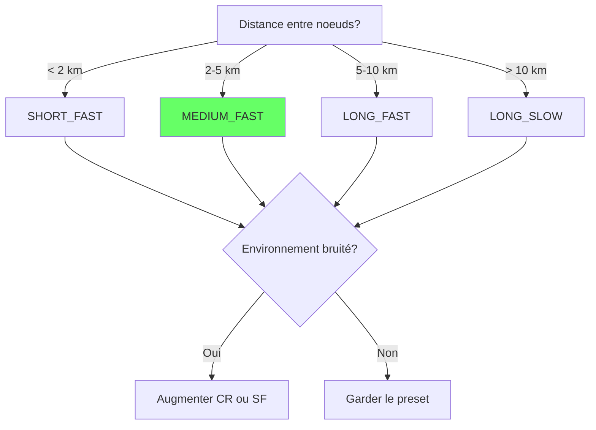
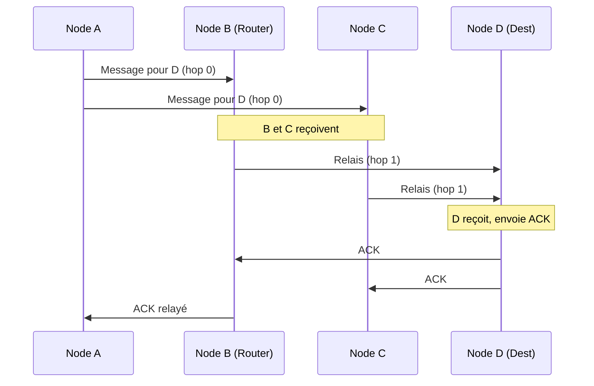

# Objets connectés
## 243-4J5-LI

Semaine 8 - Configuration avancée LoRa et réseau mesh

<div class="pt-12">
  <span class="px-2 py-1 rounded cursor-pointer" hover="bg-white bg-opacity-10">
    Francis Poisson - Cégep Limoilou - H26
  </span>
</div>

---
layout: section
---

# Récapitulatif
## Semaine 7 - Introduction LoRa/Meshtastic

---

# Ce qu'on a appris

<div class="grid grid-cols-2 gap-4">

<div>

### LoRa - Les bases

<v-clicks>

- Technologie **Long Range** (Semtech)
- Modulation **CSS** (Chirp Spread Spectrum)
- Portée : 2-15 km
- Faible débit, faible consommation
- Bande **915 MHz** (Amérique du Nord)

</v-clicks>

</div>

<div>

### Meshtastic - Les bases

<v-clicks>

- Firmware **open source**
- Réseau **mesh** décentralisé
- Chiffrement **AES-256**
- Application mobile + CLI
- T-Beam SUPREME configuré

</v-clicks>

</div>

</div>

<v-click>

<div class="mt-4 p-2 bg-blue-500 bg-opacity-20 rounded-lg text-center text-sm">

**Cette semaine** : Configuration avancée des paramètres radio et topologie mesh!

</div>

</v-click>

---
layout: section
---

# Partie 1
## Paramètres radio LoRa avancés

---

# Rappel : SF, BW, CR

### Les trois paramètres clés

<div class="grid grid-cols-3 gap-3">

<div class="p-3 bg-blue-500 bg-opacity-20 rounded-lg text-sm">

### Spreading Factor

- SF7 à SF12
- Plus élevé = plus de portée
- Plus élevé = moins de débit
- Compromis fondamental

</div>

<div class="p-3 bg-green-500 bg-opacity-20 rounded-lg text-sm">

### Bandwidth

- 125, 250, 500 kHz
- Plus large = plus de débit
- Plus étroit = plus de portée
- Affecte la sensibilité

</div>

<div class="p-3 bg-purple-500 bg-opacity-20 rounded-lg text-sm">

### Coding Rate

- 4/5 à 4/8
- Redondance pour erreurs
- Plus élevé = plus robuste
- Impact sur le temps d'air

</div>

</div>

---

# Impact du Spreading Factor

### Analyse détaillée

<v-click>

```
SF7  ████                    Rapide, courte portée
SF8  ████████
SF9  ████████████            ← Défaut Meshtastic
SF10 ████████████████
SF11 ████████████████████
SF12 ████████████████████████ Lent, longue portée

     |----|----|----|----|
     0    2    4    6    8 secondes (pour 256 bytes)
```

</v-click>

<v-click>

| SF | Sensibilité | Portée typ. | Débit | Temps/256B |
|:--:|:-----------:|:-----------:|:-----:|:----------:|
| 7 | -123 dBm | 2-3 km | 5.5 kbps | 0.4s |
| 9 | -129 dBm | 5-7 km | 1.8 kbps | 1.3s |
| 12 | -137 dBm | 13-15 km | 0.3 kbps | 7.4s |

</v-click>

---

# Sensibilité du récepteur

### Comprendre les dBm

<div class="grid grid-cols-2 gap-6">

<div>

<v-click>

### Échelle logarithmique

- **0 dBm** = 1 mW
- **-10 dBm** = 0.1 mW
- **-100 dBm** = 0.0000000001 mW
- **-137 dBm** = niveau de bruit thermique

</v-click>

<v-click>

### Plus c'est négatif, plus c'est faible

```
Fort    -50 dBm  ████████████
        -70 dBm  ████████
        -90 dBm  ████
       -110 dBm  ██
Faible -130 dBm  █
```

</v-click>

</div>

<div>

<v-click>

### Budget de liaison

$$
P_{reçue} = P_{TX} + G_{TX} - L_{path} + G_{RX}
$$

**Exemple** :
- TX : +22 dBm
- Antenne TX : +2 dBi
- Pertes : -130 dB (10 km)
- Antenne RX : +2 dBi
- **Reçu : -104 dBm**

</v-click>

<v-click>

<div class="mt-2 p-2 bg-green-500 bg-opacity-20 rounded-lg text-sm">

Si sensibilité = -129 dBm, marge = **25 dB**

</div>

</v-click>

</div>

</div>

---

# Bandwidth et compromis

### Impact sur les performances

<v-click>

| BW | Avantages | Inconvénients |
|:--:|-----------|---------------|
| 125 kHz | Meilleure sensibilité (+3dB) | Débit plus lent |
| 250 kHz | Bon compromis | Standard |
| 500 kHz | Débit maximum | Portée réduite |

</v-click>

<v-click>

### Formule du débit

$$
Débit = SF \times \frac{BW}{2^{SF}} \times CR
$$

</v-click>

<v-click>

<div class="mt-2 p-2 bg-blue-500 bg-opacity-20 rounded-lg text-center text-sm">

**Recommandation Meshtastic** : BW 250 kHz pour un bon équilibre.

</div>

</v-click>

---

# Coding Rate et robustesse

### Protection contre les erreurs

<div class="grid grid-cols-2 gap-6">

<div>

<v-click>

### Fonctionnement

- **4/5** : 4 bits utiles, 1 bit redondant (20%)
- **4/6** : 4 bits utiles, 2 bits redondants (33%)
- **4/7** : 4 bits utiles, 3 bits redondants (43%)
- **4/8** : 4 bits utiles, 4 bits redondants (50%)

</v-click>

<v-click>

### Quand augmenter le CR?

- Environnement très bruité
- Interférences fréquentes
- Importance critique des données

</v-click>

</div>

<div>

<v-click>

### Impact sur le temps d'air

```
CR 4/5  ████████████
CR 4/6  ██████████████
CR 4/7  ████████████████
CR 4/8  ██████████████████

        Temps de transmission →
```

</v-click>

<v-click>

<div class="mt-2 p-2 bg-orange-500 bg-opacity-20 rounded-lg text-sm">

Plus de redondance = plus de temps d'air = plus de consommation.

</div>

</v-click>

</div>

</div>

---

# Presets Meshtastic

### Configurations prédéfinies

<v-click>

| Preset | SF | BW | CR | Usage |
|--------|:--:|:--:|:--:|-------|
| SHORT_FAST | 7 | 250 | 4/5 | Courte portée, rapide |
| SHORT_SLOW | 8 | 250 | 4/5 | Courte, plus fiable |
| **MEDIUM_FAST** | 9 | 250 | 4/5 | **Défaut** |
| MEDIUM_SLOW | 10 | 250 | 4/5 | Moyenne portée |
| LONG_FAST | 11 | 250 | 4/5 | Longue portée |
| LONG_SLOW | 11 | 125 | 4/8 | Maximum portée |
| VERY_LONG_SLOW | 12 | 125 | 4/8 | Extrême |

</v-click>

<v-click>

### Configuration CLI

```bash
meshtastic --set lora.modem_preset LONG_FAST
```

</v-click>

---

# Choisir le bon preset

### Arbre de décision

<v-click>



</v-click>

<v-click>

<div class="mt-2 p-2 bg-blue-500 bg-opacity-20 rounded-lg text-center text-sm">

**En cas de doute** : Commencez par MEDIUM_FAST et ajustez selon les tests.

</div>

</v-click>

---
layout: section
---

# Partie 2
## Architecture mesh Meshtastic

---

# Types de noeuds

### Rôles dans le réseau

<div class="grid grid-cols-2 gap-4">

<div class="p-3 bg-blue-500 bg-opacity-20 rounded-lg text-sm">

### CLIENT

<v-click>

- Noeud **utilisateur** standard
- Envoie et reçoit des messages
- **Relaye** les messages des autres
- Connecté à l'app mobile
- Mode par défaut

</v-click>

</div>

<div class="p-3 bg-green-500 bg-opacity-20 rounded-lg text-sm">

### CLIENT_MUTE

<v-click>

- Reçoit les messages
- **Ne transmet pas**
- Monitoring silencieux
- Économie d'énergie
- Pas de contribution au mesh

</v-click>

</div>

<div class="p-3 bg-purple-500 bg-opacity-20 rounded-lg text-sm">

### ROUTER

<v-click>

- **Priorité** au relayage
- Pas d'écran/interface
- Position fixe idéale
- Consommation optimisée
- Infrastructure réseau

</v-click>

</div>

<div class="p-3 bg-orange-500 bg-opacity-20 rounded-lg text-sm">

### ROUTER_CLIENT

<v-click>

- Router **+** Client
- Relaye avec priorité
- Utilisable comme client
- Flexible
- Notre choix pour le cours

</v-click>

</div>

</div>

---

# Topologies mesh

### Configurations de réseau

<div class="grid grid-cols-2 gap-6">

<div>

<v-click>

### Étoile (Star)

```
        [Client]
           │
    [Client]─[Router]─[Client]
           │
        [Client]
```

- Router central
- Clients autour
- Simple mais point de défaillance

</v-click>

</div>

<div>

<v-click>

### Maillé (Mesh)

```
    [Node]───[Node]
       │ ╲   ╱ │
       │  ╲ ╱  │
    [Node]─X─[Node]
       │  ╱ ╲  │
       │ ╱   ╲ │
    [Node]───[Node]
```

- Connexions multiples
- Résilient
- Auto-configuration

</v-click>

</div>

</div>

---

# Algorithme de routage

### Comment les messages traversent le mesh

<v-click>



</v-click>

---

# Gestion des doublons

### Éviter la tempête de broadcast

<v-click>

### Problème : Flooding

Sans contrôle, un message serait relayé à l'infini!

</v-click>

<v-click>

### Solutions Meshtastic

1. **Hop limit** : Maximum de sauts (défaut: 3)
2. **Packet ID** : Identifier les messages déjà vus
3. **SNR-based** : Ne relayer que si meilleur signal
4. **Timing** : Délai aléatoire avant relais

</v-click>

<v-click>

### Configuration

```bash
# Définir le nombre max de hops
meshtastic --set lora.hop_limit 3
```

</v-click>

---

# Optimisation de la topologie

### Bonnes pratiques

<div class="grid grid-cols-2 gap-4">

<div>

<v-click>

### Placement des routers

- **Hauteur** : Plus c'est haut, mieux c'est
- **Ligne de vue** : Éviter les obstacles
- **Couverture** : Chevaucher les zones
- **Redondance** : Plusieurs chemins possibles

</v-click>

</div>

<div>

<v-click>

### Erreurs à éviter

- Trop de routers proches (collisions)
- Hop limit trop élevé (latence)
- Tous les noeuds en ROUTER (inutile)
- Ignorer les obstacles (bâtiments, collines)

</v-click>

</div>

</div>

<v-click>

<div class="mt-4 p-2 bg-blue-500 bg-opacity-20 rounded-lg text-center text-sm">

**Règle** : 1 router pour 5-10 clients dans une zone donnée.

</div>

</v-click>

---
layout: section
---

# Partie 3
## Tests et mesures

---

# Métriques de performance

### Ce qu'il faut mesurer

<v-click>

| Métrique | Description | Valeur idéale |
|----------|-------------|---------------|
| **RSSI** | Force du signal reçu | > -100 dBm |
| **SNR** | Rapport signal/bruit | > 0 dB |
| **Hops** | Nombre de sauts | ≤ 3 |
| **Latence** | Temps aller-retour | < 5 s |
| **PDR** | Taux de livraison | > 95% |

</v-click>

<v-click>

### Où trouver ces métriques?

- **App Meshtastic** : Onglet "Nodes"
- **CLI** : `meshtastic --nodes`
- **Debug** : `meshtastic --debug`

</v-click>

---

# Interpréter RSSI et SNR

### Guide de diagnostic

<div class="grid grid-cols-2 gap-6">

<div>

<v-click>

### RSSI (Received Signal Strength)

| RSSI | Qualité |
|:----:|---------|
| > -70 dBm | Excellent |
| -70 à -85 | Bon |
| -85 à -100 | Acceptable |
| -100 à -110 | Faible |
| < -110 | Critique |

</v-click>

</div>

<div>

<v-click>

### SNR (Signal-to-Noise Ratio)

| SNR | Qualité |
|:---:|---------|
| > 10 dB | Excellent |
| 5 à 10 | Bon |
| 0 à 5 | Acceptable |
| -5 à 0 | Faible |
| < -5 | LoRa uniquement |

</v-click>

</div>

</div>

<v-click>

<div class="mt-4 p-2 bg-green-500 bg-opacity-20 rounded-lg text-center text-sm">

**LoRa peut fonctionner avec un SNR négatif!** C'est sa force.

</div>

</v-click>

---

# Outils de diagnostic

### Commandes CLI utiles

```bash {all|1-2|4-5|7-8|10-11}
# Voir tous les noeuds et leurs métriques
meshtastic --nodes

# Informations détaillées du noeud local
meshtastic --info

# Activer le debug pour voir les paquets
meshtastic --debug

# Envoyer un ping et mesurer le temps
meshtastic --sendping
```

<v-click>

### Dans l'application

- **Node list** : RSSI, SNR, hops, dernière activité
- **Map** : Positions GPS des noeuds
- **Statistics** : Métriques réseau

</v-click>

---

# Tests de portée

### Méthodologie

<v-clicks>

1. **Préparer** deux noeuds avec batteries chargées
2. **Configurer** le même canal et preset
3. **Fixer** un noeud en position connue
4. **Déplacer** l'autre progressivement
5. **Enregistrer** à chaque point :
   - Distance (GPS ou mesurée)
   - RSSI et SNR
   - Succès/échec des messages
6. **Répéter** avec différents presets

</v-clicks>

<v-click>

<div class="mt-2 p-2 bg-orange-500 bg-opacity-20 rounded-lg text-center text-sm">

**Important** : Noter les conditions (météo, obstacles, hauteur antenne).

</div>

</v-click>

---

# Cartographie de couverture

### Documenter le réseau

<div class="grid grid-cols-2 gap-6">

<div>

<v-click>

### Données à collecter

- Position GPS de chaque noeud
- RSSI/SNR entre paires de noeuds
- Obstacles identifiés
- Zones mortes

</v-click>

<v-click>

### Outils

- Export GPS depuis Meshtastic
- QGIS (gratuit) pour cartographie
- Google Earth pour visualisation
- Feuille de calcul pour données

</v-click>

</div>

<div>

<v-click>

### Exemple de carte

```
┌─────────────────────────┐
│  [R1]       Lac         │
│    ╲                    │
│     ╲   Zone morte      │
│      ╲  ░░░░░░░         │
│  [R2]─────[R3]          │
│    │       │            │
│ [Client] [Client]       │
└─────────────────────────┘

[R] = Router
─── = Bonne connexion
```

</v-click>

</div>

</div>

---
layout: section
---

# Travail de la semaine
## Configuration réseau multi-noeuds

---

# Objectifs du laboratoire

### Mise en place d'un réseau mesh complet

<div class="grid grid-cols-2 gap-4">

<div>

### Configuration (1h30)

<v-clicks>

- [ ] Former des équipes (4-6 noeuds)
- [ ] Attribuer les rôles (1-2 Routers, reste Clients)
- [ ] Configurer les paramètres radio
- [ ] Tester différents presets
- [ ] Documenter les configurations

</v-clicks>

</div>

<div>

### Tests (1h30)

<v-clicks>

- [ ] Tests de communication inter-noeuds
- [ ] Mesure RSSI/SNR pour chaque liaison
- [ ] Test de portée (intérieur/extérieur)
- [ ] Identification des zones mortes
- [ ] Documentation des résultats

</v-clicks>

</div>

</div>

---

# Configuration recommandée

### Pour le laboratoire

<v-click>

```bash
# Configuration commune à tous les noeuds
meshtastic --set lora.region US
meshtastic --set lora.modem_preset MEDIUM_FAST
meshtastic --set lora.hop_limit 3

# Pour les routers (1-2 par groupe)
meshtastic --set device.role ROUTER_CLIENT

# Pour les clients
meshtastic --set device.role CLIENT

# Définir un nom unique
meshtastic --set-owner "Equipe1-Node1"
```

</v-click>

<v-click>

<div class="mt-4 p-2 bg-blue-500 bg-opacity-20 rounded-lg text-center text-sm">

**Tous les noeuds du groupe** doivent être sur le même canal avec la même clé!

</div>

</v-click>

---

# Fiche de test

### Template à remplir

| Test | Node A | Node B | Distance | RSSI | SNR | Succès |
|------|--------|--------|----------|:----:|:---:|:------:|
| 1 | R1 | C1 | 10m | | | |
| 2 | R1 | C2 | 50m | | | |
| 3 | R1 | C1 | 100m | | | |
| ... | | | | | | |

<v-click>

### Questions à répondre

1. Quelle est la portée maximale observée?
2. Quel preset donne les meilleurs résultats?
3. Quels obstacles affectent le plus le signal?
4. Le mesh fonctionne-t-il correctement (multi-hop)?

</v-click>

---
layout: center
class: text-center
---

# Questions?

<div class="text-xl mt-8">
Prochaine étape : Configuration et tests du réseau mesh!
</div>

<div class="mt-4 text-sm">
Semaine prochaine : Gateway WiFi et tests terrain
</div>

---
layout: end
---

# Merci!

243-4J5-LI - Objets connectés

Semaine 8
