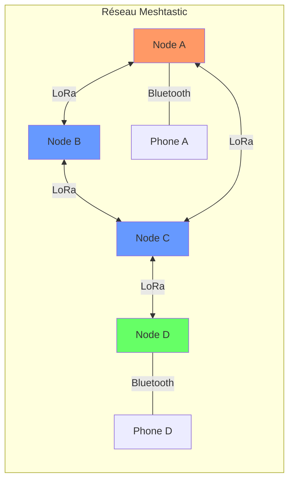

# Objets connectés
## 243-4J5-LI

Semaine 8 - Introduction à LoRa, Meshtastic et réseau mesh

<div class="pt-12">
  <span class="px-2 py-1 rounded cursor-pointer" hover="bg-white bg-opacity-10">
    Francis Poisson - Cégep Limoilou - H26
  </span>
</div>

---
layout: two-cols
---

# Où s'en va-t-on?

### Deuxième moitié de la session

<v-clicks>

- Nouveaux modules : **LilyGO T-Beam SUPREME**
- Technologie **LoRa** — communication longue portée
- Firmware **Meshtastic** — réseau mesh décentralisé
- Communication **sans infrastructure** cellulaire
- Tests terrain et cartographie de couverture

</v-clicks>

::right::

<div class="pl-4 pt-8">

<v-click>

### LilyGO T-Beam SUPREME

- Microcontrôleur **ESP32-S3**
- Radio **LoRa SX1262** (915 MHz)
- **GPS** intégré
- Batterie rechargeable
- Parfait pour Meshtastic

</v-click>

<v-click>

<div class="mt-4 p-3 bg-blue-500 bg-opacity-20 rounded-lg text-sm">

On passe du **LTE/MQTT** (infrastructure) au **LoRa/Mesh** (autonome) — deux approches complémentaires pour l'IoT.

</div>

</v-click>

</div>

---
layout: section
---

# Partie 1
## Introduction à LoRa

---

# Qu'est-ce que LoRa?

### Long Range - Communication longue portée

<div class="grid grid-cols-2 gap-6">

<div>

<v-clicks>

- **Lo**ng **Ra**nge = Longue portée
- Technologie radio **propriétaire** (Semtech)
- Portée : **2-15 km** (rural), **1-5 km** (urbain)
- Faible consommation énergétique
- Faible débit (0.3 - 50 kbps)
- Bande ISM **sans licence** (915 MHz)

</v-clicks>

</div>

<div>

<v-click>

### Caractéristiques clés

| Paramètre | Valeur |
|-----------|--------|
| Fréquence | 915 MHz (Amérique) |
| Portée | 2-15 km |
| Débit | 0.3-50 kbps |
| Consommation | ~50 mA TX |
| Sensibilité | -137 dBm |

</v-click>

</div>

</div>

<v-click>

<div class="mt-2 p-2 bg-blue-500 bg-opacity-20 rounded-lg text-center text-sm">

LoRa sacrifie le **débit** pour gagner en **portée** et **efficacité énergétique**.

</div>

</v-click>

---

# Modulation CSS

### Chirp Spread Spectrum

<div class="grid grid-cols-2 gap-6">

<div>

<v-click>

### Qu'est-ce qu'un chirp?

- Signal dont la fréquence **varie** dans le temps
- **Up-chirp** : fréquence augmente
- **Down-chirp** : fréquence diminue
- Très résistant aux interférences

</v-click>

<v-click>

### Avantages du CSS

- Fonctionne **sous le bruit** (SNR négatif!)
- Résistant au **multipath**
- Faible sensibilité au **Doppler**
- Synchronisation facile

</v-click>

</div>

<div>

<v-click>

### Visualisation d'un chirp

```
Fréquence
    ↑
    │     ╱╲
    │   ╱    ╲
    │ ╱        ╲
    │╱          ╲
    └────────────→ Temps

    Up-chirp    Down-chirp
```

</v-click>

<v-click>

<div class="mt-2 p-2 bg-green-500 bg-opacity-20 rounded-lg text-sm">

Le récepteur cherche la **corrélation** avec le pattern chirp connu.

</div>

</v-click>

</div>

</div>

---

# Paramètres LoRa

### SF, BW et CR — Les trois réglages clés

<div class="grid grid-cols-3 gap-3">

<div class="p-3 bg-blue-500 bg-opacity-20 rounded-lg text-sm">

### Spreading Factor (SF)

<v-click>

- SF7 à SF12
- SF élevé = plus de portée
- SF élevé = moins de débit
- Chaque +1 SF = portée x2
- Chaque +1 SF = débit /2

</v-click>

</div>

<div class="p-3 bg-green-500 bg-opacity-20 rounded-lg text-sm">

### Bandwidth (BW)

<v-click>

- 125, 250, 500 kHz
- BW large = plus de débit
- BW étroit = plus de portée
- Typique : **125 kHz**

</v-click>

</div>

<div class="p-3 bg-purple-500 bg-opacity-20 rounded-lg text-sm">

### Coding Rate (CR)

<v-click>

- 4/5, 4/6, 4/7, 4/8
- Redondance pour correction
- Plus élevé = plus robuste
- Typique : **4/5**

</v-click>

</div>

</div>

<v-click>

<div class="mt-4 p-2 bg-orange-500 bg-opacity-20 rounded-lg text-center text-sm">

**Compromis fondamental** : Portée ↔ Débit ↔ Consommation

</div>

</v-click>

---

# Portée vs Débit

### Impact du Spreading Factor

<v-click>

| SF | Débit (125 kHz) | Portée typique | Temps/256 bytes |
|:--:|:---------------:|:--------------:|:---------------:|
| 7 | 5.5 kbps | 2-3 km | ~0.4 s |
| 8 | 3.1 kbps | 3-5 km | ~0.7 s |
| 9 | 1.8 kbps | 5-7 km | ~1.3 s |
| 10 | 1.0 kbps | 7-10 km | ~2.3 s |
| 11 | 0.6 kbps | 10-13 km | ~4.1 s |
| 12 | 0.3 kbps | 13-15+ km | ~7.4 s |

</v-click>

<v-click>

<div class="mt-2 p-2 bg-blue-500 bg-opacity-20 rounded-lg text-center text-sm">

**SF12** : Un message de 256 octets prend **7 secondes** à transmettre!

</div>

</v-click>

---

# Bandes de fréquences

### Réglementation par région

<v-click>

| Région | Fréquence | Puissance max |
|--------|-----------|---------------|
| **Amérique du Nord** | 902-928 MHz | 30 dBm (1W) |
| Europe | 863-870 MHz | 14 dBm |
| Asie (CN) | 470-510 MHz | 17 dBm |
| Australie | 915-928 MHz | 30 dBm |

</v-click>

<v-click>

### Au Canada (915 MHz)

- Bande ISM **sans licence**
- Puissance max : **30 dBm** (1 Watt)
- Duty cycle : pas de limite légale stricte
- Respecter les bonnes pratiques (partage équitable)

</v-click>

<v-click>

<div class="mt-2 p-2 bg-green-500 bg-opacity-20 rounded-lg text-center text-sm">

**915 MHz** = Notre fréquence pour Meshtastic au Québec!

</div>

</v-click>

---

# LoRa vs autres technologies

### Comparaison

<v-click>

| Technologie | Portée | Débit | Conso. | Coût |
|-------------|--------|-------|--------|------|
| **LoRa** | 15 km | 50 kbps | Faible | Faible |
| WiFi | 100 m | 100+ Mbps | Élevée | Faible |
| LTE | 10 km | 100 Mbps | Élevée | Abonnement |
| Bluetooth | 10 m | 2 Mbps | Faible | Faible |
| Zigbee | 100 m | 250 kbps | Faible | Moyen |
| Sigfox | 50 km | 100 bps | Très faible | Abonnement |

</v-click>

<v-click>

<div class="mt-2 p-2 bg-blue-500 bg-opacity-20 rounded-lg text-center text-sm">

**LoRa** : Le meilleur compromis pour l'IoT longue portée sans abonnement!

</div>

</v-click>

---

# Cas d'utilisation de LoRa

### Applications idéales

<div class="grid grid-cols-2 gap-4">

<div class="p-3 bg-blue-500 bg-opacity-20 rounded-lg">

### Agriculture

<v-click>

- Capteurs de sol (humidité, pH)
- Surveillance du bétail (GPS)
- Stations météo distribuées
- Gestion de l'irrigation

</v-click>

</div>

<div class="p-3 bg-green-500 bg-opacity-20 rounded-lg">

### Ville intelligente

<v-click>

- Compteurs d'eau/gaz
- Stationnement intelligent
- Éclairage public
- Gestion des déchets

</v-click>

</div>

<div class="p-3 bg-purple-500 bg-opacity-20 rounded-lg">

### Industrie

<v-click>

- Surveillance d'équipements
- Tracking d'assets
- Détection de fuites
- Maintenance prédictive

</v-click>

</div>

<div class="p-3 bg-orange-500 bg-opacity-20 rounded-lg">

### Personnel

<v-click>

- Communication hors réseau
- Randonnée/camping
- Urgences/catastrophes
- Événements extérieurs

</v-click>

</div>

</div>

---
layout: section
---

# Partie 2
## Meshtastic et le T-Beam SUPREME

---

# Qu'est-ce que Meshtastic?

### Réseau mesh décentralisé

<div class="grid grid-cols-2 gap-6">

<div>

<v-clicks>

- **Firmware open source** pour radios LoRa
- Réseau **mesh** (maillé) peer-to-peer
- **Aucune infrastructure** requise
- Communication **hors réseau**
- Chiffrement **AES-256**
- GPS intégré pour localisation

</v-clicks>

</div>

<div>

<v-click>

### Fonctionnalités

- Messagerie texte
- Partage de position GPS
- Telemetry (capteurs)
- Canaux multiples
- Répétition automatique
- Interface smartphone (Bluetooth)

</v-click>

</div>

</div>

<v-click>

<div class="mt-2 p-2 bg-green-500 bg-opacity-20 rounded-lg text-center text-sm">

Meshtastic transforme des radios LoRa en **réseau de communication autonome**.

</div>

</v-click>

---

# Architecture mesh

### Comment ça fonctionne?

<v-click>


```mermaid {scale: 0.55}
graph LR
    subgraph "Réseau Meshtastic"
        A[Node A] <-->|LoRa| B[Node B]
        B <-->|LoRa| C[Node C]
        C <-->|LoRa| D[Node D]
        A <-->|LoRa| C

        A ---|Bluetooth| PA[Phone A]
        D ---|Bluetooth| PD[Phone D]
    end

    style A fill:#f96
    style B fill:#69f
    style C fill:#69f
    style D fill:#6f6
```

</v-click>

<v-click>

### Caractéristiques du mesh

- Chaque noeud peut **relayer** les messages (multi-hop)
- Pas de noeud **central** — réseau décentralisé
- Le réseau s'**auto-configure**
- **Résilience** : si un noeud tombe, le réseau s'adapte

</v-click>

---

# Répétition des messages

### Multi-hop routing

<div class="grid grid-cols-2 gap-6">

<div>

<v-click>

### Le problème

- Node A veut parler à Node D
- A et D sont trop loin (hors portée)
- Portée LoRa : ~5 km

</v-click>

<v-click>

### La solution Meshtastic

1. A envoie le message
2. B et C **reçoivent** et **relayent**
3. D reçoit via C
4. Portée effective : **3 x 5 km = 15 km**

</v-click>

</div>

<div>

<v-click>

### Paramètres de répétition

```
Hop Limit: 3 (défaut)
```

| Hops | Portée théorique |
|:----:|:----------------:|
| 1 | 5 km |
| 2 | 10 km |
| 3 | 15 km |
| 4 | 20 km |
| 5 | 25 km |

</v-click>

<v-click>

<div class="mt-2 p-2 bg-orange-500 bg-opacity-20 rounded-lg text-sm">

Plus de hops = plus de latence et trafic réseau.

</div>

</v-click>

</div>

</div>

---

# LilyGO T-Beam SUPREME

### Notre carte de développement LoRa

<div class="grid grid-cols-2 gap-6">

<div>

<v-click>

### Caractéristiques

- **MCU** : ESP32-S3 (dual-core, 240 MHz)
- **LoRa** : SX1262 (915 MHz)
- **GPS** : L76K ou UC6580
- **Batterie** : Support 18650
- **Connectivité** : WiFi, Bluetooth 5
- **USB** : Type-C

</v-click>

</div>

<div>

<v-click>

### Spécifications LoRa SX1262

| Paramètre | Valeur |
|-----------|--------|
| Fréquence | 850-930 MHz |
| Puissance TX | +22 dBm |
| Sensibilité | -137 dBm |
| Courant TX | 118 mA |
| Courant RX | 4.6 mA |

</v-click>

</div>

</div>

<v-click>

<div class="mt-2 p-2 bg-green-500 bg-opacity-20 rounded-lg text-center text-sm">

La carte **idéale** pour Meshtastic : LoRa + GPS + batterie intégrée!

</div>

</v-click>

---
layout: section
---

# Prochain projet
## Pipeline LoRa + LLM pour IoT

---

# Projet LoRa-LLM

### Évaluation sommative 3 — 20% de la note finale

<div class="grid grid-cols-2 gap-6">

<div>

<v-click>

### Objectif

Construire un pipeline qui collecte des données via **LoRa/Meshtastic**, les achemine vers un **serveur MQTT**, puis utilise un **LLM** pour analyser intelligemment les données et déclencher des actions.

</v-click>

<v-click>

### Le lien LoRa + LLM

- **LoRa** : Transport longue portée sans infrastructure
- **MQTT** : Passerelle entre le mesh et le cloud
- **LLM** : Intelligence pour interpréter les données
- Un pipeline **bout en bout** complet

</v-click>

</div>

<div>

<v-click>

### Pipeline à construire

```
┌──────────┐   ┌───────────┐
│ Capteurs │──▶│ Meshtastic│
│  (T-Beam)│   │   (LoRa)  │
└──────────┘   └─────┬─────┘
                     │
               ┌─────▼─────┐
               │  Gateway   │
               │ MQTT Bridge│
               └─────┬─────┘
                     │
               ┌─────▼─────┐
               │ Validation │
               └─────┬─────┘
                     │
               ┌─────▼─────┐
               │ Analyse    │
               │   LLM      │
               └─────┬─────┘
                     │
               ┌─────▼─────┐
               │  Actions   │
               │automatiques│
               └────────────┘
```

</v-click>

</div>

</div>

---

# Technologies du projet

### De la radio au LLM

<div class="grid grid-cols-2 gap-4">

<div class="p-3 bg-blue-500 bg-opacity-20 rounded-lg text-sm">

### Couche radio (LoRa)

<v-click>

- T-Beam SUPREME avec Meshtastic
- Capteurs : GPS, telemetry, messages
- Communication **sans infrastructure**
- Données transmises via le mesh

</v-click>

</div>

<div class="p-3 bg-green-500 bg-opacity-20 rounded-lg text-sm">

### Couche passerelle (MQTT)

<v-click>

- Gateway Meshtastic → MQTT
- Broker Mosquitto
- Topics structurés par noeud
- Format JSON standardisé

</v-click>

</div>

<div class="p-3 bg-purple-500 bg-opacity-20 rounded-lg text-sm">

### Couche intelligence (LLM)

<v-click>

- **API** : OpenAI (GPT) ou Anthropic (Claude)
- Prompt système adapté à l'IoT
- Réponses **JSON structuré**
- Analyse contextuelle des données

</v-click>

</div>

<div class="p-3 bg-orange-500 bg-opacity-20 rounded-lg text-sm">

### Couche action

<v-click>

- Alertes et notifications
- Publication MQTT de commandes
- Journalisation des analyses
- Tableau de bord (bonus)

</v-click>

</div>

</div>

---

# Ce que vous devrez faire

### Compétences évaluées

<div class="grid grid-cols-2 gap-4">

<div class="p-3 bg-blue-500 bg-opacity-20 rounded-lg text-sm">

### Configuration API (25%)

<v-click>

- Configurer une clé API **sécurisée** (fichier `.env`)
- Appels API fonctionnels avec gestion d'erreurs
- **Aucune clé** dans le code source!

</v-click>

</div>

<div class="p-3 bg-green-500 bg-opacity-20 rounded-lg text-sm">

### Prompt Engineering (25%)

<v-click>

- Rédiger un **prompt système** efficace
- Définir le rôle : analyste IoT/LoRa
- Format de réponse **JSON structuré**
- Contexte : données de capteurs mesh

</v-click>

</div>

<div class="p-3 bg-purple-500 bg-opacity-20 rounded-lg text-sm">

### Pipeline de traitement (30%)

<v-click>

- Réception MQTT des données Meshtastic
- Validation des données entrantes
- Analyse LLM **intelligente** (pas à chaque message)
- Exécution d'actions automatiques

</v-click>

</div>

<div class="p-3 bg-orange-500 bg-opacity-20 rounded-lg text-sm">

### Documentation (20%)

<v-click>

- README complet
- Architecture documentée
- Code structuré et lisible
- Qualité du français

</v-click>

</div>

</div>

---

# Calendrier et livrables

### Planification

<v-click>

| Semaine | Activité |
|:-------:|----------|
| **8** (cette semaine) | Introduction LoRa, flash Meshtastic |
| **9-10** | Réseau mesh + gateway MQTT + début pipeline LLM |
| **11** | Intégration complète LoRa → MQTT → LLM |
| **12** | **Remise du projet LoRa-LLM** |

</v-click>

<v-click>

### Format de remise

- **Dépôt Git** : branche `prenom-nom/projet-llm`
- **Structure** : `src/`, `prompts/`, `docs/`, `.env.example`
- **Démonstration** : Pipeline fonctionnel (données LoRa → analyse LLM)

</v-click>

<v-click>

<div class="mt-2 p-1 bg-red-500 bg-opacity-20 rounded-lg text-center text-sm">

**Sécurité** : Toute clé API exposée dans le code ou l'historique git = pénalité automatique (-20 points).

</div>

</v-click>

---
layout: center
class: text-center
---

# Questions?

<div class="text-xl mt-8">
Prochaine étape : Flash Meshtastic et configuration du réseau mesh!
</div>

<div class="mt-4 text-sm">
Semaine prochaine : Gateway WiFi, tests terrain et cartographie de couverture
</div>

---
layout: end
---

# Merci!

243-4J5-LI - Objets connectés

Semaine 8
