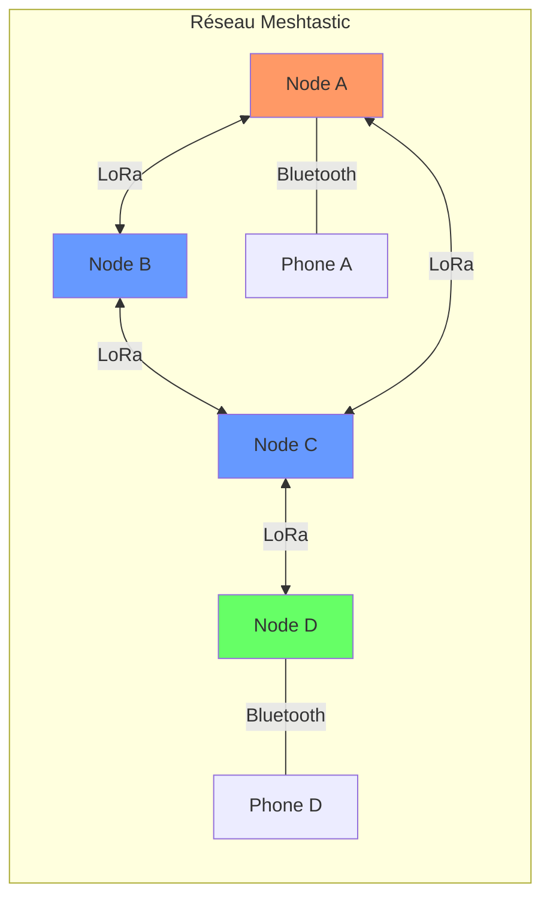
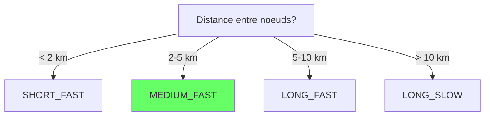
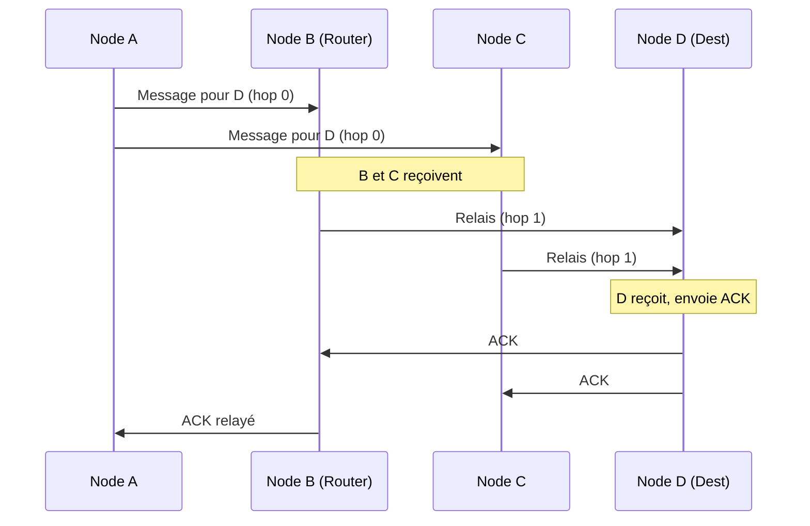

# Objets connectés
## 243-4J5-LI

Semaine 8 - Introduction à LoRa, Meshtastic et réseau mesh

<div class="pt-12">
  <span class="px-2 py-1 rounded cursor-pointer" hover="bg-white bg-opacity-10">
    Francis Poisson - Cégep Limoilou - H26
  </span>
</div>

---
layout: two-cols
---

# Où s'en va-t-on?

### Deuxième moitié de la session

<v-clicks>

- Nouveaux modules : **LilyGO T-Beam SUPREME**
- Technologie **LoRa** — communication longue portée
- Firmware **Meshtastic** — réseau mesh décentralisé
- Communication **sans infrastructure** cellulaire
- Tests terrain et cartographie de couverture

</v-clicks>

::right::

<div class="pl-4 pt-8">

<v-click>

### LilyGO T-Beam SUPREME

- Microcontrôleur **ESP32-S3**
- Radio **LoRa SX1262** (915 MHz)
- **GPS** intégré
- Batterie rechargeable
- Parfait pour Meshtastic

</v-click>

<v-click>

<div class="mt-4 p-3 bg-blue-500 bg-opacity-20 rounded-lg text-sm">

On passe du **LTE/MQTT** (infrastructure) au **LoRa/Mesh** (autonome) — deux approches complémentaires pour l'IoT.

</div>

</v-click>

</div>

---
layout: section
---

# Partie 1
## Introduction à LoRa

---

# Qu'est-ce que LoRa?

### Long Range - Communication longue portée

<div class="grid grid-cols-2 gap-6">

<div>

<v-clicks>

- **Lo**ng **Ra**nge = Longue portée
- Technologie radio **propriétaire** (Semtech)
- Portée : **2-15 km** (rural), **1-5 km** (urbain)
- Faible consommation énergétique
- Faible débit (0.3 - 50 kbps)
- Bande ISM **sans licence** (915 MHz)

</v-clicks>

</div>

<div>

<v-click>

### Caractéristiques clés

| Paramètre | Valeur |
|-----------|--------|
| Fréquence | 915 MHz (Amérique) |
| Portée | 2-15 km |
| Débit | 0.3-50 kbps |
| Consommation | ~50 mA TX |
| Sensibilité | -137 dBm |

</v-click>

</div>

</div>

<v-click>

<div class="mt-2 p-2 bg-blue-500 bg-opacity-20 rounded-lg text-center text-sm">

LoRa sacrifie le **débit** pour gagner en **portée** et **efficacité énergétique**.

</div>

</v-click>

---

# Modulation CSS

### Chirp Spread Spectrum

<div class="grid grid-cols-2 gap-6">

<div>

<v-click>

### Qu'est-ce qu'un chirp?

- Signal dont la fréquence **varie** dans le temps
- **Up-chirp** : fréquence augmente
- **Down-chirp** : fréquence diminue
- Très résistant aux interférences

</v-click>

<v-click>

### Avantages du CSS

- Fonctionne **sous le bruit** (SNR négatif!)
- Résistant au **multipath**
- Faible sensibilité au **Doppler**
- Synchronisation facile

</v-click>

</div>

<div>

<v-click>

### Visualisation d'un chirp

```
Fréquence
    ↑
    │     ╱╲
    │   ╱    ╲
    │ ╱        ╲
    │╱          ╲
    └────────────→ Temps

    Up-chirp    Down-chirp
```

</v-click>

<v-click>

<div class="mt-2 p-2 bg-green-500 bg-opacity-20 rounded-lg text-sm">

Le récepteur cherche la **corrélation** avec le pattern chirp connu.

</div>

</v-click>

</div>

</div>

---

# Paramètres LoRa

### SF, BW et CR — Les trois réglages clés

<div class="grid grid-cols-3 gap-3">

<div class="p-3 bg-blue-500 bg-opacity-20 rounded-lg text-sm">

### Spreading Factor (SF)

<v-click>

- SF7 à SF12
- SF élevé = plus de portée
- SF élevé = moins de débit
- Chaque +1 SF = portée x2
- Chaque +1 SF = débit /2

</v-click>

</div>

<div class="p-3 bg-green-500 bg-opacity-20 rounded-lg text-sm">

### Bandwidth (BW)

<v-click>

- 125, 250, 500 kHz
- BW large = plus de débit
- BW étroit = plus de portée
- Typique : **125 kHz**

</v-click>

</div>

<div class="p-3 bg-purple-500 bg-opacity-20 rounded-lg text-sm">

### Coding Rate (CR)

<v-click>

- 4/5, 4/6, 4/7, 4/8
- Redondance pour correction
- Plus élevé = plus robuste
- Typique : **4/5**

</v-click>

</div>

</div>

<v-click>

<div class="mt-4 p-2 bg-orange-500 bg-opacity-20 rounded-lg text-center text-sm">

**Compromis fondamental** : Portée ↔ Débit ↔ Consommation

</div>

</v-click>

---

# Portée vs Débit

### Impact du Spreading Factor

<v-click>

| SF | Débit (125 kHz) | Portée typique | Temps/256 bytes |
|:--:|:---------------:|:--------------:|:---------------:|
| 7 | 5.5 kbps | 2-3 km | ~0.4 s |
| 8 | 3.1 kbps | 3-5 km | ~0.7 s |
| 9 | 1.8 kbps | 5-7 km | ~1.3 s |
| 10 | 1.0 kbps | 7-10 km | ~2.3 s |
| 11 | 0.6 kbps | 10-13 km | ~4.1 s |
| 12 | 0.3 kbps | 13-15+ km | ~7.4 s |

</v-click>

<v-click>

<div class="mt-2 p-2 bg-blue-500 bg-opacity-20 rounded-lg text-center text-sm">

**SF12** : Un message de 256 octets prend **7 secondes** à transmettre!

</div>

</v-click>

---

# Bandes de fréquences

### Réglementation par région

<v-click>

| Région | Fréquence | Puissance max |
|--------|-----------|---------------|
| **Amérique du Nord** | 902-928 MHz | 30 dBm (1W) |
| Europe | 863-870 MHz | 14 dBm |
| Asie (CN) | 470-510 MHz | 17 dBm |
| Australie | 915-928 MHz | 30 dBm |

</v-click>

<v-click>

### Au Canada (915 MHz)

- Bande ISM **sans licence**
- Puissance max : **30 dBm** (1 Watt)
- Duty cycle : pas de limite légale stricte
- Respecter les bonnes pratiques (partage équitable)

</v-click>

<v-click>

<div class="mt-2 p-2 bg-green-500 bg-opacity-20 rounded-lg text-center text-sm">

**915 MHz** = Notre fréquence pour Meshtastic au Québec!

</div>

</v-click>

---

# LoRa vs autres technologies

### Comparaison

<v-click>

| Technologie | Portée | Débit | Conso. | Coût |
|-------------|--------|-------|--------|------|
| **LoRa** | 15 km | 50 kbps | Faible | Faible |
| WiFi | 100 m | 100+ Mbps | Élevée | Faible |
| LTE | 10 km | 100 Mbps | Élevée | Abonnement |
| Bluetooth | 10 m | 2 Mbps | Faible | Faible |
| Zigbee | 100 m | 250 kbps | Faible | Moyen |
| Sigfox | 50 km | 100 bps | Très faible | Abonnement |

</v-click>

<v-click>

<div class="mt-2 p-2 bg-blue-500 bg-opacity-20 rounded-lg text-center text-sm">

**LoRa** : Le meilleur compromis pour l'IoT longue portée sans abonnement!

</div>

</v-click>

---

# Cas d'utilisation de LoRa

### Applications idéales

<div class="grid grid-cols-2 gap-4">

<div class="p-3 bg-blue-500 bg-opacity-20 rounded-lg">

### Agriculture

<v-click>

- Capteurs de sol (humidité, pH)
- Surveillance du bétail (GPS)
- Stations météo distribuées
- Gestion de l'irrigation

</v-click>

</div>

<div class="p-3 bg-green-500 bg-opacity-20 rounded-lg">

### Ville intelligente

<v-click>

- Compteurs d'eau/gaz
- Stationnement intelligent
- Éclairage public
- Gestion des déchets

</v-click>

</div>

<div class="p-3 bg-purple-500 bg-opacity-20 rounded-lg">

### Industrie

<v-click>

- Surveillance d'équipements
- Tracking d'assets
- Détection de fuites
- Maintenance prédictive

</v-click>

</div>

<div class="p-3 bg-orange-500 bg-opacity-20 rounded-lg">

### Personnel

<v-click>

- Communication hors réseau
- Randonnée/camping
- Urgences/catastrophes
- Événements extérieurs

</v-click>

</div>

</div>

---
layout: section
---

# Partie 2
## Meshtastic et le T-Beam SUPREME

---

# Qu'est-ce que Meshtastic?

### Réseau mesh décentralisé

<div class="grid grid-cols-2 gap-6">

<div>

<v-clicks>

- **Firmware open source** pour radios LoRa
- Réseau **mesh** (maillé) peer-to-peer
- **Aucune infrastructure** requise
- Communication **hors réseau**
- Chiffrement **AES-256**
- GPS intégré pour localisation

</v-clicks>

</div>

<div>

<v-click>

### Fonctionnalités

- Messagerie texte
- Partage de position GPS
- Telemetry (capteurs)
- Canaux multiples
- Répétition automatique
- Interface smartphone (Bluetooth)

</v-click>

</div>

</div>

<v-click>

<div class="mt-2 p-2 bg-green-500 bg-opacity-20 rounded-lg text-center text-sm">

Meshtastic transforme des radios LoRa en **réseau de communication autonome**.

</div>

</v-click>

---

# Architecture mesh

### Comment ça fonctionne?

<v-click>


```mermaid {scale: 0.55}
graph LR
    subgraph "Réseau Meshtastic"
        A[Node A] <-->|LoRa| B[Node B]
        B <-->|LoRa| C[Node C]
        C <-->|LoRa| D[Node D]
        A <-->|LoRa| C

        A ---|Bluetooth| PA[Phone A]
        D ---|Bluetooth| PD[Phone D]
    end

    style A fill:#f96
    style B fill:#69f
    style C fill:#69f
    style D fill:#6f6
```

</v-click>

<v-click>

### Caractéristiques du mesh

- Chaque noeud peut **relayer** les messages (multi-hop)
- Pas de noeud **central** — réseau décentralisé
- Le réseau s'**auto-configure**
- **Résilience** : si un noeud tombe, le réseau s'adapte

</v-click>

---

# Répétition des messages

### Multi-hop routing

<div class="grid grid-cols-2 gap-6">

<div>

<v-click>

### Le problème

- Node A veut parler à Node D
- A et D sont trop loin (hors portée)
- Portée LoRa : ~5 km

</v-click>

<v-click>

### La solution Meshtastic

1. A envoie le message
2. B et C **reçoivent** et **relayent**
3. D reçoit via C
4. Portée effective : **3 x 5 km = 15 km**

</v-click>

</div>

<div>

<v-click>

### Paramètres de répétition

```
Hop Limit: 3 (défaut)
```

| Hops | Portée théorique |
|:----:|:----------------:|
| 1 | 5 km |
| 2 | 10 km |
| 3 | 15 km |
| 4 | 20 km |
| 5 | 25 km |

</v-click>

<v-click>

<div class="mt-2 p-2 bg-orange-500 bg-opacity-20 rounded-lg text-sm">

Plus de hops = plus de latence et trafic réseau.

</div>

</v-click>

</div>

</div>

---

# LilyGO T-Beam SUPREME

### Notre carte de développement LoRa

<div class="grid grid-cols-2 gap-6">

<div>

<v-click>

### Caractéristiques

- **MCU** : ESP32-S3 (dual-core, 240 MHz)
- **LoRa** : SX1262 (915 MHz)
- **GPS** : L76K ou UC6580
- **Batterie** : Support 18650
- **Connectivité** : WiFi, Bluetooth 5
- **USB** : Type-C

</v-click>

</div>

<div>

<v-click>

### Spécifications LoRa SX1262

| Paramètre | Valeur |
|-----------|--------|
| Fréquence | 850-930 MHz |
| Puissance TX | +22 dBm |
| Sensibilité | -137 dBm |
| Courant TX | 118 mA |
| Courant RX | 4.6 mA |

</v-click>

</div>

</div>

<v-click>

<div class="mt-2 p-2 bg-green-500 bg-opacity-20 rounded-lg text-center text-sm">

La carte **idéale** pour Meshtastic : LoRa + GPS + batterie intégrée!

</div>

</v-click>

---

# Anatomie du T-Beam SUPREME

### Composants principaux

<v-click>

```
┌─────────────────────────────────────────────┐
│  [GPS]                              [LoRa]  │
│   ANT                                 ANT   │
│    ○                                   ○    │
│                                             │
│  ┌─────────────────────────────────────┐   │
│  │                                     │   │
│  │           ESP32-S3                  │   │
│  │                                     │   │
│  └─────────────────────────────────────┘   │
│                                             │
│  [USB-C]    [PWR]    [RST]    [USR]        │
│     □         ○        ○        ○          │
│                                             │
│  ╔═════════════════════════════════════╗   │
│  ║         Batterie 18650              ║   │
│  ╚═════════════════════════════════════╝   │
└─────────────────────────────────────────────┘
```

</v-click>

<v-click>

<div class="mt-2 p-2 bg-red-500 bg-opacity-20 rounded-lg text-center text-sm">

**ATTENTION** : Ne JAMAIS alimenter sans antenne LoRa! Risque de dommage au module.

</div>

</v-click>

---

# Flash du firmware Meshtastic

### Installation sur T-Beam SUPREME

<div class="grid grid-cols-2 gap-4">

<div>

<v-click>

### Méthode 1 : Web Flasher

1. Aller sur **flasher.meshtastic.org**
2. Connecter le T-Beam en USB
3. Sélectionner **T-Beam Supreme**
4. Cliquer **Flash**
5. Attendre la fin

</v-click>

<v-click>

<div class="p-2 bg-green-500 bg-opacity-20 rounded-lg text-sm mt-2">

**Recommandé** : Simple et fiable!

</div>

</v-click>

</div>

<div>

<v-click>

### Méthode 2 : CLI Python

```bash
# Installer le CLI
pip install meshtastic

# Flasher le firmware
meshtastic --flash

# Ou version spécifique
meshtastic --flash --version 2.x.x
```

</v-click>

<v-click>

<div class="p-2 bg-blue-500 bg-opacity-20 rounded-lg text-sm mt-2">

Utile pour scripts et automatisation.

</div>

</v-click>

</div>

</div>

---

# Configuration initiale

### Premiers pas avec Meshtastic

<v-clicks>

1. **Connecter l'antenne LoRa** (IMPORTANT!)
2. **Alimenter** le T-Beam (USB ou batterie)
3. **Attendre** le boot (LED clignote)
4. **Connecter** l'app mobile via Bluetooth
5. **Configurer** :
   - Nom du noeud
   - Région : **US** (915 MHz)
   - Canal : garder défaut ou créer
6. **Tester** : envoyer un message

</v-clicks>

<v-click>

### Commandes CLI essentielles

```bash
meshtastic --info                          # Voir la config actuelle
meshtastic --set-owner "MonT-Beam"         # Nom du noeud
meshtastic --set lora.region US            # Région (obligatoire!)
meshtastic --nodes                         # Voir les noeuds du réseau
meshtastic --sendtext "Hello Mesh!"        # Envoyer un message
```

</v-click>

---
layout: section
---

# Partie 3
## Paramètres radio LoRa avancés

---

# Impact du Spreading Factor

### Analyse détaillée

<v-click>

```
SF7  ████                    Rapide, courte portée
SF8  ████████
SF9  ████████████            ← Défaut Meshtastic
SF10 ████████████████
SF11 ████████████████████
SF12 ████████████████████████ Lent, longue portée

     |----|----|----|----|
     0    2    4    6    8 secondes (pour 256 bytes)
```

</v-click>

<v-click>

| SF | Sensibilité | Portée typ. | Débit | Temps/256B |
|:--:|:-----------:|:-----------:|:-----:|:----------:|
| 7 | -123 dBm | 2-3 km | 5.5 kbps | 0.4s |
| 9 | -129 dBm | 5-7 km | 1.8 kbps | 1.3s |
| 12 | -137 dBm | 13-15 km | 0.3 kbps | 7.4s |

</v-click>

---

# Sensibilité du récepteur

### Comprendre les dBm

<div class="grid grid-cols-2 gap-6">

<div>

<v-click>

### Échelle logarithmique

- **0 dBm** = 1 mW
- **-10 dBm** = 0.1 mW
- **-100 dBm** = 0.0000000001 mW
- **-137 dBm** = niveau de bruit thermique

</v-click>

<v-click>

### Plus c'est négatif, plus c'est faible

```
Fort    -50 dBm  ████████████
        -70 dBm  ████████
        -90 dBm  ████
       -110 dBm  ██
Faible -130 dBm  █
```

</v-click>

</div>

<div>

<v-click>

### Budget de liaison

$$
P_{reçue} = P_{TX} + G_{TX} - L_{path} + G_{RX}
$$

**Exemple** :
- TX : +22 dBm
- Antenne TX : +2 dBi
- Pertes : -130 dB (10 km)
- Antenne RX : +2 dBi
- **Reçu : -104 dBm**

</v-click>

<v-click>

<div class="mt-2 p-2 bg-green-500 bg-opacity-20 rounded-lg text-sm">

Si sensibilité = -129 dBm, marge = **25 dB**

</div>

</v-click>

</div>

</div>

---

# Bandwidth et compromis

### Impact sur les performances

<v-click>

| BW | Avantages | Inconvénients |
|:--:|-----------|---------------|
| 125 kHz | Meilleure sensibilité (+3dB) | Débit plus lent |
| 250 kHz | Bon compromis | Standard |
| 500 kHz | Débit maximum | Portée réduite |

</v-click>

<v-click>

### Formule du débit

$$
Débit = SF \times \frac{BW}{2^{SF}} \times CR
$$

</v-click>

<v-click>

<div class="mt-2 p-2 bg-blue-500 bg-opacity-20 rounded-lg text-center text-sm">

**Recommandation Meshtastic** : BW 250 kHz pour un bon équilibre.

</div>

</v-click>

---

# Coding Rate et robustesse

### Protection contre les erreurs

<div class="grid grid-cols-2 gap-6">

<div>

<v-click>

### Fonctionnement

- **4/5** : 4 bits utiles, 1 bit redondant (20%)
- **4/6** : 4 bits utiles, 2 bits redondants (33%)
- **4/7** : 4 bits utiles, 3 bits redondants (43%)
- **4/8** : 4 bits utiles, 4 bits redondants (50%)

</v-click>

<v-click>

### Quand augmenter le CR?

- Environnement très bruité
- Interférences fréquentes
- Importance critique des données

</v-click>

</div>

<div>

<v-click>

### Impact sur le temps d'air

```
CR 4/5  ████████████
CR 4/6  ██████████████
CR 4/7  ████████████████
CR 4/8  ██████████████████

        Temps de transmission →
```

</v-click>

<v-click>

<div class="mt-2 p-2 bg-orange-500 bg-opacity-20 rounded-lg text-sm">

Plus de redondance = plus de temps d'air = plus de consommation.

</div>

</v-click>

</div>

</div>

---

# Presets Meshtastic

### Configurations prédéfinies

<v-click>

| Preset | SF | BW | CR | Usage |
|--------|:--:|:--:|:--:|-------|
| SHORT_FAST | 7 | 250 | 4/5 | Courte portée, rapide |
| SHORT_SLOW | 8 | 250 | 4/5 | Courte, plus fiable |
| **MEDIUM_FAST** | 9 | 250 | 4/5 | **Défaut** |
| MEDIUM_SLOW | 10 | 250 | 4/5 | Moyenne portée |
| LONG_FAST | 11 | 250 | 4/5 | Longue portée |
| LONG_SLOW | 11 | 125 | 4/8 | Maximum portée |
| VERY_LONG_SLOW | 12 | 125 | 4/8 | Extrême |

</v-click>

<v-click>

### Arbre de décision rapide


```mermaid {scale: 0.4}
graph TD
    A[Distance entre noeuds?] -->|< 2 km| B[SHORT_FAST]
    A -->|2-5 km| C[MEDIUM_FAST]
    A -->|5-10 km| D[LONG_FAST]
    A -->|> 10 km| E[LONG_SLOW]

    style C fill:#6f6
```

</v-click>

---
layout: section
---

# Partie 4
## Architecture mesh Meshtastic

---

# Types de noeuds

### Rôles dans le réseau

<div class="grid grid-cols-2 gap-4">

<div class="p-3 bg-blue-500 bg-opacity-20 rounded-lg text-sm">

### CLIENT

<v-click>

- Noeud **utilisateur** standard
- Envoie et reçoit des messages
- **Relaye** les messages des autres
- Connecté à l'app mobile
- Mode par défaut

</v-click>

</div>

<div class="p-3 bg-green-500 bg-opacity-20 rounded-lg text-sm">

### CLIENT_MUTE

<v-click>

- Reçoit les messages
- **Ne transmet pas**
- Monitoring silencieux
- Économie d'énergie
- Pas de contribution au mesh

</v-click>

</div>

<div class="p-3 bg-purple-500 bg-opacity-20 rounded-lg text-sm">

### ROUTER

<v-click>

- **Priorité** au relayage
- Pas d'écran/interface
- Position fixe idéale
- Consommation optimisée
- Infrastructure réseau

</v-click>

</div>

<div class="p-3 bg-orange-500 bg-opacity-20 rounded-lg text-sm">

### ROUTER_CLIENT

<v-click>

- Router **+** Client
- Relaye avec priorité
- Utilisable comme client
- Flexible
- Notre choix pour le cours

</v-click>

</div>

</div>

---

# Topologies mesh

### Configurations de réseau

<div class="grid grid-cols-2 gap-6">

<div>

<v-click>

### Étoile (Star)

```
        [Client]
           │
    [Client]─[Router]─[Client]
           │
        [Client]
```

- Router central
- Clients autour
- Simple mais point de défaillance

</v-click>

</div>

<div>

<v-click>

### Maillé (Mesh)

```
    [Node]───[Node]
       │ ╲   ╱ │
       │  ╲ ╱  │
    [Node]─X─[Node]
       │  ╱ ╲  │
       │ ╱   ╲ │
    [Node]───[Node]
```

- Connexions multiples
- Résilient
- Auto-configuration

</v-click>

</div>

</div>

---

# Algorithme de routage

### Comment les messages traversent le mesh

<v-click>


```mermaid {scale: 0.55}
sequenceDiagram
    participant A as Node A
    participant B as Node B (Router)
    participant C as Node C
    participant D as Node D (Dest)

    A->>B: Message pour D (hop 0)
    A->>C: Message pour D (hop 0)
    Note over B,C: B et C reçoivent
    B->>D: Relais (hop 1)
    C->>D: Relais (hop 1)
    Note over D: D reçoit, envoie ACK
    D->>B: ACK
    D->>C: ACK
    B->>A: ACK relayé
```

</v-click>

---

# Gestion des doublons

### Éviter la tempête de broadcast

<v-click>

### Problème : Flooding

Sans contrôle, un message serait relayé à l'infini!

</v-click>

<v-click>

### Solutions Meshtastic

1. **Hop limit** : Maximum de sauts (défaut: 3)
2. **Packet ID** : Identifier les messages déjà vus
3. **SNR-based** : Ne relayer que si meilleur signal
4. **Timing** : Délai aléatoire avant relais

</v-click>

<v-click>

### Configuration

```bash
# Définir le nombre max de hops
meshtastic --set lora.hop_limit 3
```

</v-click>

---
layout: section
---

# Partie 5
## Tests et mesures

---

# Métriques de performance

### Ce qu'il faut mesurer

<v-click>

| Métrique | Description | Valeur idéale |
|----------|-------------|---------------|
| **RSSI** | Force du signal reçu | > -100 dBm |
| **SNR** | Rapport signal/bruit | > 0 dB |
| **Hops** | Nombre de sauts | ≤ 3 |
| **Latence** | Temps aller-retour | < 5 s |
| **PDR** | Taux de livraison | > 95% |

</v-click>

<v-click>

### Où trouver ces métriques?

- **App Meshtastic** : Onglet "Nodes"
- **CLI** : `meshtastic --nodes`
- **Debug** : `meshtastic --debug`

</v-click>

---

# Interpréter RSSI et SNR

### Guide de diagnostic

<div class="grid grid-cols-2 gap-6">

<div>

<v-click>

### RSSI (Received Signal Strength)

| RSSI | Qualité |
|:----:|---------|
| > -70 dBm | Excellent |
| -70 à -85 | Bon |
| -85 à -100 | Acceptable |
| -100 à -110 | Faible |
| < -110 | Critique |

</v-click>

</div>

<div>

<v-click>

### SNR (Signal-to-Noise Ratio)

| SNR | Qualité |
|:---:|---------|
| > 10 dB | Excellent |
| 5 à 10 | Bon |
| 0 à 5 | Acceptable |
| -5 à 0 | Faible |
| < -5 | LoRa uniquement |

</v-click>

</div>

</div>

<v-click>

<div class="mt-4 p-2 bg-green-500 bg-opacity-20 rounded-lg text-center text-sm">

**LoRa peut fonctionner avec un SNR négatif!** C'est sa force.

</div>

</v-click>

---

# Outils de diagnostic

### Commandes CLI utiles

```bash {all|1-2|4-5|7-8|10-11}
# Voir tous les noeuds et leurs métriques
meshtastic --nodes

# Informations détaillées du noeud local
meshtastic --info

# Activer le debug pour voir les paquets
meshtastic --debug

# Envoyer un ping et mesurer le temps
meshtastic --sendping
```

<v-click>

### Dans l'application

- **Node list** : RSSI, SNR, hops, dernière activité
- **Map** : Positions GPS des noeuds
- **Statistics** : Métriques réseau

</v-click>

---
layout: section
---

# Travail de la semaine
## Configuration réseau multi-noeuds

---

# Objectifs du laboratoire

### Mise en place d'un réseau mesh complet

<div class="grid grid-cols-2 gap-4">

<div>

### Configuration (1h30)

<v-clicks>

- [ ] Former des équipes (4-6 noeuds)
- [ ] Flash du firmware Meshtastic
- [ ] Attribuer les rôles (1-2 Routers, reste Clients)
- [ ] Configurer les paramètres radio
- [ ] Tester différents presets
- [ ] Documenter les configurations

</v-clicks>

</div>

<div>

### Tests (1h30)

<v-clicks>

- [ ] Tests de communication inter-noeuds
- [ ] Mesure RSSI/SNR pour chaque liaison
- [ ] Test de portée (intérieur/extérieur)
- [ ] Identification des zones mortes
- [ ] Documentation des résultats

</v-clicks>

</div>

</div>

---

# Configuration recommandée

### Pour le laboratoire

<v-click>

```bash
# Configuration commune à tous les noeuds
meshtastic --set lora.region US
meshtastic --set lora.modem_preset MEDIUM_FAST
meshtastic --set lora.hop_limit 3

# Pour les routers (1-2 par groupe)
meshtastic --set device.role ROUTER_CLIENT

# Pour les clients
meshtastic --set device.role CLIENT

# Définir un nom unique
meshtastic --set-owner "Equipe1-Node1"
```

</v-click>

<v-click>

<div class="mt-4 p-2 bg-blue-500 bg-opacity-20 rounded-lg text-center text-sm">

**Tous les noeuds du groupe** doivent être sur le même canal avec la même clé!

</div>

</v-click>

---

# Fiche de test

### Template à remplir

| Test | Node A | Node B | Distance | RSSI | SNR | Succès |
|------|--------|--------|----------|:----:|:---:|:------:|
| 1 | R1 | C1 | 10m | | | |
| 2 | R1 | C2 | 50m | | | |
| 3 | R1 | C1 | 100m | | | |
| ... | | | | | | |

<v-click>

### Questions à répondre

1. Quelle est la portée maximale observée?
2. Quel preset donne les meilleurs résultats?
3. Quels obstacles affectent le plus le signal?
4. Le mesh fonctionne-t-il correctement (multi-hop)?

</v-click>

---
layout: section
---

# Prochaine évaluation
## Projet Pipeline LLM pour IoT

---

# Projet LLM-IoT

### Évaluation sommative 3 — 20% de la note finale

<div class="grid grid-cols-2 gap-6">

<div>

<v-click>

### Objectif

Intégrer un **modèle de langage** (LLM) dans votre système IoT pour ajouter une couche d'**intelligence artificielle** capable d'analyser vos données de capteurs.

</v-click>

<v-click>

### Technologies

- **API LLM** : OpenAI (GPT) ou Anthropic (Claude)
- **MQTT** : Réception des données capteurs
- **Python** : Pipeline de traitement
- **JSON** : Format de données structuré

</v-click>

</div>

<div>

<v-click>

### Pipeline à construire

```
┌──────────┐   ┌──────────┐
│ Capteurs │──▶│   MQTT   │
└──────────┘   └────┬─────┘
                    │
              ┌─────▼─────┐
              │ Validation│
              └─────┬─────┘
                    │
              ┌─────▼─────┐
              │ Analyse   │
              │   LLM     │
              └─────┬─────┘
                    │
              ┌─────▼─────┐
              │  Actions  │
              │automatiques│
              └───────────┘
```

</v-click>

</div>

</div>

---

# Ce que vous devrez faire

### Compétences évaluées

<div class="grid grid-cols-2 gap-4">

<div class="p-3 bg-blue-500 bg-opacity-20 rounded-lg text-sm">

### Configuration API (25%)

<v-click>

- Configurer une clé API **sécurisée** (fichier `.env`)
- Appels API fonctionnels avec gestion d'erreurs
- **Aucune clé** dans le code source!

</v-click>

</div>

<div class="p-3 bg-green-500 bg-opacity-20 rounded-lg text-sm">

### Prompt Engineering (25%)

<v-click>

- Rédiger un **prompt système** efficace
- Définir le rôle : analyste IoT
- Format de réponse **JSON structuré**
- Formatage intelligent des données

</v-click>

</div>

<div class="p-3 bg-purple-500 bg-opacity-20 rounded-lg text-sm">

### Pipeline de traitement (30%)

<v-click>

- Réception MQTT robuste
- Validation des données entrantes
- Analyse LLM **intelligente** (pas à chaque message)
- Exécution d'actions automatiques

</v-click>

</div>

<div class="p-3 bg-orange-500 bg-opacity-20 rounded-lg text-sm">

### Documentation (20%)

<v-click>

- README complet
- Architecture documentée
- Code structuré et lisible
- Qualité du français

</v-click>

</div>

</div>

---

# Calendrier et livrables

### Planification

<v-click>

| Semaine | Activité |
|:-------:|----------|
| **8** (cette semaine) | Présentation du projet, début LoRa/Meshtastic |
| **9-10** | Travail sur LoRa + début pipeline LLM |
| **11** | Intégration LLM dans le pipeline IoT |
| **12** | **Remise du projet LLM-IoT** |

</v-click>

<v-click>

### Format de remise

- **Dépôt Git** : branche `prenom-nom/projet-llm`
- **Structure** : `src/`, `prompts/`, `docs/`, `.env.example`
- **Démonstration** : Pipeline fonctionnel

</v-click>

<v-click>

<div class="mt-4 p-2 bg-red-500 bg-opacity-20 rounded-lg text-center text-sm">

**Critère de sécurité** : Toute clé API exposée dans le code ou l'historique git entraîne une pénalité automatique (-20 points).

</div>

</v-click>

---
layout: center
class: text-center
---

# Questions?

<div class="text-xl mt-8">
Prochaine étape : Flash Meshtastic et configuration du réseau mesh!
</div>

<div class="mt-4 text-sm">
Semaine prochaine : Gateway WiFi, tests terrain et cartographie de couverture
</div>

---
layout: end
---

# Merci!

243-4J5-LI - Objets connectés

Semaine 8
