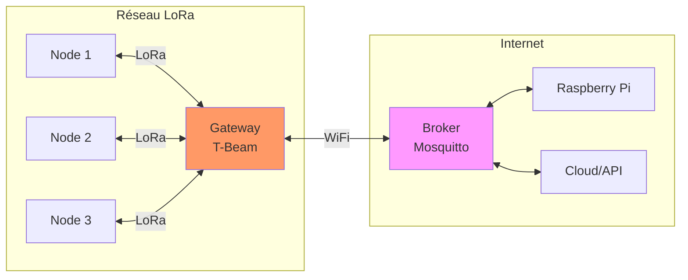
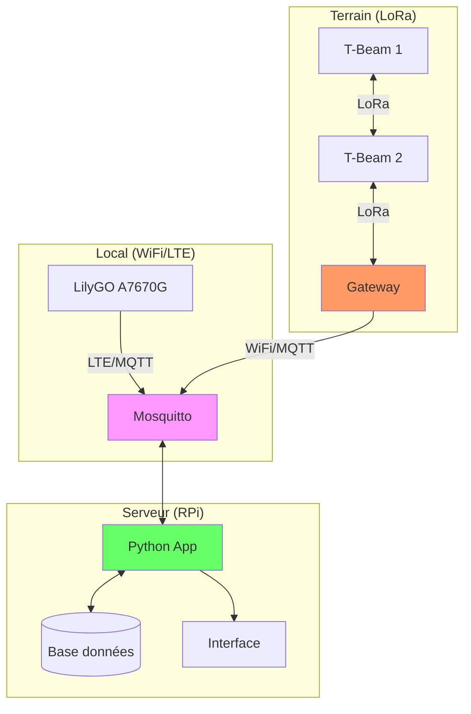

# Objets connectés
## 243-4J5-LI

Semaine 9 - Gateway WiFi autonome et tests terrain

<div class="pt-12">
  <span class="px-2 py-1 rounded cursor-pointer" hover="bg-white bg-opacity-10">
    Francis Poisson - Cégep Limoilou - H26
  </span>
</div>

---
layout: section
---

# Récapitulatif
## Semaine 8 - Configuration avancée

---

# Ce qu'on a accompli

<div class="grid grid-cols-2 gap-4">

<div>

### Paramètres radio

<v-clicks>

- Spreading Factor (SF7-SF12)
- Bandwidth (125-500 kHz)
- Coding Rate (4/5 à 4/8)
- Presets Meshtastic
- Compromis portée/débit

</v-clicks>

</div>

<div>

### Réseau mesh

<v-clicks>

- Rôles : Client, Router, Router_Client
- Topologies : étoile, maillé
- Algorithme de routage
- Métriques : RSSI, SNR
- Tests de communication

</v-clicks>

</div>

</div>

<v-click>

<div class="mt-4 p-2 bg-blue-500 bg-opacity-20 rounded-lg text-center text-sm">

**Cette semaine** : Connecter le mesh à Internet via MQTT + Tests terrain!

</div>

</v-click>

---
layout: section
---

# Partie 1
## Gateway WiFi/MQTT

---

# Architecture avec Gateway

### Pont entre LoRa et Internet

<v-click>



</v-click>

<v-click>

<div class="mt-2 p-2 bg-green-500 bg-opacity-20 rounded-lg text-center text-sm">

La **Gateway** transforme les messages LoRa en messages MQTT et vice-versa.

</div>

</v-click>

---

# Modes Gateway dans Meshtastic

### Options disponibles

<v-click>

| Mode | Description | Usage |
|------|-------------|-------|
| **MQTT Client** | Envoie/reçoit via MQTT | Notre choix |
| Serial Gateway | Via USB/Serial | Debug |
| WiFi AP | Point d'accès local | Isolation |

</v-click>

<v-click>

### MQTT Client

- Connexion au broker via WiFi
- Topics standardisés Meshtastic
- Bidirectionnel : LoRa ↔ MQTT
- Configuration via app ou CLI

</v-click>

---

# Configuration WiFi

### Connecter le T-Beam au réseau

```bash {all|1-2|4-6|8-9}
# Activer le WiFi
meshtastic --set wifi.enabled true

# Configurer le réseau
meshtastic --set wifi.ssid "NomDuReseau"
meshtastic --set wifi.psk "MotDePasse"

# Vérifier la connexion
meshtastic --info | grep -i wifi
```

<v-click>

### Modes WiFi

| Mode | Usage |
|------|-------|
| **Client** | Se connecte à un réseau existant |
| AP | Crée son propre réseau |
| AP+Client | Les deux simultanément |

</v-click>

---

# Configuration MQTT

### Connexion au broker

```bash {all|1-2|4-7|9-10|12-13}
# Activer MQTT
meshtastic --set mqtt.enabled true

# Configurer le broker
meshtastic --set mqtt.address "broker.example.com"
meshtastic --set mqtt.username "user"
meshtastic --set mqtt.password "password"

# Port (1883 ou 8883 pour TLS)
meshtastic --set mqtt.port 1883

# Activer le chiffrement TLS
meshtastic --set mqtt.tls_enabled true
```

<v-click>

<div class="mt-2 p-2 bg-orange-500 bg-opacity-20 rounded-lg text-center text-sm">

**Important** : Utilisez TLS en production! Port 8883 avec certificats.

</div>

</v-click>

---

# Topics MQTT Meshtastic

### Structure des messages

<v-click>

### Topic de base

```
msh/[region]/[channel_id]/[gateway_id]/...
```

</v-click>

<v-click>

### Topics disponibles

| Topic | Direction | Contenu |
|-------|-----------|---------|
| `.../json/...` | Sortant | Messages JSON |
| `.../c/...` | Entrant | Commandes |
| `.../stat/...` | Sortant | Statistiques |

</v-click>

<v-click>

### Exemple de message JSON

```json
{
  "from": 1234567890,
  "to": 4294967295,
  "payload": "Hello from LoRa!",
  "type": "text"
}
```

</v-click>

---

# Flux bidirectionnel

### LoRa → MQTT et MQTT → LoRa

<div class="grid grid-cols-2 gap-6">

<div>

<v-click>

### LoRa vers MQTT

1. Node envoie message LoRa
2. Gateway reçoit
3. Gateway publie sur MQTT
4. Subscribers reçoivent

```
Node → LoRa → Gateway → MQTT → RPi
```

</v-click>

</div>

<div>

<v-click>

### MQTT vers LoRa

1. Client publie sur MQTT
2. Gateway souscrit et reçoit
3. Gateway transmet en LoRa
4. Nodes reçoivent

```
RPi → MQTT → Gateway → LoRa → Nodes
```

</v-click>

</div>

</div>

<v-click>

<div class="mt-4 p-2 bg-blue-500 bg-opacity-20 rounded-lg text-center text-sm">

La Gateway agit comme un **pont transparent** entre les deux mondes.

</div>

</v-click>

---

# Script Python de réception

### Écouter les messages Meshtastic via MQTT

```python {all|1-4|6-12|14-22}
import paho.mqtt.client as mqtt
import json

BROKER = "broker.example.com"
TOPIC = "msh/US/2/json/#"  # Tous les messages JSON

def on_message(client, userdata, msg):
    try:
        data = json.loads(msg.payload.decode())
        print(f"De: {data.get('from')}")
        print(f"Message: {data.get('payload')}")
        print(f"Type: {data.get('type')}")
    except json.JSONDecodeError:
        print(f"Raw: {msg.payload}")

client = mqtt.Client()
client.connect(BROKER, 1883)
client.subscribe(TOPIC)
client.on_message = on_message

print("Écoute des messages Meshtastic...")
client.loop_forever()
```

---

# Envoyer vers le mesh

### Publier un message depuis Python

```python {all|1-8|10-18}
import paho.mqtt.client as mqtt
import json

BROKER = "broker.example.com"
# Topic pour envoyer au mesh
TOPIC = "msh/US/2/c/sendtext"

client = mqtt.Client()
client.connect(BROKER, 1883)

# Envoyer un message texte au mesh
message = {
    "text": "Hello from Python!",
    "to": "^all"  # Broadcast à tous
}

client.publish(TOPIC, json.dumps(message))
print("Message envoyé au mesh!")
```

<v-click>

<div class="mt-2 p-2 bg-green-500 bg-opacity-20 rounded-lg text-center text-sm">

Vous pouvez maintenant contrôler le mesh depuis n'importe où sur Internet!

</div>

</v-click>

---
layout: section
---

# Partie 2
## Architecture unifiée

---

# Vision globale du système

### Intégration complète

<v-click>



</v-click>

---

# Redondance des communications

### LTE + LoRa

<div class="grid grid-cols-2 gap-4">

<div class="p-3 bg-blue-500 bg-opacity-20 rounded-lg text-sm">

### LTE (LilyGO A7670G)

<v-click>

- Couverture cellulaire
- Connexion directe Internet
- Latence faible (~100ms)
- Dépend du réseau opérateur
- Coût : forfait data

</v-click>

</div>

<div class="p-3 bg-green-500 bg-opacity-20 rounded-lg text-sm">

### LoRa (Meshtastic)

<v-click>

- Aucune infrastructure requise
- Longue portée (15+ km)
- Latence variable (1-10s)
- Autonome et gratuit
- Débit limité

</v-click>

</div>

</div>

<v-click>

<div class="mt-4 p-2 bg-purple-500 bg-opacity-20 rounded-lg text-center text-sm">

**Stratégie** : LTE pour les données critiques, LoRa pour la communication de secours.

</div>

</v-click>

---

# Scénarios d'utilisation

### Quand utiliser quoi?

<v-click>

| Scénario | Technologie | Raison |
|----------|-------------|--------|
| Données capteurs temps réel | LTE | Faible latence |
| Alertes critiques | LTE + LoRa | Redondance |
| Communication hors réseau | LoRa | Seule option |
| Télémétrie longue portée | LoRa | Économie d'énergie |
| Streaming vidéo | LTE uniquement | Débit élevé requis |
| Position GPS périodique | LoRa | Suffisant |

</v-click>

---

# Topics MQTT unifiés

### Organisation recommandée

<v-click>

```
# Structure générale
iot/[projet]/[source]/[type]/[data]

# Exemples
iot/projet1/lilygo/sensors/temperature
iot/projet1/lilygo/sensors/humidity
iot/projet1/meshtastic/position/node1
iot/projet1/meshtastic/text/broadcast
iot/projet1/commands/led1
```

</v-click>

<v-click>

### Avantages

- Séparation claire des sources
- Filtrage facile par wildcards
- Scalable pour plusieurs projets
- Compatible avec les deux systèmes

</v-click>

---
layout: section
---

# Partie 3
## Tests terrain

---

# Méthodologie de test

### Planification rigoureuse

<v-clicks>

1. **Définir les objectifs**
   - Portée maximale?
   - Couverture d'une zone?
   - Performance avec obstacles?

2. **Préparer l'équipement**
   - Batteries chargées (100%)
   - Antennes vérifiées
   - GPS fonctionnel
   - App mobile configurée

3. **Choisir le lieu**
   - Terrain varié (plat, collines, forêt)
   - Points de repère identifiables
   - Sécurité (accès, météo)

</v-clicks>

---

# Protocole de test

### Étapes sur le terrain

<v-click>

### Phase 1 : Point fixe

1. Installer le noeud de référence en hauteur
2. Vérifier la réception GPS
3. Confirmer la connexion mesh
4. Noter les coordonnées exactes

</v-click>

<v-click>

### Phase 2 : Points mobiles

1. Se déplacer vers le premier point de test
2. Attendre la stabilisation GPS (30s)
3. Envoyer 5 messages de test
4. Noter : distance, RSSI, SNR, succès/échec
5. Répéter pour chaque point

</v-click>

<v-click>

### Phase 3 : Analyse

1. Collecter toutes les données
2. Créer la carte de couverture
3. Identifier les zones problématiques
4. Recommandations d'amélioration

</v-click>

---

# Fiche de terrain

### Template de collecte de données

| Point | Lat/Long | Distance | RSSI | SNR | Msg OK | Obstacles |
|:-----:|----------|:--------:|:----:|:---:|:------:|-----------|
| P1 | 46.xxx, -71.xxx | 100m | -65 | 12 | 5/5 | Aucun |
| P2 | 46.xxx, -71.xxx | 500m | -85 | 5 | 5/5 | Arbres |
| P3 | 46.xxx, -71.xxx | 1km | -95 | -2 | 4/5 | Bâtiment |
| P4 | 46.xxx, -71.xxx | 2km | -105 | -8 | 2/5 | Colline |

<v-click>

### Informations contextuelles

- Date et heure :
- Météo :
- Preset utilisé :
- Hauteur antenne référence :
- Équipement mobile :

</v-click>

---

# Facteurs influençant la portée

### Ce qui affecte le signal

<div class="grid grid-cols-2 gap-4">

<div>

### Favorables

<v-click>

- Ligne de vue dégagée
- Antenne en hauteur
- Temps sec
- Faible humidité
- SF élevé

</v-click>

</div>

<div>

### Défavorables

<v-click>

- Obstacles (bâtiments, collines)
- Végétation dense
- Pluie forte
- Interférences RF
- Antenne mal orientée

</v-click>

</div>

</div>

<v-click>

<div class="mt-4 p-2 bg-orange-500 bg-opacity-20 rounded-lg text-center text-sm">

**Zone de Fresnel** : Garder 60% de la première zone dégagée pour une transmission optimale.

</div>

</v-click>

---

# Cartographie de couverture

### Visualisation des résultats

<div class="grid grid-cols-2 gap-6">

<div>

<v-click>

### Outils de cartographie

- **Google Earth** : Import KML
- **QGIS** : Analyse avancée (gratuit)
- **Google Maps** : Partage facile
- **Meshtastic Map** : Intégré

</v-click>

<v-click>

### Export des données

```bash
# Exporter les positions depuis CLI
meshtastic --export-csv positions.csv
```

</v-click>

</div>

<div>

<v-click>

### Exemple de carte

```
    Excellent (> -80 dBm)
         ████
        ██████
    Bon (-80 à -100)
       ░░░░░░░░
      ░░░░░░░░░░
    Faible (< -100)
         ····
        ······
    [REF] = Point de référence
```

</v-click>

</div>

</div>

---
layout: section
---

# Évaluation
## TP Intégration LLM (20%)

---

# Présentation de l'évaluation

### TP Intégration et automatisation

<div class="grid grid-cols-2 gap-4">

<div class="p-3 bg-blue-500 bg-opacity-20 rounded-lg">

### Capacité 1 (15%)

<v-click>

**Flux de données**

- Pipeline capteurs → traitement
- Actions automatisées
- Intégration LLM fonctionnelle
- Code documenté

</v-click>

</div>

<div class="p-3 bg-green-500 bg-opacity-20 rounded-lg">

### Capacité 2 (5%)

<v-click>

**Configuration et communication**

- Gateway configurée
- MQTT fonctionnel
- Documentation technique
- Tests de validation

</v-click>

</div>

</div>

<v-click>

<div class="mt-4 p-2 bg-orange-500 bg-opacity-20 rounded-lg text-center text-sm">

**Détails** : À venir dans les prochaines semaines (Semaines 11-12)

</div>

</v-click>

---

# Travail de la semaine

### Objectifs du laboratoire

<div class="grid grid-cols-2 gap-4">

<div>

### Gateway (1h30)

<v-clicks>

- [ ] Configurer WiFi sur T-Beam
- [ ] Connecter au broker MQTT
- [ ] Tester la réception des messages
- [ ] Envoyer un message depuis Python
- [ ] Documenter la configuration

</v-clicks>

</div>

<div>

### Tests terrain (1h30)

<v-clicks>

- [ ] Préparer l'équipement
- [ ] Sortie terrain (si météo OK)
- [ ] Collecter les données (min 5 points)
- [ ] Créer une carte de couverture
- [ ] Documenter les résultats

</v-clicks>

</div>

</div>

---

# Configuration cible

### À réaliser aujourd'hui

```bash
# Sur le T-Beam Gateway
meshtastic --set wifi.enabled true
meshtastic --set wifi.ssid "SSID_Du_Cegep"
meshtastic --set wifi.psk "MotDePasse"

meshtastic --set mqtt.enabled true
meshtastic --set mqtt.address "votre-broker.example.com"
meshtastic --set mqtt.username "votre-user"
meshtastic --set mqtt.password "votre-password"

meshtastic --set device.role ROUTER_CLIENT
```

<v-click>

<div class="mt-4 p-2 bg-blue-500 bg-opacity-20 rounded-lg text-center text-sm">

**Validation** : Voir les messages apparaître sur le broker MQTT!

</div>

</v-click>

---
layout: center
class: text-center
---

# Questions?

<div class="text-xl mt-8">
Prochaine étape : Gateway + Tests terrain!
</div>

<div class="mt-4 text-sm">
Semaine prochaine : Réception et soudure des PCB
</div>

---
layout: end
---

# Merci!

243-4J5-LI - Objets connectés

Semaine 9
