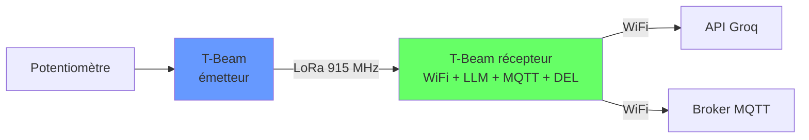

# Objets connectés
## 243-4J5-LI

Semaine 10 - Meshtastic en pratique

<div class="pt-12">
  <span class="px-2 py-1 rounded cursor-pointer" hover="bg-white bg-opacity-10">
    Francis Poisson - Cégep Limoilou - H26
  </span>
</div>

---
layout: section
---

# Plan de la semaine
## Firmware, téléphones et tests terrain

---

# Objectifs d'aujourd'hui

### Du théorique au pratique

<v-clicks>

1. **Flasher** le firmware Meshtastic sur vos T-Beam SUPREME
2. **Connecter** l'application Meshtastic à votre téléphone
3. **Configurer** les canaux et paramètres du réseau de classe
4. **Tester** la portée et interpréter les métriques radio (RSSI, SNR)
5. **Explorer** les fonctionnalités : messagerie, GPS, télémétrie

</v-clicks>

<v-click>

<div class="mt-4 p-2 bg-blue-500 bg-opacity-20 rounded-lg text-center text-sm">

Aujourd'hui c'est **hands-on** : pas d'énoncé de labo, on expérimente à partir des diapos!

</div>

</v-click>

---
layout: section
---

# Partie 1
## Mise en route du firmware

---

# Rappel rapide

### Ce qu'on sait déjà (semaine 8)

<div class="grid grid-cols-2 gap-4">

<div>

### LoRa

- Modulation **CSS** (Chirp Spread Spectrum)
- Portée **2-15 km**, débit faible
- Bande **915 MHz** sans licence
- Compromis : SF haut = plus loin, plus lent

</div>

<div>

### Meshtastic

- Firmware **open source** pour LoRa
- Réseau **mesh** décentralisé
- Multi-hop pour étendre la portée
- Chiffrement **AES-256**

</div>

</div>

<v-click>

<div class="mt-4 p-2 bg-green-500 bg-opacity-20 rounded-lg text-center text-sm">

Aujourd'hui on passe de la théorie à la **pratique terrain**.

</div>

</v-click>

---

# Flasher le firmware Meshtastic

### Méthode Web Flasher (recommandée)

<v-clicks>

1. Aller sur **flasher.meshtastic.org**
2. Brancher le T-Beam SUPREME en **USB-C**
3. Sélectionner **T-Beam Supreme** dans la liste
4. Choisir la **dernière version stable**
5. Cliquer sur **Flash**
6. Attendre la fin (~2 minutes)

</v-clicks>

<v-click>

<div class="mt-4 p-2 bg-red-500 bg-opacity-20 rounded-lg text-center text-sm">

**Avant d'alimenter** : vérifiez que l'antenne LoRa est **branchée**! Émettre sans antenne peut endommager le module radio.

</div>

</v-click>

---

# Vérification du flash

### Signes de succès

<v-clicks>

- L'écran OLED affiche le **logo Meshtastic** au démarrage
- Le nom du noeud apparaît (ex: `Meshtastic_XXXX`)
- L'icône Bluetooth clignote (prêt à se connecter)
- Le GPS commence à chercher des satellites

</v-clicks>

---

# Dépannage du flash

### En cas de problème

| Symptôme | Cause probable | Solution |
|----------|----------------|----------|
| Écran noir | Flash incomplet | Reflasher |
| Pas de Bluetooth | Mauvais firmware | Vérifier le modèle sélectionné |
| Boucle de redémarrage | Firmware corrompu | Effacer la flash et reflasher |
| Erreur USB | Pilote manquant | Installer le pilote CP210x/CH340 |

---
layout: section
---

# Partie 2
## Connexion au téléphone

---

# Application Meshtastic

### Installation et connexion Bluetooth

<div class="grid grid-cols-2 gap-6">

<div>

<v-click>

### Installation

- **Android** : Google Play Store → "Meshtastic"
- **iOS** : App Store → "Meshtastic"
- Gratuit et open source
- Alternative : interface web (client.meshtastic.org)

</v-click>

<v-click>

### Connexion Bluetooth

1. Activer le Bluetooth sur le téléphone
2. Ouvrir l'application Meshtastic
3. Cliquer sur **+** (ajouter un appareil)
4. Sélectionner votre T-Beam dans la liste
5. Confirmer l'appairage

</v-click>

</div>

<div>

<v-click>

### Interface de l'application


</v-click>

</div>

</div>

---

# Configuration initiale

### Paramètres essentiels

<v-click>

| Paramètre | Valeur | Où dans l'app |
|-----------|--------|---------------|
| **Nom du noeud** | Votre prénom | Settings → User → Long Name |
| **Région** | `US` (915 MHz) | Settings → LoRa → Region |
| **Rôle** | `CLIENT` (défaut) | Settings → Device → Role |
| **Canal** | Canal de la classe | Settings → Channels |

</v-click>

<v-click>

<div class="mt-4 p-2 bg-orange-500 bg-opacity-20 rounded-lg text-center text-sm">

**Tout le monde doit être sur la même région et le même canal** pour communiquer!

</div>

</v-click>

---

# Configuration du canal de classe

### Rejoindre le canal partagé

<v-click>

### Comment ça fonctionne

- Chaque canal Meshtastic a une **clé de chiffrement (PSK)** partagée entre les membres
- Le prof a configuré le canal `243-4J5` avec une clé AES-256
- Le **QR code** contient tout : nom du canal, clé, et paramètres LoRa
- Vous n'avez qu'à **scanner le QR** dans l'app pour rejoindre

</v-click>

<v-click>

### Procédure

- **Android** : dans l'app Meshtastic → scanner QR
- **iOS** : utiliser la **caméra** du téléphone, le lien s'ouvre dans l'app
- Confirmer le changement de canal

</v-click>

---

# Presets Meshtastic

### Compromis portée / débit

| Preset | SF | BW | Usage |
|--------|:--:|:--:|-------|
| SHORT_FAST | 7 | 250 kHz | Courte portée, débit max |
| SHORT_SLOW | 8 | 250 kHz | Courte portée, plus robuste |
| MEDIUM_FAST | 9 | 250 kHz | Bon compromis |
| MEDIUM_SLOW | 10 | 250 kHz | Portée moyenne |
| **LONG_FAST** | **11** | **250 kHz** | **Longue portée** |
| LONG_SLOW | 12 | 125 kHz | Portée maximale |

<v-click>

<div class="mt-4 p-2 bg-blue-500 bg-opacity-20 rounded-lg text-center text-sm">

On utilise **LONG_FAST** pour le labo : bonne portée pour les tests terrain tout en gardant un débit raisonnable.

</div>

</v-click>

---

# Alternative : configuration CLI

### Pour les curieux

<v-click>

```bash
# Configurer le canal
meshtastic --ch-set name "243-4J5" --ch-index 0

# Configurer le preset
meshtastic --set lora.modem_preset LONG_FAST

# Afficher le QR code du canal
meshtastic --qr
```

</v-click>

<v-click>

### URL Meshtastic

- Le QR code encode une URL : `https://meshtastic.org/e/#...`
- On peut aussi la partager par texte ou courriel
- L'ouvrir dans l'app Meshtastic importe la config automatiquement

</v-click>

---

# Premier test de communication

### Valider que tout fonctionne

<v-click>

### Test en classe (2-3 minutes)

1. Tout le monde est sur le canal `243-4J5`
2. Chacun envoie un message avec son **prénom**
3. Vérifier que les messages des autres apparaissent
4. Observer les **ACK** (accusés de réception)

</v-click>

<v-click>

### Ce qu'on devrait voir

- **Alice**: Test Alice **✓**
- **Bob**: Ici Bob **✓**
- **Charlie**: Hello! **✓**
- ✓ = ACK reçu (message livré) | ✗ = pas d'ACK (problème)

</v-click>

<v-click>

<div class="mt-2 p-2 bg-green-500 bg-opacity-20 rounded-lg text-center text-sm">

Si tout le monde se voit : le réseau mesh de la classe est **fonctionnel**!

</div>

</v-click>

---
layout: section
---

# Partie 3
## Métriques radio et tests de portée

---

# Comprendre les métriques radio

### RSSI et SNR — vos deux indicateurs clés

<div class="grid grid-cols-2 gap-6">

<div>

<v-click>

### RSSI (dBm) — force du signal

Plus proche de 0 = plus fort

| RSSI | Qualité |
|:----:|---------|
| -30 à -70 | Excellent |
| -70 à -90 | Bon |
| -90 à -110 | Faible |
| -110 à -120 | Limite |
| < -120 | Perte probable |

</v-click>

</div>

<div>

<v-click>

### SNR (dB) — clarté du signal

LoRa fonctionne même en SNR négatif!

| SNR | Qualité |
|:---:|---------|
| > 10 dB | Excellent |
| 5 à 10 dB | Bon |
| 0 à 5 dB | Correct |
| -5 à 0 dB | Faible (LoRa OK) |
| < -10 dB | Limite |

</v-click>

</div>

</div>

---

# Où voir les métriques?

### Dans l'application Meshtastic

<v-click>

### Onglet Noeuds — exemple

| Noeud | RSSI | SNR | Distance | Hops | Batterie |
|-------|:----:|:---:|:--------:|:----:|:--------:|
| Alice | -65 dBm | 8.5 dB | 120 m | 0 | 92% |
| Bob | -89 dBm | 3.2 dB | 450 m | 0 | 78% |
| Charlie | -105 dBm | -2.1 dB | 1.2 km | 1 | 65% |

</v-click>

<v-click>

- **Hops** : 0 = direct, 1+ = relayé par un autre noeud
- **Distance** : Calculée par GPS (si activé)
- **Dernière activité** : Temps depuis le dernier message

</v-click>

---

# Protocole de test de portée

### Méthodologie pour les tests terrain

<v-clicks>

- **Individuellement** : chaque étudiant a son T-Beam
- Un **noeud fixe** est installé dans la **tour** du cégep (point de référence)
- Vous vous éloignez progressivement et notez les métriques
- **Intervalle** : envoyer un message tous les ~30 secondes

</v-clicks>

<v-click>

<div class="mt-4 p-2 bg-blue-500 bg-opacity-20 rounded-lg text-center text-sm">

Le noeud fixe et la méthodologie de mesure seront aussi utilisés dans le cours **243-4Q5** (Communication radio).

</div>

</v-click>

---

# Données à collecter

### Exemple de tableau de mesures

| Point | Distance (m) | RSSI (dBm) | SNR (dB) | Hops | Reçu? |
|:-----:|:------------:|:----------:|:--------:|:----:|:-----:|
| 1 | 50 | -55 | 10.2 | 0 | Oui |
| 2 | 150 | -72 | 6.8 | 0 | Oui |
| 3 | 300 | -88 | 2.1 | 0 | Oui |
| 4 | 500 | -98 | -1.5 | 0 | Oui |
| 5 | 800 | -112 | -8.2 | 0 | Non |

<v-click>

<div class="mt-4 p-2 bg-orange-500 bg-opacity-20 rounded-lg text-center text-sm">

Notez aussi l'**environnement** : ligne de vue dégagée, bâtiments, arbres, intérieur/extérieur.

</div>

</v-click>

---

# Facteurs qui affectent la portée

### Comprendre les résultats

<div class="grid grid-cols-2 gap-4">

<div>

<v-click>

### Favorables

- **Ligne de vue** dégagée
- **Hauteur** de l'antenne (étage élevé, colline)
- Antenne **verticale** (pas dans la poche)
- Temps **sec** et clair
- **SF élevé** (LONG_SLOW)

</v-click>

</div>

<div>

<v-click>

### Défavorables

- **Bâtiments** entre les noeuds
- **Intérieur** (murs, béton)
- Antenne **horizontale** ou cachée
- **Végétation** dense
- **SF bas** (SHORT_FAST)

</v-click>

</div>

</div>

<v-click>

### Règle empirique

```
Portée intérieure :  50-200 m  (murs, couloirs)
Portée urbaine    :  1-3 km    (bâtiments, rues)
Portée suburbaine :  3-8 km    (quelques obstacles)
Portée dégagée    :  5-15+ km  (ligne de vue)
```

</v-click>

---

# Exercice de test de portée

### Sortie terrain (~45 minutes)

<v-clicks>

1. **Point de départ** : local de cours (noeud fixe en ROUTER)
2. **Test intérieur** : couloir → escalier → autre étage
3. **Test extérieur** : sortir du bâtiment, s'éloigner progressivement
4. **Points de mesure** : tous les 50-100 m environ
5. **Limite** : continuer jusqu'à perte de signal

</v-clicks>

---

# Observations à noter

### Pendant les tests

<v-clicks>

- À quel moment le signal passe de "excellent" à "faible"?
- Y a-t-il des **zones mortes** (pas de signal même proche)?
- Le **multi-hop** fonctionne-t-il? (un troisième noeud relaye)
- Différence de portée entre **intérieur** et **extérieur**?

</v-clicks>

<v-click>

<div class="mt-4 p-2 bg-purple-500 bg-opacity-20 rounded-lg text-sm">

**Défi maison (jeudi soir / fin de semaine)** : Amenez votre T-Beam chez vous et testez le **multi-hop** entre les maisons des étudiants. Est-ce qu'on peut se parler d'une maison à l'autre via le réseau mesh?

</div>

</v-click>

---
layout: section
---

# Partie 4
## Fonctionnalités avancées

---

# Rôles des noeuds

### Optimiser le réseau mesh

<v-click>

| Rôle | Description |
|------|-------------|
| **CLIENT** | Noeud standard, envoie et relaye (défaut) |
| **CLIENT_MUTE** | Reçoit seulement, ne relaye pas |
| **ROUTER** | Relaye en priorité, économise la batterie |
| **REPEATER** | Relais pur, pas d'écran ni app |
| **TRACKER** | Envoie sa position GPS régulièrement |

</v-click>

<v-click>

<div class="mt-4 p-2 bg-blue-500 bg-opacity-20 rounded-lg text-center text-sm">

Pour les tests : noeud fixe en **ROUTER**, vos T-Beam en **CLIENT**.

</div>

</v-click>

---

# Télémétrie et GPS

### Données automatiques du réseau

<div class="grid grid-cols-2 gap-6">

<div>

<v-click>

### Télémétrie (Device Metrics)

- **Batterie** : Tension et pourcentage
- **Utilisation radio** : Air time (%)
- Intervalle configurable (défaut : 15 min)

</v-click>

</div>

<div>

<v-click>

### Position GPS

- **Latitude/Longitude** automatiques
- **Altitude** et vitesse
- Visible sur la **carte** de l'app
- Peut être **désactivé** (vie privée)

</v-click>

</div>

</div>

<v-click>

<div class="mt-4 p-2 bg-green-500 bg-opacity-20 rounded-lg text-center text-sm">

La carte Meshtastic montre la **position de tous les noeuds** — utile pour visualiser les tests de portée!

</div>

</v-click>

---

# Fonctionnalité Traceroute

### Visualiser le chemin d'un message

<v-click>

### Comment l'utiliser

1. Dans l'app → onglet **Noeuds**
2. Sélectionner un noeud distant
3. Cliquer sur **Traceroute**
4. Le résultat montre chaque saut

</v-click>

<v-click>

### Exemple de résultat

| Hop | Noeud | RSSI | SNR |
|:---:|-------|:----:|:---:|
| 1 | Bob (relais) | -78 dBm | 5.2 dB |
| 2 | Charlie (destination) | -92 dBm | 1.8 dB |

</v-click>

<v-click>

<div class="mt-2 p-2 bg-purple-500 bg-opacity-20 rounded-lg text-center text-sm">

Le traceroute confirme que le **multi-hop fonctionne** et montre la qualité de chaque lien.

</div>

</v-click>

---
layout: section
---

# Partie 5
## Vers le projet final (semaines 11-12)

---

# Prochaines étapes — Le TP évalué

### Liaison LoRa point à point avec gateway WiFi

<v-click>

### Architecture cible (semaines 11-12)



</v-click>

<v-click>

<div class="mt-2 p-2 bg-orange-500 bg-opacity-20 rounded-lg text-center text-sm">

Le TP sera codé dans l'**IDE Arduino** (pas Meshtastic). Communication LoRa point à point avec la librairie RadioLib.

</div>

</v-click>

---

# Ce qu'on va construire

### Liaison LoRa point à point (IDE Arduino)

<div class="grid grid-cols-2 gap-4">

<div>

<v-click>

### Semaine 11

- Coder l'**émetteur** : lecture du potentiomètre, envoi LoRa
- Coder le **récepteur** : réception LoRa, connexion WiFi
- Premiers appels **LLM** depuis le récepteur
- Contrôle d'une **DEL** selon la réponse du LLM

</v-click>

</div>

<div>

<v-click>

### Semaine 12

- Publication des données et analyses sur **MQTT**
- **Prompt engineering** pour l'analyse IoT
- Pipeline complet émetteur → récepteur → LLM → MQTT
- Documentation et **remise**

</v-click>

</div>

</div>

---

# Préparation pour la semaine prochaine

### Ce qu'il faut avoir prêt

<v-clicks>

- **Compte API LLM** prêt (Groq, OpenAI ou Anthropic)
- Avoir noté vos **résultats de tests de portée** (RSSI, SNR, distances)
- Revoir le code du **labo 4** (appel LLM depuis ESP32, potentiomètre, DEL)
- Installer la librairie **RadioLib** dans l'IDE Arduino

</v-clicks>

<v-click>

<div class="mt-4 p-2 bg-blue-500 bg-opacity-20 rounded-lg text-center text-sm">

La semaine prochaine, on code la liaison **LoRa point à point** dans l'IDE Arduino.

</div>

</v-click>

---

# Plan de la séance (5h)

### Théorie (2h)

<v-clicks>

1. Présentation des slides (~1h30)
2. Questions et discussion (~30 min)

</v-clicks>

<v-click>

### Labo (3h)

</v-click>

<v-clicks>

1. **Flash Meshtastic** sur votre T-Beam (~15 min)
2. **Connexion Bluetooth** + scanner le QR du canal de classe (~15 min)
3. **Test en classe** : tout le monde s'envoie un message (~10 min)
4. **Sortie terrain** : tests de portée individuels depuis la tour (~45 min)
5. **Retour en classe** : partage des résultats, exploration traceroute/GPS/rôles (~30 min)
6. **Bonus** : essayer la liaison LoRa point à point avec les exemples Arduino de LilyGO (~45 min)

</v-clicks>

---

# Activité bonus : premiers pas en Arduino LoRa

### Préparer la semaine prochaine

<v-click>

Si vous avez terminé les tests Meshtastic, essayez de faire communiquer deux T-Beam en LoRa avec le code Arduino de LilyGO :

**Dépôt GitHub** : [github.com/Xinyuan-LilyGO/LilyGo-LoRa-Series](https://github.com/Xinyuan-LilyGO/LilyGo-LoRa-Series)

</v-click>

<v-click>

### Étapes

1. Cloner ou télécharger le dépôt
2. Ouvrir un exemple RadioLib (`Transmit_Interrupt` ou `Receive_Interrupt`)
3. Dans `utilities.h`, décommenter **`T_BEAM_S3_SUPREME_SX1262`**
4. Flasher un T-Beam en émetteur, l'autre en récepteur
5. Observer les messages dans le moniteur série

</v-click>

<v-click>

<div class="mt-4 p-2 bg-purple-500 bg-opacity-20 rounded-lg text-sm">

**Jeudi soir / fin de semaine** : amenez votre T-Beam (avec Meshtastic) chez vous et testez le multi-hop entre vos maisons!

</div>

</v-click>

---
layout: center
class: text-center
---

# Questions?

<div class="mt-4 text-sm">
Semaine prochaine : liaison LoRa point à point dans l'IDE Arduino
</div>

---
layout: end
---

# Merci!

243-4J5-LI - Objets connectés

Semaine 10
