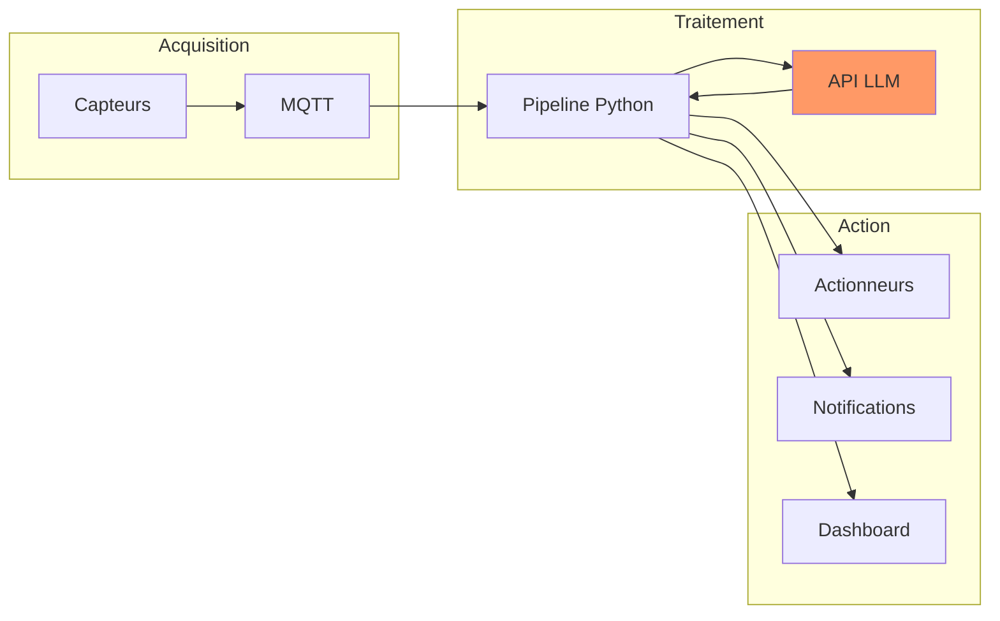
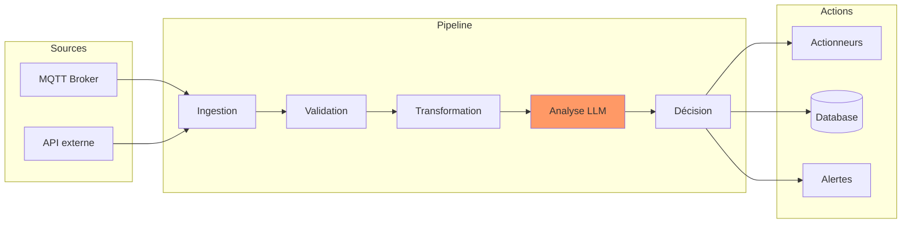

# Objets connectés
## 243-4J5-LI

Semaine 11 - Automatisation LLM et infrastructure

<div class="pt-12">
  <span class="px-2 py-1 rounded cursor-pointer" hover="bg-white bg-opacity-10">
    Francis Poisson - Cégep Limoilou - H26
  </span>
</div>

---
layout: section
---

# Introduction
## L'IA au service de l'IoT

---

# Évolution de notre système

### Du capteur à l'intelligence

<v-click>



</v-click>

<v-click>

<div class="mt-4 p-2 bg-blue-500 bg-opacity-20 rounded-lg text-center text-sm">

**Nouveau** : Les LLM peuvent analyser, décider et générer des réponses intelligentes!

</div>

</v-click>

---

# Qu'est-ce qu'un LLM?

### Large Language Model

<div class="grid grid-cols-2 gap-6">

<div>

<v-clicks>

- **Modèle de langage** entraîné sur des milliards de textes
- Capable de **comprendre** et **générer** du texte
- Peut analyser des **données structurées**
- Accessible via **API** (OpenAI, Anthropic, Google)
- Exemples : GPT-4, Claude, Gemini

</v-clicks>

</div>

<div>

<v-click>

### Capacités utiles pour l'IoT

- Analyse de données textuelles
- Classification d'événements
- Génération de rapports
- Détection d'anomalies
- Interaction en langage naturel

</v-click>

</div>

</div>

---

# Cas d'utilisation IoT + LLM

### Applications concrètes

<div class="grid grid-cols-2 gap-4">

<div class="p-3 bg-blue-500 bg-opacity-20 rounded-lg text-sm">

### Analyse intelligente

<v-click>

- Interpréter les données capteurs
- Détecter des patterns anormaux
- Prédire des pannes
- Résumer l'état du système

</v-click>

</div>

<div class="p-3 bg-green-500 bg-opacity-20 rounded-lg text-sm">

### Automatisation

<v-click>

- Décisions basées sur le contexte
- Réponses adaptatives
- Génération d'alertes intelligentes
- Scripts auto-générés

</v-click>

</div>

<div class="p-3 bg-purple-500 bg-opacity-20 rounded-lg text-sm">

### Interface utilisateur

<v-click>

- Commandes en langage naturel
- Chatbot de contrôle
- Rapports lisibles
- Assistant de diagnostic

</v-click>

</div>

<div class="p-3 bg-orange-500 bg-opacity-20 rounded-lg text-sm">

### Maintenance

<v-click>

- Analyse des logs
- Suggestions de correction
- Documentation automatique
- Historique intelligent

</v-click>

</div>

</div>

---
layout: section
---

# Partie 1
## Intégration des API LLM

---

# Fournisseurs d'API LLM

### Options disponibles

<v-click>

| Fournisseur | Modèle | Avantages | Coût |
|-------------|--------|-----------|------|
| **OpenAI** | GPT-4, GPT-3.5 | Très capable, populaire | $$$ |
| **Anthropic** | Claude | Sécurité, long contexte | $$ |
| **Google** | Gemini | Multimodal, gratuit limité | $ |
| **Local** | Ollama/LLaMA | Gratuit, privé | Matériel |

</v-click>

<v-click>

### Pour ce cours

- API **OpenAI** ou **Anthropic** recommandée
- Compte gratuit avec crédits de départ
- Clé API à sécuriser!

</v-click>

---

# Configuration de l'API OpenAI

### Installation et setup

```bash
# Installation
pip install openai

# Variable d'environnement (recommandé)
export OPENAI_API_KEY="sk-..."
```

<v-click>

### Code de base

```python
from openai import OpenAI

client = OpenAI()  # Utilise OPENAI_API_KEY

response = client.chat.completions.create(
    model="gpt-3.5-turbo",
    messages=[
        {"role": "system", "content": "Tu es un assistant IoT."},
        {"role": "user", "content": "Analyse ces données: temp=25°C"}
    ]
)

print(response.choices[0].message.content)
```

</v-click>

---

# Configuration de l'API Anthropic

### Alternative avec Claude

```bash
# Installation
pip install anthropic

# Variable d'environnement
export ANTHROPIC_API_KEY="sk-ant-..."
```

<v-click>

### Code de base

```python
from anthropic import Anthropic

client = Anthropic()

response = client.messages.create(
    model="claude-3-haiku-20240307",
    max_tokens=1024,
    messages=[
        {"role": "user", "content": "Analyse ces données: temp=25°C, humidity=60%"}
    ]
)

print(response.content[0].text)
```

</v-click>

---

# Prompt Engineering pour IoT

### Structurer les requêtes

<v-click>

### Exemple de prompt système

```python
SYSTEM_PROMPT = """Tu es un assistant d'analyse IoT.
Tu reçois des données de capteurs au format JSON.
Tes responsabilités:
1. Analyser les valeurs reçues
2. Détecter les anomalies
3. Suggérer des actions si nécessaire
4. Répondre de manière concise

Format de réponse: JSON avec les clés:
- status: "normal" | "warning" | "critical"
- analysis: description courte
- action: action suggérée ou null
"""
```

</v-click>

<v-click>

<div class="mt-2 p-2 bg-blue-500 bg-opacity-20 rounded-lg text-center text-sm">

Un bon **prompt système** = réponses cohérentes et exploitables.

</div>

</v-click>

---

# Analyser des données capteurs

### Exemple complet

```python {all|1-10|12-22|24-30}
import json
from openai import OpenAI

client = OpenAI()

def analyze_sensor_data(data: dict) -> dict:
    """Analyse les données capteurs avec un LLM."""

    prompt = f"""Analyse ces données capteurs:
{json.dumps(data, indent=2)}

Réponds en JSON avec: status, analysis, action"""

    response = client.chat.completions.create(
        model="gpt-3.5-turbo",
        messages=[
            {"role": "system", "content": SYSTEM_PROMPT},
            {"role": "user", "content": prompt}
        ],
        response_format={"type": "json_object"}
    )

    return json.loads(response.choices[0].message.content)

# Utilisation
data = {"temperature": 85, "humidity": 20, "motion": True}
result = analyze_sensor_data(data)
print(result)
# {"status": "warning", "analysis": "Température élevée...", "action": "Vérifier..."}
```

---
layout: section
---

# Partie 2
## Pipelines de données

---

# Architecture de pipeline

### Flux de données automatisé

<v-click>



</v-click>

---

# Pipeline avec MQTT

### Écoute et traitement automatique

```python {all|1-8|10-22|24-32}
import paho.mqtt.client as mqtt
import json
from datetime import datetime

# Configuration
BROKER = "broker.example.com"
TOPICS = ["iot/+/sensors/#"]

def on_message(client, userdata, msg):
    """Callback de réception MQTT."""
    try:
        data = json.loads(msg.payload.decode())
        data['topic'] = msg.topic
        data['timestamp'] = datetime.now().isoformat()

        # Pipeline de traitement
        validated = validate_data(data)
        if validated:
            enriched = enrich_data(validated)
            analysis = analyze_with_llm(enriched)
            execute_actions(analysis)

    except Exception as e:
        log_error(f"Pipeline error: {e}")

client = mqtt.Client()
client.on_message = on_message
client.connect(BROKER)
client.subscribe(TOPICS)
client.loop_forever()
```

---

# Validation des données

### Première étape du pipeline

```python
from pydantic import BaseModel, validator
from typing import Optional

class SensorData(BaseModel):
    temperature: Optional[float] = None
    humidity: Optional[float] = None
    motion: Optional[bool] = None
    acceleration: Optional[dict] = None

    @validator('temperature')
    def temp_in_range(cls, v):
        if v is not None and (v < -40 or v > 85):
            raise ValueError('Temperature hors limites')
        return v

def validate_data(raw: dict) -> Optional[SensorData]:
    """Valide et structure les données."""
    try:
        return SensorData(**raw)
    except Exception as e:
        log_warning(f"Validation failed: {e}")
        return None
```

---

# Transformation et enrichissement

### Ajouter du contexte

```python
def enrich_data(data: SensorData) -> dict:
    """Enrichit les données avec du contexte."""

    enriched = data.dict()

    # Ajouter des calculs dérivés
    if data.temperature and data.humidity:
        enriched['heat_index'] = calculate_heat_index(
            data.temperature, data.humidity
        )

    # Ajouter l'historique récent
    enriched['history'] = get_recent_readings(limit=5)

    # Ajouter les seuils configurés
    enriched['thresholds'] = {
        'temp_warning': 30,
        'temp_critical': 40,
        'humidity_low': 30
    }

    return enriched
```

---

# Décisions et actions

### Agir sur l'analyse

```python {all|1-15|17-28}
def execute_actions(analysis: dict):
    """Exécute les actions basées sur l'analyse LLM."""

    status = analysis.get('status', 'normal')
    action = analysis.get('action')

    # Logger l'analyse
    log_analysis(analysis)

    # Actions basées sur le status
    if status == 'critical':
        send_alert(analysis['analysis'], priority='high')
        trigger_safety_mode()
    elif status == 'warning':
        send_notification(analysis['analysis'])

    # Actions spécifiques suggérées par le LLM
    if action:
        if 'allumer' in action.lower() and 'led' in action.lower():
            mqtt_publish("iot/commands/led", {"state": 1})
        elif 'éteindre' in action.lower():
            mqtt_publish("iot/commands/led", {"state": 0})
        elif 'ventilateur' in action.lower():
            mqtt_publish("iot/commands/fan", {"state": 1})

    # Sauvegarder pour historique
    save_to_database(analysis)
```

---
layout: section
---

# Partie 3
## Infrastructure de support

---

# Architecture microservices

### Organisation modulaire

<v-click>

```
project/
├── services/
│   ├── ingestion/        # Réception MQTT
│   │   └── main.py
│   ├── processor/        # Transformation
│   │   └── main.py
│   ├── analyzer/         # LLM
│   │   └── main.py
│   └── actuator/         # Actions
│       └── main.py
├── shared/
│   ├── config.py         # Configuration
│   ├── models.py         # Modèles de données
│   └── mqtt_client.py    # Client MQTT partagé
├── docker-compose.yml
└── requirements.txt
```

</v-click>

---

# Communication inter-services

### Via MQTT interne

```python
# Service Ingestion → publie sur topic interne
mqtt_publish("internal/validated", validated_data)

# Service Processor → souscrit et traite
@mqtt_subscribe("internal/validated")
def process(data):
    enriched = enrich(data)
    mqtt_publish("internal/enriched", enriched)

# Service Analyzer → souscrit et analyse
@mqtt_subscribe("internal/enriched")
def analyze(data):
    result = llm_analyze(data)
    mqtt_publish("internal/analyzed", result)

# Service Actuator → souscrit et agit
@mqtt_subscribe("internal/analyzed")
def act(analysis):
    execute_actions(analysis)
```

---

# Logging centralisé

### Traçabilité des opérations

```python
import logging
from datetime import datetime

# Configuration du logging
logging.basicConfig(
    level=logging.INFO,
    format='%(asctime)s - %(name)s - %(levelname)s - %(message)s',
    handlers=[
        logging.FileHandler('iot_pipeline.log'),
        logging.StreamHandler()
    ]
)

logger = logging.getLogger('iot_pipeline')

def log_analysis(analysis: dict):
    """Log structuré d'une analyse."""
    logger.info(f"Analysis: status={analysis['status']}, "
                f"action={analysis.get('action', 'none')}")

def log_error(message: str):
    """Log d'erreur."""
    logger.error(message)
```

---

# Monitoring simple

### Métriques de santé

```python
from dataclasses import dataclass
from datetime import datetime, timedelta

@dataclass
class Metrics:
    messages_received: int = 0
    messages_processed: int = 0
    llm_calls: int = 0
    errors: int = 0
    last_message: datetime = None

metrics = Metrics()

def update_metrics(event: str):
    """Met à jour les métriques."""
    if event == 'received':
        metrics.messages_received += 1
        metrics.last_message = datetime.now()
    elif event == 'processed':
        metrics.messages_processed += 1
    elif event == 'llm_call':
        metrics.llm_calls += 1
    elif event == 'error':
        metrics.errors += 1

def get_health() -> dict:
    """Retourne l'état de santé du système."""
    return {
        'status': 'healthy' if metrics.errors < 10 else 'degraded',
        'messages': metrics.messages_processed,
        'error_rate': metrics.errors / max(metrics.messages_received, 1)
    }
```

---
layout: section
---

# Travail de la semaine
## Mise en place du pipeline

---

# Objectifs du laboratoire

### Créer votre premier pipeline LLM

<div class="grid grid-cols-2 gap-4">

<div>

### Configuration (1h)

<v-clicks>

- [ ] Créer un compte API (OpenAI/Anthropic)
- [ ] Configurer la clé API (variable env)
- [ ] Tester l'appel API basique
- [ ] Définir le prompt système

</v-clicks>

</div>

<div>

### Intégration (2h)

<v-clicks>

- [ ] Script de réception MQTT
- [ ] Fonction de validation
- [ ] Fonction d'analyse LLM
- [ ] Actions basées sur l'analyse
- [ ] Tests avec données réelles

</v-clicks>

</div>

</div>

---

# Template de départ

### Structure minimale

```python
# pipeline.py
import os
import json
import paho.mqtt.client as mqtt
from openai import OpenAI

# Configuration
BROKER = os.getenv("MQTT_BROKER", "localhost")
OPENAI_KEY = os.getenv("OPENAI_API_KEY")

client_mqtt = mqtt.Client()
client_llm = OpenAI(api_key=OPENAI_KEY)

def analyze(data: dict) -> dict:
    # TODO: Implémenter l'analyse LLM
    pass

def on_message(client, userdata, msg):
    data = json.loads(msg.payload)
    result = analyze(data)
    print(f"Analyse: {result}")

client_mqtt.on_message = on_message
client_mqtt.connect(BROKER)
client_mqtt.subscribe("iot/#")
client_mqtt.loop_forever()
```

---
layout: center
class: text-center
---

# Questions?

<div class="text-xl mt-8">
Prochaine étape : Configurer votre pipeline LLM!
</div>

<div class="mt-4 text-sm">
Semaine prochaine : Fiabilité et sécurité des automatisations
</div>

---
layout: end
---

# Merci!

243-4J5-LI - Objets connectés

Semaine 11
