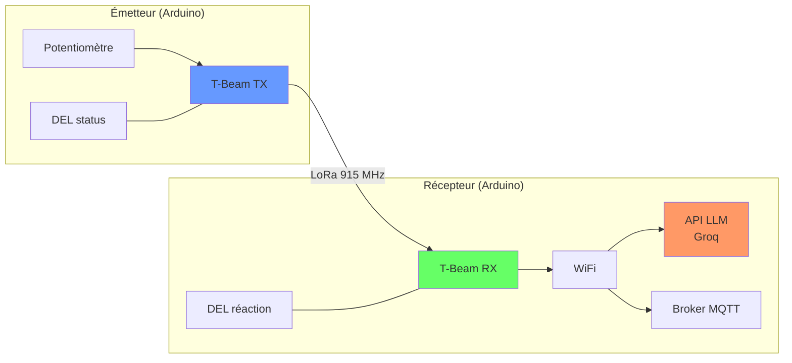

# Objets connectés
## 243-4J5-LI

Semaine 11 - Liaison LoRa point à point et LLM

<div class="pt-12">
  <span class="px-2 py-1 rounded cursor-pointer" hover="bg-white bg-opacity-10">
    Francis Poisson - Cégep Limoilou - H26
  </span>
</div>

---
layout: section
---

# TP évalué (20%)
## Semaines 11-12

---

# Vue d'ensemble du TP

### Communication LoRa avec analyse LLM

<v-click>

### Objectif

Construire une **liaison LoRa point à point** codée dans l'IDE Arduino :

1. Un **émetteur** lit un potentiomètre et envoie la valeur via LoRa
2. Un **récepteur** reçoit les données, se connecte au WiFi
3. Le récepteur appelle un **LLM** pour analyser les données
4. Le récepteur publie les résultats sur le **broker MQTT**
5. Une **DEL** réagit selon l'analyse du LLM

</v-click>

<v-click>

<div class="mt-4 p-2 bg-orange-500 bg-opacity-20 rounded-lg text-center text-sm">

**Évaluation** : 20% de la note finale. Remise semaine 12.

</div>

</v-click>

---

# Architecture du TP

### Les deux T-Beam communiquent en LoRa

<v-click>


```mermaid {scale: 0.6}
graph LR
    subgraph "Émetteur (Arduino)"
        POT[Potentiomètre] --> TX[T-Beam TX]
        LED1[DEL status] --- TX
    end

    TX -->|LoRa 915 MHz| RX

    subgraph "Récepteur (Arduino)"
        RX[T-Beam RX] --> WIFI[WiFi]
        WIFI --> LLM[API LLM<br/>Groq]
        WIFI --> MQTT[Broker MQTT]
        LED2[DEL réaction] --- RX
    end

    style TX fill:#69f
    style RX fill:#6f6
    style LLM fill:#f96
```

</v-click>

<v-click>

<div class="mt-2 p-2 bg-blue-500 bg-opacity-20 rounded-lg text-center text-sm">

Tout est codé dans l'**IDE Arduino** avec la librairie **RadioLib** pour le LoRa.

</div>

</v-click>

---
layout: section
---

# Partie 1
## L'émetteur LoRa

---

# Librairie RadioLib

### Communication LoRa sans Meshtastic

<v-click>

### Pourquoi RadioLib?

- Contrôle **direct** du module SX1262 du T-Beam
- Pas besoin de firmware Meshtastic
- On code **notre propre protocole**
- Compatible avec l'IDE Arduino

</v-click>

<v-click>

### Installation

1. IDE Arduino → **Gestionnaire de bibliothèques**
2. Chercher **RadioLib**
3. Installer la dernière version
4. Aussi installer : **ArduinoJson**, **WiFi**, **HTTPClient**

</v-click>

---

# Configuration du SX1262

### Initialiser le module LoRa du T-Beam Supreme

```cpp
#include <RadioLib.h>

// Pins du SX1262 sur le T-Beam Supreme
#define LORA_SS   10
#define LORA_DIO1 33
#define LORA_RST  5
#define LORA_BUSY 36

SX1262 radio = new Module(LORA_SS, LORA_DIO1, LORA_RST, LORA_BUSY);

void setup() {
  Serial.begin(115200);

  int state = radio.begin(
    915.0,    // Fréquence (MHz)
    125.0,    // Bandwidth (kHz)
    9,        // Spreading Factor
    7,        // Coding Rate (4/7)
    0x12,     // Sync Word
    22,       // Puissance TX (dBm)
    8         // Preamble length
  );

  if (state == RADIOLIB_ERR_NONE) {
    Serial.println("Radio initialisée!");
  } else {
    Serial.println("Erreur radio: " + String(state));
  }
}
```

---

# Code de l'émetteur

### Lire le potentiomètre et envoyer via LoRa

```cpp
#define POT_PIN   36   // Pin ADC du potentiomètre
#define LED_PIN   25   // Pin de la DEL status

void setup() {
  Serial.begin(115200);
  pinMode(LED_PIN, OUTPUT);
  // ... initialisation radio (slide précédente)
}

void loop() {
  // Lire le potentiomètre (0-4095)
  int valeur = analogRead(POT_PIN);

  // Construire le message
  String message = String(valeur);

  // Envoyer via LoRa
  digitalWrite(LED_PIN, HIGH);  // DEL allumée = en train d'émettre
  int state = radio.transmit(message);
  digitalWrite(LED_PIN, LOW);

  if (state == RADIOLIB_ERR_NONE) {
    Serial.println("Envoyé: " + message);
  } else {
    Serial.println("Erreur envoi: " + String(state));
  }

  delay(5000);  // Envoyer toutes les 5 secondes
}
```

---

# Enrichir le message

### Envoyer plus que le potentiomètre

<v-click>

```cpp
#include <ArduinoJson.h>

void loop() {
  int potValue = analogRead(POT_PIN);

  // Construire un JSON
  JsonDocument doc;
  doc["pot"] = potValue;
  doc["millis"] = millis();

  String message;
  serializeJson(doc, message);

  // Envoyer via LoRa
  digitalWrite(LED_PIN, HIGH);
  radio.transmit(message);
  digitalWrite(LED_PIN, LOW);

  Serial.println("TX: " + message);
  delay(5000);
}
```

</v-click>

<v-click>

### Exemple de message envoyé

```json
{"pot":2048,"millis":15000}
```

</v-click>

---
layout: section
---

# Partie 2
## Le récepteur LoRa + WiFi + LLM

---

# Code du récepteur — Réception LoRa

### Écouter les messages

```cpp
#define LED_PIN 25

void setup() {
  Serial.begin(115200);
  pinMode(LED_PIN, OUTPUT);

  // Initialiser la radio (même config que l'émetteur)
  radio.begin(915.0, 125.0, 9, 7, 0x12, 22, 8);

  Serial.println("Récepteur prêt, en attente...");
}

void loop() {
  String received;
  int state = radio.receive(received);

  if (state == RADIOLIB_ERR_NONE) {
    Serial.println("RX: " + received);
    Serial.println("RSSI: " + String(radio.getRSSI()) + " dBm");
    Serial.println("SNR: " + String(radio.getSNR()) + " dB");

    // Traiter le message reçu
    processMessage(received);
  }
}
```

---

# Connexion WiFi

### Le récepteur se connecte au réseau

```cpp
#include <WiFi.h>

// Dans config.h (ignoré par git!)
#include "config.h"
// const char* WIFI_SSID = "...";
// const char* WIFI_PASS = "...";
// const char* GROQ_API_KEY = "gsk_...";

void setupWiFi() {
  WiFi.begin(WIFI_SSID, WIFI_PASS);

  Serial.print("Connexion WiFi");
  while (WiFi.status() != WL_CONNECTED) {
    delay(500);
    Serial.print(".");
  }
  Serial.println(" OK!");
  Serial.println("IP: " + WiFi.localIP().toString());
}

void setup() {
  Serial.begin(115200);
  setupWiFi();
  // ... initialisation radio
}
```

---

# Appel LLM depuis le récepteur

### Analyser les données avec Groq

```cpp
#include <HTTPClient.h>
#include <ArduinoJson.h>

String callLLM(String sensorData, float rssi, float snr) {
  HTTPClient http;
  http.begin("https://api.groq.com/openai/v1/chat/completions");
  http.addHeader("Content-Type", "application/json");
  http.addHeader("Authorization", "Bearer " + String(GROQ_API_KEY));

  JsonDocument req;
  req["model"] = "llama-3.3-70b-versatile";
  JsonArray msgs = req["messages"].to<JsonArray>();

  JsonObject sys = msgs.add<JsonObject>();
  sys["role"] = "system";
  sys["content"] = "Tu analyses des données IoT LoRa. "
    "Réponds en JSON: {\"status\":\"normal|attention|urgent\","
    "\"action\":\"on|off|none\"}";

  JsonObject usr = msgs.add<JsonObject>();
  usr["role"] = "user";
  usr["content"] = "Données: " + sensorData +
    " RSSI: " + String(rssi) + " SNR: " + String(snr);

  String body;
  serializeJson(req, body);

  int code = http.POST(body);
  String response = http.getString();
  http.end();
  return response;
}
```

---

# Traiter la réponse et contrôler la DEL

### Boucler la boucle

```cpp
void processMessage(String received) {
  float rssi = radio.getRSSI();
  float snr = radio.getSNR();

  // Appeler le LLM
  String llmResponse = callLLM(received, rssi, snr);

  // Parser la réponse
  JsonDocument doc;
  // ... extraire le contenu de la réponse LLM
  // ... parser le JSON interne

  String action = doc["action"] | "none";

  // Contrôler la DEL selon l'action du LLM
  if (action == "on") {
    digitalWrite(LED_PIN, HIGH);
    Serial.println("DEL allumée (LLM: on)");
  } else if (action == "off") {
    digitalWrite(LED_PIN, LOW);
    Serial.println("DEL éteinte (LLM: off)");
  }

  // Publier sur MQTT (semaine 12)
}
```

<v-click>

<div class="mt-2 p-2 bg-green-500 bg-opacity-20 rounded-lg text-center text-sm">

Le LLM décide de l'action, le code l'exécute. La DEL est la preuve visible que le pipeline fonctionne!

</div>

</v-click>

---
layout: section
---

# Partie 3
## Sécurité et structure du projet

---

# Gestion des secrets

### Fichier config.h (comme au labo 4)

<div class="grid grid-cols-2 gap-4">

<div>

<v-click>

### config.h (ignoré par git)

```cpp
// NE PAS COMMITER CE FICHIER
const char* WIFI_SSID = "MonReseau";
const char* WIFI_PASS = "MonMotDePasse";
const char* GROQ_API_KEY = "gsk_abc...";
const char* MQTT_BROKER = "192.168.1.10";
```

</v-click>

</div>

<div>

<v-click>

### config.example.h (commité)

```cpp
// Copier vers config.h et remplir
const char* WIFI_SSID = "VOTRE_SSID";
const char* WIFI_PASS = "VOTRE_PASS";
const char* GROQ_API_KEY = "VOTRE_CLE";
const char* MQTT_BROKER = "ADRESSE_BROKER";
```

</v-click>

</div>

</div>

<v-click>

### .gitignore

```
config.h
```

</v-click>

<v-click>

<div class="mt-2 p-2 bg-red-500 bg-opacity-20 rounded-lg text-center text-sm">

Clé API dans le code ou l'historique git = **-20 points**. Vérifiez avant de push!

</div>

</v-click>

---
layout: section
---

# Travail de la semaine
## Coder l'émetteur et le récepteur

---

# Objectifs du laboratoire

### Ce qu'il faut réaliser aujourd'hui

<div class="grid grid-cols-2 gap-4">

<div>

### Émetteur (1h)

<v-clicks>

- [ ] Initialiser RadioLib (SX1262)
- [ ] Lire le potentiomètre
- [ ] Envoyer la valeur via LoRa
- [ ] DEL qui clignote à l'envoi
- [ ] Tester la réception

</v-clicks>

</div>

<div>

### Récepteur (2h)

<v-clicks>

- [ ] Initialiser RadioLib (même config)
- [ ] Recevoir les messages LoRa
- [ ] Connecter au WiFi
- [ ] Appeler l'API LLM (Groq)
- [ ] Contrôler la DEL selon la réponse
- [ ] Afficher RSSI/SNR

</v-clicks>

</div>

</div>

---

# Checklist avant de partir

### Minimum pour aujourd'hui

<v-click>

- [ ] L'émetteur envoie des données du potentiomètre via LoRa
- [ ] Le récepteur reçoit les messages et affiche RSSI/SNR
- [ ] Au moins un appel LLM réussi depuis le récepteur
- [ ] La DEL réagit à la réponse du LLM

</v-click>

<v-click>

### Pour la semaine prochaine (remise)

- [ ] Ajout de la publication MQTT
- [ ] Gestion des erreurs (retry LLM, reconnexion WiFi)
- [ ] Documentation (README.md)
- [ ] Aucun secret dans le code ou l'historique git

</v-click>

---
layout: center
class: text-center
---

# Questions?

<div class="text-xl mt-8">
On code la liaison LoRa!
</div>

<div class="mt-4 text-sm">
Semaine prochaine : MQTT, finalisation et remise du TP
</div>

---
layout: end
---

# Merci!

243-4J5-LI - Objets connectés

Semaine 11
