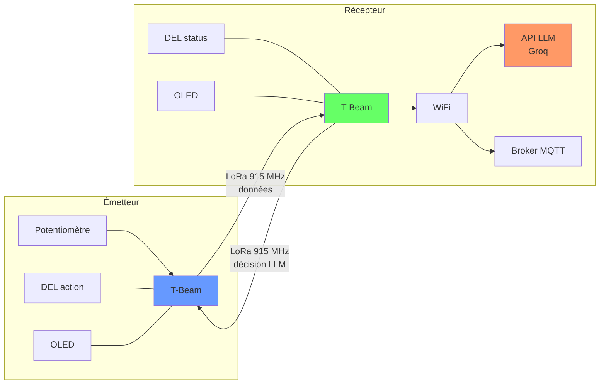

# Objets connectés
## 243-4J5-LI

Semaine 11 - Liaison LoRa point à point et LLM

<div class="pt-12">
  <span class="px-2 py-1 rounded cursor-pointer" hover="bg-white bg-opacity-10">
    Francis Poisson - Cégep Limoilou - H26
  </span>
</div>

---
layout: section
---

# TP évalué (20%)
## Semaines 11-12

---

# Vue d'ensemble du TP

### Communication LoRa avec analyse LLM

<v-click>

### Objectif

Construire une **liaison LoRa point à point** codée dans l'IDE Arduino :

1. Un **émetteur** lit un potentiomètre et envoie la valeur via LoRa
2. Un **récepteur** reçoit les données, se connecte au WiFi
3. Le récepteur appelle un **LLM** pour analyser les données
4. Le récepteur publie les résultats sur le **broker MQTT**
5. Le récepteur **renvoie la décision** à l'émetteur via LoRa (liaison bidirectionnelle)
6. Une **DEL** côté émetteur réagit selon l'analyse du LLM

</v-click>

<v-click>

<div class="mt-4 p-2 bg-orange-500 bg-opacity-20 rounded-lg text-center text-sm">

**Évaluation** : 20% de la note finale. Remise semaine 12.

</div>

</v-click>

---

# Architecture du TP

### Les deux T-Beam communiquent en LoRa

<v-click>


```mermaid {scale: 0.6}
graph LR
    subgraph "Émetteur"
        POT[Potentiomètre] --> TX[T-Beam]
        LED1[DEL action] --- TX
        OLED1[OLED] --- TX
    end

    TX -->|LoRa 915 MHz<br/>données| RX
    RX -->|LoRa 915 MHz<br/>décision LLM| TX

    subgraph "Récepteur"
        RX[T-Beam] --> WIFI[WiFi]
        WIFI --> LLM[API LLM<br/>Groq]
        WIFI --> MQTT[Broker MQTT]
        LED2[DEL status] --- RX
        OLED2[OLED] --- RX
    end

    style TX fill:#69f
    style RX fill:#6f6
    style LLM fill:#f96
```

</v-click>

<v-click>

<div class="mt-2 p-2 bg-blue-500 bg-opacity-20 rounded-lg text-center text-sm">

Tout est codé dans l'**IDE Arduino** avec la librairie **RadioLib** pour le LoRa.

</div>

</v-click>

---

# Périphériques des T-Beam

### Chaque T-Beam a sa DEL et son OLED

| Périphérique | Émetteur | Récepteur |
|--------------|----------|-----------|
| **DEL** | action (on/off reçu du LLM) | status (clignote à chaque réception/appel LLM) |
| **OLED** | valeur du pot + décision reçue | message reçu, RSSI/SNR, réponse LLM |

<v-click>

### Helper OLED (SSD1306, I2C intégré au T-Beam)

```cpp
#include <Adafruit_SSD1306.h>
Adafruit_SSD1306 oled(128, 64, &Wire);

void oledPrint(String s) {
  oled.clearDisplay();
  oled.setCursor(0, 0);
  oled.println(s);
  oled.display();
}
```

</v-click>

---
layout: section
---

# Partie 1
## L'émetteur LoRa

---

# Librairie RadioLib

### Communication LoRa sans Meshtastic

<v-click>

### Pourquoi RadioLib?

- Contrôle **direct** du module SX1262 du T-Beam
- Pas besoin de firmware Meshtastic
- On code **notre propre protocole**
- Compatible avec l'IDE Arduino

</v-click>

<v-click>

### Installation

1. IDE Arduino → **Gestionnaire de bibliothèques**
2. Chercher **RadioLib**
3. Installer la dernière version
4. Aussi installer : **ArduinoJson**, **WiFi**, **HTTPClient**

</v-click>

---

# Configuration du SX1262

### Initialiser le module LoRa du T-Beam Supreme

```cpp
#include <RadioLib.h>

// Pins SX1262 du T-Beam Supreme
SX1262 radio = new Module(10, 33, 5, 36);

void setup() {
  Serial.begin(115200);
  // freq, BW, SF, CR, sync, puissance, preamble
  radio.begin(915.0, 125.0, 9, 7, 0x12, 22, 8);
}
```

---

# Code de l'émetteur

### Lire le potentiomètre et envoyer via LoRa

```cpp
#define POT_PIN 36
#define LED_PIN 25

void loop() {
  int valeur = analogRead(POT_PIN);
  radio.transmit(String(valeur));
  Serial.println("TX: " + String(valeur));
  delay(5000);
}
```

---

# Enrichir le message

### Envoyer plus que le potentiomètre

<v-click>

```cpp
#include <ArduinoJson.h>

void loop() {
  JsonDocument doc;
  doc["pot"] = analogRead(POT_PIN);
  String msg; serializeJson(doc, msg);
  radio.transmit(msg);
  oledPrint("TX: " + msg);

  // Écouter la décision du LLM (retour LoRa)
  String reply;
  if (radio.receive(reply, 10000) == RADIOLIB_ERR_NONE) {
    JsonDocument r; deserializeJson(r, reply);
    String action = r["action"] | "none";
    digitalWrite(LED_ACTION, action == "on" ? HIGH : LOW);
    oledPrint("TX: " + msg + "\nLLM: " + reply);
  }
  delay(5000);
}
```

</v-click>

<v-click>

### Exemple de message envoyé

```json
{"pot":2048,"millis":15000}
```

</v-click>

---
layout: section
---

# Partie 2
## Le récepteur LoRa + WiFi + LLM

---

# Code du récepteur — Réception LoRa

### Écouter les messages

```cpp
#define LED_STATUS 25  // clignote à chaque réception / appel LLM

void loop() {
  String received;
  if (radio.receive(received) == RADIOLIB_ERR_NONE) {
    digitalWrite(LED_STATUS, HIGH);
    oledPrint("RX: " + received +
              "\nRSSI: " + String(radio.getRSSI()));
    processMessage(received);
    digitalWrite(LED_STATUS, LOW);
  }
}
```

---

# Connexion WiFi

### Le récepteur se connecte au réseau

```cpp
#include <WiFi.h>
#include "config.h"   // WIFI_SSID, WIFI_PASS, GROQ_API_KEY

void setupWiFi() {
  WiFi.begin(WIFI_SSID, WIFI_PASS);
  while (WiFi.status() != WL_CONNECTED) delay(500);
  oledPrint("WiFi OK\n" + WiFi.localIP().toString());
}
```

---

# Appel LLM depuis le récepteur

### Analyser les données — structured output obligatoire

L'appel LLM doit utiliser un **schéma JSON** (`response_format` / `json_schema`) que **vous définissez**. Sans structured output, la réponse peut varier et casser le parsing côté Arduino. Le schéma ci-dessous est un exemple — libre à vous de l'adapter.

```cpp
// Schéma JSON (exemple — à adapter) — structured output OBLIGATOIRE
const char* SCHEMA = R"({
  "type":"json_schema",
  "json_schema":{
    "name":"decision","strict":true,
    "schema":{
      "type":"object","additionalProperties":false,
      "required":["status","action"],
      "properties":{
        "status":{"enum":["normal","attention","urgent"]},
        "action":{"enum":["on","off","none"]}}}}})";

String callLLM(String data) {
  JsonDocument req;
  req["model"] = LLM_MODEL;
  deserializeJson(req["response_format"].to<JsonObject>(), SCHEMA);
  auto m = req["messages"].to<JsonArray>();
  m.add<JsonObject>()["role"] = "user";
  m[0]["content"] = "Analyse: " + data;

  HTTPClient http;
  http.begin("https://api.groq.com/openai/v1/chat/completions");
  http.addHeader("Authorization", "Bearer " + String(GROQ_API_KEY));
  http.addHeader("Content-Type", "application/json");
  String body; serializeJson(req, body);
  http.POST(body);
  String r = http.getString();
  http.end();
  return r;
}
```

---

# Traiter la réponse et contrôler la DEL

### Boucler la boucle

```cpp
void processMessage(String received) {
  String resp = callLLM(received);

  // Extraire {status, action} du JSON retourné par le LLM
  JsonDocument doc;
  deserializeJson(doc, resp);
  String content = doc["choices"][0]["message"]["content"];
  JsonDocument decision;
  deserializeJson(decision, content);

  // Renvoyer la décision à l'émetteur via LoRa
  String reply; serializeJson(decision, reply);
  radio.transmit(reply);
  oledPrint("LLM: " + reply);

  // Publier sur MQTT (semaine 12)
}
```

<v-click>

<div class="mt-2 p-2 bg-green-500 bg-opacity-20 rounded-lg text-center text-sm">

Le LLM décide de l'action, le code l'exécute. La DEL est la preuve visible que le pipeline fonctionne!

</div>

</v-click>

---
layout: section
---

# Partie 3
## Sécurité et structure du projet

---

# Gestion des secrets

### Fichier config.h (comme au labo 4)

<div class="grid grid-cols-2 gap-4">

<div>

<v-click>

### config.h (ignoré par git)

```cpp
const char* WIFI_SSID = "MonReseau";
const char* WIFI_PASS = "MonMotDePasse";
const char* GROQ_API_KEY = "gsk_abc...";
const char* LLM_MODEL = "gpt-oss-20b";
const char* MQTT_BROKER = "192.168.1.10";
```

</v-click>

</div>

<div>

<v-click>

### config.example.h (commité)

```cpp
const char* WIFI_SSID = "VOTRE_SSID";
const char* WIFI_PASS = "VOTRE_PASS";
const char* GROQ_API_KEY = "VOTRE_CLE";
const char* LLM_MODEL = "gpt-oss-20b";
const char* MQTT_BROKER = "ADRESSE_BROKER";
```

</v-click>

</div>

</div>

<v-click>

### .gitignore

```
config.h
```

</v-click>

<v-click>

<div class="mt-2 p-2 bg-red-500 bg-opacity-20 rounded-lg text-center text-sm">

Clé API dans le code ou l'historique git = **-20 points**. Vérifiez avant de push!

</div>

</v-click>

---
layout: section
---

# Travail de la semaine
## Coder l'émetteur et le récepteur

---

# Objectifs du laboratoire

### Ce qu'il faut réaliser aujourd'hui

<div class="grid grid-cols-2 gap-4">

<div>

### Émetteur (1h)

<v-clicks>

- [ ] Initialiser RadioLib (SX1262) et l'OLED
- [ ] Lire le potentiomètre, envoyer via LoRa
- [ ] Afficher la trame envoyée sur l'OLED
- [ ] Écouter la réponse LoRa du récepteur
- [ ] DEL action : on/off selon la décision du LLM

</v-clicks>

</div>

<div>

### Récepteur (2h)

<v-clicks>

- [ ] Initialiser RadioLib + OLED + WiFi
- [ ] Recevoir les messages LoRa
- [ ] DEL status : clignote à la réception / à l'appel LLM
- [ ] Appeler l'API LLM (Groq)
- [ ] Renvoyer la décision via LoRa
- [ ] Afficher RX, RSSI/SNR et réponse LLM sur l'OLED

</v-clicks>

</div>

</div>

---

# Checklist avant de partir

### Minimum pour aujourd'hui

<v-click>

- [ ] L'émetteur envoie des données du potentiomètre via LoRa
- [ ] Le récepteur reçoit les messages et affiche RSSI/SNR
- [ ] Au moins un appel LLM réussi depuis le récepteur
- [ ] Le récepteur renvoie la décision via LoRa et la DEL de l'émetteur réagit

</v-click>

<v-click>

### Pour la semaine prochaine (remise)

- [ ] Ajout de la publication MQTT
- [ ] Gestion des erreurs (retry LLM, reconnexion WiFi)
- [ ] Documentation (README.md)
- [ ] Aucun secret dans le code ou l'historique git

</v-click>

---
layout: center
class: text-center
---

# Questions?

<div class="text-xl mt-8">
On code la liaison LoRa!
</div>

<div class="mt-4 text-sm">
Semaine prochaine : MQTT, finalisation et remise du TP
</div>

---
layout: end
---

# Merci!

243-4J5-LI - Objets connectés

Semaine 11
