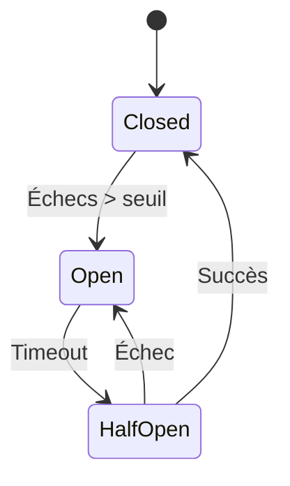

# Objets connectés
## 243-4J5-LI

Semaine 12 - Fiabilité et sécurité des automatisations

<div class="pt-12">
  <span class="px-2 py-1 rounded cursor-pointer" hover="bg-white bg-opacity-10">
    Francis Poisson - Cégep Limoilou - H26
  </span>
</div>

---
layout: section
---

# Introduction
## De la démo à la production

---

# Le défi de la production

### Ce qui change

<div class="grid grid-cols-2 gap-4">

<div class="p-3 bg-blue-500 bg-opacity-20 rounded-lg">

### En développement

<v-click>

- Environnement contrôlé
- Erreurs = on corrige
- Données de test
- Un seul utilisateur
- Pas de conséquences

</v-click>

</div>

<div class="p-3 bg-orange-500 bg-opacity-20 rounded-lg">

### En production

<v-click>

- Environnement imprévisible
- Erreurs = pannes visibles
- Données réelles
- Multiples utilisateurs
- Conséquences réelles

</v-click>

</div>

</div>

<v-click>

<div class="mt-4 p-2 bg-red-500 bg-opacity-20 rounded-lg text-center text-sm">

**Objectif** : Un système qui fonctionne 24/7, même quand ça va mal.

</div>

</v-click>

---
layout: section
---

# Partie 1
## Fiabilité des systèmes

---

# Gestion des erreurs

### Principe fondamental

<v-click>

```python
# ❌ Mauvais : Erreur non gérée
def process_data(data):
    result = api_call(data)  # Peut échouer!
    return result

# ✅ Bon : Erreur gérée
def process_data(data):
    try:
        result = api_call(data)
        return result
    except ConnectionError as e:
        logger.error(f"API inaccessible: {e}")
        return None
    except TimeoutError as e:
        logger.warning(f"API lente: {e}")
        return retry_later(data)
    except Exception as e:
        logger.critical(f"Erreur inattendue: {e}")
        raise
```

</v-click>

---

# Types d'erreurs IoT

### Catégorisation

<v-click>

| Type | Exemples | Stratégie |
|------|----------|-----------|
| **Réseau** | Timeout, connexion perdue | Retry avec backoff |
| **API** | Rate limit, erreur serveur | Circuit breaker |
| **Données** | Format invalide, valeur aberrante | Validation, rejet |
| **Matériel** | Capteur défaillant | Fallback, alerte |
| **Logique** | Bug dans le code | Logging, correction |

</v-click>

<v-click>

<div class="mt-4 p-2 bg-blue-500 bg-opacity-20 rounded-lg text-center text-sm">

Chaque type d'erreur nécessite une **stratégie spécifique**.

</div>

</v-click>

---

# Retry avec backoff exponentiel

### Ne pas surcharger les services

```python {all|1-6|8-22}
import time
import random

MAX_RETRIES = 5
BASE_DELAY = 1  # secondes

def retry_with_backoff(func, *args, **kwargs):
    """Exécute une fonction avec retry et backoff exponentiel."""
    for attempt in range(MAX_RETRIES):
        try:
            return func(*args, **kwargs)
        except Exception as e:
            if attempt == MAX_RETRIES - 1:
                raise  # Dernière tentative, on abandonne

            # Calcul du délai avec jitter
            delay = BASE_DELAY * (2 ** attempt)
            jitter = random.uniform(0, delay * 0.1)

            logger.warning(f"Tentative {attempt + 1} échouée, "
                          f"retry dans {delay:.1f}s")
            time.sleep(delay + jitter)
```

---

# Circuit Breaker

### Protection contre les cascades d'erreurs

<v-click>



</v-click>

<v-click>

### États

- **Closed** : Fonctionnement normal
- **Open** : Service considéré en panne, appels bloqués
- **Half-Open** : Test de récupération

</v-click>

---

# Implémentation Circuit Breaker

### Code Python

```python {all|1-11|13-28}
from enum import Enum
from datetime import datetime, timedelta

class CircuitState(Enum):
    CLOSED = "closed"
    OPEN = "open"
    HALF_OPEN = "half_open"

class CircuitBreaker:
    def __init__(self, failure_threshold=5, reset_timeout=60):
        self.state = CircuitState.CLOSED
        self.failures = 0
        self.threshold = failure_threshold
        self.reset_timeout = reset_timeout
        self.last_failure = None

    def call(self, func, *args, **kwargs):
        if self.state == CircuitState.OPEN:
            if self._should_try_reset():
                self.state = CircuitState.HALF_OPEN
            else:
                raise CircuitOpenError("Circuit ouvert")

        try:
            result = func(*args, **kwargs)
            self._on_success()
            return result
        except Exception as e:
            self._on_failure()
            raise
```

---

# Fallback et dégradation gracieuse

### Plan B quand ça ne marche pas

<v-click>

```python
def get_analysis(data: dict) -> dict:
    """Analyse avec fallback en cas d'échec LLM."""

    # Tentative 1: API LLM principale
    try:
        return llm_analyze(data)
    except Exception as e:
        logger.warning(f"LLM principal indisponible: {e}")

    # Tentative 2: API LLM secondaire
    try:
        return backup_llm_analyze(data)
    except Exception as e:
        logger.warning(f"LLM backup indisponible: {e}")

    # Fallback: Analyse basée sur règles simples
    return rule_based_analyze(data)

def rule_based_analyze(data: dict) -> dict:
    """Analyse simple sans LLM."""
    if data.get('temperature', 0) > 40:
        return {"status": "warning", "analysis": "Température élevée"}
    return {"status": "normal", "analysis": "Valeurs normales"}
```

</v-click>

---
layout: section
---

# Partie 2
## Observabilité

---

# Les trois piliers

### Logs, Métriques, Traces

<div class="grid grid-cols-3 gap-3">

<div class="p-3 bg-blue-500 bg-opacity-20 rounded-lg text-sm">

### Logs

<v-click>

- Événements textuels
- Debug et erreurs
- Historique des actions
- Format structuré (JSON)

</v-click>

</div>

<div class="p-3 bg-green-500 bg-opacity-20 rounded-lg text-sm">

### Métriques

<v-click>

- Valeurs numériques
- Compteurs, jauges
- Tendances temporelles
- Alertes sur seuils

</v-click>

</div>

<div class="p-3 bg-purple-500 bg-opacity-20 rounded-lg text-sm">

### Traces

<v-click>

- Parcours d'une requête
- Latences par étape
- Identification des goulots
- Corrélation d'erreurs

</v-click>

</div>

</div>

---

# Logging structuré

### Format JSON pour l'analyse

```python {all|1-8|10-20}
import json
import logging
from datetime import datetime

class JSONFormatter(logging.Formatter):
    def format(self, record):
        log_data = {
            "timestamp": datetime.utcnow().isoformat(),
            "level": record.levelname,
            "logger": record.name,
            "message": record.getMessage(),
            "module": record.module,
            "function": record.funcName,
        }
        if hasattr(record, 'extra'):
            log_data.update(record.extra)
        return json.dumps(log_data)

# Usage
logger.info("Message traité", extra={
    "topic": "iot/sensors",
    "latency_ms": 45,
    "status": "success"
})
```

---

# Métriques essentielles

### Ce qu'il faut surveiller

<v-click>

| Métrique | Type | Seuil d'alerte |
|----------|------|----------------|
| Messages/min | Compteur | < 10 (trop peu) |
| Latence p95 | Histogramme | > 5s |
| Taux d'erreur | Ratio | > 5% |
| Connexions MQTT | Jauge | = 0 (déconnecté) |
| Appels LLM | Compteur | Coût/jour |
| CPU/Mémoire | Jauge | > 80% |

</v-click>

<v-click>

### Collecte simple

```python
from collections import Counter
from time import time

metrics = {
    'messages_total': Counter(),
    'errors_total': Counter(),
    'latencies': []
}

def record_latency(start_time: float):
    metrics['latencies'].append(time() - start_time)
```

</v-click>

---

# Alertes proactives

### Réagir avant l'utilisateur

```python
def check_health_and_alert():
    """Vérifie la santé et envoie des alertes."""

    # Vérifier le taux d'erreur
    error_rate = metrics['errors'] / max(metrics['total'], 1)
    if error_rate > 0.05:
        send_alert(
            level="warning",
            message=f"Taux d'erreur élevé: {error_rate:.1%}"
        )

    # Vérifier la latence
    if metrics['latencies']:
        p95 = sorted(metrics['latencies'])[int(len(metrics['latencies']) * 0.95)]
        if p95 > 5.0:
            send_alert(
                level="warning",
                message=f"Latence p95 élevée: {p95:.1f}s"
            )

    # Vérifier la connexion MQTT
    if not mqtt_client.is_connected():
        send_alert(level="critical", message="MQTT déconnecté!")
```

---
layout: section
---

# Partie 3
## Sécurité

---

# Gestion des secrets

### Ne jamais exposer les clés!

<div class="grid grid-cols-2 gap-4">

<div>

### ❌ À éviter

<v-click>

```python
# Dans le code (DANGER!)
API_KEY = "sk-abc123..."

# Dans git
# config.py avec clés en clair
```

</v-click>

</div>

<div>

### ✅ Bonnes pratiques

<v-click>

```python
# Variables d'environnement
import os
API_KEY = os.getenv("API_KEY")

# Fichier .env (ignoré par git)
# .env
API_KEY=sk-abc123...

# .gitignore
.env
*.pem
*_secret*
```

</v-click>

</div>

</div>

---

# Fichier .env et python-dotenv

### Gestion propre des secrets

```bash
# .env (NE JAMAIS COMMITER!)
MQTT_BROKER=broker.example.com
MQTT_USER=myuser
MQTT_PASSWORD=supersecret
OPENAI_API_KEY=sk-abc123...
```

<v-click>

```python
from dotenv import load_dotenv
import os

# Charger les variables d'environnement
load_dotenv()

# Utilisation sécurisée
BROKER = os.getenv("MQTT_BROKER")
MQTT_USER = os.getenv("MQTT_USER")
MQTT_PASS = os.getenv("MQTT_PASSWORD")
API_KEY = os.getenv("OPENAI_API_KEY")

if not API_KEY:
    raise ValueError("OPENAI_API_KEY non configurée!")
```

</v-click>

---

# Principe du moindre privilège

### Limiter les accès

<v-clicks>

- **API Keys** : Créer des clés avec permissions minimales
- **MQTT** : ACL par topic (lecture/écriture séparées)
- **Base de données** : Utilisateur en lecture seule si possible
- **Fichiers** : Permissions restrictives (600, 700)

</v-clicks>

<v-click>

### Exemple ACL Mosquitto

```
# mosquitto_acl.conf
user sensor_device
topic read iot/commands/#
topic write iot/sensors/#

user dashboard
topic read iot/#

user admin
topic readwrite #
```

</v-click>

---

# Validation des entrées

### Ne jamais faire confiance aux données

```python {all|1-12|14-24}
from pydantic import BaseModel, validator, constr

class SensorPayload(BaseModel):
    device_id: constr(regex=r'^[a-zA-Z0-9_-]+$', max_length=32)
    temperature: float
    humidity: float

    @validator('temperature')
    def validate_temp(cls, v):
        if not -50 <= v <= 100:
            raise ValueError('Température invalide')
        return v

def process_mqtt_message(payload: bytes) -> Optional[SensorPayload]:
    """Valide et parse un message MQTT."""
    try:
        data = json.loads(payload)
        return SensorPayload(**data)
    except json.JSONDecodeError:
        logger.warning("JSON invalide reçu")
        return None
    except ValidationError as e:
        logger.warning(f"Validation échouée: {e}")
        return None
```

---

# Audit et traçabilité

### Qui a fait quoi, quand?

```python
from datetime import datetime
from typing import Optional

def audit_log(
    action: str,
    user: str,
    resource: str,
    details: Optional[dict] = None,
    success: bool = True
):
    """Log d'audit pour traçabilité."""
    audit_entry = {
        "timestamp": datetime.utcnow().isoformat(),
        "action": action,
        "user": user,
        "resource": resource,
        "success": success,
        "details": details or {}
    }

    # Écrire dans un fichier d'audit séparé
    with open("audit.log", "a") as f:
        f.write(json.dumps(audit_entry) + "\n")

# Usage
audit_log("config_change", "admin", "mqtt_broker", {"new_port": 8883})
```

---
layout: section
---

# Travail de la semaine
## Robustesse et sécurité

---

# Objectifs du laboratoire

### Durcir votre système

<div class="grid grid-cols-2 gap-4">

<div>

### Fiabilité (1h30)

<v-clicks>

- [ ] Ajouter try/except sur tous les appels externes
- [ ] Implémenter retry avec backoff
- [ ] Ajouter des fallbacks
- [ ] Tester les cas d'erreur

</v-clicks>

</div>

<div>

### Sécurité (1h30)

<v-clicks>

- [ ] Migrer les secrets vers .env
- [ ] Vérifier le .gitignore
- [ ] Ajouter la validation des données
- [ ] Implémenter le logging structuré
- [ ] Documenter la sécurité

</v-clicks>

</div>

</div>

---

# Checklist de sécurité

### Avant la remise du projet

<v-click>

- [ ] **Aucun secret** dans le code ou git
- [ ] **.gitignore** inclut : .env, *.pem, *_secret*
- [ ] **Validation** de toutes les entrées externes
- [ ] **TLS/SSL** pour les connexions réseau
- [ ] **Logs** ne contiennent pas de données sensibles
- [ ] **Documentation** des accès requis

</v-click>

<v-click>

<div class="mt-4 p-2 bg-red-500 bg-opacity-20 rounded-lg text-center text-sm">

**Un secret exposé = projet compromis.** Vérifiez deux fois!

</div>

</v-click>

---
layout: center
class: text-center
---

# Questions?

<div class="text-xl mt-8">
Prochaine étape : Sécuriser votre pipeline!
</div>

<div class="mt-4 text-sm">
Semaine prochaine : Intégration finale du projet
</div>

---
layout: end
---

# Merci!

243-4J5-LI - Objets connectés

Semaine 12
