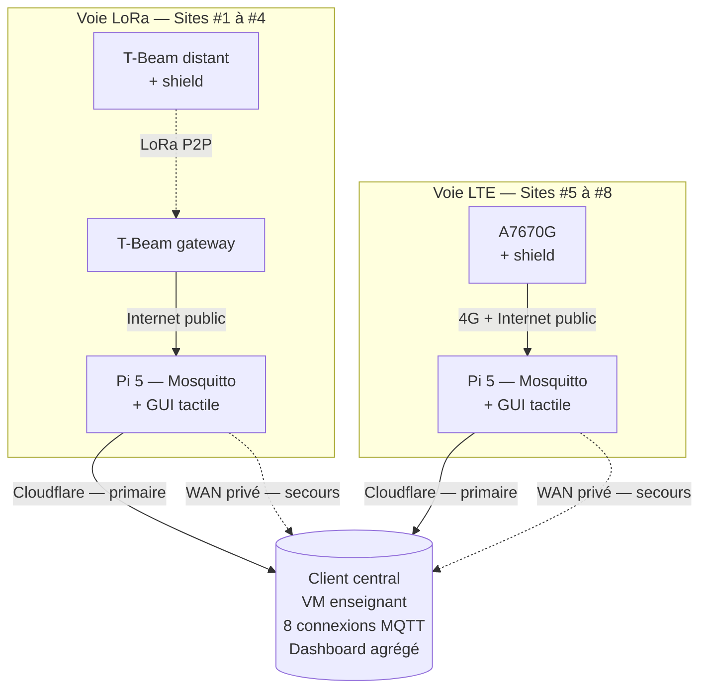

# Objets connectés
## 243-4J5-LI

### Semaine 12 — Projet final

<div class="pt-12">
  <span class="px-2 py-1 rounded cursor-pointer" hover="bg-white bg-opacity-10">
    Francis Poisson — Cégep Limoilou — H26
  </span>
</div>

---

# Votre défi de fin de session

<div class="text-2xl mt-8 leading-relaxed">

**Hydro-Limoilou** — un distributeur d'énergie fictif déploie **8 sites RF** sur son territoire.

Chaque site héberge un **répéteur RF** (configuré dans le cours connexe de télécom).

**Votre mission** : déployer l'**infrastructure IdO de télémétrie** qui surveille ces 8 sites et faire converger toutes les données vers un **Centre de conduite du réseau (CCR)**, à l'image de celui [d'Hydro-Québec](https://www.hydroquebec.com/comprendre/transport/conduite-reseau.html).

</div>

<div class="mt-8 text-lg opacity-70">
Semaines 13 à 15 — 35 % de la note finale
</div>

---

# Le dashboard cible

<div class="flex justify-center mt-4">
  
</div>

<div class="mt-3 text-center text-sm opacity-70">
  8 sites supervisés en temps réel · LoRa + LTE · LWT online/offline · télémétrie live
</div>

---

# Articulation avec les autres cours

<v-clicks>

- **4J5** — Télémétrie (présent cours) : supervision de l'installation
- **4P3** — Gestion du projet
- **4K4** — WAN privé
- **4Q5** — Répéteur : chaque étudiant·e configure son propre répéteur RF
- **4L4** — Liaison optique
- Le présent projet assure le **monitoring environnemental et opérationnel de l'installation** :
  - télémétrie : climat shelter, vibration mât, alimentation, intrusion
  - alarmes : basculement, inondation, ouverture cabinet, batterie faible
  - convergence centrale : simule un **CCR** (Centre de conduite du réseau) supervisant les 8 sites — cf. les 160 stations de télémesure + 22 500 points d'acquisition du CCR réel d'Hydro-Québec

</v-clicks>

---

# Architecture cible


```mermaid {scale: 0.55}
graph TB
    subgraph LoRa["Voie LoRa — Sites #1 à #4"]
        TBd["T-Beam distant<br/>+ shield"]
        TBg["T-Beam gateway"]
        PiL["Pi 5 — Mosquitto<br/>+ GUI tactile"]
        TBd -.LoRa P2P.-> TBg
        TBg -->|Internet public| PiL
    end

    subgraph LTE["Voie LTE — Sites #5 à #8"]
        A1["A7670G<br/>+ shield"]
        PiT["Pi 5 — Mosquitto<br/>+ GUI tactile"]
        A1 -->|4G + Internet public| PiT
    end

    PiL -->|Cloudflare — primaire| VM[("Client central<br/>VM enseignant<br/>8 connexions MQTT<br/>Dashboard agrégé")]
    PiL -.WAN privé — secours.-> VM
    PiT -->|Cloudflare — primaire| VM
    PiT -.WAN privé — secours.-> VM
```

---

# Ce qu'il faut retenir du schéma

<v-clicks>

- **1 broker Mosquitto par site**, hébergé sur le Raspberry Pi 5 de l'étudiant·e
- Le **serveur central est un *client* MQTT** (pas un broker) — il s'abonne en parallèle aux 8 brokers
- Capteurs → broker Pi 5 passent par **Internet public** (pas de LAN local commun)
- **Redondance réseau à 2 voies** : Cloudflare Tunnel (primaire) + WAN privé inter-labo (secours)
- Chaque Pi 5 porte aussi une **GUI tactile locale** — 3 pages Python (télémétrie, alarmes, état du lien)
- Bascule automatique côté client via `servers: [primaire, secours]` de mqtt.js

</v-clicks>

---

# Les 2 voies d'accès

<div class="grid grid-cols-2 gap-4 mt-4">

<div class="p-3 bg-cyan-500 bg-opacity-20 rounded-lg">

### Voie LoRa (#1-4)

<v-clicks>

- Sites **isolés** ou **en hauteur**, couverture cellulaire faible
- Liaison **LoRa point-à-point** (pas de mesh) vers une gateway
- Gateway → broker Pi 5 via **Internet public**
- Remédiation sur le TP LoRa (semaine 9)

</v-clicks>

</div>

<div class="p-3 bg-orange-500 bg-opacity-20 rounded-lg">

### Voie LTE (#5-8)

<v-clicks>

- Sites **urbains** ou à couverture cellulaire correcte
- Publication **MQTT sur 4G/LTE** → Internet public → broker Pi 5
- Remédiation sur l'éval mi-session (semaine 7)

</v-clicks>

</div>

</div>

---

# Remédiation ciblée

| Évaluation antérieure faible | Voie attribuée |
|------------------------------|----------------|
| **TP LoRa** (sem. 9) | **LoRa** (#1-4) |
| **Éval mi-session — Shield A7670G/LTE** (sem. 7) | **LTE** (#5-8) |

<div class="mt-4 text-sm">

Le projet final est conçu comme une **seconde chance encadrée** sur la compétence la moins bien démontrée antérieurement. Assignation équilibrée 4/4.

</div>

---

# Les 8 sites — voie LoRa (#1-4)

| # | Site | Mise en situation |
|---|------|-------------------|
| 1 | **Pylône 315 kV rural** | Shelter + vibrations mât · répéteur colocalisé |
| 2 | **Barrage — poste de vanne** | Intrusion + niveau d'eau · SCADA côtier |
| 3 | **Centrale solaire isolée** | Climat + autonomie alim · répéteur 24/7 |
| 4 | **Pylône 25 kV** | Basculement pylône + présence base |

Hôte : **LilyGO T-Beam SUPREME** (×2 — distant + gateway)

---

# Les 8 sites — voie LTE (#5-8)

| # | Site | Mise en situation |
|---|------|-------------------|
| 5 | **Poste transformation urbain** | Climat + intrusion + tension/courant ligne |
| 6 | **Poste sur toit (centre-ville)** | Orientation antenne + apport solaire |
| 7 | **Centrale thermique diesel** | Climat machinerie + sécurité d'accès |
| 8 | **Refuge technique barrage** | Intégrité refuge + niveau carburant génératrice |

Hôte : **LilyGO A7670G** (1 par site)

---

# Pool de modules capteurs

| Module | Référence | Bus |
|--------|-----------|-----|
| **BME280** | Adafruit 2652 | I2C (0x76 externe) ou SPI — T°/humidité/**pression** |
| **MPU6050** | Adafruit 3886 (STEMMA QT) | I2C (0x68) — accéléro+gyro 6 axes |
| **BH1750** | DFRobot SEN0097 | I2C (0x23) — luminosité |
| **EKMC4607112K** | SparkFun 17372 | GPIO digital — PIR ultra-basse conso (170 µA) |
| Potentiomètre | 10 kΩ | ADC |
| Bouton tactile | 12 × 12 mm | GPIO digital |
| LED | 5 mm + R 220–330 Ω | GPIO digital |

---

# Assignations LoRa (#1-4)

| # | Modules assignés |
|---|-------------------|
| 1 | BME280 + MPU6050 + 2 boutons + 2 LEDs |
| 2 | BH1750 + EKMC + 1 pot + 1 bouton + 1 LED |
| 3 | BME280 + BH1750 + 1 bouton + 1 pot + 1 LED |
| 4 | MPU6050 + EKMC + 1 bouton + 1 pot + 2 LEDs |

<div class="mt-4 p-3 bg-yellow-500 bg-opacity-20 rounded-lg text-sm">
ADC limité sur T-Beam SUPREME → <strong>1 potentiomètre maximum</strong> côté LoRa.
</div>

---

# Assignations LTE (#5-8)

| # | Modules assignés |
|---|-------------------|
| 5 | BME280 + EKMC + 2 pots + 2 LEDs |
| 6 | MPU6050 + BH1750 + 2 boutons + 2 LEDs |
| 7 | BME280 + BH1750 + EKMC + 2 LEDs |
| 8 | MPU6050 + BME280 + 2 boutons + 1 pot + 1 LED |

<div class="mt-4 text-sm opacity-70">
A7670G = ESP32 standard → plus de GPIO disponibles, jusqu'à 5 modules.
</div>

---

# Convention MQTT

```
hydro-limoilou/{poste-id}/telemetry/{capteur}   # données périodiques
hydro-limoilou/{poste-id}/status                # uptime, rssi, link, batterie
hydro-limoilou/{poste-id}/status/llm            # résumé texte (LLM local)
hydro-limoilou/{poste-id}/alarm/{type}          # évènements ponctuels
hydro-limoilou/{poste-id}/actuators/{nom}       # commandes descendantes
```

<div class="mt-4 text-sm">
<strong>poste-id</strong> : <code>poste-01</code> à <code>poste-08</code> — attribué par l'enseignant en début de semaine 13.
</div>

---

# Exemples de payloads

```json
// hydro-limoilou/poste-01/telemetry/temperature
{"value": 22.4, "unit": "C", "ts": 1739500000}

// hydro-limoilou/poste-01/telemetry/pressure
{"value": 1013, "unit": "hPa", "ts": 1739500000}

// hydro-limoilou/poste-01/telemetry/vibration
{"x": 0.02, "y": -0.01, "z": 9.81, "ts": 1739500005}

// hydro-limoilou/poste-01/status
{"uptime": 3600, "rssi": -67, "link": "lora", "battery_v": 3.92, "ts": 1739500030}

// hydro-limoilou/poste-01/alarm/vibration
{"level": "warning", "value": 1.45, "unit": "m/s2", "ts": 1739500045}
```

---

# Topic `status/llm` — résumé LLM local

```json
// hydro-limoilou/poste-01/status/llm
{
  "summary": "Vibrations nominales, climat ok.",
  "model": "qwen2.5:3b",
  "ts": 1739500090
}
```

<v-clicks>

- Chaque appareil exécute **un appel LLM local** (Ollama sur la passerelle Pi 5 ou modèle embarqué ESP32)
- Produit un **résumé texte en langage naturel** des dernières lectures
- Affiché par le client central dans le panneau du site (voir diapos suivantes)
- Fréquence : 1× / 2-5 min

</v-clicks>

---

# Aperçu — détail d'un site

<div class="flex justify-center mt-2">
  
</div>

<div class="mt-3 text-center text-sm opacity-70">
  BME280 · MPU6050 · boutons · LEDs · lien actif (primaire / WAN privé)
</div>

---

# Aperçu — scénario d'alarme

<div class="flex justify-center mt-2">
  
</div>

<div class="mt-3 text-center text-sm opacity-70">
  <code>alarm/vibration</code> level <code>critical</code> — mise en évidence rouge immédiate
</div>

---

# Aperçu — perte de lien

<div class="flex justify-center mt-2">
  
</div>

<div class="mt-3 text-center text-sm opacity-70">
  Témoin jaune : broker connecté, <strong>aucune donnée fraîche depuis &gt; 45 s</strong>
</div>

---

# Aperçu — résumé LLM

<div class="flex justify-center mt-2">
  
</div>

<div class="mt-3 text-center text-sm opacity-70">
  Carte <span style="color:#a855f7">violette</span> dans la sidebar — affiche le <code>summary</code> + modèle + fraîcheur
</div>

---

# Livrables du projet

<v-clicks>

1. **Shield PCB** — schéma + PCB 2 couches + Gerbers (KiCad, non fabriqué)
2. **Firmware** — Arduino/ESP32 qui lit les capteurs assignés et publie sur les bons topics
3. **Interface tactile Python** sur Pi 5 — 3 pages : télémétrie, alarmes, état du lien
4. **Documentation** — description du site, câblage, topics utilisés, procédure de démo
5. **Vidéo de démo** (≤ 5 min) — 3 scénarios obligatoires :
   - Fonctionnement nominal
   - Déclenchement d'alarme
   - Perte & reprise de lien (WiFi/LTE + bascule WAN privé)

</v-clicks>

---

# Calendrier & pondération

| Checkpoint | Semaine | Pondération | Focus |
|-----------|---------|:-----------:|-------|
| **CP1** | 13 | **5 %** | Câblage + 1ʳᵉ publication MQTT + amorce KiCad |
| **CP2** | 14 | **10 %** | Tous capteurs publient + alarmes + GUI Pi 5 + visibilité VM |
| **CP3** | 15 | **20 %** | Démo 3 scénarios + PCB finalisé + QoS/fiabilité MQTT |
| | | **35 %** | **du cours** |

<div class="mt-4 text-sm opacity-70">
Pondération par capacité — Capacité 1 (10 %) : conception/programmation IdO · Capacité 2 (25 %) : protocoles de comm.
</div>

---

# CP1 (sem. 13) — 5 %

<v-clicks>

- **1.1** Câblage breadboard conforme à l'assignation — 1 % (C1)
- **1.2** Première publication MQTT vers le broker local — 3 % (C2)
- **1.3** Amorce du shield KiCad (schéma démarré) — 1 % (C1)

</v-clicks>

---

# CP2 (sem. 14) — 10 %

<v-clicks>

- **2.1** Tous les capteurs publient sur les bons topics — 3 % (C2)
- **2.2** Alarmes fonctionnelles — 2 % (C1)
- **2.3** Extension de l'interface tactile (3 pages) — 1 % (C1)
- **2.4** Visibilité du site depuis le serveur central — 3 % (C2)
- **2.5** Schéma KiCad complet (ERC sans erreurs) — 1 % (C1)

</v-clicks>

---

# CP3 (sem. 15) — 20 %

<v-clicks>

- **3.1** Démonstration des 3 scénarios — 7 % (C2)
- **3.2** PCB finalisé (DRC + Gerbers + BOM) — 3 % (C1)
- **3.3** Documentation processus de conception — 1 % (C1)
- **3.4** Documentation protocoles et topics — 3 % (C2)
- **3.5** Site visible côté VM pendant toute la démo — 3 % (C2)
- **3.6** QoS et fiabilité MQTT (incl. bascule WAN privé) — 3 % (C2)

</v-clicks>

---

# Pièges fréquents

<v-clicks>

- **I2C — conflit d'adresses BME280** : T-Beam SUPREME a un BME280 **interne** à `0x77` → le BME280 externe (Adafruit 2652) doit être strappé à `0x76` (SDO → GND)
- **Alim** : modules en 3.3 V (BME/MPU/BH tolèrent 3-5 V ; EKMC accepte 3-6 V)
- **Topics non conformes** : respecter strictement `hydro-limoilou/poste-XX/telemetry/...`
- **Payload non JSON** : utiliser ArduinoJson, toujours inclure `ts` (Unix int)
- **Pas de redondance testée** : le CP3 vérifie explicitement la bascule sur le WAN privé

</v-clicks>

---

# Dashboard live

<div class="text-lg mt-8 text-center">

Référence visuelle disponible en tout temps :

**https://hydrolimoilou.ve2fpd.com**

</div>

<div class="mt-4 text-sm text-center opacity-70">
Utilisez-le comme cible pendant le développement pour valider que vos topics et payloads rendent correctement côté dashboard.
</div>

---

# Documents de référence

<div class="text-sm">

- `evaluations/Evaluation-04/architecture-finale-projet.md` — architecture complète, mises en situation, assignations
- `evaluations/Evaluation-04/contrat-serveur-central.md` — contrat technique (topics, payloads, fréquences, sécurité)
- `evaluations/Evaluation-04/liste-pieces.md` — pool de pièces, quantités, coûts
- `evaluations/Evaluation-04/grille-projet-final.md` — grille d'évaluation globale
- `evaluations/Evaluation-04/grille-checkpoint-{1,2,3}.md` — grilles détaillées par CP

</div>

---

# Questions ?

<div class="text-lg mt-16 text-center">

Les assignations de site sont communiquées en **début de semaine 13**.

D'ici là : relire les 2 documents centraux (architecture + contrat serveur), s'assurer que le Pi 5 est opérationnel avec Mosquitto + tunnel Cloudflare, et vérifier son inventaire personnel de modules.

</div>
