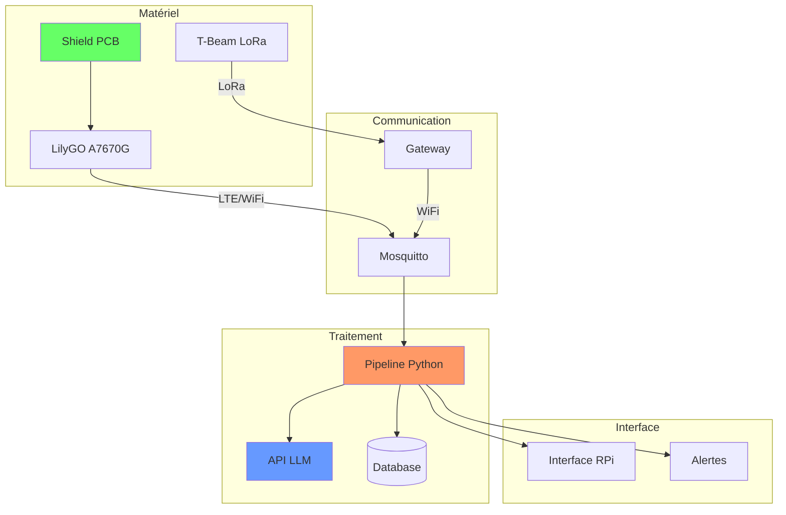
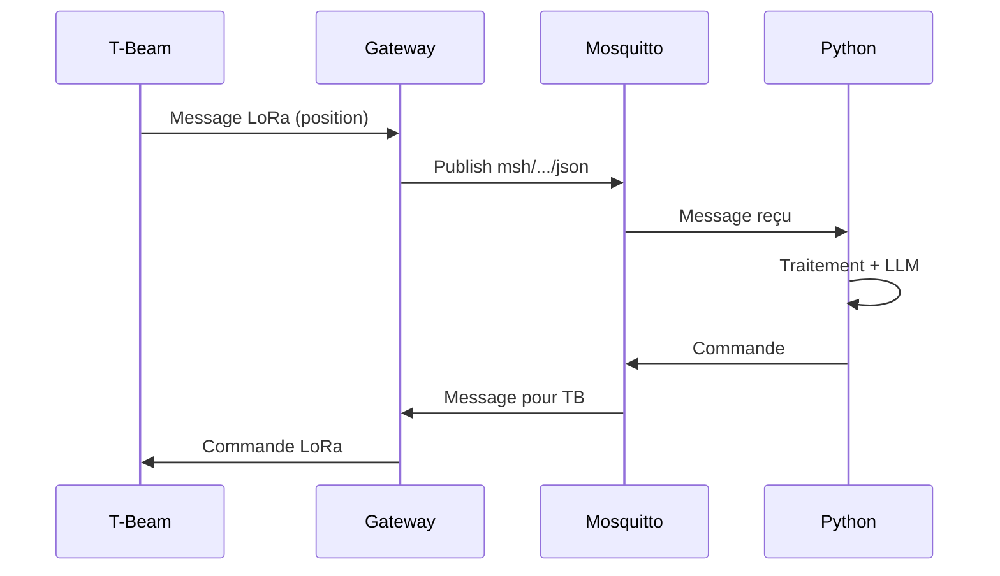

# Objets connectés
## 243-4J5-LI

Semaine 13 - Intégration finale du projet

<div class="pt-12">
  <span class="px-2 py-1 rounded cursor-pointer" hover="bg-white bg-opacity-10">
    Francis Poisson - Cégep Limoilou - H26
  </span>
</div>

---
layout: section
---

# Vue d'ensemble
## Assemblage du système complet

---

# Architecture finale

### Tous les composants ensemble

<v-click>



</v-click>

---

# Composants à intégrer

### Checklist du système

<div class="grid grid-cols-3 gap-3 text-sm">

<div class="p-3 bg-blue-500 bg-opacity-20 rounded-lg">

### Matériel

<v-click>

- [ ] PCB shield soudé et testé
- [ ] LilyGO A7670G fonctionnel
- [ ] T-Beam SUPREME configuré
- [ ] Connexions validées
- [ ] Alimentation stable

</v-click>

</div>

<div class="p-3 bg-green-500 bg-opacity-20 rounded-lg">

### Communication

<v-click>

- [ ] MQTT broker opérationnel
- [ ] LTE ou WiFi connecté
- [ ] Gateway LoRa→MQTT
- [ ] Topics structurés
- [ ] TLS activé

</v-click>

</div>

<div class="p-3 bg-purple-500 bg-opacity-20 rounded-lg">

### Logiciel

<v-click>

- [ ] Firmware Arduino stable
- [ ] Pipeline Python complet
- [ ] Intégration LLM
- [ ] Interface utilisateur
- [ ] Gestion des erreurs

</v-click>

</div>

</div>

---
layout: section
---

# Partie 1
## Intégration matérielle

---

# Test du système complet

### Validation progressive

<v-clicks>

1. **Alimentation**
   - Brancher le PCB au LilyGO
   - Vérifier les tensions (3.3V stable)
   - Pas de composants qui chauffent

2. **Capteurs**
   - Lecture accéléromètre I2C
   - Lecture potentiomètres ADC
   - Lecture boutons GPIO

3. **Actionneurs**
   - Contrôle des LEDs
   - Réponse aux commandes MQTT

4. **Communication**
   - Connexion au broker
   - Publication de données
   - Réception de commandes

</v-clicks>

---

# Code d'intégration Arduino

### Structure recommandée

```cpp {all|1-10|12-24|26-34}
#include <WiFi.h>
#include <PubSubClient.h>
#include <Wire.h>
#include <ArduinoJson.h>

// Modules
#include "config.h"
#include "sensors.h"
#include "actuators.h"
#include "mqtt_handler.h"

void setup() {
    Serial.begin(115200);

    // Initialisation des modules
    initSensors();
    initActuators();
    initWiFi();
    initMQTT();

    Serial.println("Système initialisé!");
}

void loop() {
    // Maintenir la connexion MQTT
    mqttLoop();

    // Lecture et publication des capteurs
    if (shouldPublish()) {
        SensorData data = readAllSensors();
        publishSensorData(data);
    }

    delay(100);
}
```

---

# Gestion des modules

### Organisation du code

```cpp
// sensors.h
struct SensorData {
    float accel_x, accel_y, accel_z;
    int pot1, pot2;
    bool btn1, btn2;
};

SensorData readAllSensors() {
    SensorData data;

    // Accéléromètre
    readAccelerometer(&data.accel_x, &data.accel_y, &data.accel_z);

    // Potentiomètres
    data.pot1 = analogRead(POT1_PIN);
    data.pot2 = analogRead(POT2_PIN);

    // Boutons
    data.btn1 = digitalRead(BTN1_PIN);
    data.btn2 = digitalRead(BTN2_PIN);

    return data;
}
```

---

# Intégration Meshtastic

### Communication LoRa + MQTT

<v-click>



</v-click>

---
layout: section
---

# Partie 2
## Tests de performance

---

# Métriques à mesurer

### Évaluer la qualité du système

<v-click>

| Métrique | Cible | Comment mesurer |
|----------|-------|-----------------|
| Latence bout-en-bout | < 2s | Timestamp envoi→réception |
| Taux de livraison | > 99% | Messages reçus/envoyés |
| Autonomie batterie | > 8h | Test de décharge |
| Temps de reconnexion | < 30s | Après coupure réseau |
| Disponibilité | > 99% | Uptime sur 24h |

</v-click>

---

# Tests de charge

### Simuler des conditions réelles

```python
import asyncio
import time

async def stress_test(messages_per_second: int, duration: int):
    """Test de charge du système."""
    start = time.time()
    sent = 0
    received = 0
    errors = 0

    while time.time() - start < duration:
        try:
            # Envoyer un message
            await send_test_message()
            sent += 1

            # Attendre la réponse
            if await wait_for_response(timeout=5):
                received += 1
        except Exception:
            errors += 1

        await asyncio.sleep(1 / messages_per_second)

    print(f"Envoyés: {sent}, Reçus: {received}, Erreurs: {errors}")
    print(f"Taux de succès: {received/sent*100:.1f}%")
```

---

# Tests de latence

### Mesurer les délais

```python
import time
import statistics

def measure_latency(num_samples: int = 100) -> dict:
    """Mesure la latence du système."""
    latencies = []

    for _ in range(num_samples):
        start = time.time()

        # Envoyer et attendre la réponse
        send_ping()
        wait_for_pong()

        latency = (time.time() - start) * 1000  # ms
        latencies.append(latency)

    return {
        "min": min(latencies),
        "max": max(latencies),
        "mean": statistics.mean(latencies),
        "median": statistics.median(latencies),
        "p95": sorted(latencies)[int(len(latencies) * 0.95)],
        "p99": sorted(latencies)[int(len(latencies) * 0.99)]
    }
```

---
layout: section
---

# Partie 3
## Autonomie énergétique

---

# Profil de consommation

### Comprendre où va l'énergie

<v-click>

| Composant | Mode actif | Mode veille |
|-----------|:----------:|:-----------:|
| ESP32 | 80-240 mA | 10 µA |
| Module LTE | 200-400 mA | 1 mA |
| Module LoRa | 120 mA (TX) | 1.5 µA |
| GPS | 25-50 mA | 10 µA |
| LEDs | 10-20 mA | 0 |

</v-click>

<v-click>

### Calcul d'autonomie

$$
Autonomie = \frac{Capacité_{batterie}}{Consommation_{moyenne}}
$$

**Exemple** : Batterie 3000 mAh, conso moyenne 100 mA
$$
\frac{3000}{100} = 30 \text{ heures}
$$

</v-click>

---

# Optimisation de la consommation

### Stratégies d'économie d'énergie

<v-clicks>

1. **Deep Sleep** entre les transmissions
   ```cpp
   esp_deep_sleep_start();  // ~10 µA
   ```

2. **Réduire la fréquence** d'envoi
   - Toutes les 5 min au lieu de toutes les secondes

3. **Éteindre les périphériques** inutilisés
   - GPS seulement si nécessaire
   - LEDs seulement pour feedback

4. **Optimiser le code radio**
   - SF plus bas si possible
   - Puissance TX adaptée à la distance

</v-clicks>

---

# Modes de veille ESP32

### Options disponibles

<v-click>

| Mode | Consommation | Réveil par |
|------|:------------:|------------|
| Active | 80-240 mA | - |
| Modem Sleep | 20 mA | CPU actif |
| Light Sleep | 0.8 mA | Timer, GPIO, WiFi |
| Deep Sleep | 10 µA | Timer, GPIO, ULP |
| Hibernation | 5 µA | Timer, GPIO |

</v-click>

<v-click>

### Code Deep Sleep

```cpp
#define SLEEP_DURATION_US 300000000  // 5 minutes

void goToSleep() {
    esp_sleep_enable_timer_wakeup(SLEEP_DURATION_US);
    esp_deep_sleep_start();
}
```

</v-click>

---
layout: section
---

# Travail de la semaine
## Intégration et tests

---

# Objectifs du laboratoire

### Finaliser l'intégration

<div class="grid grid-cols-2 gap-4">

<div>

### Intégration (2h)

<v-clicks>

- [ ] Assembler tous les composants
- [ ] Tester les connexions
- [ ] Valider la communication
- [ ] Résoudre les conflits

</v-clicks>

</div>

<div>

### Tests (1h)

<v-clicks>

- [ ] Tests de latence
- [ ] Tests de fiabilité
- [ ] Mesure de consommation
- [ ] Documentation des résultats

</v-clicks>

</div>

</div>

---

# Checklist d'intégration

### Validation système

<v-click>

### Matériel

- [ ] PCB fonctionne sur batterie
- [ ] Tous les capteurs répondent
- [ ] Tous les actionneurs fonctionnent
- [ ] Connexions stables

</v-click>

<v-click>

### Logiciel

- [ ] Firmware stable (pas de crash sur 1h)
- [ ] Pipeline traite les données
- [ ] LLM répond correctement
- [ ] Interface affiche les données

</v-click>

<v-click>

### Performance

- [ ] Latence acceptable (< 5s)
- [ ] Pas de perte de messages
- [ ] Autonomie mesurée

</v-click>

---

# Préparation de la présentation

### Ce qu'il faut préparer

<v-clicks>

1. **Démonstration fonctionnelle**
   - Scénario préparé
   - Plan B si problème

2. **Documentation technique**
   - Architecture du système
   - Choix techniques justifiés
   - Résultats des tests

3. **Support visuel**
   - Diapositives claires
   - Schémas explicatifs
   - Photos/vidéos du système

</v-clicks>

---
layout: center
class: text-center
---

# Questions?

<div class="text-xl mt-8">
Prochaine étape : Intégration complète!
</div>

<div class="mt-4 text-sm">
Semaine prochaine : Préparation de la présentation finale
</div>

---
layout: end
---

# Merci!

243-4J5-LI - Objets connectés

Semaine 13
