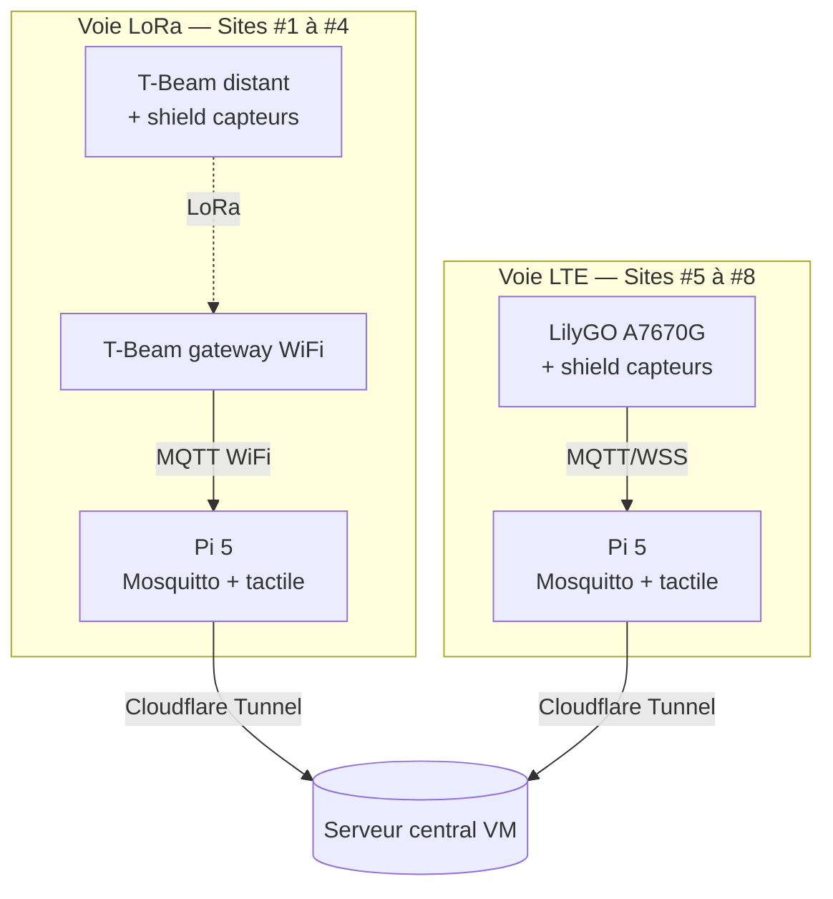

# Objets connectés
## 243-4J5-LI

Semaine 13 — Projet final Hydro-Limoilou (CP1)

<div class="pt-12">
  <span class="px-2 py-1 rounded cursor-pointer" hover="bg-white bg-opacity-10">
    Francis Poisson - Cégep Limoilou - H26
  </span>
</div>

---
layout: section
---

# Mise en situation
## Hydro-Limoilou — Télémétrie RF

---

# Le contexte

### Hydro-Limoilou (fictif)

<v-clicks>

- Distributeur d'énergie qui exploite **8 sites RF** disséminés sur le territoire
- **Chaque site héberge un répéteur RF** (que vous configurez dans un cours connexe)
- Le projet en cours déploie **l'infrastructure de télémétrie** qui surveille les conditions opérationnelles autour du répéteur :
  - Climat (température, humidité, lumière) — protection du shelter du répéteur
  - État mécanique (vibrations, inclinaison) — pointage de l'antenne
  - Sécurité (intrusion, ouverture porte) — protection physique
  - Énergie (tension batterie, niveau carburant) — disponibilité 24/7
- Les données convergent vers un **serveur central VM** simulant un NOC qui supervise les 8 répéteurs

</v-clicks>

---

# Architecture cible


```mermaid {scale: 0.5}
graph TB
    subgraph LoRa["Voie LoRa — Sites #1 à #4"]
        TBd1["T-Beam distant<br/>+ shield capteurs"]
        TBg1["T-Beam gateway WiFi"]
        Pi1["Pi 5<br/>Mosquitto + tactile"]
        TBd1 -.LoRa.-> TBg1 -->|MQTT WiFi| Pi1
    end

    subgraph LTE["Voie LTE — Sites #5 à #8"]
        A1["LilyGO A7670G<br/>+ shield capteurs"]
        Pi2["Pi 5<br/>Mosquitto + tactile"]
        A1 -->|MQTT/WSS| Pi2
    end

    Pi1 -->|Cloudflare Tunnel| VM[("Serveur central VM")]
    Pi2 -->|Cloudflare Tunnel| VM
```

---

# Pourquoi 2 voies ?

<div class="grid grid-cols-2 gap-4">

<div class="p-3 bg-cyan-500 bg-opacity-20 rounded-lg">

### Voie LoRa (#1-4)

<v-clicks>

- Sites **isolés** ou **en hauteur**
- Couverture cellulaire faible
- Mesh local autonome pertinent
- Tour relais, cabinet fluvial, poste forestier, mât météo

</v-clicks>

</div>

<div class="p-3 bg-amber-500 bg-opacity-20 rounded-lg">

### Voie LTE (#5-8)

<v-clicks>

- Sites **urbains** ou **semi-urbains**
- Couverture cellulaire fiable
- Latence faible, intégration cloud directe
- Sous-station, rooftop, station de pompage, refuge

</v-clicks>

</div>

</div>

---
layout: section
---

# Sélection des étudiant·es
## Une remédiation ciblée

---

# Principe pédagogique

### Le projet final = 2e chance encadrée

<v-clicks>

- Chaque étudiant·e est affecté·e à la voie qui exerce ce qu'il/elle a **le moins bien réussi** lors des évaluations antérieures
- L'objectif : **redémontrer** la compétence faiblement maîtrisée
- Les 3 checkpoints hebdomadaires deviennent des points d'observation de la progression

</v-clicks>

---

# Critères de sélection

| Évaluation faible | Compétence à redémontrer | Voie attribuée |
|---|---|---|
| **Évaluation mi-session** (Shield PCB + LTE + MQTT) | A7670G + LTE + MQTT/WSS | **LTE (#5-8)** |
| **TP LoRa** (Meshtastic + mesh + gateway) | LoRa mesh + pont MQTT | **LoRa (#1-4)** |

<v-click>

<div class="mt-4 p-3 bg-blue-500 bg-opacity-20 rounded-lg text-sm">

**Cas limite** : étudiant·e faible aux deux évaluations → léger biais vers LoRa (deux T-Beam à coordonner = davantage d'occasions d'observer la progression).

</div>

</v-click>

---
layout: section
---

# Les 8 sites

---

# Sites LoRa (#1-4)

Chaque site héberge un **répéteur RF** (configuré dans le cours connexe) — la télémétrie en surveille les conditions opérationnelles.

| # | Site | Mise en situation |
|---|------|-------------------|
| 1 | **Pylône 315 kV (rural)** | Répéteur colocalisé sur pylône haute tension — shelter + vibrations structure |
| 2 | **Barrage — poste de vanne** | Répéteur SCADA en crête de barrage — intrusion + niveau d'eau amont |
| 3 | **Centrale solaire isolée** | Répéteur autonome solaire — climat onduleurs + alimentation 24/7 |
| 4 | **Pylône 25 kV** | Répéteur sur pylône de distribution — basculement (pointage antenne) + présence base |

---

# Sites LTE (#5-8)

Chaque site héberge un **répéteur RF** (configuré dans le cours connexe) — la télémétrie en surveille les conditions opérationnelles.

| # | Site | Mise en situation |
|---|------|-------------------|
| 5 | **Poste électrique urbain** | Répéteur colocalisé en poste de transformation — climat + intrusion + énergie |
| 6 | **Poste rooftop (centre-ville)** | Répéteur directionnel sur toit — choc antenne + batteries solaires |
| 7 | **Centrale thermique de secours** | Répéteur SCADA en centrale diesel — climat + sécurité d'accès |
| 8 | **Barrage — refuge technique** | Répéteur isolé + génératrice de secours — choc + carburant |

---
layout: section
---

# Assignations capteurs
## Modules breakout sur shield

---

# Pool de modules

| Module | Type | Bus |
|--------|------|-----|
| **BME280** (Adafruit 2652) | T° + humidité + **pression** | I2C (0x76 / 0x77) ou SPI |
| **MPU6050** (Adafruit 3886) | Accéléro + gyro 6 axes | I2C STEMMA QT (0x68) |
| **BH1750** (DFRobot SEN0097) | Luminosité | I2C (0x23) |
| **EKMC4607112K** (SparkFun 17372) | PIR ultra-basse conso (170 µA) | GPIO digital |
| **Potentiomètre** | Mesure analogique simulée | ADC |
| **Bouton** | Entrée digitale | GPIO digital |
| **LED** | Sortie digitale | GPIO digital |

---

# Assignations LoRa (#1-4)

| # | Modules assignés |
|---|-------------------|
| 1 | BME280 + MPU6050 + 2 boutons + 2 LEDs |
| 2 | BH1750 + EKMC + 1 pot + 1 bouton + 1 LED |
| 3 | BME280 + BH1750 + 1 bouton + 1 pot + 1 LED |
| 4 | MPU6050 + EKMC + 1 bouton + 1 pot + 2 LEDs |

<div class="mt-4 p-3 bg-yellow-500 bg-opacity-20 rounded-lg text-sm">

**T-Beam SUPREME** : ADC limité (max 1 pot). Capteurs I2C partagent le bus primaire 17/18 sans conflit.

</div>

---

# Assignations LTE (#5-8)

| # | Modules assignés |
|---|-------------------|
| 5 | BME280 + EKMC + 2 pots + 2 LEDs |
| 6 | MPU6050 + BH1750 + 2 boutons + 2 LEDs |
| 7 | BME280 + BH1750 + EKMC + 2 LEDs |
| 8 | MPU6050 + BME280 + 2 boutons + 1 pot + 1 LED |

<div class="mt-4 p-3 bg-green-500 bg-opacity-20 rounded-lg text-sm">

**LilyGO A7670G** : ESP32 standard, plus de GPIO disponibles → jusqu'à 5 modules.

</div>

---
layout: section
---

# Convention MQTT
## Le contrat avec le serveur central

---

# Schéma de topics

```
hydro-limoilou/{site-id}/telemetry/{capteur}     # Mesures périodiques
hydro-limoilou/{site-id}/status                  # État du nœud
hydro-limoilou/{site-id}/alarm/{type}            # Évènements ponctuels
hydro-limoilou/{site-id}/actuators/{nom}         # Commandes descendantes
```

<v-click>

### Site-id

`poste-01` à `poste-08` selon la position attribuée.

</v-click>

---

# Exemples de payloads

```json
// hydro-limoilou/poste-01/telemetry/temperature
{"value": 22.4, "unit": "C", "ts": 1739500000}

// hydro-limoilou/poste-01/telemetry/vibration
{"x": 0.02, "y": -0.01, "z": 9.81, "ts": 1739500005}

// hydro-limoilou/poste-01/status
{"uptime": 3600, "rssi": -67, "link": "lora", "battery_v": 3.92, "ts": 1739500030}

// hydro-limoilou/poste-01/alarm/vibration
{"level": "warning", "value": 1.45, "unit": "m/s2", "ts": 1739500045}
```

<div class="mt-3 p-3 bg-blue-500 bg-opacity-20 rounded-lg text-sm">

Document complet : `evaluations/Evaluation-04/contrat-serveur-central.md`

</div>

---

# Sous-topics analogiques par site

Le potentiomètre est nommé selon la **mise en situation** :

| # | Site | Sous-topic | Plage simulée |
|---|------|------------|---------------|
| 2 | Cabinet fluvial | `water_level` | 0 - 200 cm |
| 3 | Poste forestier | `battery_v` | 10 - 14 V |
| 4 | Mât météo | `wind_speed` | 0 - 120 km/h |
| 5 | Sous-station | `voltage_line`, `current_line` | 200-260 V, 0-100 A |
| 8 | Refuge technique | `fuel_level` | 0 - 100 % |

---
layout: section
---

# Travail de la semaine
## Checkpoint 1 (CP1) — 5%

---

# Objectifs CP1

<v-clicks>

1. **Câbler le breadboard** avec tous les modules assignés sur l'hôte (T-Beam SUPREME ou A7670G)
2. **Adapter le firmware** pour publier au moins **un capteur** sur le bon topic vers le broker local du Pi 5
3. **Amorcer le projet KiCad** du shield (composants placés, début de connexions)

</v-clicks>

<v-click>

<div class="mt-4 p-3 bg-green-500 bg-opacity-20 rounded-lg">

Validation par l'enseignant **en fin de séance**.

</div>

</v-click>

---

# Critères CP1

| Critère | Capacité | Pondération |
|---------|:--------:|:-----------:|
| **1.1** Câblage breadboard conforme | C1 | 1% |
| **1.2** Première publication MQTT | C2 | 3% |
| **1.3** Amorce KiCad | C1 | 1% |
| **TOTAL CP1** | | **5%** |

<div class="mt-4 p-3 bg-blue-500 bg-opacity-20 rounded-lg text-sm">

Grille détaillée : `evaluations/Evaluation-04/grille-checkpoint-1.md`

</div>

---

# Démarrage rapide

### Procédure suggérée

<v-clicks>

1. Récupérer son site-id et sa liste de modules
2. Câbler **un module à la fois** sur le breadboard (vérifier alim 3.3 V / GND / signaux)
3. Tester chaque module isolément avec un sketch Arduino simple
4. Adapter le firmware Labo 2 pour publier sur `hydro-limoilou/poste-XX/telemetry/{capteur}`
5. Vérifier côté Pi 5 :
   ```bash
   mosquitto_sub -h localhost -t 'hydro-limoilou/poste-XX/#' -v
   ```
6. Créer le projet KiCad et placer les composants

</v-clicks>

---

# Pièges fréquents

<v-clicks>

- **Alim** : tous les modules en 3.3 V (BME280/MPU6050/BH1750 tolèrent 3-5 V ; EKMC accepte 3-6 V)
- **I2C — conflit d'adresses BME280** : T-Beam SUPREME a un BME280 interne à **0x77**. Le BME280 externe (Adafruit 2652) doit être configuré à **0x76** (strap SDO → GND)
- **I2C — autres adresses** : MPU6050 = 0x68, BH1750 = 0x23 (sans conflit)
- **Topic non conforme** : respecter strictement `hydro-limoilou/poste-XX/telemetry/...`
- **Payload non JSON** : utiliser `ArduinoJson` ou format manuel rigoureux
- **Pas de timestamp** : inclure `ts` (Unix int) dès la première publication

</v-clicks>

---

# Documents de référence

| Document | Contenu |
|----------|---------|
| `architecture-finale-projet.md` | Architecture, mises en situation, assignations |
| `contrat-serveur-central.md` | Topics, payloads, fréquences |
| `grille-checkpoint-1.md` | Grille détaillée CP1 (cette semaine) |
| `grille-projet-final.md` | Récapitulatif global des 3 checkpoints |

Tous dans `evaluations/Evaluation-04/`.

---
layout: section
---

# Pour la semaine 14
## Préparer CP2 (10%) — puis CP3 (20%) en sem. 15

---

# À anticiper

<v-clicks>

- **Tous** les capteurs publient (pas juste un)
- Au moins **une alarme** déclenchable et publiée sur `alarm/{type}`
- Interface tactile **étendue à 3 pages** : télémétrie / alarmes / état lien
- **Tunnel Cloudflare** actif → site visible depuis serveur central VM
- **Schéma KiCad complet** (ERC sans erreurs)

</v-clicks>

<v-click>

<div class="mt-4 p-3 bg-orange-500 bg-opacity-20 rounded-lg text-sm">

Le CP2 vaut **10%** — ne pas attendre le dernier moment.

</div>

</v-click>

---

# Questions ?

<div class="text-center pt-12">

À la semaine prochaine pour le **CP2** !

</div>
