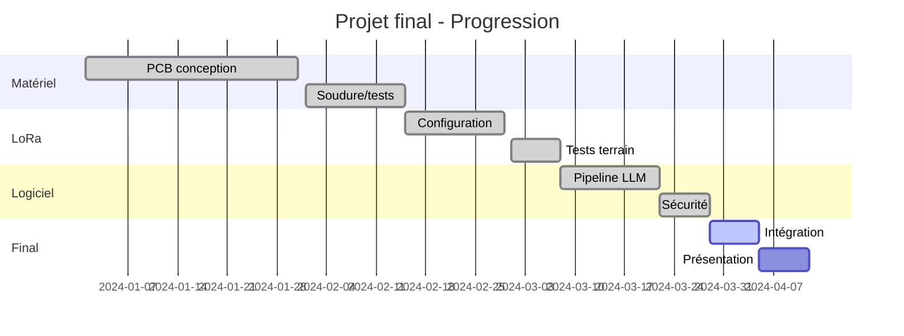

# Objets connectés
## 243-4J5-LI

Semaine 14 - Validation et préparation de la présentation

<div class="pt-12">
  <span class="px-2 py-1 rounded cursor-pointer" hover="bg-white bg-opacity-10">
    Francis Poisson - Cégep Limoilou - H26
  </span>
</div>

---
layout: section
---

# Dernière ligne droite!
## Préparation finale

---

# État d'avancement

### Où en êtes-vous?

<v-click>



</v-click>

---
layout: section
---

# Partie 1
## Validation finale

---

# Checklist avant livraison

### Ne rien oublier!

<div class="grid grid-cols-2 gap-4 text-sm">

<div>

### Matériel

<v-click>

- [ ] PCB fonctionne correctement
- [ ] Tous les composants testés
- [ ] Connexions solides
- [ ] Boîtier/protection (si applicable)
- [ ] Batterie/alimentation validée

</v-click>

### Communication

<v-click>

- [ ] MQTT stable sur 1h+
- [ ] LoRa/Meshtastic fonctionnel
- [ ] Gateway opérationnelle
- [ ] TLS configuré

</v-click>

</div>

<div>

### Logiciel

<v-click>

- [ ] Code Arduino sans bugs
- [ ] Pipeline Python stable
- [ ] LLM intégré et fonctionnel
- [ ] Gestion des erreurs complète
- [ ] Secrets sécurisés

</v-click>

### Documentation

<v-click>

- [ ] README complet
- [ ] Schémas à jour
- [ ] API documentée
- [ ] Guide d'installation
- [ ] Résultats des tests

</v-click>

</div>

</div>

---

# Tests d'acceptation

### Critères de validation

<v-click>

| Test | Critère | Résultat |
|------|---------|:--------:|
| Démarrage | Boot en < 30s | ⬜ |
| Capteurs | Lecture correcte de tous | ⬜ |
| Actionneurs | Réponse aux commandes | ⬜ |
| MQTT | Connexion stable 1h | ⬜ |
| LoRa | Communication 2 noeuds | ⬜ |
| LLM | Analyse fonctionnelle | ⬜ |
| Erreurs | Récupération après panne | ⬜ |
| Sécurité | Pas de secrets exposés | ⬜ |

</v-click>

---

# Documentation des limitations

### Être honnête sur les limites

<v-click>

### Limitations connues (exemple)

```markdown
## Limitations connues

### Matériel
- Portée LoRa réduite en intérieur (~100m)
- Consommation élevée en mode actif continu

### Logiciel
- Latence LLM variable (2-10s selon charge)
- Reconnexion WiFi peut prendre 30s

### Fonctionnalités non implémentées
- Mode deep sleep (prévu mais pas testé)
- Interface web (hors scope)
```

</v-click>

<v-click>

<div class="mt-2 p-2 bg-blue-500 bg-opacity-20 rounded-lg text-center text-sm">

**Documenter les limitations** démontre une compréhension professionnelle du projet.

</div>

</v-click>

---
layout: section
---

# Partie 2
## Communication technique

---

# Structure de la présentation

### Plan recommandé (15 min)

<v-clicks>

1. **Introduction** (2 min)
   - Contexte et objectifs
   - Aperçu du système

2. **Architecture** (3 min)
   - Schéma global
   - Composants clés
   - Choix techniques

3. **Démonstration** (5 min)
   - Fonctionnement en direct
   - Scénarios d'utilisation

4. **Résultats et apprentissages** (3 min)
   - Métriques de performance
   - Défis rencontrés
   - Leçons apprises

5. **Questions** (2 min)

</v-clicks>

---

# Conseils pour la présentation

### Réussir sa communication

<div class="grid grid-cols-2 gap-4">

<div>

### À faire

<v-click>

- Préparer un **plan B** pour la démo
- **Répéter** plusieurs fois
- Parler **clairement** et pas trop vite
- **Regarder** l'audience
- Utiliser des **visuels** clairs
- Chronométrer (15 min max)

</v-click>

</div>

<div>

### À éviter

<v-click>

- Lire ses notes mot à mot
- Trop de texte sur les diapos
- Démo trop longue/complexe
- Ignorer les questions
- Paniquer si problème technique
- Dépasser le temps alloué

</v-click>

</div>

</div>

---

# La démonstration

### Préparer un scénario solide

<v-click>

### Scénario type (5 min)

1. **Montrer le système physique** (30s)
   - PCB, connexions, T-Beam

2. **Démarrage** (30s)
   - Boot, connexion MQTT

3. **Capteurs → Affichage** (1 min)
   - Lire un capteur, voir sur l'interface

4. **Commande → Action** (1 min)
   - Envoyer une commande, LED s'allume

5. **LoRa** (1 min)
   - Message entre deux noeuds

6. **LLM** (1 min)
   - Analyse automatique d'une situation

</v-click>

---

# Plan B pour la démo

### Quand ça ne marche pas...

<v-clicks>

1. **Vidéo de backup**
   - Enregistrer une démo fonctionnelle
   - Prête à être jouée

2. **Screenshots/captures**
   - Interface en fonctionnement
   - Messages MQTT
   - Résultats de tests

3. **Mode dégradé**
   - Démontrer une partie seulement
   - Expliquer ce qui devrait se passer

4. **Rester calme**
   - "Le système a fonctionné ce matin..."
   - Montrer les preuves (logs, vidéos)

</v-clicks>

---

# Répondre aux questions

### Techniques de gestion

<v-click>

### Types de questions

| Type | Stratégie |
|------|-----------|
| Clarification | Reformuler et répondre |
| Technique | Être précis ou admettre ne pas savoir |
| Critique | Accepter, expliquer les contraintes |
| Hors sujet | Rediriger poliment |

</v-click>

<v-click>

### Phrases utiles

- "C'est une bonne question, en fait..."
- "Nous avons choisi X parce que..."
- "C'est une limitation que nous avons documentée..."
- "Je ne suis pas certain, je vais vérifier..."

</v-click>

---
layout: section
---

# Partie 3
## Rétrospective

---

# Leçons apprises

### Ce que le projet vous a appris

<v-click>

### Questions à vous poser

- Quelle compétence technique avez-vous le plus développée?
- Quel a été le plus grand défi?
- Que feriez-vous différemment?
- Qu'est-ce qui vous a surpris?
- Quelle partie avez-vous préférée?

</v-click>

<v-click>

<div class="mt-4 p-2 bg-blue-500 bg-opacity-20 rounded-lg text-center text-sm">

**Partager ses apprentissages** = valeur ajoutée pour la présentation.

</div>

</v-click>

---

# Points forts à valoriser

### Mettez en avant vos réussites

<v-click>

### Exemples de points forts

- "Notre PCB a fonctionné du premier coup"
- "Nous avons atteint 5 km de portée LoRa"
- "Le pipeline traite 100 messages/min sans erreur"
- "L'intégration LLM détecte 95% des anomalies"
- "Le système fonctionne 24h sans intervention"

</v-click>

<v-click>

### Comment les présenter

```markdown
## Résultats clés

- Latence moyenne: **1.2 secondes** (cible: < 2s) ✅
- Taux de livraison: **99.5%** (cible: > 99%) ✅
- Portée LoRa: **3.2 km** en urbain
- Autonomie: **12 heures** sur batterie 3000mAh
```

</v-click>

---

# Axes d'amélioration

### Pour aller plus loin

<v-click>

### Améliorations possibles

- Mode deep sleep pour économie d'énergie
- Interface web pour monitoring distant
- Plus de capteurs sur le shield
- Réseau mesh avec plus de noeuds
- Dashboard plus complet
- Tests automatisés

</v-click>

<v-click>

<div class="mt-4 p-2 bg-green-500 bg-opacity-20 rounded-lg text-center text-sm">

**Identifier des améliorations** montre une vision critique et constructive.

</div>

</v-click>

---

# Portfolio professionnel

### Valoriser votre travail

<v-click>

### Ce projet peut servir à

- **CV** : "Conception et réalisation d'un système IoT complet"
- **Entretien** : Démontrer des compétences concrètes
- **Portfolio** : GitHub public avec documentation soignée
- **LinkedIn** : Post avec photos et description

</v-click>

<v-click>

### Éléments à conserver

- Photos du matériel
- Vidéos de démonstration
- Code source (nettoyé)
- Documentation technique
- Résultats de tests

</v-click>

---
layout: section
---

# Travail de la semaine
## Finalisation

---

# Objectifs du laboratoire

### Dernière ligne droite

<div class="grid grid-cols-2 gap-4">

<div>

### Finalisation (1h30)

<v-clicks>

- [ ] Corrections de dernière minute
- [ ] Tests d'acceptation
- [ ] Documentation complète
- [ ] Nettoyage du code

</v-clicks>

</div>

<div>

### Présentation (1h30)

<v-clicks>

- [ ] Créer les diapositives
- [ ] Préparer la démo
- [ ] Enregistrer vidéo backup
- [ ] Répéter la présentation

</v-clicks>

</div>

</div>

---

# Grille d'évaluation (rappel)

### Projet final - 30%

<v-click>

### Capacité 1 (10%)

- PCB fonctionnel et assemblé
- Code Arduino/Python fonctionnel
- Interface utilisateur
- Documentation technique

</v-click>

<v-click>

### Capacité 2 (20%)

- Configuration Meshtastic
- Intégration MQTT
- Tests de performance
- Qualité de la présentation
- Documentation complète

</v-click>

---
layout: center
class: text-center
---

# Questions?

<div class="text-xl mt-8">
Derniers ajustements avant la grande finale!
</div>

<div class="mt-4 text-sm">
Semaine prochaine : Présentations finales
</div>

---
layout: end
---

# Merci!

243-4J5-LI - Objets connectés

Semaine 14
