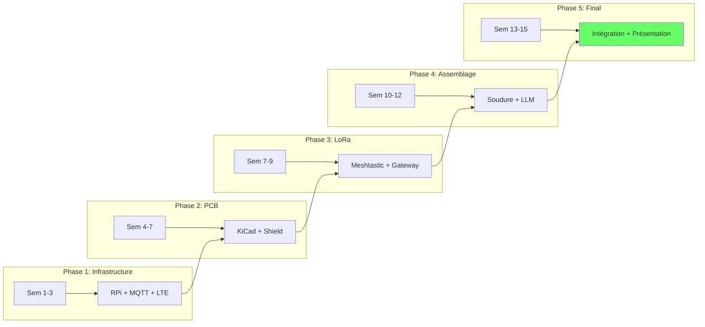
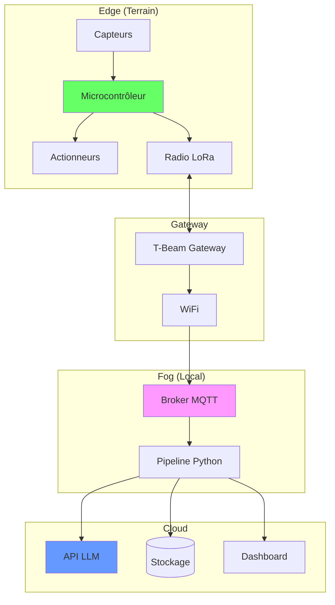

# Objets connectés
## 243-4J5-LI

Semaine 15 - Présentations finales et remise

<div class="pt-12">
  <span class="px-2 py-1 rounded cursor-pointer" hover="bg-white bg-opacity-10">
    Francis Poisson - Cégep Limoilou - H26
  </span>
</div>

---
layout: section
---

# Félicitations!
## Vous avez parcouru un long chemin

---

# Le parcours complet

### 15 semaines d'apprentissage

<v-click>



</v-click>

---

# Ce que vous avez accompli

### Compétences développées

<div class="grid grid-cols-3 gap-3 text-sm">

<div class="p-3 bg-blue-500 bg-opacity-20 rounded-lg">

### Matériel

<v-click>

- Conception de PCB (KiCad)
- Soudure électronique
- Microcontrôleurs (ESP32)
- Capteurs et actionneurs
- Gestion de l'alimentation

</v-click>

</div>

<div class="p-3 bg-green-500 bg-opacity-20 rounded-lg">

### Communication

<v-click>

- MQTT (pub/sub)
- LoRa et Meshtastic
- WiFi et LTE cellulaire
- TLS/SSL sécurité
- Architecture réseau mesh

</v-click>

</div>

<div class="p-3 bg-purple-500 bg-opacity-20 rounded-lg">

### Logiciel

<v-click>

- Arduino/C++ embarqué
- Python (pipelines, API)
- Intégration LLM
- Git et GitHub
- Documentation technique

</v-click>

</div>

</div>

---
layout: section
---

# Évaluation finale
## Projet IoT complet - 30%

---

# Grille d'évaluation détaillée

### Capacité 1 - Concevoir et programmer (10%)

<v-click>

| Critère | Excellent | Satisfaisant | Insuffisant |
|---------|:---------:|:------------:|:-----------:|
| PCB fonctionnel | Parfait, aucun correctif | Fonctionne avec ajustements | Ne fonctionne pas |
| Code Arduino | Robuste, bien structuré | Fonctionne, quelques bugs | Instable ou incomplet |
| Interface utilisateur | Intuitive, complète | Fonctionnelle | Absente ou non fonctionnelle |
| Documentation technique | Complète, professionnelle | Suffisante | Manquante ou insuffisante |

</v-click>

---

# Grille d'évaluation (suite)

### Capacité 2 - Protocoles de communication (20%)

<v-click>

| Critère | Excellent | Satisfaisant | Insuffisant |
|---------|:---------:|:------------:|:-----------:|
| Meshtastic | Réseau multi-noeuds stable | Configuration de base | Non fonctionnel |
| MQTT | Bidirectionnel, sécurisé | Fonctionnel | Non connecté |
| Tests de performance | Documentés, analysés | Effectués | Non réalisés |
| Présentation | Claire, démo réussie | Correcte | Confuse ou incomplète |
| Documentation | README exemplaire | Suffisante | Manquante |

</v-click>

---

# Déroulement des présentations

### Organisation de la journée

<v-click>

### Format

- **15 minutes** par étudiant/équipe
  - 10-12 min : Présentation + démonstration
  - 3-5 min : Questions

- **Ordre de passage** : Tirage au sort ou volontaires

</v-click>

<v-click>

### Équipement disponible

- Projecteur et écran
- Connexion réseau (WiFi)
- Prises électriques
- Votre propre matériel

</v-click>

---

# Éléments à présenter

### Contenu attendu

<v-clicks>

1. **Introduction** : Objectif de votre projet
2. **Architecture** : Schéma du système complet
3. **Démonstration live** :
   - Capteurs → Données → Interface
   - Commandes → Actionneurs
   - Communication LoRa (si applicable)
4. **Résultats** : Métriques de performance
5. **Défis et solutions** : Problèmes rencontrés
6. **Conclusion** : Leçons apprises

</v-clicks>

---

# Livrables à remettre

### Ce qui doit être déposé

<v-click>

### Sur GitHub (avant la présentation)

```
projet-iot-final/
├── README.md              # Documentation principale
├── docs/
│   ├── architecture.md    # Description technique
│   ├── api.md            # Documentation MQTT
│   └── tests.md          # Résultats des tests
├── firmware/             # Code Arduino
├── python/               # Code Python (pipeline, interface)
├── kicad/                # Fichiers PCB
├── presentations/        # Support de présentation
└── media/                # Photos, vidéos
```

</v-click>

---

# Critères de notation

### Ce qui fait la différence

<div class="grid grid-cols-2 gap-4">

<div class="p-3 bg-green-500 bg-opacity-20 rounded-lg text-sm">

### Points bonus

<v-click>

- Fonctionnalités au-delà des requis
- Documentation exceptionnelle
- Présentation particulièrement claire
- Innovation technique
- Tests approfondis

</v-click>

</div>

<div class="p-3 bg-red-500 bg-opacity-20 rounded-lg text-sm">

### Points perdus

<v-click>

- Système non fonctionnel
- Documentation manquante
- Secrets exposés dans le code
- Présentation confuse
- Retard de remise

</v-click>

</div>

</div>

---
layout: section
---

# Rétrospective du cours
## Ce qu'on a construit ensemble

---

# Architecture IoT complète

### Du capteur au cloud

<v-click>



</v-click>

---

# Technologies maîtrisées

### Votre boîte à outils IoT

<v-click>

| Catégorie | Technologies |
|-----------|--------------|
| **Matériel** | ESP32, LilyGO, T-Beam, PCB |
| **CAO** | KiCad, Gerber, BOM |
| **Protocoles** | MQTT, LoRa, I2C, SPI |
| **Réseaux** | WiFi, LTE, Mesh |
| **Sécurité** | TLS, AES-256, gestion secrets |
| **Logiciel** | Arduino, Python, API REST |
| **IA** | LLM, prompt engineering |
| **Outils** | Git, GitHub, CLI |

</v-click>

---

# Applications futures

### Où utiliser ces compétences?

<div class="grid grid-cols-2 gap-4">

<div class="p-3 bg-blue-500 bg-opacity-20 rounded-lg text-sm">

### Domaines d'application

<v-click>

- Agriculture intelligente
- Villes connectées
- Industrie 4.0
- Domotique
- Santé connectée
- Environnement
- Logistique

</v-click>

</div>

<div class="p-3 bg-green-500 bg-opacity-20 rounded-lg text-sm">

### Carrières

<v-click>

- Ingénieur IoT
- Développeur embarqué
- Concepteur de PCB
- Intégrateur systèmes
- Spécialiste réseaux sans fil
- Consultant en automatisation

</v-click>

</div>

</div>

---

# Conseils pour la suite

### Continuer à apprendre

<v-clicks>

1. **Projets personnels** : Appliquez vos compétences
2. **Communautés** : Rejoignez des groupes (Meshtastic, Arduino)
3. **Certifications** : Validez vos acquis
4. **Veille technologique** : Suivez les évolutions
5. **Portfolio** : Documentez vos réalisations
6. **Open source** : Contribuez à des projets

</v-clicks>

---
layout: section
---

# Questions finales?
## Avant de commencer les présentations

---

# Derniers conseils

### Pour une présentation réussie

<v-clicks>

- **Respirez** : Le stress est normal
- **Parlez fort** : Tout le monde doit entendre
- **Regardez l'audience** : Pas seulement l'écran
- **Gérez votre temps** : 15 min passent vite
- **Plan B** : Si la démo échoue, montrez la vidéo
- **Soyez fiers** : Vous avez accompli beaucoup!

</v-clicks>

---
layout: center
class: text-center
---

# Bonne chance à tous!

<div class="text-2xl mt-8">
C'est l'heure de briller!
</div>

<div class="mt-4 text-sm">
Montrez ce que vous avez appris et construit
</div>

---
layout: section
---

# Présentations
## Place aux démonstrations!

---

# Ordre de passage

### À déterminer

<v-click>

```
1. _________________ (heure: __:__)
2. _________________ (heure: __:__)
3. _________________ (heure: __:__)
4. _________________ (heure: __:__)
5. _________________ (heure: __:__)
6. _________________ (heure: __:__)
7. _________________ (heure: __:__)
8. _________________ (heure: __:__)
```

</v-click>

---

# Notes de présentation

### Espace pour commentaires

<v-click>

| Étudiant | Points forts | Améliorations | Note |
|----------|--------------|---------------|:----:|
| | | | /30 |
| | | | /30 |
| | | | /30 |
| | | | /30 |
| | | | /30 |
| | | | /30 |

</v-click>

---
layout: center
class: text-center
---

# Merci pour ce semestre!

<div class="text-xl mt-8">
Vous êtes maintenant des développeurs IoT!
</div>

<div class="mt-4">
Gardez contact et continuez à créer!
</div>

---
layout: end
---

# Félicitations!

243-4J5-LI - Objets connectés

Fin de session H26

Francis Poisson - Cégep Limoilou
